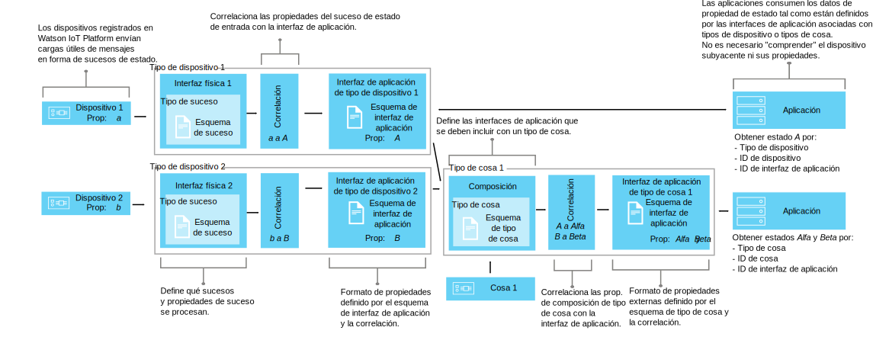

---

copyright:
years: 2016, 2017
lastupdated: "2017-04-25"

---

{:new_window: target="\_blank"}
{:shortdesc: .shortdesc}
{:screen: .screen}
{:codeblock: .codeblock}
{:pre: .pre}

# Utilización de interfaces para correlacionar datos de dispositivo (Beta)
{: #im_index}

Las interfaces de aplicación amplían el concepto de [tipo de dispositivo](#resources) para controlar mejor los datos que fluyen por {{site.data.keyword.iot_short_notm}} y para ofrecer una vista de los datos IoT independientes del dispositivo.
{:shortdesc}

**Importante:** la característica de correlación de interfaces es una característica beta. Las actualizaciones futuras, así como el release final, pueden incluir cambios que no sean compatibles con la versión actual. Se recomienda encarecidamente que las características beta no se utilicen en aplicaciones de producción hasta el release final. Para recibir información adicional y enviar comentarios sobre esta versión beta, puede [registrarse en el programa Information Management Beta ](https://www.ibm.com/software/support/trial/cst/forms/nomination.wss?id=7050){:new_window}.

## Visión general
{: #overview}

Utilice interfaces de aplicación para crear abstracciones compartidas de dispositivos y cosas para mejorar su reutilización y mantenimiento y para gestionar la complejidad de un ecosistema IoT mientras mantiene la aplicación aislada de cambios en los datos. Las interfaces de aplicación no están vinculadas a la variabilidad de los datos de los mensajes que dichos dispositivos comunican a {{site.data.keyword.iot_short_notm}}.

Mediante las interfaces de aplicación, las aplicaciones pueden acceder al estado correcto de dispositivos y cosas. El estado consta de un conjunto de propiedades de estado que se han definido mediante la interfaz de la aplicación. A medida que los dispositivos envían sucesos de cambio de estado, los valores más recientes de estas propiedades se almacenan en {{site.data.keyword.iot_short_notm}} y se ponen a disponibilidad de la aplicación según demanda utilizando una API HTTP.

Con las interfaces de aplicación, puede:
- Correlacionar propiedades de estado con datos de mensajes de suceso
- Definir la estructura de datos que prefiera
- Definir más de una representación o vista del estado de un dispositivo
- Suscribirse a estados de dispositivo o consultarlos en cualquier momento a través de una API HTTP

Algunos casos de uso comunes para las interfaces de aplicación incluyen:
- Proporcionar a los desarrolladores de aplicaciones interfaces coherentes para acceder a datos de dispositivos controlados por sucesos al estilo REST.
- Normalizar datos procedentes de dispositivos de diferentes modelos que publican datos en distintos formatos.
- Combinar datos de sucesos procedentes de distintos tipos de dispositivo para modelar cualquier cosa de IoT.
- Modificar y convertir formatos de datos para que se adapten a su modelo de aplicación.  

Para ver la documentación de la API de interfaces (beta), consulte [{{site.data.keyword.iot_short_notm}} API REST HTTP ](https://docs.internetofthings.ibmcloud.com/apis/swagger/v0002-beta/info-mgmt-beta.html){: new_window}.   

## Ejemplos
{: #examples}
En los siguientes ejemplos de interfaces se muestran dos posibles soluciones.

### Ejemplo 1: Correlación de sensores de temperatura heterogéneos con una interfaz de aplicación
{: #device-type-example}
En este ejemplo, crearemos una interfaz de aplicación que proporcione datos de estado de temperatura homogéneos en un formato, independientemente del formato de la carga útil de los mensajes de sucesos del dispositivo real. TemperatureSensor1 publica una lectura de temperatura en grados centígrados de `{ "t" : 34.5 }` en {{site.data.keyword.iot_short_notm}}. TemperatureSensor2 publica una lectura de temperatura en grados Fahrenheit de `{ "temp" : 72.55 }`. Las lecturas de temperatura se publican como sucesos separados.

Para ver un caso de ejemplo completo detallado que describe este ejemplo, consulte el [Caso de ejemplo 1 de interfaz de aplicación](im_index_scenario.html).

Como parte del flujo de datos de la interfaz de aplicación, puede realizar cálculos sobre los datos de entrada para normalizar estas lecturas en un formato coherente para su proceso. Esto significa que no es necesario que escriba la aplicación para entender o convertir distintas escalas de temperatura. La aplicación recibe un único estado normalizado y utiliza la propiedad de estado **temperature** en lugar de las propiedades **t** y **temp** específicas de cada dispositivo.

### Ejemplo 2: Correlación de varios dispositivos de clima con una interfaz de aplicación de tipo de cosa
{: #thing-type-example}  
En este ejemplo, ampliaremos el ejemplo de tipo de dispositivo añadiendo un conjunto de sensores de humedad en forma de distintos higrómetros. Mediante el uso de una interfaz de aplicación de tipo de cosa, podemos fusionar los datos procedentes de distintos tipos de dispositivos en una interfaz de aplicación que represente todos los dispositivos y sensores de una sala. Ahora una aplicación puede obtener los datos sobre clima recopilados en una sala conectando con la interfaz de aplicación de dispositivo de la sala.

Para ver un caso de ejemplo completo detallado que describe este ejemplo, consulte el [Caso de ejemplo 2 de interfaz de aplicación](im_index_scenario_thing.html).

El sensor 1 de temperatura y el sensor 3 de humedad publican datos ambientales recopilados en la sala R1. Los datos del sensor de temperatura y de humedad se correlacionan por separado con dos interfaces de aplicación de tipo de dispositivo, una para el tipo de dispositivo termómetro y otra para el tipo de dispositivo higrómetro para el ejemplo anterior. Ahora creamos un tipo de dispositivo denominado Sala y creamos dos instancias del dispositivo Sala (R1 y R2).

Ahora podemos configurar una composición que incluya las interfaces de aplicación de termómetro y de higrómetro y luego correlacionar los sensores ambientales correctos a cada una de las instancias de Sala; por ejemplo, podemos correlacionar D1 y D3 con R1. Ahora la aplicación de usuario final puede solicitar el estado de un determinado ID de dispositivo de sala y obtener los estados de temperatura y de humedad de la sala sin tener que conocer la infraestructura de dispositivos subyacente.

## Definiciones y recursos
{: #resources}

En los diagramas siguientes se muestra la correlación lógica entre dispositivos y aplicaciones en {{site.data.keyword.iot_short_notm}} cuando se utilizan interfaces de aplicación.

### Conceptos

Conceptos                        | Descripción       
------------- | ------------- | -------------  
Suceso | Los sucesos son el mecanismo por el que los dispositivos publican datos en {{site.data.keyword.iot_short_notm}}. El dispositivo controla el contenido del suceso y asigna un nombre a cada suceso que envía.
Propiedad | Datos que contienen parte de la carga útil del suceso del dispositivo.
Estado | El valor más reciente de una propiedad de estado correlacionada.
Composición                         | Una construcción lógica que define las interfaces de aplicación asociadas a cada tipo de cosa. La composición se especifica mediante un esquema de tipo de cosa.   

### Recursos de gestión de información
Puede gestionar los recursos mediante las API REST. Para obtener información sobre las API REST, consulte la [documentación de {{site.data.keyword.iot_short_notm}} API REST HTTP](https://docs.internetofthings.ibmcloud.com/swagger/info-mgmt-beta.html).

Recursos de tipo                        | Descripción       
------------- | ------------- | -------------  
Tipo de suceso                         | Construcción programática que conecta una interfaz física a un esquema de suceso.  **Importante:** para la versión beta, todos los sucesos de entrada que se vayan a utilizar en una interfaz de aplicación deben estar en formato JSON.   
Tipo de dispositivo                         |  Construcción programática que le permite agrupar dispositivos que comparten características o comportamientos. En la correlación de interfaces, el tipo de dispositivo se amplía para incluir una interfaz física para un dispositivo y una o varias interfaces de aplicación que se utilizan para recuperar el estado del dispositivo.  Para obtener más información, consulte la sección sobre "Identificadores y tipos de dispositivo" del tema [Modelo de dispositivo](../reference/device_model.html#id_and_device_types).
Tipo de cosa                         | Construcción programática que representa una colección de uno o varios tipos de dispositivos, tipos de cosas o ambos.  **Importante:** la versión beta admite tres niveles de anidación de interfaces de aplicación de tipo de cosa.
Recursos de esquema                         |  Construcciones programáticas que definen la estructura de datos de las interfaces físicas del tipo de dispositivo, la composición del tipo de cosa y las interfaces de aplicación de salida. Se utilizan los siguientes [Esquemas JSON ](http://json-schema.org/){:new_window}: <ul><li>Los *esquemas de sucesos* definen la estructura de los sucesos que un dispositivo publica en {{site.data.keyword.iot_short_notm}}. Cada esquema de suceso define la estructura de un suceso de entrada y está asociado a un tipo de suceso. <li>Los *esquemas de tipo de cosa* definen las interfaces de aplicación que actúan como orígenes de la entrada realizada por un tipo de cosa. Cada esquema de tipo de cosa define la estructura de una o varias interfaces de aplicación de tipo de cosa.<li>Los *esquemas de interfaz de aplicación* definen la estructura de un [estado de dispositivo](#key_concepts) almacenado en {{site.data.keyword.iot_short_notm}}</ul>.

Recursos de interfaz                        | Descripción       
------------- | ------------- | -------------  
Interfaz de aplicación | Construcción programática con la que pueden conectar las aplicaciones, o suscribirse a la misma, para ver el estado de un dispositivo o de una cosa. La interfaz de aplicación se define mediante un esquema de interfaz de aplicación que modela la estructura de los datos almacenados como el estado del dispositivo o de la cosa. El estado se actualiza como respuesta a sucesos de estado de entrada. Una interfaz de aplicación asociada a un tipo de dispositivo puede tener una interfaz física como entrada. Una interfaz de aplicación asociada a un tipo de cosa pueden tener una o varias interfaces de aplicación como entrada.

Recursos de instancia                        | Descripción       
------------- | ------------- | -------------  
Dispositivo                         | Construcción programática que representa un activo, sistema o componente registrado con {{site.data.keyword.iot_short_notm}} y envía datos de IoT en forma de sucesos.  
Cosa                         | Construcción programática que representa de forma lógica una instancia única de un tipo de cosa. Una instancia de cosa tiene el mismo objetivo que un dispositivo registrado como tipo de dispositivo.

Recursos de soporte                        | Descripción       
------------- | ------------- | -------------  
Interfaz física                         | Construcción programática que define los tipos de sucesos y las propiedades de dispositivo asociadas a un único tipo de dispositivo. La interfaz física se define mediante esquemas de suceso.   
Correlaciones                         | Construcción programática que define la forma en que las propiedades asociadas con sucesos de entrada se correlacionan con las propiedades definidas en una interfaz de aplicación.  **Importante:** debe haber como mínimo una interfaz de aplicación asociada a un tipo de dispositivo para que se puedan definir correlaciones.

## Flujo de trabajo de alto nivel
{: #workflow}

Siga los pasos siguientes como ayuda para configurar los recursos que necesita empezar a correlacionar los datos del dispositivo mediante las interfaces.

Para ver detalles sobre la API, consulte la [documentación de {{site.data.keyword.iot_short_notm}} API REST HTTP ](https://docs.internetofthings.ibmcloud.com/swagger/info-mgmt-beta.html){:new_window}.

**Consejo:** para obtener más información sobre cada uno de los pasos, consulte los casos de ejemplo o utilice los enlaces para ir directamente a un paso específico de un caso de ejemplo. El [Caso de ejemplo 1](im_index_scenario.html#scenario) le muestra los pasos a seguir para crear una interfaz de aplicación de tipo de dispositivo para dispositivos de tipo termómetro heterogéneos y el [Caso de ejemplo 2](im_index_scenario_thing.html#scenario) va más allá y describe cómo crear una interfaz de aplicación que le permita consumir datos de dos tipos diferentes de dispositivos de clima combinados en una sola cosa de tipo sala.

El proceso para crear y consumir interfaces de aplicación difieren ligeramente en función de si está creando una interfaz de aplicación asociada a un tipo de dispositivo o a un tipo de cosa.

### Antes de empezar
Para crear una interfaz de aplicación asociada a un tipo de dispositivo, debe tener [al menos un dispositivo registrado con {{site.data.keyword.iot_short_notm}}](im_index_scenario.html#step14) que envíe sucesos con propiedades de estado.  
Para crear una interfaz de aplicación asociada a un tipo de cosa, debe tener al menos una interfaz de aplicación asociada a un tipo de dispositivo creado.

### Pasos

1. 	Defina las propiedades de estado de entrada.  
En primer lugar, defina las propiedades de estado de entrada que desea que la interfaz de aplicación ponga a disponibilidad de las aplicaciones.  
En función de la interfaz de aplicación que está creando, haga una de estas dos cosas:
<dl>
<dt>Tipo de dispositivo: cree una interfaz física.</dt>
<dd>
<ol>
<li>[Cree un archivo de esquema de suceso](im_index_scenario.html#step1). El archivo de esquema de suceso es un archivo .JSON local que define la estructura y el formato de un suceso de entrada.
<li>[Cree un recurso de esquema de suceso para el tipo de suceso](im_index_scenario.html#step2). El recurso de esquema de suceso es una construcción programática utilizada por o que se utiliza por {{site.data.keyword.iot_short_notm}}.
<li>[Cree un tipo de suceso que haga referencia al esquema de suceso](im_index_scenario.html#step3). {{site.data.keyword.iot_short_notm}} utiliza el tipo de suceso para correlacionar uno o varios recursos de esquema de suceso con una interfaz física.
<li>[Cree una interfaz física](im_index_scenario.html#step7).
<li>[Añada el tipo de suceso a la interfaz física](im_index_scenario.html#step8).
<li>[Añada la interfaz física al tipo de dispositivo](im_index_scenario.html#step9).
</ol>
</dd>
<dt>Tipo de cosa: defina una composición.</dt>
<dd>
<ol>
<li>[Cree un archivo de esquema de composición](im_index_scenario_thing.html#crt_composition_file).  
Un archivo de esquema de composición de tipo de cosa es un archivo .JSON local que define la composición del tipo de cosa apuntando a interfaces de aplicación existentes.
<li>[Cree el recurso de esquema de composición](im_index_scenario_thing.html#crt_composition_resource).  
Cargue el archivo .JSON local en {{site.data.keyword.iot_short_notm}}.
<li>[Cree un tipo de cosa](im_index_scenario_thing.html#crt_thing_type).   Un tipo de cosa tiene el mismo objetivo que un dispositivo en el hecho de que representa una clase de cosa.
</ol>
</dd>
</dl>
4. 	Cree la interfaz de aplicación.
 1. 	Cree un archivo de esquema de interfaz de aplicación para el [tipo de dispositivo](im_index_scenario.html#step4) o el [tipo de cosa](im_index_scenario_thing.html#crt_ai_schema_file).  
Un archivo de esquema de interfaz de aplicación es un archivo .JSON local que define el estado del dispositivo que pasará a disposición de las aplicaciones.
 2. 	Cree un recurso de esquema de interfaz de aplicación para el [tipo de dispositivo](im_index_scenario.html#step5) o el [tipo de cosa](im_index_scenario_thing.html#crt_ai_schema_resource).
 3.	Cree una interfaz de aplicación para el [tipo de dispositivo](im_index_scenario.html#step6) o el [tipo de cosa](im_index_scenario_thing.html#crt_thing_ai).
 4.	Añada la interfaz de aplicación al [tipo de dispositivo](im_index_scenario.html#step10) o al [tipo de cosa](im_index_scenario_thing.html#add_thing_ai).
5. 	Defina las correlaciones para el [tipo de dispositivo](im_index_scenario.html#step11) o el [tipo de cosa](im_index_scenario_thing.html#define_Thing_type_mappings).   
Correlaciones para correlacionar propiedades de entrada con propiedades de la interfaz de aplicación.
6. 	Despliegue la configuración asociada al [tipo de dispositivo](im_index_scenario.html#step15) o al [tipo de cosa](im_index_scenario_thing.html#deploy_Thing_config).
7. 	**Tipo de cosa:** [Cree una instancia del tipo de cosa](im_index_scenario_thing.html#create_Thing_instances).
8. 	Compruebe el estado de las actualizaciones del [dispositivo](im_index_scenario.html#step13) o de la [cosa](im_index_scenario_thing.html#verify_Thing_state).  
Compruebe que las suscripciones muestran los datos de dispositivo actualizados o que se devuelven los datos de dispositivo actualizados mediante una llamada REST.
