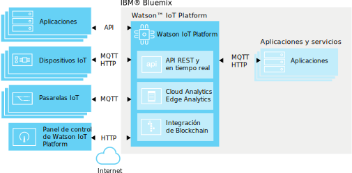

---

copyright:
  years: 2016, 2017
lastupdated: "2017-03-13"

---

{:new_window: target="\_blank"}
{:shortdesc: .shortdesc}
{:screen: .screen}
{:codeblock: .codeblock}
{:pre: .pre}

# Acerca de {{site.data.keyword.iot_short_notm}}
{: #about_iotplatform}

{{site.data.keyword.iot_full}} proporciona acceso potente de las aplicaciones a dispositivos y datos de IoT para ayudarle a componer rápidamente aplicaciones de analíticas, paneles de instrumentos de visualización y apps de IoT móviles.
{:shortdesc}

{{site.data.keyword.iot_short_notm}} le permite realizar operaciones de gestión de dispositivos potentes, y almacenar y acceder a datos de dispositivos, y a conectar una amplia variedad de dispositivos y dispositivos de pasarela. {{site.data.keyword.iot_short_notm}} proporciona comunicación segura a y desde los dispositivos utilizando MQTT y TLS.

## Arquitectura del {{site.data.keyword.iot_short_notm}}
{: #watsoniotplatform_architecture}

**Importante:** Las características de análisis se fusionan desde el servicio de {{site.data.keyword.iotrtinsights_full}}. Si la organización de {{site.data.keyword.iot_short_notm}} se utiliza como un origen de datos para una instancia existente de {{site.data.keyword.iotrtinsights_short}}, Cloud y Edge Analytics no se habilitarán hasta que se hayan migrado las instancias existentes de {{site.data.keyword.iotrtinsights_short}}. Siga utilizando el panel de control de {{site.data.keyword.iotrtinsights_short}} para sus necesidades de análisis hasta que se haya completado la migración. Para obtener más información, consulte el [Blog de IBM Watson IoT Platform ](https://developer.ibm.com/iotplatform/2016/04/28/iot-real-time-insights-and-watson-iot-platform-a-match-made-in-heaven/){: new_window} en IBM developerWorks y los paneles de control de instancias de {{site.data.keyword.iotrtinsights_short}} existentes.  

El {{site.data.keyword.iot_short_notm}} se comunica con las aplicaciones y dispositivos utilizando la API de {{site.data.keyword.iot_short_notm}} y el protocolo de mensajería de {{site.data.keyword.iot_short_notm}}. El panel de instrumentos de {{site.data.keyword.iot_short_notm}} se conecta como una interfaz de usuario frontal para simplificar operaciones dentro de la plataforma. Los datos de dispositivo se pueden almacenar o utilizar con las soluciones de analíticas.

## Conceptos importantes en el {{site.data.keyword.iot_short_notm}}
{: #watsoniotplatform_importantconcepts}

### Organizaciones

Al registrarse con el {{site.data.keyword.iot_short_notm}}, se le dará un ID de organización. El ID de organización es un identificador exclusivo de seis caracteres para la cuenta. Las organizaciones garantizan que sólo se pueda acceder a los datos mediante los dispositivos y las aplicaciones. Tras el registro, los dispositivos y las claves de la API están vinculados a una sola organización. Cuando una aplicación se conecta al servicio utilizando una clave de API, se registrará en la organización asociada con la clave de API que se utiliza.

Para la seguridad, es imposible para la comunicación entre organizaciones. La única forma de transmitir datos entre dos organizaciones es crear una aplicación dentro de cada organización que se comunicará con aplicaciones en la otra organización.

### Dispositivos

Un dispositivo puede ser cualquier cosa que tenga una conexión a Internet y que pueda enviar datos a la nube. Sin embargo, los dispositivos no se pueden comunicar directamente con otros dispositivos; en su lugar, los dispositivos aceptan mandatos de aplicaciones, y envían sucesos a las aplicaciones. Los dispositivos del {{site.data.keyword.iot_short_notm}} se identifican mediante una señal de autenticación exclusiva. Los dispositivos deben estar registrados antes de poder conectarse al {{site.data.keyword.iot_short_notm}}.

El {{site.data.keyword.iot_short_notm}} reconoce dos clases de dispositivos: **dispositivos gestionados** y **dispositivos no gestionados**.

**Dispositivos gestionados** se definen como dispositivos que contienen un agente de gestión de dispositivos. Un agente de gestión de dispositivos es un conjunto de lógicas que permiten al dispositivo interactuar con el servicio de Gestión de dispositivos de {{site.data.keyword.iot_short_notm}} mediante el Protocolo de gestión de dispositivos. Los dispositivos gestionados pueden realizar operaciones de gestión de dispositivos, incluidas actualizaciones de ubicación, descargas y actualizaciones de firmware, rearranques y restablecimientos de fábrica.

**Dispositivos no gestionados** son todos los dispositivos sin un agente de gestión de dispositivo. Los dispositivos no gestionados puede conectarse al {{site.data.keyword.iot_short_notm}} y enviar y recibir sucesos y mandatos, pero no pueden enviar solicitudes de gestión de dispositivo ni realizar operaciones de gestión de dispositivo.

### Pasarelas

Las pasarelas son dispositivos especializados que tienen las prestaciones combinadas de una aplicación y de un dispositivo, lo que les permite servir como puntos de acceso para otros dispositivos. Los dispositivos que no se pueden conectar directamente a Internet pueden acceder al servicio de {{site.data.keyword.iot_short_notm}} conectándose por primera vez al dispositivo de pasarela.

Las pasarelas deben estar registradas para que se puedan conectar al servicio.

### Aplicaciones

Una aplicación es algo que tiene conexión a Internet e interactúa con los datos de dispositivos y controla el comportamiento de dichos dispositivos. Las aplicaciones se identifican con el {{site.data.keyword.iot_short_notm}} utilizando una clave de API y un ID de aplicaciones exclusivo. A diferencia de los dispositivos, las aplicaciones individuales no necesitan registrarse para poder conectarse al {{site.data.keyword.iot_short_notm}}. Sin embargo, deben utilizar una clave de API válida que se haya registrado previamente.

### Sucesos

Los sucesos son el mecanismo por el que los dispositivos publican datos en el {{site.data.keyword.iot_short_notm}}. Los dispositivos controlan el contenido de los mensajes, y asignan un nombre para cada suceso que se envía. El {{site.data.keyword.iot_short_notm}} utiliza las credenciales que se adjuntan a cada suceso recibido para determinar qué dispositivo ha enviado el suceso. Esta arquitectura impide que los dispositivos se suplanten entre sí.

Las aplicaciones pueden procesar sucesos en tiempo real, y ver el origen del suceso y los datos contenidos en el suceso. Las aplicaciones deben estar configuradas para definir a qué dispositivos y sucesos se suscriben.

### Mandatos

Los mandatos son el mecanismo por el que las aplicaciones se comunican con los dispositivos. Sólo las aplicaciones pueden enviar mandatos, y los mandatos se envían a dispositivos específicos. El dispositivo debe determinar qué acción se llevará a cabo al recibir cualquier mandato indicado. Los dispositivos pueden estar diseñados para estar a la escucha de cualquier mandato o de suscribirse a una lista de mandatos especificada.
