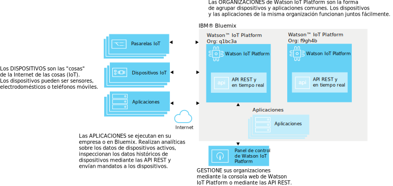
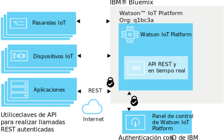
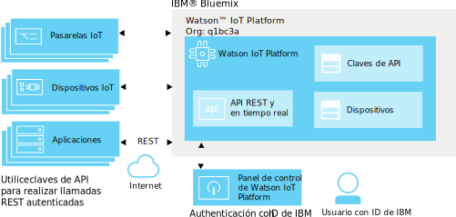
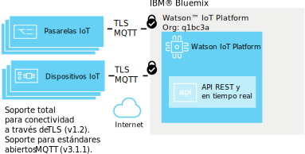
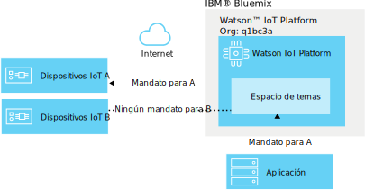
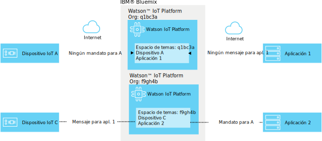

---

copyright:
  years: 2016, 2017
lastupdated: "2017-03-17"

---

{:new_window: target="blank"}
{:shortdesc: .shortdesc}
{:screen: .screen}
{:codeblock: .codeblock}
{:pre: .pre}

# Seguridad de {{site.data.keyword.iot_short_notm}}
{: #sec-index}

Como servicio alojado en nube, el {{site.data.keyword.iot_full}} incorpora seguridad como un aspecto importante de su arquitectura.
{: shortdesc}

El siguiente documento responde a algunas preguntas comunes sobre cómo se protegen los datos de la organización, centrándose en áreas específicas:

* Conformidad: estándares externos que establecen tests de referencia para seguridad.
* Autenticación: asegurar la identidad de los usuarios, dispositivos o aplicaciones que están intentando acceder a la información de la organización.
* Autorización: asegurar que los usuarios, los dispositivos y las aplicaciones tienen permiso para acceder a la información de la organización.
* Cifrado: asegurar que los datos sólo sean legibles por partes autorizadas y que no se puedan interceptar.

## {{site.data.keyword.iot_short_notm}} y {{site.data.keyword.Bluemix_notm}}
{: #iot-bluemix-sec}

{{site.data.keyword.iot_short_notm}} se ejecuta dentro de la plataforma {{site.data.keyword.Bluemix_notm}} y, por lo tanto, se basa en {{site.data.keyword.Bluemix_notm}} y {{site.data.keyword.BluSoftlayer_full}} para su acceso y conectividad. La dependencia en {{site.data.keyword.Bluemix_notm}} e {{site.data.keyword.BluSoftlayer}} hace que la seguridad y la fiabilidad de {{site.data.keyword.Bluemix_notm}} y {{site.data.keyword.BluSoftlayer}} sean importantes para los usuarios de {{site.data.keyword.iot_short_notm}}

Para obtener más detalles sobre la seguridad de {{site.data.keyword.Bluemix_notm}}, consulte [Seguridad de la plataforma {{site.data.keyword.Bluemix_notm}}](index.html#platform-security).

## {{site.data.keyword.iot_short_notm}} Conformidad de seguridad
{: #compliance}  
   
{{site.data.keyword.iot_short_notm}} tiene certificación bajo el estándar 27001 de ISO (International Organization for Standardization), que define las mejores prácticas para los procesos de gestión de seguridad de información. La norma ISO 27001 especifica los requisitos para establecer, implementar y documentar Sistemas de gestión de seguridad de la información (ISMS), además de los requisitos para implementar controles de seguridad, de acuerdo con las necesidades de cada empresa en concreto. La familia de normas ISO 27000 incorpora un proceso de escalado de riesgos y valoración de activos, con el objetivo de proteger la confidencialidad, la integridad y la disponibilidad de la información escrita, oral y electrónica.

{{site.data.keyword.iot_short_notm}} la audita una empresa de seguridad externa y cumple con todos los requisitos para ISO 27001: {{site.data.keyword.iot_short_notm}} Certificado de registro ISO 27001:2013.

## {{site.data.keyword.iot_short_notm}} Terminología
{: #terminology}

## ¿Cómo se protege la gestión de información de IoT dentro de su organización?
{: #secure-org}

La GUI basada en navegador y las API REST tienen como primer elemento HTTPS, con un certificado firmado por DigiCert, por lo que puede confiar que se está conectando al {{site.data.keyword.iot_short_notm}} genuino. El acceso a la GUI basada en web la autentica su ID de IBM o {{site.data.keyword.Bluemix_notm}} {{site.data.keyword.ssoshort}}. El uso de la API REST requiere una clave de API, generada mediante la GUI, que puede utilizar para realizar llamadas de API REST autenticadas en su organización.

## ¿Cómo aseguramos las credenciales de dispositivo y aplicación?
{: #secure-credentials}

Cuando los dispositivos están registrados o se generan claves de API, se echa sal y se aplica una función hash a la señal de autenticación. Esto significa que las credenciales de la organización nunca se pueden recuperar de nuestros sistemas, incluso en el caso poco probable de que el {{site.data.keyword.iot_short_notm}} esté en peligro.

Las credenciales de dispositivo y las claves de API se pueden revocar individualmente si están comprometidos.

## ¿Cómo nos aseguramos de que sus dispositivos se conecten de forma segura al {{site.data.keyword.iot_short_notm}}?
{: #secure-device-connection}

Los dispositivos se conectan mediante un ID de cliente o una señal de autenticación que se genera cuando se añaden dispositivos a la plataforma, o ambos. MQTT se utiliza para permitir la interoperatividad simple entre muchas plataformas e idiomas. El {{site.data.keyword.iot_short_notm}} da soporte a la conectividad sobre TLS v1.2.

Para obtener más información sobre los requisitos de TLS y de la suite de cifrado, consulte la sección [Requisitos de TLS](connect_devices_apps_gw.html#tls_requirements) en la documentación `Conexiones de aplicaciones, dispositivos y pasarelas a la Watson IoT Platform`.

Puede utilizar certificados y políticas de seguridad para mejorar la seguridad de conexión del dispositivo. Las políticas de seguridad se pueden definir de modo que permitan conexiones sin cifrar, que impongan solo conexiones de seguridad de la capa de transporte (sólo TLS) y que habiliten los dispositivos para que se autentiquen con certificados del lado del cliente. Las listas negras se pueden utilizar para especificar dispositivos que no tienen permiso para conectarse, y las listas blancas para permitir la conexión de dispositivos específicos. Para obtener más seguridad sobre la seguridad reforzada, consulte [Gestión de riesgos y de seguridad](RM_security.html).

## ¿Cómo evitamos el filtrado de datos entre dispositivos IoT?
{: #prevent-leak-devices}

Los patrones de mensajería segura se preparan. Una vez autenticados, los dispositivos sólo tendrán autorización para publicar y suscribirse a un espacio de temas restringido:

* '/iot-2/evt/<event_id>/fmt/<format_string>'
* '/iot-2/cmd/<command_id>/fmt/<format_string>'

Todos los dispositivos funcionan con el mismo espacio de temas. Las credenciales de autenticación proporcionadas por el cliente dictan para qué dispositivos tratará este espacio de temas el {{site.data.keyword.iot_short_notm}}.  Esto impide que los dispositivos puedan suplantar a otro dispositivo.

La única manera de suplantar a otro dispositivo consiste en obtener credenciales de seguridad comprometidas para el dispositivo.

Las aplicaciones pueden suscribirse y publicarse en el suceso y en los temas de mandatos para todos los dispositivos de la organización. Las aplicaciones pueden analizar datos de muchos dispositivos simultáneamente, y también pueden simular o colocar un proxy en dispositivos además de formar el lado complementario de un bucle de comunicación dúplex completo.

## ¿Cómo evitamos el filtrado de datos IoT entre organizaciones?
{: #prevent-leak-org}

El espacio de temas en el que funcionan los dispositivos y las aplicaciones se alcanza dentro de una sola organización. Cuando se autentica, el {{site.data.keyword.iot_short_notm}} transforma la estructura de temas utilizando un ID de organización basado en la autenticación de clientes, lo que hace posible que se acceda a los datos de una organización desde otra.

# Enlaces relacionados
{: #rellinks}
## Enlaces relacionados
{: #general}
* [Iniciación a {{site.data.keyword.iot_short_notm}}](https://console.ng.bluemix.net/docs/services/IoT/index.html)
* [Seguridad de {{site.data.keyword.Bluemix_notm}} ](https://console.ng.bluemix.net/docs/security/index.html#security){:new_window}
* [Seguridad de la plataforma de {{site.data.keyword.Bluemix_notm}} ](https://console.ng.bluemix.net/docs/security/index.html#platform-security){:new_window}
* [Conformidad de {{site.data.keyword.Bluemix_notm}}](https://console.ng.bluemix.net/docs/security/index.html#compliance){:new_window}
* [Seguridad de {{site.data.keyword.BluSoftlayer}} ](http://www.softlayer.com/security){:new_window}
* [Conformidad de {{site.data.keyword.BluSoftlayer}} ](http://www.softlayer.com/compliance){:new_window}
