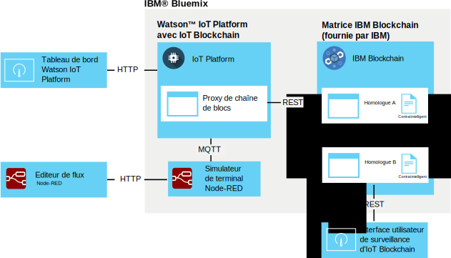

---

copyright:
  years: 2016, 2017
lastupdated: "2016-12-08"

---

{:new_window: target="\_blank"}
{:shortdesc: .shortdesc}
{:screen: .screen}
{:codeblock: .codeblock}
{:pre: .pre}

# Intégration de chaîne de blocs {{site.data.keyword.iot_short_notm}}
{: #gettingstartedtemplate}

L'intégration de chaîne de blocs {{site.data.keyword.iot_short_notm}} permet aux terminaux IoT de fournir des données aux transactions de chaîne de blocs, ainsi, les données sont stockées dans le grand livre non modifiable de la chaîne de blocs et sont utilisées dans des règles métier implémentées dans les contrats intelligents de la chaîne de blocs.
{:shortdesc}

La plateforme prendre les données de terminal dans leur format MQTT natif, les mappe au format de données qui est requis par le contrat intelligent de la chaîne de blocs et les transmet à une matrice de chaîne de blocs pour stockage dans le grand livre de la chaîne de blocs. Un matrice de chaîne de blocs est le regroupement de noeuds homologues et de certification qui constituent une instance d'{{site.data.keyword.blockchainfull}} et Hyperledger.

## Architecture de l'intégration de chaîne de blocs  
{: #architecture}

Un environnement d'intégration de chaîne de blocs {{site.data.keyword.iot_short_notm}} générique est constitué des composants suivants :
- Un ou plusieurs terminaux qui produisent les données que vous souhaitez écrire dans un grand livre de chaîne de blocs.
- Organisation {{site.data.keyword.Bluemix_notm}} :
 - Service {{site.data.keyword.iot_short_notm}} avec l'intégration de chaîne de blocs IoT activée.
 - Matrice {{site.data.keyword.blockchainfull_notm}} ou Hyperledger avec un ou plusieurs contrats intelligents déployés.
- Environnement local :
 - Interface utilisateur de surveillance IoT Blockchain

Pour plus d'informations sur la configuration et les exigences relatives à un environnement étendu pour la production et le déploiement de contrats intelligents, voir [Développement de contrats intelligents pour l'intégration de chaîne de blocs {{site.data.keyword.iot_short_notm}}](blockchain/dev_blockchain.html).  

Le diagramme suivant illustre l'environnement général de l'intégration de chaîne de blocs {{site.data.keyword.iot_short_notm}}.

## Avant de commencer
{: #byb}

- Dans le document [{{site.data.keyword.iot_short_notm}}](http://www.ibm.com/blockchain/) sur le site IBM.com, découvrez le produit {{site.data.keyword.iot_short_notm}}, de quelle manière il est lié au concept général de chaîne de blocs et ce qu'il peut faire pour vous.
- [Activez l'intégration de chaîne de blocs {{site.data.keyword.iot_short_notm}}](reference/extensions/index.html#blockchain) pour votre organisation.
- Connectez les terminaux qui produisent les données que vous souhaitez écrire dans le grand livre de chaîne de blocs.  
Suivez les instructions décrites dans la rubrique [Connexion de terminaux](iotplatform_task.html) pour connecter vos terminaux.
- Installez l'interface utilisateur de surveillance.
Cette interface utilisateur permet de vérifier la connexion entre {{site.data.keyword.iot_short_notm}} et la matrice de chaîne de blocs. Suivez les instructions décrites dans le fichier Readme Monitoring UI disponible dans le répertoire GitHub [Blockchain Monitoring UI](https://github.com/ibm-watson-iot/blockchain-samples/tree/master/applications/monitoring_ui).

### Utilisation du scénario IBM de base pour commencer rapidement

Pour vous familiariser rapidement avec l'intégration de chaîne de blocs {{site.data.keyword.iot_short_notm}}, vous pouvez vous connecter à une matrice fournie par IBM et mapper un exemple de terminal Node-RED à l'exemple de contrat fourni par IBM.  Les étapes requises pour ce scénario sont précédées de la mention **Scénario IBM de base** dans cette rubrique.  
**Important :** Sachez que l'exemple de grand livre de chaîne de blocs fourni par IBM et toutes ses données sont visibles pour tous les utilisateurs de l'exemple de chaîne de blocs. Ne stockez aucune information sensible dans l'exemple de chaîne de blocs fourni par IBM. De plus, les exemples de matrice qui prennent en charge les exemples de contrat et les contrats commerciaux sont soumis à des modifications, notamment les informations de connexion pour chaque homologue. Les informations de connexion sont fournies sur la page wiki [IoT Blockchain Connection Info](https://www.ibm.com/developerworks/community/wikis/home?lang=en#!/wiki/W7a44a0e604d9_4a90_89b7_0a2bdbe81b00/page/Blockchain%20Fabric%20Connections) de la communauté Watson IoT Blockchain.

L'environnement de l'intégration de chaîne de blocs {{site.data.keyword.iot_short_notm}} de base fourni par IBM est constitué des composants suivants :
- {{site.data.keyword.Bluemix_notm}}:
 - Service {{site.data.keyword.iot_short_notm}} avec l'intégration de chaîne de blocs IoT activée
 - Facultatif : Une application Node-RED qui exécute un simulateur de terminal IoT
   
 **Remarque :** Le simulateur de terminal peut également être déployé dans un environnement Node-RED local.
- Environnement local :
 - Node.js
 - Interface utilisateur de surveillance IoT Blockchain
- Fourni par IBM :
 - Facultatif : Matrice {{site.data.keyword.iot_short_notm}} avec un contrat intelligent simple prédéployé.

Le diagramme d'architecture suivant illustre les composants requis pour cet exemple de scénario :

**Scénario IBM de base :** Créez un simulateur de terminal Node-RED en suivant les instructions décrites dans la rubrique [Création et connexion d'un simulateur de terminal Node-RED](nodereddevice_sample.html). Pour l'intégration de chaîne de blocs, utilisez les informations de noeud spécifiques du terminal de chaîne de blocs lorsque vous importez les données de noeud. Les informations de noeud sont disponibles sur la page Wiki [Node-RED Device Simulator](https://www.ibm.com/developerworks/community/wikis/home?lang=en#!/wiki/W7a44a0e604d9_4a90_89b7_0a2bdbe81b00/page/Node-RED%20Device%20Simulator) de la communauté Watson IoT Blockchain. Si nécessaire, prenez contact avec votre agent IBM blockchain pour obtenir les droits d'accès à la communauté.

## Connexion à une matrice de chaîne de blocs
{: #getting_started}  
L'intégration de chaîne de blocs {{site.data.keyword.iot_short_notm}} étant activée, vous pouvez à présent vous connecter aux matrices de chaîne de blocs qui sont hébergées par {{site.data.keyword.blockchainfull_notm}} ou le grand livre Linux Foundation.

Pour établir une connexion à une matrice de chaîne de blocs :
1. Dans le tableau de bord {{site.data.keyword.iot_short_notm}}, sélectionnez **Extensions**.
2. Sur la page **Extensions**, dans le titre Blockchain, cliquez sur **Configuration**.
3. Sur la page **Extensions**, dans le titre Blockchain, cliquez sur **Configuration** ou sur l' si des matrices sont déjà liées, puis entrez les informations relatives à la matrice. 
 1. Dans l'onglet **Matrice**, entrez un nom permettant d'identifier la matrice dans {{site.data.keyword.iot_short_notm}}, puis cliquez sur **Suivant**.   
 2. Dans l'onglet **Homologue**, entrez les informations sur l'homologue :  
<table>
<thead>
<tr>
<th>Paramètre</th>
<th>Valeur</th>
</tr>
</thead>
<tbody>
<tr>
<td>Nom</td>
<td>Entrez un nom permettant d'identifier l'homologue dans {{site.data.keyword.iot_short_notm}}.</td>
</tr>
<tr>
<td>Hôte</td>
<td>Adresse `api_host` pour le serveur homologue de validation 1</td>
</tr>
<tr>
<td>Port</td>
<td>Numéro `api_port`<ul><li>Utilisez le port 80 si votre implémentation n'utilise pas TLS.</li><li>Utilisez le port 443 si votre implémentation utilise TLS.</li></ul></td>
</tr>
<tr>
<td>ID d'utilisateur</td>
<td>Chaîne `nom d'utilisateur` pour l'utilisateur qui a été utilisée afin d'enregistrer le contrat intelligent avec la chaîne de blocs. Vous utiliserez également cet ID d'utilisateur pour configurer ultérieurement l'interface utilisateur simple.</td>
</tr>
<tr>
<td>Clé secrète</td>
<td>Chaîne `secrète` pour l'utilisateur</td>
</tr>
<tr>
<td>Utiliser TLS</td>
<td>En fonction ou Hors fonction Utilisez le protocole TLS pour chiffrer la communication entre {{site.data.keyword.iot_short_notm}} et le contrat dans la matrice. Les numéros de port par défaut sont définis par l'instance {{site.data.keyword.iot_short_notm}} déployée à laquelle vous vous connectez.</td>
</tr></tbody>
</table>  
 3. Cliquez sur **Terminer**.
3. Dans la section Configuration de la chaîne de blocs, cliquez sur **Terminé** pour sauvegarder les informations sur la matrice.
    

**Scénario IBM de base :** Pour vous connecter à la matrice fournie par IBM, utilisez les informations de connexion de l'exemple de contrat fournies sur la page wiki [IoT Blockchain Connection Info](https://www.ibm.com/developerworks/community/wikis/home?lang=en#!/wiki/W7a44a0e604d9_4a90_89b7_0a2bdbe81b00/page/Blockchain%20Fabric%20Connections) de la communauté Watson IoT Blockchain. Si nécessaire, prenez contact avec votre agent IBM blockchain pour obtenir les droits d'accès à la communauté.

## Mappage de données de terminal aux contrats intelligents
{: #map_device_properties}

Pour écrire des données sur le grand livre de chaîne de blocs, vous devez d'abord mapper les propriétés de terminal pour un type de terminal aux paramètres qui sont définis par le contrat intelligent.

Pour mapper des données de terminal à un contrat :
 1. Dans le tableau de bord {{site.data.keyword.iot_short_notm}}, cliquez sur  dans la barre latérale de menus.
 3. Cliquez sur **Mapper les données de terminal**.
 4. Sélectionnez le type de terminal pour lequel vous souhaitez stocker des données de terminal dans la chaîne de blocs.
 5. Entrez le nom des événements que vous souhaitez stocker.  
 **Astuce :** Le nom d'événement par défaut pour l'exemple de terminal de chaîne de blocs Node-RED est obc. Pour rechercher les types d'événement d'un terminal, dans le tableau de bord {{site.data.keyword.iot_short_notm}}, sélectionnez **Terminaux** et cliquez sur le nom du terminal pour ouvrir la page d'informations le concernant. Faites défiler l'écran vers le bas jusqu'à la section **Informations sur le capteur** pour voir la liste des événements et points de données disponibles pour le terminal. Vous pouvez modifier le nom d'événement publié par le terminal Node-RED en mettant à jour la zone Sujet dans le noeud Publication dans IoT mqtt.  
 6. Cliquez sur **Suivant**.
 6. Sélectionnez l'instance de matrice que vous avez créée précédemment.
 7. Entrez un nom de contrat et l'identificateur de contrat.   
<table>
<thead>
<tr>
<th>Paramètre</th>
<th>Commentaire</th>
</tr>
</thead>
<tbody>
<tr>
<td>Nom de contrat</td>
<td>Nom utilisé pour identifier le contrat dans {{site.data.keyword.iot_short_notm}}.</td>
</tr>
<tr>
<td>ID de contrat</td>
<td>ID unique de 128 caractères du contrat mappé.   **Important :** Le contrat que vous mappez doit au minimum prendre en charge les méthodes suivantes :
- updateAsset
- readAssetSchemas  </td>
</tr>
</tbody>
</table>
**Scénario IBM de base :** L'exemple de contrat intelligent prédéployé vous permet de mapper des points de données de terminal à certains attributs de contrat pour stocker les valeurs de point de données dans le grand livre de chaîne de blocs. Utilisez l'exemple de contrat pour tester le mappage de données de terminal avant d'essayer d'utiliser les contrats commerciaux plus avancés ou d'écrire vos propres contrats. L'ID de contrat est fourni sur la page wiki [IoT Blockchain Connection Info](https://www.ibm.com/developerworks/community/wikis/home?lang=en#!/wiki/W7a44a0e604d9_4a90_89b7_0a2bdbe81b00/page/Blockchain%20Fabric%20Connections) de la communauté Watson IoT Blockchain. Si nécessaire, prenez contact avec votre agent IBM blockchain pour obtenir les droits d'accès à la communauté.
 8. Créez une route pour mapper des propriétés de terminal aux paramètres de contrat.  
 Les paramètres qui sont disponibles dans le contrat sont importés. Pour chaque paramètre, entrez une propriété d'événement correspondante.  
 **Important :** N'incluez pas le caractère `d.` qui est ajouté en préfixe au point de données dans le message de terminal.
 **Scénario IBM de base :** Si vous utilisez les contrats fournis par IBM, mappez les paramètres suivants répertoriés sur la page wiki [Data mapping](https://www.ibm.com/developerworks/community/wikis/home?lang=en#!/wiki/W7a44a0e604d9_4a90_89b7_0a2bdbe81b00/page/Data%20Mapping) de la communauté Watson IoT Blockchain. Si nécessaire, prenez contact avec votre agent IBM blockchain pour obtenir les droits d'accès à la communauté.
 9. Sur la page de synthèse, vérifiez que toutes les informations saisies sont correctes.
 10. Le mappage de données de terminal au contrat s'affiche sur la page de chaîne de blocs.

Félicitations, vous êtes opérationnel !

## Test de l'exemple de contrat intelligent fourni par IBM
{: #test_simple}

Si vous êtes connecté à la matrice fournie par IBM et que vous avez mappé vos données de terminal à l'exemple de contrat, vous pouvez tester le flux de données de bout en bout entre le terminal et le grand livre de chaîne de blocs. Utilisez l'interface utilisateur de surveillance IoT Blockchain pour consulter l'activité et les données de chaîne de blocs pour vos actifs.  
**Astuce :** Si l'interface utilisateur de surveillance n'est pas encore installée dans votre environnement local, vous pouvez l'installer dès maintenant. Suivez les instructions décrites dans le fichier Readme Monitoring UI disponible dans le répertoire GitHub [Blockchain Monitoring UI](https://github.com/ibm-watson-iot/blockchain-samples/tree/master/applications/monitoring_ui).  
1. Configurez l'interface utilisateur de surveillance pour qu'elle se connecte à {{site.data.keyword.iot_short_notm}}.  
 Dans l'interface utilisateur de surveillance, cliquez sur **CONFIGURATION** pour configurer sa connexion :
 <table>
<thead>
<tr>
<th>Paramètre</th>
<th>Commentaire</th>
</tr>
</thead>
<tbody>
<tr>
<td>Hôte et port d'API</td>
<td>Hôte et port de l'API REST {{site.data.keyword.iot_short_notm}} auxquels `http://` est ajouté en préfixe. Utilisez l'adresse `api_host` et le numéro `api_port`. </td>
</tr>
<tr>
<td>ID de code en chaîne</td>
<td>L'ID de contrat est une chaîne alphanumérique de 128 caractères qui correspond à l'entrée ID de contrat.  
**Important :** Lorsque vous copiez et collez l'ID de code en chaîne, assurez-vous qu'aucun espace n'est inclus dans l'ID. Si l'ID est incorrect, les entrées de grand livre de chaîne de blocs s'affichent, mais la fonction de recherche d'actif ne fonctionne pas.
</td>
</tr>
<tr>
<td>Contexte sécurisé</td>
<td>Ce paramètre est requis pour la connexion aux instances {{site.data.keyword.iot_short_notm}} sur Bluemix. Utilisez l'entrée secureContext.  
**Important :** Le contexte sécurisé doit être un utilisateur autorisé de la matrice, défini lors de la création de cette dernière.
</td>
</tr>
</tbody>
</table>
**Scénario IBM de base :** Pour configurer l'interface utilisateur de surveillance pour qu'elle se connecte aux contrats de base ou aux contrats commerciaux plus avancés, utilisez les informations de connexion fournies sur la page wiki [IoT Blockchain Connection Info](https://www.ibm.com/developerworks/community/wikis/home?lang=en#!/wiki/W7a44a0e604d9_4a90_89b7_0a2bdbe81b00/page/Blockchain%20Fabric%20Connections) de la communauté Watson IoT Blockchain. Si nécessaire, prenez contact avec votre agent IBM blockchain pour obtenir les droits d'accès à la communauté.
2. Dans l'éditeur de flux Node-RED, cliquez sur le bouton du noeud CON123 afin d'injecter des données de terminal, faites en sorte que ces dernières soient envoyées sous forme de message à {{site.data.keyword.iot_short_notm}} et écrites dans le grand livre {{site.data.keyword.iot_short_notm}} par le contrat simple.   
**Astuce :** Pour obtenir un flot de données en continu, cliquez deux fois sur le noeud d'injection, affectez la valeur `interval` au paramètre Répéter et configurez un intervalle approprié, par exemple, 1 minute.
3. Dans l'interface utilisateur de surveillance, vérifiez que les données de terminal sont affichées comme prévu dans les blocs de chaîne de blocs.  
  1. Vérifiez que des blocs sont ajoutés à la chaîne lorsque vous injectez des données à partir du terminal.  
  **Important :** N'utilisez pas le bouton d'actualisation de votre navigateur pour actualiser l'interface utilisateur de surveillance. Celle-ci est actualisée automatiquement par intervalles de quelques secondes. L'utilisation du bouton d'actualisation du navigateur a pour conséquence de réinitialiser les paramètres de l'interface utilisateur avec leurs valeurs par défaut, et vous devez reconfigurer l'interface utilisateur pour voir votre chaîne de blocs de contrat.
  2. Pour voir les dernières informations du grand livre pour votre actif, dans la zone de recherche de l'ID d'actif, entrez l'ID de votre actif, puis cliquez sur **SOUMETTRE**. Exemple :`CON123`  
  Pour voir les données de chaîne de blocs pour plusieurs actifs utilisant le même contrat, entrez ces noms d'actif et cliquez sur **SOUMETTRE**. Cliquez sur **REINITIALISER** pour recommencer.  
  **Astuces :**
    - La mise en fonction du dispositif de recherche de modifications garantit que l'interface utilisateur vérifie continuellement si des modifications sont apportées à l'actif observé/surveillé et actualise les données dès qu'une modification est validée dans la chaîne de blocs.
    - L'ID d'actif par défaut pour le terminal de chaîne de blocs est "CON123". Si vous avez modifié le message de terminal ou mis à jour l'ID d'actif dans le simulateur de terminal  Node-RED, vous pouvez rechercher l'ID d'actif dans {{site.data.keyword.iot_short_notm}}. Accédez à la page **Terminaux** et cliquez sur votre terminal pour ouvrir la page des informations le concernant. Faites défiler l'écran vers le bas jusqu'à la section **Informations sur le capteur** pour voir la liste des points de données disponibles pour le terminal. Utilisez la valeur du point de données `d.assetID` pour votre ID d'actif.

## Etapes suivantes  
{: #next_steps}  
Vous avez maintenant installé et configuré un environnement {{site.data.keyword.iot_short_notm}} de base intégré à IoT Blockchain. Dans ce scénario minimal, le contrat intelligent de base vous permet d'écrire des données de terminal dans le grand livre de chaîne de blocs afin de créer un historique de données de terminal ineffaçable. A présent que vous avez exécuté ces premières étapes et testé le contrat simple, vous pouvez essayer d'utiliser l'exemple de contrat commercial plus avancé et écrire vos propres contrats.    

Les instructions relatives à ces étapes plus avancées sont fournies dans la rubrique [Développement de contrats intelligents pour l'intégration de chaîne de blocs {{site.data.keyword.iot_short_notm}}](blockchain/dev_blockchain.html).
