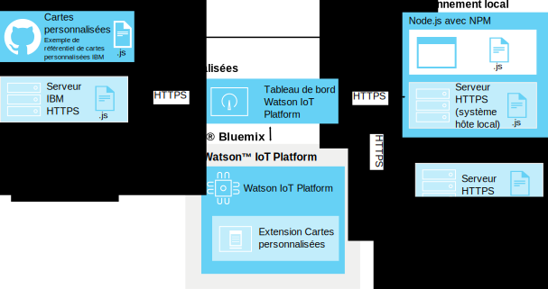

---

copyright:
  years: 2016, 2017
lastupdated: "2016-10-13"

---

{:new_window: target="\_blank"}
{:shortdesc: .shortdesc}
{:screen: .screen}
{:codeblock: .codeblock}
{:pre: .pre}

# Cartes personnalisées
{: #custom_cards}

Utilisez des cartes personnalisées pour visualiser vos données Internet of Things d'une manière améliorée par rapport aux cartes génériques fournies avec {{site.data.keyword.iot_full}}.
{:shortdesc}

## Architecture
{: #architecture}  

Les cartes personnalisées sont développées par vous et déployées à l'aide de votre propre référentiel de serveur HTTP de cartes personnalisées.  Ce serveur est accessible au moyen du navigateur d'un utilisateur qui affiche et traite les tableaux de bord {{site.data.keyword.iot_short_notm}}. {{site.data.keyword.iot_short_notm}} gère la connexion du navigateur via l'extension Cartes personnalisées, mais ne se connecte pas lui-même au serveur de cartes personnalisées.

Le navigateur qui exécute les tableaux de bord {{site.data.keyword.iot_short_notm}} extrait toutes les ressources nécessaires directement à partir du serveur de cartes personnalisées. Les cartes personnalisées sont offertes dans la boîte de dialogue d'ajout d'une carte et affichées dans les tableaux créés par les utilisateurs qui ont été configurés par vos utilisateurs.

Pour permettre l'activation du contrôle de version centralisée à l'aide du serveur de cartes, le code de carte personnalisée n'est pas mis en cache côté client. Si une carte personnalisée n'est plus disponible ou si le serveur de cartes est inaccessible, une marque de réservation est utilisée pour conserver une présentation de tableau de bord cohérente.

**Astuce :** Pour tester la fonction de cartes personnalisées sans avoir à configurer votre propre environnement de développement, vous pouvez vous connecter à l'exemple de serveur de cartes personnalisées fourni par IBM (`https://customcards.mybluemix.net`).

Pour créer vos cartes, vous devez configurer un environnement de développement local basé sur node.js et importer des exemples de carte à partir du référentiel GitHub de cartes personnalisées fourni par IBM. Après avoir créé vos cartes, déployez le package de cartes sur un serveur Web HTTPS sécurisé auquel vous liez ensuite l'extension Cartes personnalisées {{site.data.keyword.iot_short_notm}}.   

**Astuce :** Vous pouvez utiliser le serveur Web node.js intégré pour effectuer le test initial de vos cartes et identifier et résoudre les problèmes liés à ces dernières, mais vous devez utiliser un serveur Web sécurisé et bien administré pour les déploiements en production de vos cartes.

 

## Sécurité
{: #security}

Il n'existe aucune restriction sur le code JavaScript que vous choisissez de déployer dans vos cartes sur le serveur de cartes personnalisées. Le code Javascript des cartes personnalisées a accès à toutes les informations contenues dans le navigateur, tout comme n'importe quelle autre carte qui s'exécute sur le tableau de bord.  Assurez-vous que le code est fourni au navigateur par le bon serveur de cartes personnalisées pour l'affichage et le traitement des cartes personnalisées.

Les cartes exécutent leur code dans votre session de navigation {{site.data.keyword.iot_short_notm}} exactement tel qu'il est écrit. De plus, la connexion au serveur de cartes personnalisées est créée sans qu'aucune donnée d'identification ne soit communiquée au serveur de cartes personnalisées. Le navigateur d'un utilisateur peut se connecter à n'importe quel serveur de cartes personnalisées configuré.

Il est essentiel de configurer uniquement des serveurs de cartes personnalisées connus et sécurisés pour fournir des cartes personnalisées aux tableaux de bord de vos utilisateurs.   

Pour plus d'informations sur la sécurisation du serveur de cartes personnalisées, voir [Sécurité des cartes personnalisées](../reference/security/custom_cards_server.html).

Les étapes qui suivent vous guident lors du processus visant à établir une connexion à un serveur de cartes test, à déployer des exemples de cartes sur votre propre serveur de cartes et à créer et déployer vos propres cartes sur votre serveur.

## Etape 1 : Connecter {{site.data.keyword.iot_short_notm}} à l'exemple de serveur de cartes
{: #connect-to-sample}  

Pour tester la fonction de cartes personnalisées avec {{site.data.keyword.iot_short_notm}}, vous pouvez établir une connexion à l'exemple de serveur de cartes personnalisées. L'exemple de serveur contient un ensemble de cartes génériques qui sont également disponibles en tant que modèles pour la création de vos propres cartes.

Pour établir une connexion à l'exemple de serveur de cartes personnalisées :
1. Connectez-vous au tableau de bord {{site.data.keyword.iot_short_notm}} en tant qu'administrateur.
2. Activez les fonctions expérimentales.  
Actuellement, les cartes personnalisées sont fournies à titre expérimental.  
**Important :** L'extension Cartes personnalisées fournie à titre expérimental doit être activée pour chaque session de navigation. Les connexions de cartes personnalisées et les packages de cartes ne sont pas partagés globalement dans votre organisation {{site.data.keyword.iot_short_notm}}.
 1. Accédez à **Paramètres**.
 2. Dans la section Fonctions expérimentales, vérifiez que la case **Activer les fonctions expérimentales** est activée.
2. Connectez-vous à l'exemple de serveur.
 2. Accédez à **Extensions**.
 3. Cliquez sur **Ajouter une extension** et sélectionnez l'extension **Cartes personnalisées**.
 4. Dans la vignette **Carte personnalisée**, cliquez sur **Configurer**.
 5. Dans la section Configuration de cartes personnalisées, cliquez sur **Ajouter** et entrez l'URL sécurisée (HTTPS) de l'exemple de serveur de cartes dans la zone Serveur.  
Si vous vous connectez à votre propre serveur, entrez l'URL de celui-ci.    
**Astuce :** L'URL de l'exemple de serveur de cartes IBM est : `https://customcards.mybluemix.net`.  
 6. Cliquez sur **Extraire le certificat** pour établir une connexion au serveur de cartes personnalisées et extraire les informations de certificat de sécurité pour le serveur.  
 **Important :** Utilisez les informations de certificat pour vous assurer que vous vous connectez bien au serveur de cartes personnalisées connu et sécurisé souhaité.
 4. Cliquez sur **Terminé** pour ajouter la connexion serveur.
5. Créez une nouvelle carte à partir des exemples de carte.
 1. Dans le tableau de bord {{site.data.keyword.iot_short_notm}}, accédez à **Tableaux**.
 2. Cliquez sur **Créer un tableau**.  
 Renseignez la boîte de dialogue Créer un tableau. Pour toute information, voir [Création de tableaux et de cartes](../data_visualization.html#visualizing_data).
 3. Ouvrez le nouveau tableau.
 4. Cliquez sur **Ajouter une nouvelle carte**.  
 5. Faites défiler l'écran vers **Cartes personnalisées** et sélectionnez l'un des exemples de carte.  
 Exécutez le processus de création de carte. Pour toute information, voir [Création de tableaux et de cartes](../data_visualization.html#visualizing_data).  

 Votre nouvelle carte personnalisée est désormais dans votre nouveau tableau.  
 

Félicitations, vous vous êtes connecté à un serveur de cartes personnalisées et avez ajouté une carte personnalisée à l'un de vos tableaux. L'étape suivante consiste à configurer votre propre serveur de cartes et à créer votre première carte à l'aide de l'exemple de carte HelloWorld.

## Etape 2 : Configurer un serveur de cartes et déployer l'exemple de carte HelloWorld
{: #create-hello-world}

Pour préparer le développement de cartes personnalisées, vous pouvez configurer votre environnement de développement de cartes personnalisées local et tester le déploiement de l'exemple de carte HelloWorld.

Pour créer un serveur de cartes personnalisées et déployer les exemples de carte IBM, suivez les instructions détaillées contenues dans le fichier Readme relatif au [référentiel de cartes personnalisées](https://github.com/ibm-watson-iot/custom-cards/blob/master/README.md).

Le processus implique les étapes de haut niveau suivantes :
1. Assurez-vous que votre environnement de développement local comporte Node.js avec le gestionnaire de package de noeuds NPM.  
Pour toute information sur l'installation de Node.js, y compris les liens de téléchargement, voir https://nodejs.org
2. Configurez un serveur HTTP destiné à héberger votre package de cartes personnalisées.    
  - L'accès au répertoire qui prend en charge le contenu de carte personnalisée sur le serveur ne doit pas nécessiter de données d'identification.
  - Le serveur doit utiliser le protocole HTTPS.
  - Le serveur doit prendre en charge les connexions de partage de ressources d'origine croisée.  
**Astuce :** Pour que le test et la preuve de concept fonctionnent, vous pouvez utiliser l'exemple de serveur node.js intégré, configuré pour répondre à ces exigences.
3. Créez votre propre référentiel.
Déviez et clonez l'exemple de référentiel de cartes personnalisées à l'adresse suivante : https://github.com/ibm-watson-iot/custom-cards
4. Créez votre propre infrastructure de module et de carte.
Les cartes personnalisées sont organisées en modules. Configurez un nouveau module de carte HelloWorld.
5. Référencez la nouvelle carte.
Votre package de cartes personnalisées peut contenir plusieurs modules. Vous devez référencer votre nouveau module dans votre principal fichier de package.
6. Enregistrez votre module.
Pour rendre votre carte disponible dans les tableaux de votre organisation {{site.data.keyword.iot_short_notm}}, vous devez ajouter les détails de configuration de carte dans le fichier `DashboardConfig.json`.
7. Créez votre propre package de cartes.
Utilisez Gulp pour configurer un moteur de génération automatisé.
8. Déployez votre package de cartes sur votre serveur de cartes.  
Avant de pouvoir utiliser vos cartes dans {{site.data.keyword.iot_short_notm}}, vous devez déployer le package de cartes sur votre serveur HTTP de cartes personnalisées.  
**Astuce :** Vous pouvez ajouter de nouvelles cartes ou retirer des cartes obsolètes à la volée en redéployant le package de cartes sur le serveur de cartes.
9. Liez votre serveur de cartes à {{site.data.keyword.iot_short_notm}}.
Liez votre serveur de cartes personnalisées nouvellement déployé à {{site.data.keyword.iot_short_notm}}.  
**Astuce :** Etant donné qu'il est possible que votre serveur de cartes personnalisées soit une réplication totale de l'exemple de serveur de cartes, vous verrez peut-être des cartes en double dans votre environnement. Retirez l'exemple de connexion de serveur de cartes pour voir uniquement les cartes de votre serveur de cartes personnalisées.
 1. Accédez à **Extensions**.
 2. Dans la vignette **Carte personnalisée**, cliquez sur l'icône représentant un engrenage pour mettre à jour la configuration.
 4. Dans la section Configuration de cartes personnalisées, cliquez sur **Ajouter** et entrez l'URL sécurisée (HTTPS) de votre serveur de cartes personnalisées dans la zone Serveur.  
**Important :** Vérifiez que vous vous connectez bien au serveur de cartes personnalisées connu et sécurisé souhaité.
4. Cliquez sur **Terminé** pour ajouter la connexion serveur.
10. La carte personnalisée HelloWorld est maintenant disponible et vous pouvez l'utiliser avec vos tableaux.

Bien ! Vous avez configuré un serveur de cartes et déployé votre premier exemple de carte. Félicitations ! Toutefois, le principal objectif des cartes personnalisées est de vous permettre de configurer des cartes et des tableaux selon vos souhaits. Il est temps de commencer à modifier des exemples afin de créer vos propres cartes.

## Etape 3 : Créer et déployer vos propres cartes personnalisées.
{: #create-your-own-cards}
Après avoir configuré et vérifié la carte HelloWorld, vous pouvez passer aux cartes personnalisées et créer vos propres cartes personnalisées.

La référentiel d'exemples de carte personnalisée inclut les exemples de carte suivants :
- HelloWorld  
Carte simple qui fournit un exemple Hello World de base. 
- Vide  
Carte vide contenant l'infrastructure nécessaire pour une carte. Utilisez cette carte comme modèle lorsque vous générez une carte à partir de zéro.
- Webcam  
Carte de caméra Web simple. Configurez la carte avec une URL webcam et définissez la fréquence de régénération.
- iFrame  
Carte iFrame de base que vous pouvez utiliser pour intégrer n'importe quelle page Web HTTPS dans votre tableau. 

Le processus de création d'une nouvelle carte implique les étapes de haut niveau suivantes :

**Astuce :** Pour obtenir les étapes détaillées, voir le fichier Readme relatif à [la création de cartes personnalisées](https://github.com/ibm-watson-iot/custom-cards/blob/master/README.md) dans l'exemple de référentiel de cartes personnalisées.
1. Créez votre propre module de carte.
 1. Utilisez l'un des exemples de module de carte en tant que modèle pour votre module.
 2. Mettez à jour toutes les instances du nom de module dans vos nouveaux noms de fichier de module et vos nouvelles instances de contenu de fichier.  
 Par exemple, remplacez `HelloWorld` par votre nom de module dans tous les noms de fichier et toutes les instances de contenu de fichier.
2. Référencez le nouveau module dans le fichier Modules.jsx.
3. Enregistrez le nouveau module dans le fichier DashboardConfig.json.
4. Mettez à jour le code de carte personnalisée en fonction de vos besoins en matière de carte.
4. Générez le package de cartes.  
Selon votre configuration, le processus de génération peut s'effectuer automatiquement à l'aide de Gulp, ou vous devrez peut-être le déclencher manuellement.
3. Déployez la nouvelle carte.  
Si vous utilisez un serveur de cartes personnalisées externe, vous devez maintenant déployer le package sur le serveur.  

Vous avez créé votre première carte personnalisée et vous l'avez déployée sur votre serveur de cartes personnalisées. La carte est maintenant disponible pour être utilisée dans votre organisation {{site.data.keyword.iot_short_notm}}.
