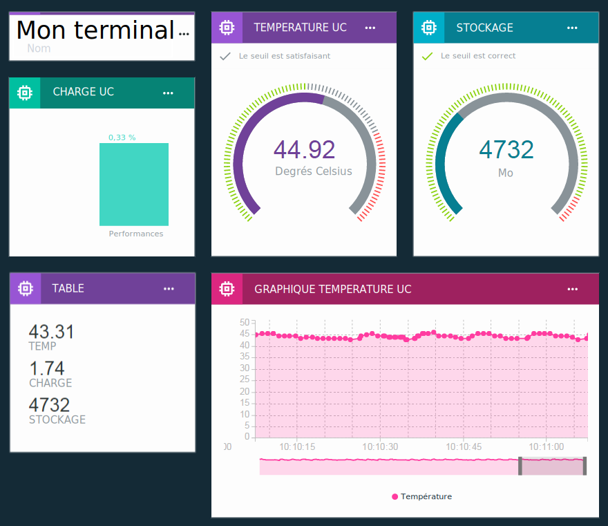

---

copyright:
  years: 2016, 2017
lastupdated: "2017-02-17"

---

{:new_window: target="\_blank"}
{:shortdesc: .shortdesc}
{:screen: .screen}
{:codeblock: .codeblock}
{:pre: .pre}

# Visualisation des données en temps réel à l'aide de tableaux et de cartes
{: #boards_and_cards}

Créez des tableaux et des cartes afin de créer et partager vos propres tableaux de bord permettant de visualiser vos données de terminal en temps réel.
{:shortdesc}

En utilisant des tableaux et des cartes, vous pouvez visualiser des graphiques qui représentent des valeurs de fichier provenant d'un ou de plusieurs terminaux pour une présentation et une compréhension rapides des données de terminal. Créez des tableaux et ajoutez des cartes qui affichent les données sous forme de nombres bruts, de graphiques en temps réel, de jauges, etc. Ajoutez des membres à vos tableaux pour les partager avec d'autres utilisateurs dans votre organisation. Organisez les cartes et ajoutez des diviseurs de texte explicatif pour peaufiner votre présentation  

Vous pouvez également développer l'ensemble par défaut des cartes fournies par IBM [en créant vos propres cartes personnalisées](custom_cards/custom-cards.html).

## Cartes par défaut
{: #default_boards}
Le tableau de bord {{site.data.keyword.iot_full}} comporte les tableaux par défaut suivants :

|Nom de tableau | Description |  
|:---|:---|  
|Présentation de l'utilisation  | Affiche les statistiques d'utilisation relatives à votre organisation. Répertorie les types de terminal, ainsi que les données consommées.
|Analyse centrée sur la règle | Affiche les règles de votre organisation. Des cartes supplémentaires recensent les alertes déclenchées, les terminaux associés, les propriétés de terminal et les informations d'alerte. |  
|Analyse centrée sur le terminal | Affiche les terminaux qui sont connectés à votre organisation. Des cartes supplémentaires affichent des alertes pour un terminal sélectionné, des informations relatives à un terminal sélectionné, et des informations d'alerte. |
|Gestion des risques et de la sécurité | Affiche des cartes qui résument l'état général de la sécurité. Les opérateurs système et les analystes de sécurité peuvent afficher des détails sur la conformité, l'état de connexion des terminaux, les causes des pannes de connexion et les terminaux qui sont bloqués ou autorisés via une liste noire ou une liste blanche.  À partir de la carte de conformité de connexion, l'utilisateur peut obtenir un rapport détaillé sur les terminaux non conformes et peut exporter le rapport vers Excel. |

Vous pouvez mettre à jour ces tableaux en ajoutant, en mettant à jour et en retirant des cartes.

**Astuce :** Pour réinitialiser un tableau par défaut avec son état d'origine, vous pouvez le supprimer. Le tableau est ensuite recréé avec les cartes d'origine.

## Création de tableaux et de cartes
{: #visualizing_data}

{{site.data.keyword.iot_short_notm}} fournit un tableau intégré que vous pouvez utiliser pour afficher les données en temps réel renvoyées par votre terminal. Par défaut, la page de présentation affiche les informations d'utilisation relatives à votre organisation {{site.data.keyword.iot_short_notm}}, telles que les données et l'espace de stockage consommés. Pour afficher le flux des données de terminal en temps réel, ajoutez des cartes spécifiques des terminaux à cette page.

Pour ajouter une carte spécifique d'un terminal à un tableau :
1. Dans le tableau de bord {{site.data.keyword.iot_short_notm}}, sélectionnez **Tableaux**.
2. Sélectionnez un tableau sur lequel vous possédez des droits d'édition ou créez un nouveau tableau.
3. Dans le tableau, cliquez sur **Ajouter une nouvelle carte**.
2. Dans la zone d'édition de la carte de visualisation générique, faites défiler l'écran vers la section Terminaux.
3. Sélectionnez un type de visualisation.
**Astuce :** Sélectionnez **Visualisation générique** pour la configuration de base. Vous pouvez modifier le type de carte ultérieurement.
Cliquez sur **Plus de détails** pour afficher la liste complète des types de carte.
4.	Sélectionnez une ou plusieurs sources de données de carte, puis cliquez sur **Suivant** pour ajouter un ou plusieurs fichiers.
 1.	Donnez un nom d'identification au fichier.
 2. Sélectionnez un événement qui inclut le point de données que vous souhaitez afficher.
 3.	Sélectionnez la propriété qui représente le point de données.
 4.	Définissez le type, l'unité, la précision, et les valeurs minimum et maximum pour le point de données.  
 Lorsque vous avez terminé, vous pouvez cliquer sur **Nouveau fichier** pour ajouter d'autres fichiers ou cliquer sur **Suivant**.
5.	Sélectionnez la visualisation.  
Sélectionnez le type et la taille de visualisation que vous souhaitez utiliser.  Certains types de carte ont d'autres paramètres.
<dl>
<dt>Utilisation</dt>
<dd>
<table>
<thead>
<tr>
<th>Type</th>
<th>Données affichées.</th>
</tr>
</thead>
<tbody>
<tr>
<td>Types de terminal</td>
<td>Graphique circulaire qui affiche le nombre de terminaux par type de terminal.</td>
</tr><tr>
<td>Données transférées</td>
<td>Statistiques d'utilisation relatives aux données transférées pour votre organisation.</td>
</tr>
</tbody>
</table>
</dd>
<dt>De base</dt>
<dd>
<table>
<thead>
<tr>
<th>Type</th>
<th>Données affichées.</th>
</tr>
</thead>
<tbody>
<tr>
<td>Séparateur</td>
<td>Séparateur horizontal permettant de structurer et de regrouper des cartes sur le tableau.</td>
</tr>
</tbody>
</table>
</dd>
<dt>Terminaux</dt>
<dd><table>
<thead>
<tr>
<th>Type</th>
<th>Données affichées.</th>
</tr>
</thead>
<tbody>
<tr>
<td>Visualisation générique</td>
<td>Valeur d'un ou de plusieurs fichiers.  **Astuce :** Pour voir jusqu'à trois valeurs de points de données dans un petit tableau, choisissez la grande taille de widget.  </td>
</tr>
<tr>
<td>Graphique en temps réel</td>
<td>Un ou plusieurs fichiers dans un graphique de défilement en temps réel. Utilisez le menu Paramètres pour définir la plage et la conservation des données, la présentation des graphiques, etc. </td>
</tr>
<tr>
<td>Graphique à barres</td>
<td>Valeurs des fichiers dans des barres libellées. Utilisez le menu Paramètres pour passer de l'affichage horizontal à l'affichage vertical et inversement pour les barres.</td>
</tr>
<tr>
<td>Graphique en anneau</td>
<td>Au moins deux fichiers dans une représentation circulaire.</td>
</tr>
<tr>
<td>Valeur</td>
<td>Valeur brute d'un ou de plusieurs fichiers.</td>
</tr>
<tr>
<td>Jauge</td>
<td>Valeur d'un fichier affichée sous forme de jauge. Vous pouvez configurer des seuils d'affichage pour les valeurs Correct, Satisfaisant et Critique du fichier. Utilisez le menu Paramètres pour définir éventuellement des seuils de jauge pour les plages de données inférieures, intermédiaires et supérieures.  </td>
</tr>
</tbody>
</table>
</dd>
<dt>Analyse</dt>
<dd>
<table>
<thead>
<tr>
<th>Type</th>
<th>Données affichées.</th>
</tr>
</thead>
<tbody>
<tr>
<td>Informations sur le terminal</td>
<td>Affiche des informations de base pour un terminal.</td>
</tr>
<tr>
<td>Informations d'alerte</td>
<td>Affiche des informations de base pour une alerte.</td>
</tr>
<tr>
<td>Liste de terminaux</td>
<td>Liste permettant de surveiller plusieurs terminaux.</td>
</tr>
<tr>
<td>Alertes</td>
<td>Liste d'alertes pour un terminal.</td>
</tr>
<tr>
<td>Règles</td>
<td>Liste de règles auxquelles sont associées des alertes.</td>
</tr>
<tr>
<td>Propriétés de terminal</td>
<td>Affiche des propriétés spécifiques pour un ou plusieurs terminaux.</td>
</tr>
<tr>
<td>Toutes les propriétés de terminal</td>
<td>Affiche toutes les propriétés pour un ou plusieurs terminaux.</td>
</tr>
<tr>
<td>Mappe de terminaux</td>
<td>Affiche l'emplacement de plusieurs terminaux dans une liste.</td>
</tr>
</tbody>
</table>
</dd>
</dl>

6. Spécifiez la source de données pour la carte.  
Selon le type de carte que vous avez sélectionné, les données affichées sur une carte peuvent provenir d'un terminal ou d'une autre carte. Sélectionnez un terminal spécifique ou une liste de terminaux ou une carte de liste d'alertes pour la source de données, puis cliquez sur **Suivant**.
7. Cartes de types de terminaux uniquement : Ajoutez un ou plusieurs fichiers à afficher dans la carte.   
 1. Cliquez sur **Connecter un fichier** pour ajouter une propriété à afficher dans la carte.
 2. Donnez un nom au fichier.
 3. Entrez ou sélectionnez l'événement pour lequel vous souhaitez afficher des propriétés.
 4. Entrez ou sélectionnez la propriété à afficher.
 5. Spécifiez le type de la propriété et éventuellement définissez l'unité, la précision et les valeurs minimum et maximum pour la propriété.  
 6. Cliquez sur **Suivant**.
7. Sélectionnez la taille de la présentation.   
Pour certains types de carte, vous pouvez cliquer sur **Paramètres** pour configurer des détails de visualisation supplémentaires. Cliquez sur **Suivant**.
7. Entrez un titre et une description pour la carte et sélectionnez éventuellement un schéma de couleurs, puis cliquez sur **Soumettre** pour créer la carte.
7.	Enfin, positionnez la nouvelle carte sur votre tableau en la faisant glisser vers l'emplacement approprié.  

Parfait ! Vous pouvez désormais voir les données en temps réel de votre terminal !

Pour obtenir les instructions étape par étape relatives à l'affichage des données de terminal en temps réel, voir la recette [Configuring Boards & Cards in the new Watson IoT Dashboard ](https://developer.ibm.com/recipes/tutorials/configuring-the-cards-in-the-new-watson-iot-dashboard/){: new_window}.
