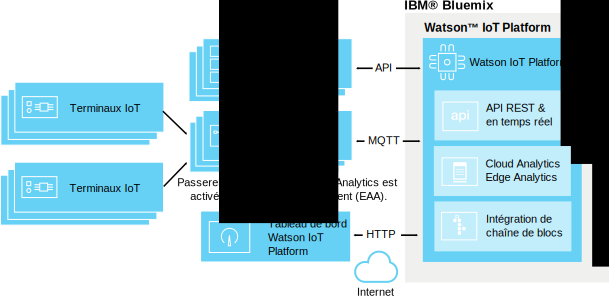

---

copyright:
  years: 2016, 2017
lastupdated: "2017-02-17"

---

{:new_window: target="\_blank"}
{:shortdesc: .shortdesc}
{:screen: .screen}
{:codeblock: .codeblock}
{:pre: .pre}

# Edge analytics
{: #edge_analytics}

Avec Edge Analytics, le processus d'analyse déclenché par des règles depuis le cloud est remplacé par une passerelle sur laquelle Edge Analytics est activé. Cela peut vous permettre de réduire considérablement la quantité de données de terminal envoyées vers le cloud car le traitement des analyses est exécutée à proximité du terminal.
{:shortdesk}

Les terminaux envoient leurs données à une passerelle sur laquelle un agent Edge Analytics est activé pour une analyse syntaxique des données par les règles de ce dernier. Selon la règle définie et l'action correspondante, des données critiques et des alertes peuvent être envoyées à {{site.data.keyword.iot_full}} ou être écrites dans un fichier texte en local sur la passerelle.

Le diagramme suivant illustre l'architecture générale d'un environnement {{site.data.keyword.iot_full}} Edge Analytics.

## Avant de commencer
{: #byb}

Avant de commencer à créer des règles et des actions Edge :
- Assurez-vous que votre passerelle est connectée à {{site.data.keyword.iot_short}} et que les données de terminal sont transmises. Pour plus d'informations, voir [Connexion de passerelles](gateways/dashboard.html).
- Installez l'agent Edge Analytics Agent (EAA) sur votre passerelle. Pour plus d'informations, voir [Installation de l'agent Edge Analytics Agent](gateways/dashboard.html#edge).   **Astuce : ** Les passerelles sur lesquelles l'agent EAA est activé fournissent des données de diagnostic EAA sous la forme de messages de terminal de passerelle. Pour plus d'informations, voir [Mesures de diagnostic Edge Analytics Agent](#eaa_metrics).
- Assurez-vous que les propriétés de terminal que vous souhaitez utiliser comme conditions dans vos règles sont mappées à des schémas. Pour plus d'informations, voir [Connexion de terminaux](iotplatform_task.html) et [Création de schémas](im_schemas.html).
- Recettes Edge Analytics  
Dans votre portail de recettes, deux recettes décrivent les étapes requises pour exécuter IBM Edge Analytics. Les recettes expliquent comment installer et configurer IBM Edge Analytics Agent sur un terminal qui se trouve au-dessus d'Apache Edgent pour exécuter des analyses proches d'une source de données IoT.
 - La première recette de cette série est [Getting Started with Edge Analytics in IBM Watson IoT Platform ](https://developer.ibm.com/recipes/tutorials/getting-started-with-edge-analytics-in-watson-iot-platform/){: new_window}. Elle explique comment configurer Cisco DSA Platform sur un système d'ordinateur portable et un terminal Raspberry Pi 3, installer et configurer IBM Edge Analytics Agent pour la connexion à {{site.data.keyword.iot_short}}, installer System DS Link et le configurer pour la connexion à la passerelle Edge sur {{site.data.keyword.iot_short}} en tant que terminal connecté et définir et activer la règle Edge sur la passerelle Edge, ainsi que la gestion des règles Edge à partir de {{site.data.keyword.iot_short}}.
 - Pour illustrer une utilisation avancée de Edge Analytics, la recette [Handling Alerts and Device Actions with Edge Analytics in IBM Watson IoT Platform ](https://developer.ibm.com/recipes/tutorials/handling-alerts-and-device-actions-with-edge-analytics-in-ibm-watson-iot-platform/){: new_window} vous montre comment créer votre propre lien DS pour transférer des données entre un terminal Arduino Uno connecté et un terminal Raspberry Pi 3. La  recette présente également les actions de filtrage de données et de traitement de terminaux locaux dans le cadre de l'alerte de règle Edge.

## Gestion des règles et des actions Edge  
{: #managing_rules}

Les règles Edge sont gérées à l'aide des éléments suivants :
- Le tableau de bord **Règles** vous permet de créer et d'éditer des règles et des actions Cloud et Edge pour vos terminaux et vos passerelles.
- Le tableau **Passerelles de règles Edge** vous permet d'activer, de désactiver, de mettre à jour et de retirer une règle Edge sur vos passerelles. Pour accéder à ce tableau, depuis le tableau de bord Règles, cliquez sur **Gérer la règle** pour la règle Edge que vous souhaitez gérer. Pour plus d'informations, voir [Activation, désactivation et gestion des règles Edge pour vos passerelles](#manage).

Pour obtenir une présentation des règles et des alertes Edge qui ont été déclenchées pour vos terminaux connectés à une passerelle, utilisez les tableaux suivants :

|Nom de tableau | Description |  
 |:---|:---|  
  |Analyse centrée sur la règle | Affiche les règles de votre organisation, y compris les règles Edge. Des cartes supplémentaires recensent les alertes Edge transmises, les terminaux associés, les propriétés de terminal et les informations sur les alertes Edge transmises. |  
 |Analyse centrée sur le terminal | Affiche les terminaux qui sont connectés à votre organisation. Des cartes supplémentaires affichent les alertes transmises pour un terminal Edge sélectionné, les informations relatives à celui-ci, les propriétés du terminal et les informations sur les alertes transmises. |

Pour plus d'informations sur les cartes d'analyse par défaut, voir [Visualisation des données en temps réel à l'aide de tableaux et de cartes](data_visualization.html#default_boards).

## Création de règles Edge
{: #rules}

Les règles Edge sont des points de décision basés sur une condition qui correspondent aux données de terminal en temps réel avec des valeurs de seuil prédéfinies ou d'autres données de propriété afin de déclencher une action Edge si une condition est remplie.

**Important :** Avant de pouvoir créer des règles pour un type de terminal, vous devez créer un schéma pour le type de terminal. Pour plus d'informations, voir [Créer des schémas de type de terminal](im_schemas.html).

Pour créer une règle :
1. Dans le tableau de bord {{site.data.keyword.iot_short}}, accédez à **Règles**.
2. Cliquez sur **Créer une règle Edge**, attribuez un nom à la règle, fournissez une description, sélectionnez un type de terminal Edge auquel s'applique la règle, puis cliquez sur **Suivant**.  
3. Configurez la logique de règle.  
Ajoutez une ou plusieurs conditions IF à utiliser comme déclencheurs de la règle.  
Vous pouvez ajouter des conditions sur des lignes parallèles afin de les appliquer en tant que conditions OR ou vous pouvez ajouter des conditions dans des colonnes séquentielles afin de les appliquer en tant que conditions AND.  
**Remarque :** Pour qu'une propriété de terminal puisse être sélectionnée en tant qu'entrée d'une règle, elle doit être mappée à un schéma. Pour plus d'informations, voir [Création de schémas](im_schemas.html).  

**Important :** Pour déclencher une condition qui compare deux propriétés ou pour déclencher au moins deux conditions de propriété combinées de manière séquentielle à l'aide de l'opérateur AND, les points de données de déclenchement doivent être inclus dans le même message de terminal. Si les données sont reçues dans plusieurs messages, la condition ou les conditions séquentielles ne se déclenchent pas.  

**Exemples :**   
Une règle simple peut déclencher une alerte si une valeur de paramètre est supérieure à une valeur spécifiée :  
`temp>80`  
Une règle plus complexe peut être déclenchée lorsqu'une combinaison de seuils est atteinte :  
`temp>60 AND capacity>50`   

4. Configurez les exigences de déclenchement conditionnel pour votre règle.  
Pour contrôler le nombre d'alertes et d'actions qui sont déclenchées pour une règle pendant une période donnée, vous pouvez configurer des exigences de déclenchement conditionnel pour votre règle.  
**Important :** Le déclenchement conditionnel agit sur n'importe quelle condition dans la règle. Par exemple, si cinq conditions parallèles différentes sont définies sur une règle à l'aide de l'opérateur OR, chaque condition qui est remplie est décomptée du nombre de déclenchements conditionnels.
Pour définir un déclenchement conditionnel pour une règle :
 1. Dans l'éditeur de règles, cliquez sur le lien par défaut **Déclencher chaque fois que les conditions sont remplies** pour ouvrir la boîte de dialogue Définir une exigence de fréquence.
 2. Sélectionnez et configurez le déclencheur conditionnel que vous souhaitez utiliser dans la règle.
 <ul>
 <li>Déclencher chaque fois que les conditions sont remplies</li>
 <li>Déclencher si des conditions sont remplies N fois en M *unité de temps*</li>
 </ul>  
 Pour obtenir une description plus détaillée des déclencheurs conditionnels, voir [Déclenchement de règle conditionnel](cloud_analytics.html#conditional "Vue d'ensemble du déclenchement conditionnel") dans la section sur l'analyse de cloud.
5. Créez ou sélectionnez une ou plusieurs actions qui se déclenchent si les conditions de règle sont remplies.  
Pour plus d'informations sur les actions Edge, voir [Création d'actions Edge](#edge_actions "Créer des actions Edge").   
 Par exemple, une action peut être utilisée pour envoyer des données de terminal au cloud ou pour écrire une alerte dans un fichier local.
3. **Facultatif :** Sélectionnez une priorité d'alerte pour la règle.  
 La priorité est utilisée pour classifier les alertes qui s'affichent dans le tableau **Analyse basée sur les règles**. La priorité par défaut est Low (faible).
6. Lorsque la règle vous convient, cliquez sur **Sauvegarder**.

Votre règle est créée et ajoutée au tableau de bord de navigation. Vous pouvez désormais [activer](#manage) la règle depuis le tableau **Passerelles de règles Edge** qui s'ouvre.

## Création d'actions Edge
{: #edge_actions}

Vous pouvez créer des actions directement dans l'éditeur de règles ou vous pouvez créer les actions dans l'onglet Actions, puis sélectionner les actions lorsque vous créez vos règles.

Pour créer une action à partir de l'onglet Actions :
1. Dans le tableau de bord {{site.data.keyword.iot_short}}, accédez à **Règles**.
2. Dans le tableau de bord Règles, sélectionnez l'onglet **Actions**.
2. Cliquez sur **Créer une action**, attribuez un nom et une description à l'action et sélectionnez un type d'action, puis cliquez sur **Suivant**.  
Edge Analytics prend en charge deux types d'action :
<dl>
<dt>Réacheminement des événements vers le cloud</dt>  
<dd>L'événement de terminal est envoyé à {{site.data.keyword.iot_short}} où il peut être utilisé dans des tableaux et dans des cartes et avec des règles Cloud Analytics. Pour plus d'informations, voir [Intégration à Cloud Analytics](#integrate_with_cloud_analytics).    
**Astuce :** Utilisez l'action Réacheminement des événements vers le cloud pour réduire la quantité de données de terminal envoyées vers le cloud en excluant les données moins importantes directement au niveau du terminal de passerelle. </dd>
<dt>Alerte</dt>  
<dd>Une alerte est créée sur le terminal de passerelle.</dd>
</dl>
3. Définissez les paramètres obligatoires pour le type d'action que vous avez sélectionné.  
<dl>
<dt>Réacheminement des événements vers le cloud</dt>  
<dd>Sélectionnez les données d'événement à réacheminer vers le cloud et indiquez le nom d'événement à utiliser dans le message.  
**Astuce :** Vous pouvez utiliser l'événement et les propriétés lors de la configuration des tableaux et des cartes et lors de la création de règles Cloud Analytics. 
Vous pouvez :
 <ul>
 <li>Inclure toutes les propriétés de terminal et toutes les propriétés virtuelles
 <li>Inclure seulement les propriétés définies par le schéma et les propriétés virtuelles  
 </ul>
 </dd>
<dt>Alerte</dt>  
<dd>Spécifiez un message d'alerte et sélectionnez au moins une destination pour l'alerte.
 <ul>
 <li>Réacheminer vers le cloud  
 L'alerte est réacheminée vers {{site.data.keyword.iot_short}} et affichée dans les tableaux Analyse centrée sur la règle et Analyse centrée sur le terminal.
 <li>Publier sur le courtier de passerelle
 L'alerte est publiée sur le courtier de passerelle. La configuration de courtier détermine la façon dont l'alerte est exposée en surface pour l'utilisateur.
 <li>Sauvegarder dans un fichier texte local
 L'alerte est ajoutée au fichier texte *IBMEdgeAnalyticsAlerts.csv* local sur le serveur de passerelle.
 </ul>
 </dd>
</dl>
4. Cliquez sur **OK** pour créer la nouvelle action.

L'action est maintenant disponible dans l'éditeur de règles.

## Activation, désactivation et gestion des règles Edge pour vos passerelles
{: #manage}

Pour qu'une règle puisse déclencher des actions, vous devez d'abord l'activer sur une ou plusieurs passerelles. Vous utilisez le tableau **Passerelles de règles Edge** pour activer, désactiver, mettre à jour et retirer une règle Edge sur vos passerelles.

Pour activer une règle Edge :
1. A partir du tableau Règles, cliquez sur le bouton **Gérer la règle** pour la règle Edge que vous souhaitez gérer.  
Dans le tableau **Passerelles de règles Edge** qui s'ouvre, la liste de toutes les passerelles connectées via EAA apparaît. Le statut de la règle des passerelles sur lesquelles la règle n'est pas téléchargée et activée est *Aucun*.
2. Localisez la passerelle sur laquelle vous souhaitez activez la règle, puis sélectionnez **Activer** dans le menu de la colonne Sélectionner une opération.  
La règle Edge est téléchargée sur la passerelle. Lorsque le téléchargement est terminé et que la règle est active, le statut de la règle passe à **Active**.  

La règle est désormais active sur la passerelle, et les actions configurées se déclencheront lorsque les conditions de règle seront remplies.

**Astuce :** Pour gérer des règles sur plusieurs passerelles, vous pouvez cocher la case Sélectionner tout en regard de l'en-tête de colonne Passerelle. Désélectionnez les passerelles que vous ne souhaitez pas inclure, puis choisissez une opération dans le menu **Sélectionner une opération** situé en haut de la colonne portant le même nom.

Outre l'activation d'une règle, vous pouvez effectuer les opérations de gestion des règles suivantes sur vos passerelles :

Opération | Description
--- | ---
Activer | Télécharge et active la règle sur les passerelles sélectionnées. Le statut de la règle prend la valeur *Active*.
Désactiver | Désactive la règle sur les passerelles sélectionnées. La règle reste sur la passerelle et peut être réactivée si besoin est. Le statut de la règle prend la valeur *Inactive*.
Mettre à jour | Télécharge une version mise à jour de la règle sur les passerelles sélectionnées. Utilisez cette opération pour actualiser une passerelle si le statut de la règle de la passerelle est *Active (Plus ancienne)*. Le statut de la règle prend la valeur *Active*.
Retirer | Retire la règle des passerelles sélectionnées. Le statut de la règle pour la passerelle reprend la valeur *Aucun*.

## Intégration à Cloud Analytics
{: #integrate_with_cloud_analytics}

Utilisez les actions déclenchées par des règles Edge qui sont exécutées sur la passerelle sur laquelle EAA est activé pour filtrer les données transmises au cloud et pour réacheminer les alertes générées par la passerelle vers le cloud afin qu'elles soient utilisées avec les tableaux et les cartes {{site.data.keyword.iot_short}}.  

Vous pouvez également utiliser {{site.data.keyword.iot_short}} pour effectuer des analyses Cloud sur les données de terminal qui sont envoyées au cloud depuis la passerelle. Si vous utilisez l'action `Réacheminement des événements vers le cloud` dans votre règle Edge, le message créé peut être utilisé en tant qu'entrée pour une règle Cloud Analytics, comme si le terminal qui a fourni les données à l'origine du déclenchement de la règle Edge était directement connecté à {{site.data.keyword.iot_short}}.

Pour plus d'informations sur la création de règles et d'actions Cloud Analytics, voir [Cloud Analytics](cloud_analytics.html).

## Mesures de diagnostic Edge Analytics Agent
{: #eaa_metrics}

Une passerelle connectée sur laquelle EAA est activé envoie des informations de diagnostic sous la forme de messages de terminal de type d'événement `gateway_xv-monitor-event`.   **Astuce :** Vous pouvez utiliser des règles [Cloud Analytics](cloud_analytics.html) pour configurer des actions d'alerte, telles que des notifications par courrier électronique basées sur les valeurs de diagnostic qui sont renvoyées par la passerelle sur laquelle EAA est activé. Par exemple, vous pouvez créer une règle destinée à vous alerter si `SystemLoad` dépasse un seuil défini.

Pour consulter des informations sur l'état de la passerelle :
1. Dans le tableau de bord {{site.data.keyword.iot_short}}, sélectionnez **Terminaux** dans la barre latérale de menus.
2. Cliquez sur le terminal de passerelle pour ouvrir la page contenant les détails de terminal.
3. Accédez aux informations de diagnostic de la passerelle :  
 - Consultez la section **Evénements récents** pour obtenir la liste des derniers messages envoyés par la passerelle.
 - Consultez la section **Journaux de diagnostic** pour afficher les avertissements liés à la passerelle et d'autres messages de diagnostic.
 - Consultez la section **Sensor information** pour afficher les informations de diagnostic détaillées provenant de la passerelle. Le tableau suivant décrit les différentes propriétés qui peuvent être incluses dans les messages de terminal de passerelle.

 Propriété | Description
 --- | ---
 `MsgInCount` |Nombre de messages ayant été envoyés à l'agent Edge Analytics Agent (EAA).
 `MsgInRate` | Nombre estimé de messages par seconde ayant été envoyés à l'agent EAA durant la minute précédente.  
 `LastHeartBeat` | Horodatage en millisecondes correspondant à la génération du dernier message de contact. Un message de contact est généré au moins toutes les 10 secondes.
 `CurrentTimestamp` | Horodatage en millisecondes correspondant à la génération du message de surveillance en cours.
 `IsAlive` | Cette propriété a pour valeur 0 si la différence entre `LastHeartBeat` et `CurrentTimestamp` est supérieure à 20 secondes.
 `BytesOutCount` | Nombre d'octets de message envoyés par l'agent EAA à {{site.data.keyword.iot_short}}.
 `BytesOutRate` | Nombre estimé d'octets de message par seconde ayant été envoyés par l'agent EAA à {{site.data.keyword.iot_short}} durant la minute précédente.
 `BytesInCount` | Nombre d'octets de message envoyés par {{site.data.keyword.iot_short}} à l'agent EAA.
 `BytesInRate` | Nombre estimé d'octets de message par seconde ayant été envoyés par {{site.data.keyword.iot_short}} à l'agent EAA durant la minute précédente.
 `RuleBytesInCount` |Nombre d'octets de message envoyés au coeur du moteur de règles EAA.   **Remarque :** Si aucune règle n'est définie pour un type de terminal, les messages pour ce type de terminal ne sont pas envoyés au coeur du moteur de règles.
 `RuleBytesInRate` | Nombre estimé d'octets de message par seconde ayant été envoyés au coeur du moteur de règles EAA durant la minute précédente.
 `MsgOutCount` | Nombre de messages ayant été envoyés par l'agent EAA à {{site.data.keyword.iot_short}}.
 `MsgOutRate` | Nombre estimé d'octets de messages par seconde envoyés par l'agent EAA à {{site.data.keyword.iot_short}} durant la minute précédente.
 `MsgReducePercent` | Différence de pourcentage entre les messages entrants et sortants.  La formule suivante est utilisée pour le calcul : `(msgIn - msgOut) / msgIn`
`BytesReducePercent` | Différence de pourcentage entre les octets entrants et sortants.  La formule suivante est utilisée pour le calcul : `(bytesIn - bytesOut) / bytesIn`
`MsgRateReduce` | Différence de pourcentage entre le débit de message entrant et sortant.  La formule suivante est utilisée pour le calcul : `(msgInRate - msgOutRate) / msgInRate`
`BytesRateReduce` | Différence de pourcentage entre les octets de message entrants et sortants.  La formule suivante est utilisée pour le calcul : `(bytesInRate - bytesOutRate) / bytesInRate`
`SystemLoad` | Charge de système en cours pour le système sur lequel l'agent EAA est en cours d'exécution. **Remarque :** Le débit de l'unité de centrale est envoyé uniquement si la commande `mpstat` est disponible sur le système sur lequel l'agent EAA est en cours d'exécution. Sinon, la charge de système moyenne pour la dernière minute est envoyée.  “La charge de système moyenne totalise le nombre d'entités exécutables placées en file d'attente pour les processeurs disponibles et le nombre d'entités exécutables qui s'exécutent sur les processeurs disponibles en moyenne sur une période. La façon dont est calculée la charge moyenne est spécifique du système d'exploitation mais il s'agit généralement d'une moyenne avec contrainte horaire amortie. Si la charge moyenne n'est pas disponible, une valeur négative est renvoyée. ” - javadoc for *ManagementFactory.getOperatingSystemMXBean*.
 `FreeMemory` | Nombre d'octets de mémoire disponible pour la machine virtuelle Java sur laquelle l'agent EAA est en cours d'exécution.
 `MemoryUsed` | Nombre d'octets de mémoire de machine virtuelle Java utilisés par l'agent EAA.
 `InQueueSize` | Nombre de messages placés en file d'attente pour le traitement par l'agent EAA.
 `RuleNumber` | Nombre de règles définies dans le coeur du moteur de règles.
 `ProcessorNumber` | A utiliser à des fins de débogage. Nombre de processeurs définis dans le coeur du moteur de règles  **Remarque :** Un processeur est l'unité d'exécution minimale dans le coeur du moteur de règles.
 `DataPointsInWindow` | Nombre total de points de données définis dans la fenêtre de temps. La taille d'octet d'un point de données varie en fonction de son type de données. Par exemple, la taille d'un point de données de type flottant/entier est égal à 8 octets tandis que celle d'un point de données de type chaîne varie en fonction de la longueur de la chaîne.  Dans la plupart des cas, vous pouvez estimer l'utilisation de la mémoire de la fenêtre de temps à l'aide de la formule suivante : `DataPointsInWindow * 8`.

## Communauté Edge Analytics
{: #eaa_community}

Vous pouvez télécharger le logiciel SDK Edge Analytics à partir de la [page de la communauté IBM Edge Analytics](https://www.ibm.com/developerworks/community/groups/service/html/communitystart?communityUuid=3df173af-0c21-4b9c-9fd1-e8e5561ef460&ftHelpTip=true). Le logiciel SDK inclut le fichier JAR SDK, le javadoc, l'exemple de code, les liens de recette et les fichiers ReadMe. Dans la communauté, vous pouvez également regarder des vidéos pour devenir opérationnel avec Edge Analytics, et vous pouvez utiliser le forum de communauté pour poser des questions. 
