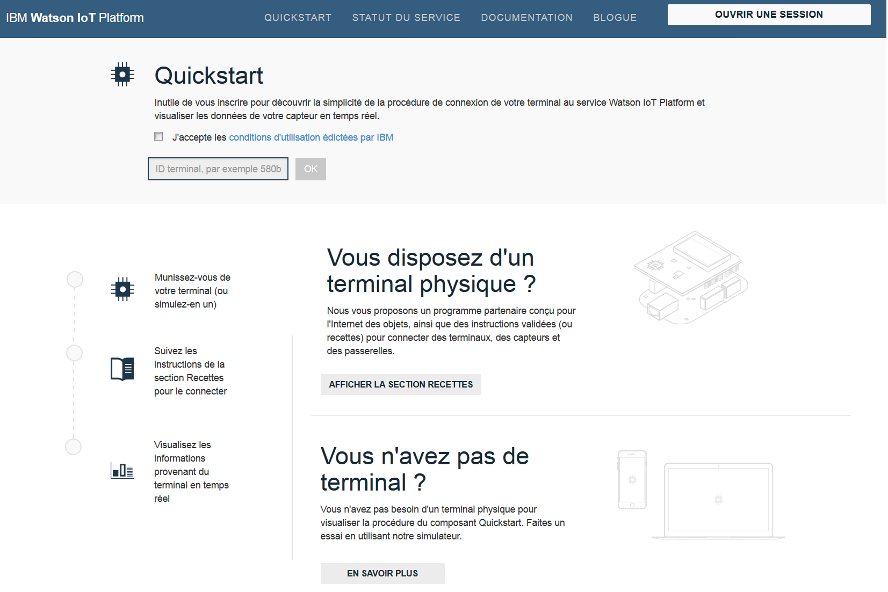

---

copyright:
  years: 2015, 2017
lastupdated: "2017-03-14"

---

{:new_window: target="_blank"}
{:shortdesc: .shortdesc}
{:screen: .screen}
{:codeblock: .codeblock}
{:pre: .pre}

# Quickstart

[Quickstart ](https://quickstart.internetofthings.ibmcloud.com/#/){: new_window} est un bac à sable ouvert que vous pouvez utiliser pour connecter rapidement vos terminaux à {{site.data.keyword.iot_full}}. Si vos terminaux prennent en charge le protocole de messagerie MQTT, ils peuvent être facilement connectés au service Quickstart.

Pour consulter les exemples, les recettes et les tutoriels qui expliquent comment vous pouvez connecter différents terminaux au service Quickstart, accédez à [DeveloperWorks Recipes ](https://developer.ibm.com/recipes/){: new_window}, par exemple :

- [OpenBlocks IoT BX1G ](https://developer.ibm.com/recipes/tutorials/openblocks-iot-bx1g-for-iot-foundation-quickstart/){: new_window}
- [Reactive Blocks ](https://developer.ibm.com/recipes/tutorials/reactive-blocks-and-java-to-iot-foundation-part-1-quickstart/){: new_window}


**Important :** Si votre instance {{site.data.keyword.iot_short_notm}} utilise le service Quickstart, les applications évolutives ne sont pas prises en charge.

## Terminaux simulés

Outre les recettes et les tutoriels Quickstart, un terminal simulé reposant sur un navigateur pour les terminaux mobiles est à votre disposition pour vous permettre de connecter n'importe quel terminal doté d'un navigateur Web au service Quickstart. Pour lancer un terminal simulé reposant sur un navigateur qui se connecte à {{site.data.keyword.iot_short}} à partir d'un téléphone mobile ou d'une tablette, ouvrez l'URL suivante :

```
http://quickstart.internetofthings.ibmcloud.com/iotsensor
```

Lorsque vous vous connectez à l'URL de terminal simulé sur un terminal mobile, un terminal simulé reposant sur un navigateur qui est connecté à {{site.data.keyword.iot_short}} est démarré. Utilisez les contrôles d'interface utilisateur suivants pour gérer les capteurs :

- Température
- Hygrométrie
- Température de l'objet


## Visualisation de données

Pour afficher les données générées depuis votre terminal mobile, assurez-vous que le terminal simulé s'exécute sur votre terminal mobile, puis démarrez l'application Quickstart. Entrez l'ID de terminal composé de 12 caractères, affiché dans l'angle supérieur droit de l'interface utilisateur.



A mesure que vous ajustez les valeurs de détection dans votre terminal simulé, vous pouvoir visualiser les données de votre terminal en temps réel dans l'application Quickstart, comme décrit dans la capture d'écran suivante :


## Démonstration Mosquitto

[Mosquitto ](http://mosquitto.org/){: new_window} est un client MQTT open source multiplateforme que vous pouvez utiliser pour expérimenter le service {{site.data.keyword.iot_short}}. Après avoir installé le client Mosquitto, choisissez un ID d'application et un ID de terminal uniques. Si les ID d'application et de terminal ne sont pas uniques, votre test de connexion peut générer un conflit avec un autre utilisateur qui exécute la même procédure de test Quickstart.

Les valeurs *appId*, *type_id*, *device_type* et *device_id* ne doivent pas comporter plus de 36 caractères et ne peuvent contenir que les caractères suivants :
- Caractères alphanumériques (a-z, A-Z, 0-9)
- Tirets (-)
- Traits de soulignement (_)
- Points (. )

Après avoir défini l'ID d'application et l'ID de terminal, créez une connexion représentant votre application à l'aide de `mosquitto_sub`. Utilisez les exemples suivants pour `<applicationId>` = myApplicationId et `<deviceId>` = myDeviceId :
```
    [user@host ~]$ mosquitto_sub -h quickstart.messaging.internetofthings.ibmcloud.com -p 1883 -i "a:quickstart:myApplicationId" -t iot-2/type/mosquitto/id/myDeviceId/evt/helloworld/fmt/json

```

Alors que le processus précédent est en cours d'exécution, vous pouvez créer votre terminal. Dans cet exemple, connectez un terminal de type `mosquitto` et envoyez deux événements au service en utilisant `mosquitto_pub`, comme décrit dans le code suivant :

```
    [user@host ~]$ mosquitto_pub -h quickstart.messaging.internetofthings.ibmcloud.com -p 1883 -i "d:quickstart:mosquitto:myDeviceId" -t iot-2/evt/helloworld/fmt/json -m "{\"helloworld\": 1}"
    [user@host ~]$ mosquitto_pub -h quickstart.messaging.internetofthings.ibmcloud.com -p 1883 -i "d:quickstart:mosquitto:myDeviceId" -t iot-2/evt/helloworld/fmt/json -m "{\"helloworld\": 2}"
```
Lorsque vous examinez votre terminal d'application, les deux événements que vous venez de publier sont affichés, comme illustré dans l'exemple de résultat suivant :

```
   [user@host ~]$ mosquitto_sub -h quickstart.messaging.internetofthings.ibmcloud.com -p 1883 -i "a:quickstart:myApplicationId" -t iot-2/type/mosquitto/id/myDeviceId/evt/helloworld/fmt/json
    {"helloworld": 1}
    {"helloworld": 2}
```

Le tour est joué ! En exécutant l'exemple de procédure Quickstart, vous avez :
- Connecté un terminal et une application à {{site.data.keyword.iot_short}} via MQTT
- Envoyé un événement depuis le terminal sur le service
- Reçu l'événement dans votre application


## Liens connexes

- [Quickstart ](https://quickstart.internetofthings.ibmcloud.com){: new_window}
- [Recettes DeveloperWorks ](https://developer.ibm.com/recipes){: new_window}
- [OpenBlocks IoT BX1G ](https://developer.ibm.com/recipes/tutorials/openblocks-iot-bx1g-for-iot-foundation-quickstart/){: new_window}
- [Reactive Blocks ](https://developer.ibm.com/recipes/tutorials/reactive-blocks-and-java-to-iot-foundation-part-1-quickstart/){: new_window}
- [Application Quickstart ](http://quickstart.internetofthings.ibmcloud.com){: new_window}
- [Mosquitto ](http://mosquitto.org/){: new_window}
