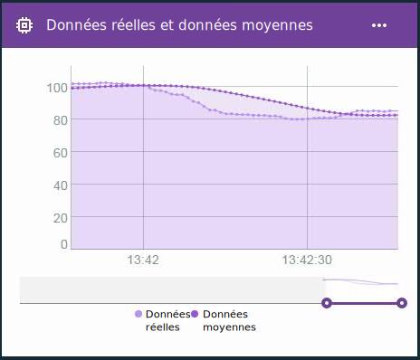

---

copyright:
  years: 2016, 2017
lastupdated: "2016-12-12"

---

{:new_window: target="blank"}
{:shortdesc: .shortdesc}
{:screen:.screen}
{:codeblock:.codeblock}
{:pre: .pre}

# Calculs avancés pour les propriétés virtuelles Edge
{: #im_vir_calculations}

Etendez les calculs de propriété virtuelle de base avec des formules d'analyse Edge prédéfinies.
{:shortdesc}

**Important :** Les calculs avancés renvoient uniquement des points de données de propriété si les données pour la propriété sélectionnée proviennent d'un terminal connecté à une passerelle sur laquelle un agent Edge Analytics Agent est installé. Une règle Edge peut utiliser cette propriété virtuelle directement. Pour que la propriété puisse être utilisée avec une règle de cloud, une règle marginale doit envoyer le point de données vers le cloud à l'aide de l'action d'acheminement vers le cloud. Pour plus d'informations, voir [Installation de l'agent Edge Analytics Agent](gateways/dashboard.html#edge).

Exemple : Utilisation des points de données virtuels avancés dans une carte de diagramme linéaire pour visualiser les tendances de données avec des projections de données retirées.  
 

## Formules avancées
{: #advanced}

Les options de calcul avancées incluent les formules suivantes :

**Astuce :** Pour certaines des formules, vous avez la possibilité de choisir une période ou un nombre de points de données à inclure. Si vous savez que vos données obéissent à un flux cohérent, il peut s'avérer judicieux de sélectionner une fenêtre de temps. Si les données sont collectées de manière sporadique ou irrégulière, il est peut-être préférable d'utiliser un nombre de points de données, car la fenêtre de temps est difficile à prévoir.

<table>
<thead>
<tr>
<th>Formule</th>
<th>Description</th>
<th>Utilisation</th>
</tr>
</thead>
<tbody>
<tr>
<td>Moyenne</td>
<td>Renvoie la valeur moyenne d'une propriété pour un nombre de points de données récents ou une période récente.    
Données d'entrée :
<ul>
<li>Propriété
 <li>Période ou nombre de points de données sous la forme d'un entier supérieur à 0.</ul></td>
 <td>La formule AVG fournit une valeur moyenne de points de données dans une fenêtre de temps qui se caractérise par une mobilité constante.     Utilisez la formule AVG avec une règle pour éviter que de fausses alertes soient déclenchées par des données excessives contenant des projections isolées.    Utilisez une carte de diagramme linéaire pour visualiser les tendances de données avec des projections de données retirées.  
</td>
</tr>
<tr>
<td>Z-Score mobile</td>
<td>Renvoie la différence des unités d'écart type entre le point de données et la valeur moyenne de point de données pour un nombre de points de données récents ou une période récente.    
Input:
<ul>
<li>Propriété
<li>Période ou nombre de points de données sous la forme d'un entier supérieur à 0.</ul></td>
<td>La valeur Z-Score mobile d'un point de données indique l'étendue d'une anomalie pour la valeur de point de données par rapport à son utilisation récente. Une valeur Z-Score absolue supérieure signifie que la valeur du point de données en cours diffère davantage des valeurs de points de données moyennes précédentes.
  Utilisez la formule Z-Score mobile avec une règle pour déclencher des alertes en cas de changement rapide lorsque les valeurs de point de données diffèrent de la moyenne récente et non lorsque le point de données dépasse une certaine valeur.
  Utilisez une carte de diagramme linéaire pour visualiser les fluctuations de vos données en réalisant un tracé de la fréquence et de l'ampleur des écarts type.
</td>
</tr>
<tr>
<td>Lissage exponentiel</td>
<td>Renvoie la valeur moyenne d'une propriété pour des points de données collectés disponibles, où les anciennes valeurs de propriété sont exponentiellement moins pondérées que les valeurs plus récentes. La pondération est contrôlée par le facteur de lissage où une valeur plus élevée accorde plus de pondération aux valeurs récentes et moins de pondération aux anciennes valeurs.  
Vous pouvez éventuellement utiliser le facteur de pente pour ajouter les tendances dans vos données. Les valeurs lissées de façon exponentielle réagissent plus vite aux modifications apportées aux données que la moyenne mobile.    
Données d'entrée :
<ul>
<li>Propriété
<li>Facteur de lissage, sous la forme d'un nombre supérieur à 0 et inférieur à 1.  
<li>Facultatif : Facteur de pente, sous la forme d'un nombre supérieur à 0 et inférieur à 1.    
 **Astuce :** Si vous n'êtes pas certain que vos données collectées comportent des tendances, commencez par utiliser une pente de 0.5. Selon les résultats, vous pourrez être amené à modifier le facteur.
 </ul></td>  
 <td>L'application d'un lissage exponentiel à un point de données génère une valeur moyenne dans laquelle la pondération des valeurs plus anciennes est inférieure si le calcul de la moyenne est utilisé au lieu de la définition d'une période. A la place, vous pouvez limiter la pondération des valeurs distantes en définissant un facteur de lissage supérieur.
  Utilisez la formule de lissage exponentiel avec une règle pour éviter que de fausses alertes soient déclenchées par des données excessives contenant des projections isolées, en utilisant non pas un sous-ensemble de données, mais toutes les données disponibles.
  Utilisez une carte de diagramme linéaire pour visualiser les tendances de données avec des projections de données retirées.</td>
</tr>
<tr>
<td>Lissage par zone</td>
<td>Renvoie la valeur moyenne d'une propriété en fonction d'une plage de points de données centrés autour du point de données en cours.  
Le lissage par zone utilise un nombre configuré de valeurs de point de données situées avant et après le point de données en cours de traitement afin de déterminer sa valeur lissée. Avec ce mode de calcul, le lissage par zone pondère toutes les valeurs de point de données de manière équitable.    
Input:
<ul>
<li>Propriété
<li>Nombre de points de données situés avant et après (demi-chasse) sous la forme d'un entier supérieur à 0.
</ul></td>
<td>L'application d'un lissage par zone à un point de données renvoie une valeur moyenne de points de données dans une fenêtre de temps qui se caractérise par une mobilité constante et qui est centrée sur le point de données concerné.   **Important :** Selon la fréquence des données et la valeur de demi-chasse, les points de données renvoyés sont plus ou moins retardés. Par exemple, si la valeur de demi-chasse est `5` et que la fréquence des données est de l'ordre d'un message par seconde, les points de données virtuels renvoyés sont retardés de cinq secondes.   Utilisez la formule de lissage par zone avec une règle pour éviter que de fausses alertes soient déclenchées par des données excessives contenant des projections isolées. **Important :** Tenez compte du retard des points de données lorsque vous créez des règles.   Utilisez une carte de diagramme linéaire pour visualiser les tendances de données avec des projections de données retirées.
</td>
</tr>
<tr>
<td>Lissage de Gauss</td>
<td>Renvoie la valeur moyenne d'une propriété en fonction d'une plage de points de données centrés autour du point de données en cours, où les valeurs de propriété plus éloignées du point de données en cours sont moins pondérées exponentiellement que les valeurs plus proches.  
Données d'entrée :
<ul>
<li>Propriété
<li>Nombre de points de données situés avant et après (demi-chasse) sous la forme d'un entier supérieur à 0.
</ul></td>
<td>L'application d'un lissage de Gauss à un point de données renvoie une valeur moyenne pondérée de points de données dans une fenêtre de temps qui se caractérise par une mobilité constante et qui est centrée sur le point de données concerné. Les points de données qui sont plus éloignés du point de données concerné sont moins pondérés lors du calcul de la moyenne.   **Important :** Selon la fréquence des données et la valeur de demi-chasse, les points de données renvoyés sont plus ou moins retardés. Par exemple, si la valeur de demi-chasse est `5` et que la fréquence des données est de l'ordre d'un message par seconde, les points de données virtuels renvoyés sont retardés de cinq secondes.   Utilisez la formule de lissage de Gauss avec une règle pour éviter que de fausses alertes soient déclenchées par des données excessives contenant des projections isolées. **Important :** Tenez compte du retard des points de données lorsque vous créez des règles.   Utilisez une carte de diagramme linéaire pour visualiser les tendances de données avec des projections de données retirées.
</td>
</tr>
</tbody>
</table>  
