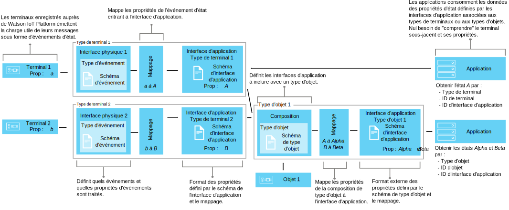

---

copyright:
years: 2016, 2017
lastupdated: "2017-04-25"

---

{:new_window: target="\_blank"}
{:shortdesc: .shortdesc}
{:screen: .screen}
{:codeblock: .codeblock}
{:pre: .pre}

# Utilisation d'interfaces pour mapper des données de terminal (bêta)
{: #im_index}

Les interfaces d'application étendent le concept
de [type de terminal](#resources) pour mieux contrôler les données qui s'écoulent à travers
{{site.data.keyword.iot_short_notm}} et fournir une vision des données IoT indépendante des spécificités de terminal.
{:shortdesc}

**Important :** La fonction de mappage d'interface est disponible en version bêta. Il est possible que des mises à jour ultérieures de cette version bêta ainsi que la version finale incluent des modifications incompatibles avec la version actuelle. Il est fortement recommandé de ne pas utiliser les fonctions bêta dans les applications en production tant que l'édition finale n'a pas été publiée. Pour recevoir davantage d'informations et nous faire part de vos commentaires sur cette fonction bêta, vous pouvez [vous inscrire programme Bêta Information Management ](https://www.ibm.com/software/support/trial/cst/forms/nomination.wss?id=7050){:new_window}.

## Présentation
{: #overview}

Les interfaces d'application vous permettent de créer des abstractions partagées des terminaux et des
objets pour améliorer les capacités de réutilisation et de maintenance et gérer la complexité
d'un écosystème IoT tout en isolant l'application des changements de données. Les interfaces d'application sont découplées de la variabilité des données transportées dans les messages
que les terminaux communiquent à {{site.data.keyword.iot_short_notm}}.

C'est à travers ces interfaces que les applications peuvent accéder au
terminaux et aux objets et à leur état du moment. Cet état est constitué d'un ensemble de propriétés définies par l'interface d'application. A mesure que les terminaux émettent des événements de changement d'état,
les valeurs les plus récentes de ces propriétés sont stockées dans
{{site.data.keyword.iot_short_notm}} et mises à la disposition de l'application, qui peut en faire la demande
via une API HTTP.

En utilisant des interfaces d'application, vous pouvez :
- Mapper les propriétés d'état aux données des messages d'événement
- Définir votre structure de données préférée
- Définir plusieurs représentations ou vues de l'état des terminaux
- Vous abonner aux états des terminaux ou les interroger à tout moment via une API HTTP

Quelques cas courants d'utilisation des interfaces d'application :
- Fournir à vos développeurs d'applications des interfaces cohérentes pour leur permettre d'accéder aux données des terminaux
déclenchées par les événements à travers des API REST.
- Normaliser les données issues de terminaux et d'appareils de différentes marques et de différents modèles, qui publient leurs données
dans différents formats.
- Combiner les données d'événements de différents types de terminaux pour modéliser un objet IoT particulier.
- Modifier et convertir les formats de données pour les adapter à votre modèle d'application.  

Pour la documentation (bêta) des API des interfaces, consultez [{{site.data.keyword.iot_short_notm}} HTTP REST API  ](https://docs.internetofthings.ibmcloud.com/apis/swagger/v0002-beta/info-mgmt-beta.html){: new_window}.   

## Exemples
{: #examples}
Les exemples d'interface suivants illustrent deux solutions possibles.

### Exemple 1 : Mapper des capteurs de température hétérogènes à une interface d'application
{: #device-type-example}
Dans cet exemple, nous créons une interface d'application qui fournit des données de
de température homogènes et dans un seul format, y compris lorsque
les terminaux émettent leurs messages d'événements dans des
formats différents. Le capteur de température 1 publie sur {{site.data.keyword.iot_short_notm}} une mesure de température en degrés Celsius, `{ "t" : 34.5 }`. Le capteur de température 2 publie une mesure en degrés Fahrenheit, `{ "temp" : 72.55 }`. Les mesures de température sont publiées sous la forme d'événements distincts.

Pour un scénario décrivant cet exemple dans les moindres détails,
consultez [Interface d'application : scénario 1](im_index_scenario.html).

Le flux de données de votre interface d'application peut incorporer un calcul appliqué aux données entrantes dans le but de normaliser les mesures des
deux terminaux et de les préparer à leur traitement. Cela signifie que vous n'avez pas besoin d'inclure dans votre application une logique visant à comprendre ou convertir différentes échelles de température. L'application reçoit un seul état normalisé, la propriété d'état **temperature**, et non la propriété spécifique de
chaque terminal, **t** pour l'un et **temp** pour l'autre.

### Exemple 2 : Mappage de plusieurs terminaux environnementaux à une seule interface d'application Type d'objet
{: #thing-type-example}  
Cet exemple reprend l'exemple précédent en l'élargissant à plusieurs types d'appareils. On ajoute à cet effet un ensemble de capteurs d'humidité sous la forme
d'hygromètres individuels. Grâce à l'emploi d'une interface d'application Type d'objet, il est possible de fusionner les données de plusieurs types de terminaux
séparés en une seule et même interface d'application qui représente tous les terminaux et capteurs installés dans une
salle. Une application peut maintenant recueillir les données environnementales d'une salle en se connectant à l'interface d'application
Objet salle.

Pour un scénario décrivant cet exemple dans les moindres détails,
consultez [Interface d'application : scénario 2](im_index_scenario_thing.html).

Le capteur de température 1 et le capteur d'humidité 3 publient les données environnementales recueillies dans la
salle R1. Les données de ces deux capteurs sont mappées séparément à deux interfaces d'application Type de terminal, une
pour le type de terminal Thermomètre et l'autre pour le type de terminal Hygromètre. Nous créons à présent un type d'objet appelé Salle et nous instancions deux objets de ce type, R1 et R2.

Nous pouvons maintenant mettre en place une composition incluant les interfaces d'application
Thermomètre et Hygromètre, puis mapper les capteurs environnementaux adéquats à chaque instance de
salle. Par exemple, les capteurs D1 et D3 sont mappés à la salle R1. Dès lors, l'application de l'utilisateur final peut interroger l'état d'un objet Salle spécifique et obtenir
en retour les données de température et d'humidité de cette salle sans avoir à connaître son infrastructure de terminaux
sous-jacente.

## Définitions et ressources
{: #resources}

Le diagramme suivant illustre le mappage logique entre terminaux et applications sur {{site.data.keyword.iot_short_notm}} lorsqu'on utilise
le concept d'interfaces d'application.

### Concepts

Concepts                        | Description       
------------- | ------------- | -------------  
Evénement | Les événements constituent le mécanisme par lequel les terminaux publient des données sur {{site.data.keyword.iot_short_notm}}. Le terminal contrôle le contenu de l'événement et affecte un nom à chaque événement qu'il envoie.
Propriété | Donnée porteuse d'une partie de la charge utile de l'événement émis par un terminal.
Etat | Valeur la plus récente d'une propriété d'état mappée.
Composition                         | Construction logique définissant les interfaces d'application associées à un type d'objet. Elle est spécifiée par un schéma de type d'objet.   

### Ressources de gestion des informations
Vous pouvez gérer les ressources à l'aide d'API REST. Pour plus d'informations sur les API REST, consultez la documentation de l'[{{site.data.keyword.iot_short_notm}} API REST HTTP](https://docs.internetofthings.ibmcloud.com/swagger/info-mgmt-beta.html).

Ressources Type                        | Description       
------------- | ------------- | -------------  
Type d'événement                         | Construction programmatique reliant une interface physique à un schéma d'événement.  **Important :** Pour la version bêta, tous les événements entrants à utiliser dans une interface d'application doivent être au format JSON.   
Type de terminal                         |  Construction programmatique permettant de grouper les terminaux ayant des caractéristiques ou des comportements en commun. Dans le mappage par interface, le type de terminal est étendu de manière à inclure une unique interface physique pour un terminal et une ou plusieurs interfaces d'application servant à obtenir l'état du terminal.  Pour plus d'informations, consultez la section "Identificateurs et types de terminaux" dans la rubrique [Modèle de terminal](../reference/device_model.html#id_and_device_types).
Type d'objet                         | Construction programmatique représentant une collection d'un ou de plusieurs types de terminaux, types de choses ou les deux.  **Important :** La version Bêta reconnaît trois niveaux d'imbrication d'interfaces d'application Type d'objet.
Ressources Schéma                         |  Constructions programmatiques définissant la structure de données des interfaces physiques de type de terminal, de la composition de type d'objet et des interfaces d'application sortantes. Les [schémas JSON ](http://json-schema.org/){:new_window} suivants sont utilisés : <ul><li>Les *schémas d'événement* définissent la structure des événements publiés sur {{site.data.keyword.iot_short_notm}} par un terminal. Chaque schéma d'événement définit la structure d'un événement entrant particulier et est associé à un seul type d'événement. <li>Les *schémas de type d'objet* définissent les interfaces d'application qui agissent comme sources d'entrée d'un type d'objet. Chaque schéma de type d'objet définit la structure d'une ou de plusieurs interfaces d'application Type d'objet.<li>Les *schémas d'interface d'application* définissent la structure de l'[état du terminal](#key_concepts) stocké sur {{site.data.keyword.iot_short_notm}}</ul>.

Ressources Interface                        | Description       
------------- | ------------- | -------------  
Interface d'application | Construction programmatique à laquelle vos applications peuvent se connecter ou s'abonner pour voir l'état d'un terminal ou d'un objet. L'interface d'application est définie par un schéma d'interface d'application qui façonne la structure des données d'état stockées sous forme d'état de terminal ou d'objet. L'état est mis à jour en réponse à des événements d'état entrants. Une interface d'application associée à un type de terminal ne peut avoir qu'une seule interface physique comme source d'entrée. Une interface d'application associée à un type d'objet peut avoir une ou plusieurs interfaces d'application comme sources d'entrée.

Ressources Instance                        | Description       
------------- | ------------- | -------------  
Terminal                         | Construction programmatique représentant un actif, un système ou un composant qui est enregistré auprès de {{site.data.keyword.iot_short_notm}} et qui envoie des données IoT sous la forme d'événements.  
Objet (ou Chose)                         | Construction programmatique représentant logiquement une instance unique d'un type d'objet. Une instance d'objet sert le même but qu'un terminal enregistré d'un type de terminal.

Ressources de support                        | Description       
------------- | ------------- | -------------  
Interface physique                         | Construction programmatique définissant les types d'événements et les propriétés associées qui, ensemble, sont associés à un type de terminal particulier. L'interface physique est définie par des schémas d'événement.   
Mappages                         | Construction programmatique décrivant de quelle façon les propriétés associées à des événements entrants sont mappées aux propriétés définies sur une interface d'application.  **Important :** Au moins une interface d'application doit être associée à un type de terminal pour que des mappages puissent être définis.

## Flux de travaux de niveau supérieur
{: #workflow}

Utilisez les étapes décrites ci-après pour vous aider à configurer les ressources dont vous avez besoin pour commencer à mapper vos données de terminal à l'aide d'interfaces.

Pour des détails sur les API, consultez la documentation en anglais [{{site.data.keyword.iot_short_notm}} HTTP REST API ](https://docs.internetofthings.ibmcloud.com/swagger/info-mgmt-beta.html){:new_window}.

**Astuce :** Pour des informations plus détaillées sur chacune de ces étapes, consultez les exemples de scénario ou utilisez les liens pour accéder directement à une étape spécifique. L'[exemple de scénario 1](im_index_scenario.html#scenario) vous fait découvrir les étapes de création d'une interface d'application Type de terminal pour différents thermomètres hétérogènes et l'[exemple de scénario 2](im_index_scenario_thing.html#scenario) complète l'étude en décrivant comment construire une interface d'application permettant de consommer les données émises par deux types de terminaux environnementaux réunis dans un même objet du type Salle.

Le processus de création et de consommation des interfaces d'application varie quelque peu selon que l'interface à créer est associée à un type de terminal ou à un type d'objet.

### Avant de commencer
Pour créer une interface d'application associée à un type de terminal, vous devez avoir [au moins un terminal enregistré auprès
de {{site.data.keyword.iot_short_notm}}](im_index_scenario.html#step14) qui émette des événements avec des propriétés d'état.
Pour créer une interface d'application associée à un type d'objet, vous devez avoir au moins une interface d'application qui soit
associée à un type de terminal déjà créé.

### Procédure

1. 	Définissez les propriétés d'état entrantes.  
Commencez par définir les propriétés d'état entrantes que votre interface d'application devra
mettre à la disposition de vos applications consommatrices.  
Selon le type d'interface d'application à créer, effectuez l'une ou l'autre des procédures suivantes :
<dl>
<dt>Pour une interface Type de terminal : créez une interface physique.</dt>
<dd>
<ol>
<li>[Créez un fichier schéma d'événement](im_index_scenario.html#step1). Il s'agit d'un fichier .JSON local qui définit la structure et le format d'un événement entrant.
<li>[Créez une ressource Schéma d'événement pour votre type d'événement](im_index_scenario.html#step2). Cette ressource est une construction programmatique utilisée par {{site.data.keyword.iot_short_notm}}.
<li>[Créez un type d'événement qui fasse référence au schéma d'événement](im_index_scenario.html#step3). Le type d'événement est utilisé par
{{site.data.keyword.iot_short_notm}} pour mapper une ou plusieurs ressources Schéma d'événement à une interface physique.
<li>[Créez une interface physique](im_index_scenario.html#step7).
<li>[Ajoutez le type d'événement à l'interface physique](im_index_scenario.html#step8).
<li>[Ajoutez votre interface physique à votre type de terminal](im_index_scenario.html#step9).
</ol>
</dd>
<dt>Pour une interface Type d'objet : définissez une composition.</dt>
<dd>
<ol>
<li>[Créez un fichier Schéma de composition](im_index_scenario_thing.html#crt_composition_file).  
Un fichier Schéma de composition de type d'objet est un fichier .JSON local qui définit la composition du type d'objet en pointant sur
des interfaces d'application existantes.
<li>[Créez la ressource Schéma de composition](im_index_scenario_thing.html#crt_composition_resource).  
Téléchargez le fichier .JSON vers {{site.data.keyword.iot_short_notm}}.
<li>[Créez un type d'objet](im_index_scenario_thing.html#crt_thing_type).   Un type d'objet
sert le même but qu'un type de terminal en ce qu'il représente une classe d'objets (ou de choses).
</ol>
</dd>
</dl>
4. 	Créez l'interface d'application.
 1. 	Créez un fichier schéma d'interface d'application pour le [type de terminal](im_index_scenario.html#step4) ou le [type d'objet](im_index_scenario_thing.html#crt_ai_schema_file).  
Un fichier schéma d'interface d'application est un fichier .JSON local qui définit l'état de terminal mis à la disposition de vos applications.
 2. 	Créez une ressource Schéma d'interface d'application pour le [type de terminal](im_index_scenario.html#step5) ou le [type d'objet](im_index_scenario_thing.html#crt_ai_schema_resource).
 3.	Créez une interface d'application pour le [type de terminal](im_index_scenario.html#step6) ou le [type d'objet](im_index_scenario_thing.html#crt_thing_ai).
 4.	Ajoutez l'interface d'application au [type de terminal](im_index_scenario.html#step10) ou au [type d'objet](im_index_scenario_thing.html#add_thing_ai).
5. 	Définissez les mappages pour le [type de terminal](im_index_scenario.html#step11) ou le [type d'objet](im_index_scenario_thing.html#define_Thing_type_mappings).   
Les mappages servent à établir le lien entre les propriétés entrantes et des propriétés dans l'interface d'application.
6. 	Déployez la configuration associée au [type de terminal](im_index_scenario.html#step15) ou au [type d'objet](im_index_scenario_thing.html#deploy_Thing_config).
7. 	**Pour une interface Type d'objet :** [créez une instance de type d'objet](im_index_scenario_thing.html#create_Thing_instances).
8. 	Vérifiez que l'état du [terminal](im_index_scenario.html#step13) ou de l'[objet](im_index_scenario_thing.html#verify_Thing_state) se met à jour.  
Vérifiez que vos abonnements permettent de voir les données de terminal mises à jour ou que ces mêmes données sont retournées en réponse à un
appel REST.
