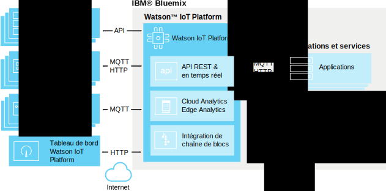

---

copyright:
  years: 2016, 2017
lastupdated: "2017-02-3"

---

{:new_window: target="\_blank"}
{:shortdesc: .shortdesc}
{:screen: .screen}
{:codeblock: .codeblock}
{:pre: .pre}

# A propos de {{site.data.keyword.iot_short_notm}}
{: #about_iotplatform}

{{site.data.keyword.iot_full}} fournit aux applications un accès puissant aux terminaux et aux données IoT afin de vous aider à composer rapidement des applications d'analyse, des tableaux de bord de visualisation et des applications IoT mobiles.
{:shortdesc}

{{site.data.keyword.iot_short_notm}} vous permet d'effectuer des opérations de gestion de terminaux puissantes, de stocker des données de terminal et d'y accéder, et de connecter une grande diversité de terminaux et de terminaux de passerelle. {{site.data.keyword.iot_short_notm}} fournit une communication sécurisée vers et depuis vos terminaux à l'aide de MQTT et de TLS.

## Architecture de {{site.data.keyword.iot_short_notm}}
{: #watsoniotplatform_architecture}

**Important :** Les fonctions d'analyse sont fusionnées à partir du service {{site.data.keyword.iotrtinsights_full}}. Si votre organisation {{site.data.keyword.iot_short_notm}} est utilisée comme source de données pour une instance {{site.data.keyword.iotrtinsights_short}} existante, Cloud and Edge Analytics n'est pas activé tant que les instances {{site.data.keyword.iotrtinsights_short}} existantes n'ont pas été migrées. Continuez d'utiliser le tableau de bord {{site.data.keyword.iotrtinsights_short}} pour vos besoins en analyse tant que la migration n'est pas terminée. Pour plus d'informations, voir le [blogue IBM Watson IoT Platform](https://developer.ibm.com/iotplatform/2016/04/28/iot-real-time-insights-and-watson-iot-platform-a-match-made-in-heaven/){: new_window} sur IBM developerWorks et vos tableaux de bord de l'instance {{site.data.keyword.iotrtinsights_short}} existante.   

{{site.data.keyword.iot_short_notm}} communique avec vos applications et vos terminaux à l'aide de l'API {{site.data.keyword.iot_short_notm}} et du protocole de messagerie {{site.data.keyword.iot_short_notm}}. Le tableau de bord {{site.data.keyword.iot_short_notm}} se connecte en tant qu'interface utilisateur initiale pour simplifier les opérations au sein de la plateforme. Les données de terminal peuvent être stockées ou utilisées à l'aide de solutions d'analyse.

## Concepts importants dans {{site.data.keyword.iot_short_notm}}
{: #watsoniotplatform_importantconcepts}

### Organisations

Lorsque vous vous enregistrez auprès de {{site.data.keyword.iot_short_notm}}, vous recevez un ID d'organisation. Votre ID d'organisation est un identificateur unique composé de six caractères pour votre compte. Les organisations s'assurent que vos données ne sont accessibles que par vos terminaux et vos applications. Après l'enregistrement, les terminaux et les clés d'API sont liés à une organisation unique. Lorsqu'une application se connecte au service à l'aide d'une clé d'API, elle s'enregistre à l'organisation qui est associée à la clé d'API utilisée.

Pour votre sécurité, la communication entre les organisations n'est pas possible. Le seul moyen de transmettre des données entre deux organisations consiste à créer une application au sein de chaque organisation qui communiquera avec les applications situées dans l'autre organisation.

### Terminaux

Un terminal peut être n'importe quel élément doté d'une connexion à Internet et qui peut insérer des données via une commande push dans le cloud. Toutefois, les terminaux ne peuvent pas communiquer directement avec d'autres terminaux, mais ils acceptent des commandes émises par des applications et envoient des événements à des applications. Les terminaux dans {{site.data.keyword.iot_short_notm}} sont identifiés par un jeton d'authentification unique. Les terminaux doivent être enregistrés avant de pouvoir se connecter à {{site.data.keyword.iot_short_notm}}.

{{site.data.keyword.iot_short_notm}} reconnaît deux classes de terminal : les **terminaux gérés** et les **terminaux non gérés**.

Les **terminaux gérés** sont définis comme des terminaux qui contiennent un agent de gestion des terminaux. Un agent de gestion des terminaux est un bloc de logique qui permet au terminal d'interagir avec le service de gestion des terminaux de {{site.data.keyword.iot_short_notm}} via le protocole de gestion des terminaux. Les terminaux gérés peuvent effectuer des opérations de gestion des terminaux, y compris des mises à jour d'emplacement, des mises à jour et des téléchargements de microprogramme, des redémarrages et des réinitialisations avec les paramètres d'usine.

Les **terminaux non gérés** représentent tous les terminaux sans un agent de gestion des terminaux. Les terminaux non gérés peuvent se connecter à {{site.data.keyword.iot_short_notm}} et envoyer et recevoir des événements et des commandes, mais ils ne peuvent pas envoyer des demandes de gestion des terminaux ni effectuer des opérations de gestion des terminaux.

### Passerelles

Les passerelles sont des terminaux spécialisés qui possèdent les fonctions combinées d'une application et d'un terminal, ce qui leur permet de servir de points d'accès pour d'autres terminaux. Les terminaux qui ne peuvent pas se connecter directement à Internet peuvent accéder au service {{site.data.keyword.iot_short_notm}} en se connectant d'abord au terminal de passerelle.

Les passerelles doivent être enregistrées avant de pouvoir se connecter au service.

### Applications

Une application peut être n'importe quel élément doté d'une connexion à Internet et qui interagit avec les données des terminaux et contrôle le comportement de ces terminaux. Les applications s'identifient dans {{site.data.keyword.iot_short_notm}} à l'aide d'une clé d'API et d'un ID d'application unique. Contrairement aux terminaux, les applications individuelles n'ont pas besoin de s'enregistrer avant de pouvoir se connecter à {{site.data.keyword.iot_short_notm}}. Toutefois, elles doivent utiliser une clé d'API valide qui a été enregistrée.

### Evénements

Les événements constituent le mécanisme par lequel les terminaux publient des données sur {{site.data.keyword.iot_short_notm}}. Les terminaux contrôlent le contenu de leurs messages et affectent un nom à chaque événement envoyé. {{site.data.keyword.iot_short_notm}} utilise les données d'identification qui sont associées à chaque événement reçu afin de déterminer le terminal qui l'a envoyé. Cette architecture empêche les terminaux de simuler les droits d'accès d'autres terminaux.

Les applications peuvent traiter des événements en temps réel et voir la source de l'événement et les données contenues dans ce dernier. Les applications doivent être configurées pour définir les terminaux et les événements auxquels ils sont abonnés.

### Commandes

Les commandes représentent le mécanisme qui permet aux applications de communiquer avec des terminaux. Seules les applications peuvent envoyer des commandes, et ces dernières sont envoyées à des terminaux spécifiques. Le terminal doit déterminer l'action à exécuter dès la réception d'une commande donnée. Les terminaux peuvent être conçus pour écouter n'importe quelle commande ou pour s'abonner à une liste de commandes spécifiée.
