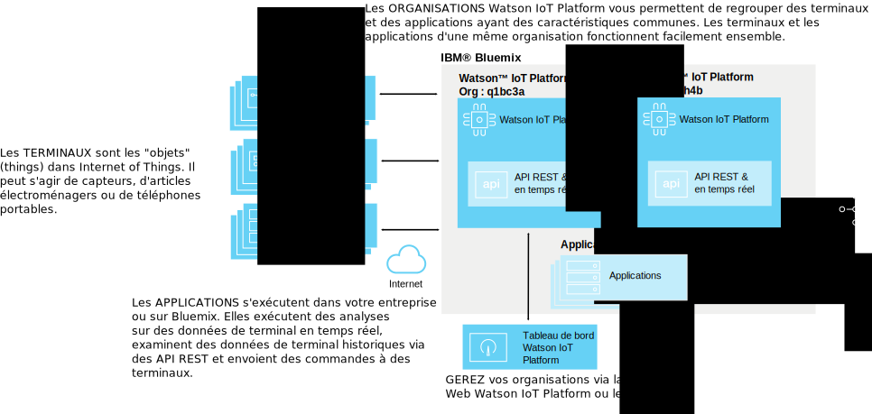
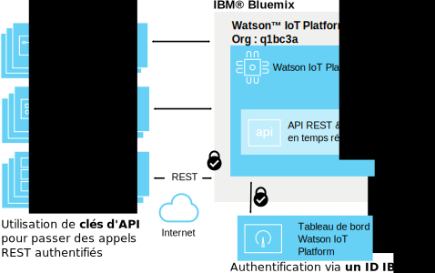
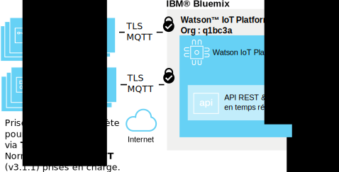
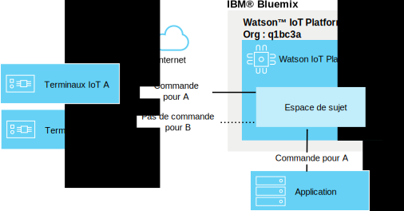
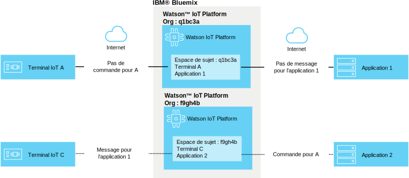

---

copyright:
  years: 2016, 2017
lastupdated: "2017-02-03"

---

{:new_window: target="blank"}
{:shortdesc: .shortdesc}
{:screen: .screen}
{:codeblock: .codeblock}
{:pre: .pre}

# Sécurité {{site.data.keyword.iot_short_notm}}
{: #sec-index}

En tant que service hébergé dans un cloud, {{site.data.keyword.iot_full}} intègre la sécurité en tant qu'aspect important de son architecture.
{: shortdesc}

Le document suivant répond à certaines questions courantes relatives à la façon dont les données d'une organisation sont protégées, en mettant l'accent sur certaines aspects :

* Conformité : Normes externes qui définissent des tests de performances pour la sécurité.
* Authentification : Vérifier l'identité des utilisateurs, des terminaux ou des applications qui tentent d'accéder aux informations de votre organisation.
* Autorisation : Vérifier que les utilisateurs, les terminaux et les applications sont autorisés à accéder aux informations de l'organisation.
* Chiffrement : Vérifier que les données ne peuvent être lues que par des parties autorisées et ne peuvent pas être interceptées.

## {{site.data.keyword.iot_short_notm}} et {{site.data.keyword.Bluemix_notm}}
{: #iot-bluemix-sec}

{{site.data.keyword.iot_short_notm}} s'exécute dans la plateforme {{site.data.keyword.Bluemix_notm}} et s'appuie donc à la fois sur {{site.data.keyword.Bluemix_notm}} et sur {{site.data.keyword.BluSoftlayer_full}} pour l'accès et la connectivité. La dépendance à {{site.data.keyword.Bluemix_notm}} et à {{site.data.keyword.BluSoftlayer}} rend la sécurité et la fiabilité de {{site.data.keyword.Bluemix_notm}} et d'{{site.data.keyword.BluSoftlayer}} essentielles pour les utilisateurs de {{site.data.keyword.iot_short_notm}}.

Pour plus d'informations sur la sécurité de {{site.data.keyword.Bluemix_notm}}, voir [Sécurité de la plateforme {{site.data.keyword.Bluemix_notm}}](https://console.ng.bluemix.net/docs/security/index.html#platform-security){: new_window}.

## Conformité à la sécurité {{site.data.keyword.iot_short_notm}}
{: #compliance}  
   
{{site.data.keyword.iot_short_notm}} est certifié aux normes ISO (International Organization for Standardization) 27001, qui définissent le code de bonne pratique pour les processus de gestion de la sécurité des informations. La norme ISO 27001 spécifie les exigences en matière d'établissement, de mise en oeuvre et de documentation des systèmes de management de la sécurité de l'information (SMSI) et les exigences relatives à la mise en oeuvre des contrôles de sécurité, en fonction des besoins des organisations individuelles. La famille de normes ISO 27000 intègre un processus d'évaluation des risques et d'estimation des ressources, dans le but de protéger la confidentialité, l'intégrité et l'accessibilité des informations écrites, orales et électroniques.

{{site.data.keyword.iot_short_notm}} fait l'objet d'un audit par une firme indépendante et répond à toutes les exigences de la norme ISO 27001 : {{site.data.keyword.iot_short_notm}} ISO 27001:2013 Certificate of Registration.

## Terminologie {{site.data.keyword.iot_short_notm}}
{: #terminology}

## Comment sécurisons-nous la gestion des informations IoT au sein de votre organisation ?
{: #secure-org}

L'interface graphique reposant sur un navigateur et les API REST sont protégées par HTTPS, avec un certificat signé par DigiCert qui vous permet de vous assurer que vous vous connectez réellement au service {{site.data.keyword.iot_short_notm}} habilité. L'accès à l'interface graphique reposant sur le Web est authentifié par votre IBMid ou via la fonction {{site.data.keyword.ssoshort}} {{site.data.keyword.Bluemix_notm}}. L'utilisation de l'API REST requiert une clé d'API, générée via l'interface graphique. Vous pouvez utiliser cette clé pour effectuer des appels d'API REST authentifiés vers votre organisation.

## Comment sécurisons-nous les données d'identification de votre terminal ou de votre application ?
{: #secure-credentials}

Lorsque des terminaux sont enregistrés ou que des clés d'API sont générées, le jeton d'authentification est soumis à une opération de hachage et de salage. Cela signifie que les données d'identification de votre organisation ne peuvent jamais être récupérées depuis nos systèmes, même dans l'éventualité peu probable que {{site.data.keyword.iot_short_notm}} soit compromis.

Les données d'identification de terminal et les clés d'API peuvent être révoquées de manière individuelle si elles sont compromises.

## Comment vérifions-nous que vos terminaux se connectent en toute sécurité à {{site.data.keyword.iot_short_notm}} ?
{: #secure-device-connection}

Les terminaux connectés utilisent une combinaison clientId/jeton d'authentification qui est générée au moment de l'ajout des terminaux à votre plateforme. MQTT v3.1.1 permet une interopérabilité simple entre plusieurs plateformes et plusieurs langues. {{site.data.keyword.iot_short_notm}} prend en charge la connectivité via TLS v1.2.

Pour plus d'informations sur les exigences relatives à TLS et aux suites de chiffrement, voir la section [Exigences TLS](https://console.ng.bluemix.net/docs/services/IoT/reference/security/connect_devices_apps_gw.html#tls_requirements){: new_window} dans la documentation `Connexions d'application, de terminal et de passerelle à Watson IoT Platform`. 

## Comment évitons-nous la fuite des données entre des terminaux IoT ?
{: #prevent-leak-devices}

Les structures de messagerie sécurisée sont intégrées. Une fois authentifiés, les terminaux sont autorisés uniquement à publier des données et à s'abonner à un espace de sujet limité :

* '/iot-2/evt/<event_id>/fmt/<format_string>'
* '/iot-2/cmd/<command_id>/fmt/<format_string>'

Tous les terminaux fonctionnent avec le même espace de sujet. Les données d'authentification fournies par le client déterminent le terminal auquel {{site.data.keyword.iot_short_notm}}  affecte cet espace de sujet.  Cela empêche les terminaux de pouvoir simuler les droits d'accès d'un autre terminal.

Le seul moyen de simuler les droits d'accès d'un autre terminal est d'obtenir les données d'identification de sécurité compromises du terminal.

Les applications peuvent s'abonner et publier des données dans les sujets d'événement et de commande de tous les terminaux de l'organisation. Les applications peuvent analyser simultanément les données de nombreux terminaux et simuler ou représenter des terminaux, en plus de la formation de la partie complémentaire de la boucle de communication en mode duplex intégral.

## Comment évitons-nous la fuite des données IoT entre des organisations ?
{: #prevent-leak-org}

L'espace de sujet dans lequel les terminaux et les applications fonctionnent est défini au sein d'une organisation unique. Une fois l'authentification effectuée, {{site.data.keyword.iot_short_notm}} transforme la structure du sujet à l'aide d'un ID d'organisation provenant de l'authentification du client. Ce mécanisme rend impossible l'accès aux données d'une organisation à partir d'une autre organisation.

# Liens connexes
{: #rellinks}
## Liens connexes
{: #general}
* [Initiation à {{site.data.keyword.iot_short_notm}}](https://console.ng.bluemix.net/docs/services/IoT/index.html)
* [Sécurité {{site.data.keyword.Bluemix_notm}}](https://console.ng.bluemix.net/docs/security/index.html#security ""){:new_window}
* [Sécurité de la plateforme {{site.data.keyword.Bluemix_notm}} ](https://console.ng.bluemix.net/docs/security/index.html#platform-security ""){:new_window}
* [Conformité {{site.data.keyword.Bluemix_notm}}](https://console.ng.bluemix.net/docs/security/index.html#compliance){:new_window}
* [Sécurité {{site.data.keyword.BluSoftlayer}}](http://www.softlayer.com/security ""){:new_window}
* [Conformité {{site.data.keyword.BluSoftlayer}}](http://www.softlayer.com/compliance ""){:new_window}
