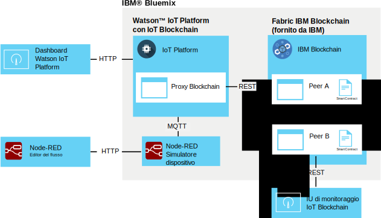

---

copyright:
  years: 2016, 2017
lastupdated: "2016-12-08"

---

{:new_window: target="\_blank"}
{:shortdesc: .shortdesc}
{:screen: .screen}
{:codeblock: .codeblock}
{:pre: .pre}

# Integrazione blockchain {{site.data.keyword.iot_short_notm}}
{: #gettingstartedtemplate}

L'integrazione blockchain {{site.data.keyword.iot_short_notm}} abilita i dispositivi IoT a fornire dati alle transazioni blockchain, che archiviano i dati nel ledger immutabile di blockchain e li utilizzano nelle regole di business implementate negli smart contract di blockchain.
{:shortdesc}

La piattaforma prende i dati del dispositivo nel loro formato MQTT nativo, li associa al formato dei dati necessario dallo smart contract di blockchain e li trasmette al fabric blockchain per l'archiviazione nel ledger blockchain. Un fabric blockchain è una raccolta di peer e di nodi del certificato che formano un'istanza di {{site.data.keyword.blockchainfull}} e Hyperledger.

## Architettura di integrazione blockchain  
{: #architecture}

Un ambiente di integrazione blockchain {{site.data.keyword.iot_short_notm}} generico è formato dai seguenti componenti:
- Uno o più dispositivi che creano i dati che desideri scrivere in un ledger blockchain.
- L'organizzazione {{site.data.keyword.Bluemix_notm}}:
 - Il servizio {{site.data.keyword.iot_short_notm}} con l'integrazione blockchain IoT abilitata.
 - Il fabric {{site.data.keyword.blockchainfull_notm}} o Hyperledger con uno o più smart contract distribuiti.
- L'ambiente locale:
 - La IU di monitoraggio blockchain IoT

Per informazioni sulla configurazione e sui requisiti di un ambiente esteso per la produzione e la distribuzione dei smart contract, consulta [Sviluppo degli smart contract per l'integrazione blockchain {{site.data.keyword.iot_short_notm}}](blockchain/dev_blockchain.html).  

Il seguente diagramma illustra l'ambiente di integrazione blockchain {{site.data.keyword.iot_short_notm}} generale.

## Prima di cominciare
{: #byb}

- Ottieni una panoramica di {{site.data.keyword.iot_short_notm}}, come si relaziona al concetto di blockchain generale e cosa può fare per te all'indirizzo [{{site.data.keyword.iot_short_notm}}](http://www.ibm.com/blockchain/) su IBM.com.
- [Abilita l'integrazione blockchain {{site.data.keyword.iot_short_notm}}](reference/extensions/index.html#blockchain) per la tua organizzazione.
- Collega i dispositivi che producono i dati che vuoi scrivere nel ledger blockchain.  
Segui le istruzioni nell'argomento [Connessione dispositivi](iotplatform_task.html) per collegare i tuoi dispositivi.
- Installazione della IU di monitoraggio.
La IU di monitoraggio viene utilizzata per verificare la connessione tra {{site.data.keyword.iot_short_notm}} e il fabric blockchain. Segui le istruzioni nel documento readme della IU di monitoraggio disponibile nella directory GitHub [Blockchain Monitoring UI](https://github.com/ibm-watson-iot/blockchain-samples/tree/master/applications/monitoring_ui).

### Utilizzo dello scenario di base di IBM per un'introduzione veloce

Per iniziare velocemente a testare l'integrazione blockchain {{site.data.keyword.iot_short_notm}}, puoi collegarti a un fabric fornito da IBM e associare un dispositivo di esempio Node-RED al contratto di esempio fornito da IBM.  I passi necessari per questo scenario sono etichettati come **Scenario di base di IBM** in questo argomento.  
**Importante:** fai attenzione che il ledger blockchain di esempio fornito da IBM e tutti i relativi dati siano visibili a tutti gli utenti nel blockchain di esempio. Non archiviare informazioni sensibili nel blockchain di esempio fornito da IBM. In aggiunta, i fabric di esempio che supportano l'esempio e scambiano i contratti commerciali sono soggetti a modifiche, incluse le informazioni di connessione per ogni peer. I dettagli della connessione sono forniti nella pagina wiki [IoT Blockchain Connection Info](https://www.ibm.com/developerworks/community/wikis/home?lang=en#!/wiki/W7a44a0e604d9_4a90_89b7_0a2bdbe81b00/page/Blockchain%20Fabric%20Connections) nella community Watson IoT Blockchain.

L'ambiente di integrazione blockchain {{site.data.keyword.iot_short_notm}} di base fornito da IBM è formato dai seguenti componenti:
- {{site.data.keyword.Bluemix_notm}}:
 - Il servizio {{site.data.keyword.iot_short_notm}} con l'integrazione blockchain IoT abilitata
 - Facoltativo: l'applicazione Node-RED in esecuzione sul simulatore del dispositivo IoT
   
 **Nota:** il simulatore del dispositivo può anche essere distribuito in un ambiente Node-RED locale.
- L'ambiente locale:
 - Node.js
 - La IU di monitoraggio blockchain IoT
- Fornito da IBM:
 - Facoltativo: il fabric {{site.data.keyword.iot_short_notm}} con uno smart contract semplice predistribuito.

Il seguente diagramma dell'architettura illustra i componenti necessari per questo scenario di esempio:

**Scenario di base IBM:** crea un simulatore del dispositivo Node-RED seguendo le istruzioni nell'argomento [Creazione e collegamento di un simulatore del dispositivo Node-RED](nodereddevice_sample.html). Per l'integrazione blockchain, utilizza le informazioni sul nodo specifiche per il dispositivo blockchain quando importi i dati del nodo. Le informazioni sul nodo sono disponibili nella pagina wiki [Node-RED Device Simulator](https://www.ibm.com/developerworks/community/wikis/home?lang=en#!/wiki/W7a44a0e604d9_4a90_89b7_0a2bdbe81b00/page/Node-RED%20Device%20Simulator) nella community Watson IoT Blockchain. Se necessario, contatta il tuo contatto blockchain IBM per ottenere l'accesso alla community.

## Collegamento a un fabric blockchain
{: #getting_started}  
Poiché l'integrazione blockchain {{site.data.keyword.iot_short_notm}} è abilitata, puoi ora collegarti ai fabric blockchain ospitati in {{site.data.keyword.blockchainfull_notm}} o in Linux Foundation Hyperledger.

Per il collegamento a un fabric blockchain:
1. Dal dashboard {{site.data.keyword.iot_short_notm}}, seleziona **Extensions**.
2. Nella pagina **Extensions**, nel tile Blockchain, fai clic su **Setup**.
3. Nella pagina **Extensions**, nel tile Blockchain, fai clic su **Setup** o su  se già disponi di fabric collegati e quindi immetti le informazioni sul fabric.
 1. Nella scheda **Fabric**, immetti un nome che identifica il fabric in {{site.data.keyword.iot_short_notm}}, quindi fai clic su **Next**.   
 2. Nella scheda **Peer**, immetti le informazioni sul peer:  
<table>
<thead>
<tr>
<th>Parametro</th>
<th>Valore</th>
</tr>
</thead>
<tbody>
<tr>
<td>Nome</td>
<td>Immetti un nome che identifica il peer in {{site.data.keyword.iot_short_notm}}.</td>
</tr>
<tr>
<td>Host</td>
<td>L'indirizzo `api_host` per il server di convalida del peer 1</td>
</tr>
<tr>
<td>Porta</td>
<td>Il numero `api_port`<ul><li>Utilizza la porta 80 se la tua implementazione non utilizza TLS.</li><li>Utilizza la porta 443 se la tua implementazione utilizza TLS.</li></ul></td>
</tr>
<tr>
<td>ID utente</td>
<td>La stringa `username` per l'utente che è stato utilizzato per registrare il smart contract con il blockchain. Puoi anche utilizzare questo ID quando in seguito configurerai a IU semplice.</td>
</tr>
<tr>
<td>Chiave segreta</td>
<td>La stringa `secret` per l'utente</td>
</tr>
<tr>
<td>Utilizza TLS</td>
<td>Attivo o Non attivo Utilizza TLS (Transport Layer Security) per codificare la comunicazione tra {{site.data.keyword.iot_short_notm}} e il contratto nel fabric. I numeri di porta predefiniti sono impostati dall'istanza {{site.data.keyword.iot_short_notm}} distribuita a cui ti stai collegando.</td>
</tr></tbody>
</table>  
 3. Fai clic su **Finish**.
3. Nella sezione di configurazione del blockchain, fai clic su **Done** per salvare le informazioni sul fabric.

**Scenario di base IBM:** per collegarti a un fabric fornito da IBM, utilizza i dettagli della connessione per il contratto di esempio forniti nella pagina wiki [IoT Blockchain Connection Info](https://www.ibm.com/developerworks/community/wikis/home?lang=en#!/wiki/W7a44a0e604d9_4a90_89b7_0a2bdbe81b00/page/Blockchain%20Fabric%20Connections) nella community Watson IoT Blockchain. Se necessario, contatta il tuo contatto blockchain IBM per ottenere l'accesso alla community.

## Associazione dei dati del dispositivo agli smart contract
{: #map_device_properties}

Per scrivere i dati del dispositivo in un ledger blockchain, devi prima associare le proprietà del dispositivo di un tipo di dispositivo ai parametri definiti dal smart contract.

Per associare i dati del dispositivo a un contratto:
 1. Dal dashboard {{site.data.keyword.iot_short_notm}}, fai clic su  nella barra laterale del menu.
 3. Fai clic su **Map Device Data**.
 4. Seleziona il tipo di dispositivo per cui desideri archiviare i dati nel blockchain.
 5. Immetti il nome dell'evento che desideri archiviare.  
 **Suggerimento:** il nome dell'evento predefinito per il dispositivo Node-RED di esempio è obc. Per trovare i tipi di evento per un dispositivo, dal dashboard {{site.data.keyword.iot_short_notm}}, seleziona **Devices** e fai clic sul nome del dispositivo per aprirne la pagina dei dettagli. Scorri verso il basso fino alla sezione **Sensor Information** per visualizzare un elenco dei punti dati e degli eventi disponibili per il dispositivo. Puoi modificare il nome dell'evento che il servizio Node-RED pubblica aggiornando il campo dell'argomento in Publish to IoT mqtt out node.  
 6. Fai clic su **Next**.
 6. Seleziona l'istanza fabric che hai precedentemente creato.
 7. Immetti un nome e l'ID del contratto.  
<table>
<thead>
<tr>
<th>Parametro</th>
<th>Commento</th>
</tr>
</thead>
<tbody>
<tr>
<td>Nome contratto</td>
<td>Un nome che viene utilizzato per identificare il contratto in {{site.data.keyword.iot_short_notm}}.</td>
</tr>
<tr>
<td>ID contratto</td>
<td>L'ID di 128 caratteri univoco del contratto associato.   **Importante:** il contratto che associ deve supportare almeno i seguenti metodi:
- updateAsset
- readAssetSchemas  </td>
</tr>
</tbody>
</table>
**Scenario di base IBM:** lo smart contract predistribuito di esempio ti lascia associare i punti dati del dispositivo ad alcuni attributi del contratto per archiviare i valori dei punti dati nel ledger blockchain. Utilizza il contratto di esempio per verificare l'associazione dei dati del dispositivo prima di tentare dei contratti commerciali più avanzati o di scrivere i tuoi propri contratti. L'ID del contratto viene fornito nella pagina wiki [IoT Blockchain Connection Info](https://www.ibm.com/developerworks/community/wikis/home?lang=en#!/wiki/W7a44a0e604d9_4a90_89b7_0a2bdbe81b00/page/Blockchain%20Fabric%20Connections) nella community Watson IoT Blockchain. Se necessario, contatta il tuo contatto blockchain IBM per ottenere l'accesso alla community.

 8. Crea una rotta per associare le proprietà del dispositivo ai parametri del contratto.  
 I parametri disponibili nel contratto vengono importati. Per ogni parametro, immetti una proprietà dell'evento corrispondente.  
 **Importante:** non includere `d.` che precede i punti dati nel messaggio del dispositivo.
 **Scenario di base IBM:** se stai utilizzando i contratti forniti da IBM, associa i seguenti parametri elencati nella pagina wiki [Data mapping](https://www.ibm.com/developerworks/community/wikis/home?lang=en#!/wiki/W7a44a0e604d9_4a90_89b7_0a2bdbe81b00/page/Data%20Mapping) nella community Watson IoT Blockchain. Se necessario, contatta il tuo contatto blockchain IBM per ottenere l'accesso alla community.
 9. Nella pagina di riepilogo, verifica che tutte le informazioni sia state immesse correttamente.
 10. I dati del dispositivo per l'associazione del contratto vengono visualizzati nella pagina Blockchain.

Congratulazioni, sei pronto!

## Verifica della versione del smart contract di esempio fornito da IBM
{: #test_simple}

Se sei collegato al fabric fornito da IBM e hai associato i tuoi dati del dispositivo al contratto di esempio, puoi verificare il flusso di dati end-to-end dal dispositivo al ledger blockchain. Utilizza la IU di monitoraggio blockchain IoT per visualizzare i dati e l'attività blockchain per i tuoi asset.  
**Suggerimento:** se la IU di monitoraggio non è ancora stata installata nel tuo ambiente locale, puoi installarla ora. Segui le istruzioni nel documento readme della IU di monitoraggio disponibile nella directory GitHub [Blockchain Monitoring UI](https://github.com/ibm-watson-iot/blockchain-samples/tree/master/applications/monitoring_ui).  
1. Configura la IU di monitoraggio per collegarsi a {{site.data.keyword.iot_short_notm}}.  
 Nella IU di monitoraggio, fai clic su **CONFIGURATION** per configurare la connessione della IU di monitoraggio:
 <table>
<thead>
<tr>
<th>Parametro</th>
<th>Commento</th>
</tr>
</thead>
<tbody>
<tr>
<td>Porta e host API</td>
<td>L'host e la porta per l'API REST {{site.data.keyword.iot_short_notm}} preceduti da `http://`. Utilizza l'indirizzo `api_host` e il numero `api_port`. </td>
</tr>
<tr>
<td>ID chaincode</td>
<td>L'ID del contratto è una stringa alfanumerica di 128 caratteri che corrisponde alla voce dell'ID del contratto.  
**Importante:** quando tagli e incolli l'ID chaincode, assicurati che non sia incluso alcuno spazio nell'ID. Se l'ID viene inserito non correttamente, le voci del ledger blockchain vengono visualizzate ma la funzione di ricerca dell'asset non funziona.
</td>
</tr>
<tr>
<td>Contesto sicuro</td>
<td>Questo parametro è obbligatorio per la connessione alle istanze {{site.data.keyword.iot_short_notm}} in Bluemix. Utilizza la voce secureContext.  
**Importante:** secureContext dovrebbe essere un utente autorizzato del fabric, definito quando crei il fabric.
</td>
</tr>
</tbody>
</table>
**Scenario di base IBM:** per configurare la IU di monitoraggio per collegarsi ai contratti commerciali o di base, utilizza i dettagli della connessione forniti nella pagina wiki [IoT Blockchain Connection Info](https://www.ibm.com/developerworks/community/wikis/home?lang=en#!/wiki/W7a44a0e604d9_4a90_89b7_0a2bdbe81b00/page/Blockchain%20Fabric%20Connections) nella community Watson IoT Blockchain. Se necessario, contatta il tuo contatto blockchain IBM per ottenere l'accesso alla community.
2. Nell'editor del flusso Node-RED, fai clic sul pulsante sul nodo CON123 per trasmettere i dati del dispositivo, inviati come un messaggio a {{site.data.keyword.iot_short_notm}} e scritti nel ledger {{site.data.keyword.iot_short_notm}} dal contratto semplice.   
**Suggerimento:** per avere un flusso di dati continuo, fai doppio clic sul nodo di trasmissione, imposta il parametro Repeat su `interval` e configura un intervallo appropriato, come ad esempio ogni minuto.
3. Nella IU di monitoraggio, verifica che i dati del dispositivo siano visualizzati come previsto nei blocchi blockchain.  
  1. Verifica che i blocchi siano aggiunti alla catena quando trasmetti i dati dal dispositivo.  
  **Importante:** non utilizzare il pulsante di aggiornamento del browser per aggiornare la IU di monitoraggio. La IU si aggiorna automaticamente ogni pochi secondi. Utilizzando il pulsante di aggiornamento del browser reimposti le configurazioni della IU ai valori predefiniti e devi riconfigurare la IU di monitoraggio per visualizzare il tuo blockchain del contratto.
  2. Per visualizzare le ultime informazioni sul ledger per il tuo asset, nel campo di ricerca dell'ID dell'asset, immetti l'ID del tuo asset e fai clic su **SUBMIT**. Esempio: `CON123`  
  Per visualizzare i dati blockchain per più di un asset che utilizzano lo stesso contratto, immetti il nome dell'asset e fai clic su **SUBMIT**. Fai clic su **RESET** per ricominciare.  
  **Suggerimenti:**
    - L'attivazione del polling della funzione delle modifiche ti assicurerà che la IU esegue continuativamente il polling di tutte le modifiche all'asset sotto osservazione / monitoraggio e che esegue l'aggiornamento non appena viene applicata una modifica nel blockchain.
    - L'ID dell'asset predefinito per il dispositivo blockchain è "CON123". Se hai modificato il messaggio del dispositivo o hai aggiornato l'ID dell'asset nel simulatore del dispositivo Node-RED, puoi ricercare l'ID dell'asset in {{site.data.keyword.iot_short_notm}}. Vai alla pagina **Devices** e fai clic sul tuo dispositivo per aprire la pagina dei dettagli del dispositivo. Scorri verso il basso fino alla sezione **Sensor Information** per visualizzare un elenco dei punti dati per il dispositivo. Utilizza il valore per il punto dati `d.assetID` per il tuo ID dell'asset.

## Passo successivo  
{: #next_steps}  
Hai ora installato e configurato un blockchain IoT di base integrato con l'ambiente {{site.data.keyword.iot_short_notm}}. In questo piccolo scenario, il smart contract di base ti lascia scrivere i dati del dispositivo nel ledger blockchain per creare una cronologia dei dati del dispositivo indelebile. Ora che hai completato questi passi iniziali e verificato il contratto semplice, puoi tentare con il contratto di esempio commerciale più avanzato e scrivere i tuoi propri contratti.    

Le istruzioni per questi passi più avanzati sono forniti nell'argomento [Sviluppo degli smart contract per l'integrazione blockchain {{site.data.keyword.iot_short_notm}}](blockchain/dev_blockchain.html).
