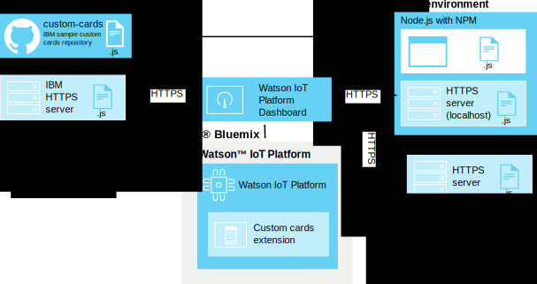

---

copyright:
  years: 2016, 2017
lastupdated: "2016-10-13"

---

{:new_window: target="\_blank"}
{:shortdesc: .shortdesc}
{:screen: .screen}
{:codeblock: .codeblock}
{:pre: .pre}

# Schede personalizzate
{: #custom_cards}

Utilizza le schede personalizzate per visualizzare il tuoi dati di Internet delle cose oltre alle schede generiche fornite con {{site.data.keyword.iot_full}}.
{:shortdesc}

## Architettura
{: #architecture}  

Le schede personalizzate sono sviluppate da te e distribuite utilizzando il tuo proprio repository server HTTP delle schede personalizzate.  È possibile accedere a questo server da un browser dell'utente che visualizza ed elabora i dashboard {{site.data.keyword.iot_short_notm}}. {{site.data.keyword.iot_short_notm}} gestisce la connessione al browser tramite l'estensione delle schede personalizzate ma non si collega al server delle schede personalizzate.

Il browser su cui sono in esecuzione i dashboard {{site.data.keyword.iot_short_notm}} richiama tutte le risorse necessarie direttamente dal server delle schede personalizzate. Le schede personalizzate sono offerte nella finestra di dialogo “Aggiungi scheda” e visualizzate nelle tabelle create dall'utente che hanno configurato i tuoi utenti.

Per abilitare il controllo della versione centralizzato utilizzando il server delle schede, il codice della scheda personalizzata non viene memorizzato nel lato client. Se una scheda personalizzata non è più disponibile o se il server delle schede non può essere raggiunto, viene utilizzato un segnaposto per mantenere un layout del dashboard congruente.

**Suggerimento:** per verificare la funzione delle schede personalizzate senza configurare il tuo proprio ambiente di sviluppo, puoi collegare il server delle schede personalizzate di esempio fornito da IBM all'indirizzo: `https://customcards.mybluemix.net`

Per creare le tue schede, devi configurare un ambiente di sviluppo locale basato su node.js e importare le schede personalizzate di esempio dal repository GitHub delle schede personalizzate fornito da IBM. Dopo aver creato le tue schede, distribuisci il pacchetto delle schede a un server web (HTTPS) sicuro a cui puoi successivamente collegare l'estensione delle schede personalizzate {{site.data.keyword.iot_short_notm}}.   

**Suggerimento:** puoi utilizzare il server web node.js integrato per la verifica iniziale e la risoluzione dei problemi delle tue schede, ma dovresti utilizzare un server web ben gestito e sicuro per la distribuzione della produzione delle tue schede.

 

## Sicurezza
{: #security}

Non esistono restrizioni nel codice JavaScript che scegli di distribuire nelle tue schede nel tuo server delle schede personalizzate. Il codice Javascript nelle schede personalizzate ha accesso a tutte le informazioni detenute dal browser, così come a qualsiasi scheda in esecuzione nel dashboard.  Assicurati che il server delle schede personalizzato corretto stia fornendo il codice al browser per visualizzare ed elaborare le schede personalizzate.

Le schede eseguono il loro codice nella tua sessione del browser {{site.data.keyword.iot_short_notm}} esattamente come è scritto. Inoltre, la connessione al server delle schede personalizzate viene creata senza credenziali fornite al server delle schede personalizzate. Un browser dell'utente può collegarsi a un qualsiasi server delle schede personalizzate configurato.

È importante che configuri solo i server delle schede personalizzate sicuri e conosciuti per fornire le schede personalizzate ai dashboard dei tuoi utenti.   

Per ulteriori informazioni su come proteggere il tuo server delle schede personalizzate, consulta [Sicurezza delle schede personalizzate](../reference/security/custom_cards_server.html).

La seguente procedura ti mostra il processo di collegamento a un server delle schede di test, la distribuzione delle schede di esempio al tuo proprio server delle schede e infine la creazione delle tue proprie schede e la loro distribuzione al tuo server.

## Passo 1: Collega {{site.data.keyword.iot_short_notm}} al server delle schede di esempio.
{: #connect-to-sample}  

Per verificare la funzione delle schede personalizzate con il tuo {{site.data.keyword.iot_short_notm}}, puoi collegarti al server delle schede personalizzate di esempio. Il server di esempio contiene una serie di schede generiche che sono inoltre disponibili come modelli per la creazione delle tue proprie schede.

Per collegarti al server delle schede personalizzate di esempio:
1. Accedi al dashboard {{site.data.keyword.iot_short_notm}} come un utente amministratore.
2. Abilita le funzioni sperimentali.  
Le schede personalizzate vengono al momento offerte come una funzione sperimentale.  
**Importante:** l'estensione delle schede personalizzate di esempio deve essere abilitata per la sessione del browser. Le connessioni delle schede personalizzate e i pacchetti della scheda non sono condivisi globalmente nella tua organizzazione {{site.data.keyword.iot_short_notm}}.
 1. Vai a **Settings**.
 2. Nella sezione delle funzioni sperimentali, verifica che **Activate Experimental Features** sia abilitato.
2. Collegati al server di esempio.
 2. Vai a **Extensions**.
 3. Fai clic su **Add extension** e seleziona l'estensione **Custom Cards**.
 4. Nel tile **Custom Card**, fai clic su **Setup**.
 5. Nella sezione di configurazione delle schede personalizzate, fai clic su **Add** e immetti l'URL (HTTPS) sicuro per il server delle schede di esempio nel campo server.  
Se ti stai collegando al tuo proprio server, immetti l'URL di tale server.    
**Suggerimento:** l'URL del server delle schede di esempio IBM è: `https://customcards.mybluemix.net`  
 6. Fai clic su **Retrieve Certificate** per collegarti al server delle schede personalizzate e richiamare le informazioni del certificato di sicurezza per il server.  
 **Importante:** utilizza le informazioni del certificato per verificare che ti stai collegando a un server delle schede personalizzate sicuro, conosciuto e previsto.
 4. Fai clic su **Done** per aggiungere la connessione al server.
5. Crea una nuova scheda che si basa sulle schede di esempio.
 1. Nel dashboard {{site.data.keyword.iot_short_notm}}, vai a **Boards**.
 2. Fai clic su **Create New Board**.  
 Completa la nuova finestra di dialogo di creazione della tabella. Per informazioni, consulta [Creazione di tabelle e schede](../data_visualization.html#visualizing_data).
 3. Apri la nuova tabella.
 4. Fai clic su **Add New Card**.  
 5. Scorri fino a **Custom cards** e seleziona una delle schede di esempio.  
 Completa il processo di creazione della scheda. Per informazioni, consulta [Creazione di tabelle e schede](../data_visualization.html#visualizing_data).  

 La tua nuova scheda personalizzata è ora nella tua nuova tabella.  
 

Congratulazioni, ti sei collegato al server delle schede personalizzate e hai aggiunto una scheda personalizzata a una delle tue tabelle. Il prossimo passo è di configurare il tuo proprio server delle schede e creare la tua prima scheda utilizzando la scheda di esempio HelloWorld.

## Passo 2: Configura un server delle schede e distribuisci la scheda di esempio HelloWorld.
{: #create-hello-world}

Per preparare lo sviluppo delle schede personalizzate, puoi configurare il tuo ambiente di sviluppo delle schede personalizzate locale e verificare la distribuzione della scheda di esempio HelloWorld.

Per creare un server delle schede personalizzate e distribuire le schede di esempio IBM, segui le istruzioni dettagliate nel readme [custom-cards repository](https://github.com/ibm-watson-iot/custom-cards/blob/master/README.md).

I seguenti passi avanzati sono coinvolti nel processo:
1. Assicurati che il tuo ambiente di sviluppo locale disponga di Node.js con il gestore del pacchetto del nodo npm.  
Per informazioni sull'installazione di Node.js, inclusi i link di download, vai all'indirizzo: https://nodejs.org
2. Configura un server HTTP per ospitare il tuo pacchetto delle schede personalizzate.    
  - La directory che utilizza il contenuto della scheda personalizzata sul server non deve richiedere credenziali di accesso.
  - Il server deve utilizzare il protocollo HTTPS.
  - Il server deve supportare le connessioni CORS (Cross-Origin Resource Sharing).  
**Suggerimento:** per una verifica e una prova di utilizzo, puoi utilizzare il server node.js di esempio integrato, che è configurato per rispettare questi requisiti.
3. Crea il tuo proprio repository.
Dividi e clona il repository delle schede personalizzate di esempio all'indirizzo: https://github.com/ibm-watson-iot/custom-cards
4. Crea i tuoi propri modulo e framework della scheda.
Le schede personalizzate sono organizzate in moduli. Configura il modulo della scheda HelloWorld.
5. Fai riferimento alla nuova scheda.
Il tuo pacchetto delle schede personalizzate può contenere più moduli. Devi fare riferimento al tuo nuovo modulo nel file del pacchetto principale.
6. Registra il tuo modulo.
Per rendere la tua scheda disponibile nelle tabelle della tua organizzazione {{site.data.keyword.iot_short_notm}}, devi aggiungere i dettagli di configurazione della scheda nel file `DashboardConfig.json`.
7. Crea il tuo pacchetto delle schede.
Utilizza Gulp per configurare un motore di build automatizzato.
8. Distribuisci il tuo pacchetto delle schede al tuo server delle schede.  
Prima di poter utilizzare le tue schede in {{site.data.keyword.iot_short_notm}}, devi distribuire il pacchetto delle schede al tuo server HTTP delle schede personalizzate.  
**Suggerimento:** puoi aggiungere nuove schede o rimuoverne di obsolete in tempo reale ridistribuendo il pacchetto delle schede al server delle schede.
9. Collega il tuo server delle schede a {{site.data.keyword.iot_short_notm}}.
Collega il tuo server delle schede personalizzate appena distribuito a {{site.data.keyword.iot_short_notm}}.  
**Suggerimento:** se il tuo server delle schede personalizzate è una replica completa del server delle schede di esempio, potresti visualizzare schede duplicate nel tuo ambiente. Rimuovi la connessione al server delle schede personalizzate per visualizzare solo le schede dal tuo server delle schede personalizzate.
 1. Vai a **Extensions**.
 2. Nel tile **Custom Card**, fai clic sull'icona ingranaggio per aggiornare la configurazione.
 4. Nella sezione di configurazione delle schede personalizzate, fai clic su **Add** e immetti l'URL (HTTPS) sicuro per il tuo server delle schede personalizzate nel campo server.  
**Importante:** verifica che ti stai collegando a un server delle schede personalizzate sicuro, conosciuto e previsto.
4. Fai clic su **Done** per aggiungere la connessione al server.
10. La scheda personalizzata HelloWorld è ora disponibile per l'utilizzo con le tue tabelle.

Ok! Hai correttamente configurato un server delle schede e distribuito la tua prima scheda di esempio. Congratulazioni! Tuttavia, le schede personalizzate ti permettono di configurare schede e tabelle esattamente come le desideri. È ora di iniziare a modificare gli esempi per creare le tue proprie schede.

## Passo 3: Crea e distribuisci le tue proprie schede personalizzate.
{: #create-your-own-cards}
Dopo aver configurato e verificato la scheda HelloWorld, puoi ampliare le schede personalizzate e crearne di tue.

Il repository delle schede personalizzate di esempio include le seguenti schede di esempio:
- HelloWorld  
Una scheda semplice che fornisce un esempio Hello World di base.
- Vuota  
Una scheda vuota che contiene l'infrastruttura di una scheda. Utilizza questa scheda quando crei una scheda da zero.
- Webcam  
Una scheda webcam semplice. Configura la scheda con un URL webcam e imposta la frequenza di aggiornamento.
- iFrame  
Una scheda iFrame di base che puoi utilizzare per integrare qualsiasi pagina web (HTTPS) sicura nella tua tabella.

I seguenti passi avanzati creano una nuova scheda:

**Suggerimento:** per i passi dettagliati, consulta [Creating custom cards Readme](https://github.com/ibm-watson-iot/custom-cards/blob/master/README.md) nel repository delle schede personalizzate di esempio.
1. Crea il tuo proprio modulo della scheda.
 1. Utilizza uno dei moduli della scheda di esempio come template per il tuo modulo.
 2. Aggiorna tutte le istanze del nome del modulo nei tuoi nuovi nomi del file modulo e contenuto dei file.  
 Ad esempio, sostituisci `HelloWorld` con il tuo nome del modulo in tutti i nomi del file e le istanze del contenuto dei file.
2. Fai riferimento al nuovo modulo nel file Modules.jsx.
3. Registra il nuovo modulo nel file DashboardConfig.json.
4. Aggiorna il codice della scheda personalizzato per soddisfare i bisogni della tua scheda.
4. Crea il pacchetto delle schede.  
A seconda della tua configurazione, il processo di build potrebbe utilizzare gulp in automatico o potresti dover attivare manualmente una build.
3. Distribuisci la nuova scheda.  
Se stai utilizzando un server delle schede personalizzate esterno, devi ora distribuire il pacchetto al server.  

Hai creato la tua prima scheda personalizzata e l'hai distribuita al tuo server delle schede personalizzate. La scheda è ora disponibile per l'utilizzo nella tua organizzazione {{site.data.keyword.iot_short_notm}}.
