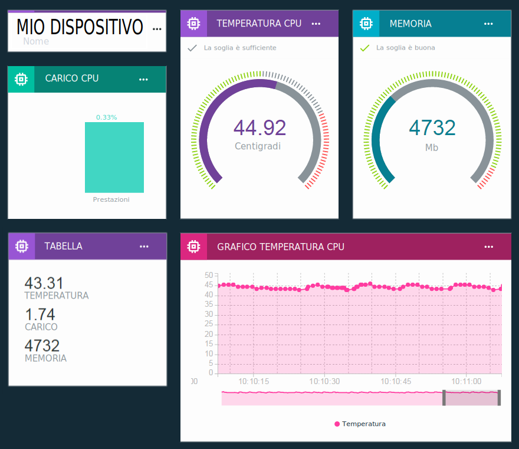

---

copyright:
  years: 2016, 2017
lastupdated: "2017-01-10"

---

{:new_window: target="\_blank"}
{:shortdesc: .shortdesc}
{:screen: .screen}
{:codeblock: .codeblock}
{:pre: .pre}

# Visualizzazione dei dati in tempo reale utilizzando le tabelle e le schede
{: #boards_and_cards}

Crea le tabelle e le schede per creare e condividere i tuoi propri dashboard che visualizzano i tuoi dati del dispositivo in tempo reale.
{:shortdesc}

Utilizzando le schede e le tabelle, puoi visualizzare i valori dei dataset graficamente da uno o più dispositivi per avere una veloce panoramica e una migliore comprensione dei dati. Crea tabelle e aggiungi schede che visualizzano i dati come numeri non elaborati, grafici in tempo reale, misuratori e altro. Aggiungi membri alle tue tabelle per condividerle con altri utenti nella tua organizzazione. Ordina le schede e aggiungi divisori di testo esplicativi per ottimizzare la tua presentazione.  

Puoi anche espandere la serie predefinita di schede fornite da IBM [creando le tue proprie schede personalizzate](custom_cards/custom-cards.html).

## Tabelle predefinite
{: #default_boards}
Il dashboard {{site.data.keyword.iot_full}} dispone delle seguenti tabelle predefinite:

|Nome tabella | Descrizione |  
|:---|:---|  
|Panoramica sull'utilizzo  | Visualizza le statistiche di utilizzo per la tua organizzazione. Elenca i tipi di dispositivo e i dati utilizzati.
|Analisi incentrata sulla regola | Visualizza le regole per la tua organizzazione. Ulteriori schede elencano gli avvisi attivati, i dispositivi associati, le proprietà del dispositivo e le informazione sull'avviso. |  
|Analisi incentrata sul dispositivo | Visualizza i dispositivi collegati alla tua organizzazione. Ulteriori schede mostrano gli avvisi e le informazioni per un dispositivo selezionato, le proprietà del dispositivo e le informazioni sull'avviso. |
|Gestione della sicurezza e del rischio | Mostra le schede che riepilogano lo stato di sicurezza generale. Gli operatori di sistema e gli analisti della sicurezza possono visualizzare i dettagli di conformità, lo stato della connessione dei dispositivi, le cause dei problemi di connessione e i dispositivi bloccati o consentiti tramite una una whitelist o una blacklist.  Dalla scheda di conformità della connessione, l'utente può eseguire il drilldown di un report dettagliato sui dispositivi non conformi e può esportare il report in Excel. |

Puoi aggiornare queste tabelle aggiungendo, aggiornando e rimuovendo schede.

**Suggerimento:** per reimpostare una tabella predefinita nel suo stato iniziale puoi eliminarla. La tabella viene quindi ricreata con le schede originali.

## Creazione di tabelle e schede
{: #visualizing_data}

{{site.data.keyword.iot_short_notm}} fornisce un dashboard integrato che puoi utilizzare per visualizzare i dati in tempo reale restituiti dal tuo dispositivo. Per impostazione predefinita, la pagina della panoramica visualizza le informazioni sull'utilizzo relative alla tua organizzazione {{site.data.keyword.iot_short_notm}}, come i dati e lo spazio di archiviazione utilizzati. Per visualizzare i dati del dispositivo in tempo reale come arrivano, aggiungi le schede specifiche per il dispositivo in questa pagina.

Per aggiungere una scheda specifica per il dispositivo alla tabella:
1. Nel dashboard {{site.data.keyword.iot_short_notm}}, seleziona **Boards**.
2. Seleziona una tabella per cui disponi dei diritti di modifica o crea una nuova tabella.
3. Nella tabella, fai clic su **Add New Card**.
2. Nella casella Edit Generic Visualization Card, scorri verso il basso fino alla sezione Devices.
3. Seleziona un tipo di visualizzazione.
**Suggerimento:** seleziona **Generic visualization** per la configurazione di base. Puoi modificare il tipo di scheda successivamente.
Fai clic su **Show more** per un elenco completo dei tipi di dispositivo.
4.	Seleziona uno o più origini dati della scheda e quindi fai clic su **Next** per aggiungere uno o più dataset.
 1.	Fornisci al dataset un nome di identificazione.
 2. Seleziona un evento che include il punto dati che desideri visualizzare.
 3.	Seleziona la proprietà che rappresenta il punto dati.
 4.	Imposta i valori tipo, unità, precisione e minimo e massimo per il punto dati.  
 Quando finito fai clic su **New Data Set** per aggiungere ulteriori dataset o fai clic su **Next**.
5.	Seleziona la visualizzazione.  
Seleziona il tipo e la dimensione di visualizzazione che vuoi utilizzare.  Alcuni tipi di schede hanno ulteriori impostazioni.
<dl>
<dt>Utilizzo</dt>
<dd>
<table>
<thead>
<tr>
<th>Tipo</th>
<th>Dati visualizzati</th>
</tr>
</thead>
<tbody>
<tr>
<td>Tipi di dispositivo</td>
<td>Un grafico a torta che visualizza il numero di dispositivi per tipo di dispositivo.</td>
</tr><tr>
<td>Dati trasferiti</td>
<td>Le statistiche di utilizzo per i dati trasferiti per la tua organizzazione.</td>
</tr>
</tbody>
</table>
</dd>
<dt>Di base</dt>
<dd>
<table>
<thead>
<tr>
<th>Tipo</th>
<th>Dati visualizzati</th>
</tr>
</thead>
<tbody>
<tr>
<td>Separatore</td>
<td>Un separatore orizzontale per organizzare e raggruppare le schede nella tabella</td>
</tr>
</tbody>
</table>
</dd>
<dt>Dispositivi</dt>
<dd><table>
<thead>
<tr>
<th>Tipo</th>
<th>Dati visualizzati</th>
</tr>
</thead>
<tbody>
<tr>
<td>Visualizzazione generica</td>
<td>Il valore di uno o più dataset.  **Suggerimento:** per visualizzare fino a tre valori di punto dati in una piccola tabella, scegli la dimensione del widget grande.  </td>
</tr>
<tr>
<td>Grafico in tempo reale</td>
<td>Uno o più dataset in un grafico a scorrimento in tempo reale. Utilizza il menu delle impostazioni per impostare l'intervallo e la conservazione dei dati, l'aspetto dei grafici e altro. </td>
</tr>
<tr>
<td>Grafico a barre</td>
<td>I valori dei dataset nelle barre etichettate. Utilizza il menu delle impostazioni per cambiare la direzione della barra, verticale o orizzontale.</td>
</tr>
<tr>
<td>Grafico ad anello</td>
<td>Due o più dataset in una rappresentazione circolare.</td>
</tr>
<tr>
<td>Valore</td>
<td>Il valore non elaborato di uno o più dataset.</td>
</tr>
<tr>
<td>Misuratore</td>
<td>Il valore del dataset visualizzato come un misuratore. Puoi configurare le soglie per i valori buono, discreto o critico del dataset. Utilizza il menu delle impostazioni per facoltativamente impostare le soglie del misuratore per gli intervalli di dati inferiore, medio e superiore.  </td>
</tr>
</tbody>
</table>
</dd>
<dt>Analytics</dt>
<dd>
<table>
<thead>
<tr>
<th>Tipo</th>
<th>Dati visualizzati</th>
</tr>
</thead>
<tbody>
<tr>
<td>Informazioni dispositivo</td>
<td>Mostra le informazioni di base per un solo dispositivo.</td>
</tr>
<tr>
<td>Informazioni avviso</td>
<td>Mostra le informazioni di base per un solo avviso.</td>
</tr>
<tr>
<td>Elenco dispositivi</td>
<td>Un elenco per monitorare più dispositivi.</td>
</tr>
<tr>
<td>Avvisi</td>
<td>Un elenco di avvisi per un dispositivo.</td>
</tr>
<tr>
<td>Regole</td>
<td>Un elenco di regole che dispongono di avvisi.</td>
</tr>
<tr>
<td>Proprietà del dispositivo</td>
<td>Visualizza le proprietà specifiche per uno o più dispositivi.</td>
</tr>
<tr>
<td>Tutte le proprietà del dispositivo</td>
<td>Visualizza tutte le proprietà specifiche per uno o più dispositivi.</td>
</tr>
<tr>
<td>Associazione dispositivo</td>
<td>Visualizza l'ubicazione di più dispositivi in un elenco.</td>
</tr>
</tbody>
</table>
</dd>
</dl>

6. Specifica l'origine dati per la scheda.  
A seconda del tipo di scheda che hai selezionato, i dati visualizzati su una scheda possono provenire da un dispositivo o da un'altra scheda. Seleziona un dispositivo specifico o un elenco di dispositivi o una scheda di elenco di avvisi per l'origine dati e quindi fai clic su **Next**.
7. Solo per le schede del tipo di dispositivi: aggiungi uno o più dataset da visualizzare nella scheda.   
 1. Fai clic su **Connect data set** per aggiungere una proprietà da visualizzare nella scheda.
 2. Fornisci un nome al dataset.
 3. Immetti o seleziona l'evento di cui visualizzare le proprietà.
 4. Immetti o seleziona la proprietà da visualizzare.
 5. Specifica il tipo della proprietà e facoltativamente imposta i valori unità, precisione, minimo e massimo per la proprietà.  
 6. Fai clic su **Next**.
7. Seleziona la dimensione di presentazione.   
Per alcuni tipi di schede, puoi fare clic su **Settings** per configurare ulteriori dettagli di visualizzazione. Fai clic su **Next**.
7. Fornisci un tile e una descrizione per la scheda e facoltativamente seleziona uno schema di colore e quindi fai clic su **Submit** per creare la scheda.
7.	Infine, posiziona la nuova scheda nella tua tabella trascinandola in una posizione valida.  

Bene! Puoi ora visualizzare i dati in tempo reale del tuo dispositivo!

Per le istruzioni dettagliate su come visualizzare i dati del dispositivo in tempo reale, consulta la ricetta [Configuring Boards & Cards in the new Watson IoT Dashboard](https://developer.ibm.com/recipes/tutorials/configuring-the-cards-in-the-new-watson-iot-dashboard/).
