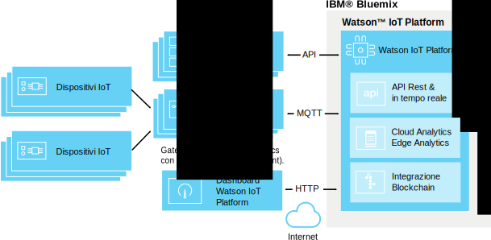

---

copyright:
  years: 2016, 2017
lastupdated: "2017-02-17"

---

{:new_window: target="\_blank"}
{:shortdesc: .shortdesc}
{:screen: .screen}
{:codeblock: .codeblock}
{:pre: .pre}

# Analisi edge
{: #edge_analytics}

Con le analisi edge, puoi spostare il processo di attivazione della regola di analisi dal cloud al gateway abilitato per l'analisi edge che riduce drasticamente la quantità di traffico dati del dispositivo nel cloud eseguendo l'elaborazione delle analisi vicino al dispositivo.
{:shortdesk}

I dispositivi inviano i loro dati a un gateway abilitato per l'analisi edge in cui le regole di analisi edge analizzano i dati. In base alla tua regola e alle relative azioni, i dati critici e gli avvisi possono essere inviati a {{site.data.keyword.iot_full}}, possono essere attivati nel gateway o essere scritti in un file di testo locale nel gateway.

Il seguente diagramma illustra l'architettura generale di un ambiente di analisi edge {{site.data.keyword.iot_full}}.

## Prima di cominciare
{: #byb}

Prima di iniziare la creazione di regole e azioni edge:
- Assicurati che il tuo gateway sia collegato a {{site.data.keyword.iot_short}} e che i dati del dispositivo siano stati trasmessi. Consulta [Connessione ai gateway](gateways/dashboard.html) per ulteriori informazioni.
- Installa EAA (Edge Analytics Agent) sul tuo gateway. Per informazioni, consulta [Installazione dell'agent di analisi edge](gateways/dashboard.html#edge).   **Suggerimento:** i gateway abilitati EAA forniscono dati di diagnostica EAA sotto forma di messaggi del dispositivo gateway. Per informazioni, consulta [Metriche di diagnostica di EAA (Edge Analytics Agent)](#eaa_metrics).
- Assicurati che le proprietà del dispositivo che desideri utilizzare come le condizioni nelle tue regole siano associate agli schemi. Consulta [Connessione dispositivi](iotplatform_task.html) e [Creazione di schemi](im_schemas.html) per ulteriori informazioni.
- Ricette Edge Analytics  
Nel nostro portale delle ricette, un paio di ricette descrivono i passi necessari per eseguire IBM Edge Analytics. Le ricette descrivono chiaramente come installare e configurare l'EAA (Edge Analytics Agent) IBM su un dispositivo creato con Apache Edgent per eseguire le analisi vicino a un'origine dati IoT.
 - [La ricetta Getting Started with Edge Analytics in IBM Watson IoT Platform ](https://developer.ibm.com/recipes/tutorials/getting-started-with-edge-analytics-in-watson-iot-platform/){: new_window} è la prima di questa serie. Questa ricetta descrive la configurazione della piattaforma Cisco DSA su un sistema di un portatile e sul dispositivo Raspberry Pi 3, l'installazione e la configurazione di EAA (Edge Analytics Agent) IBM per il collegamento a {{site.data.keyword.iot_short}}, l'installazione del link System DS e la sua configurazione per il collegamento al gateway Edge su {{site.data.keyword.iot_short}} come un dispositivo allegato, definendo e attivando la regola edge nel gateway edge e la gestione della regola edge da {{site.data.keyword.iot_short}}.
 - Per mostrare un utilizzo avanzato di Edge Analytics, la ricetta [Handling Alerts and Device Actions with Edge Analytics in IBM Watson IoT Platform ](https://developer.ibm.com/recipes/tutorials/handling-alerts-and-device-actions-with-edge-analytics-in-ibm-watson-iot-platform/){: new_window} illustra come creare il tuo proprio link DS per trasferire i dati da un dispositivo Arduino Uno collegato a un dispositivo Raspberry Pi 3. La ricetta illustra inoltre i dati di filtro e gestione delle azioni del dispositivo locale come parte di un avviso della regola edge.

## Gestione delle regole e delle azioni edge  
{: #managing_rules}

Le regole edge sono gestite nel seguente modo:
- Il dashboard **Rules** viene utilizzato per creare e modificare le regole e le azioni edge e cloud per i tuoi dispositivi e gateway.
- La tabella **Edge Rules Gateways** viene utilizzata per attivare, disattivare, aggiornare e rimuovere una regola edge dai tuoi gateway. Per accedere alla tabella Edge Rules Gateways, dal dashboard Rules fai clic su **Manage Rule** per la regola edge che desideri gestire. Per ulteriori informazioni, consulta [ Attivazione, disattivazione e gestione delle regole edge per i tuoi gateway](#manage).

Per ottenere una panoramica delle regole e degli avvisi edge che sono stati attivati dai tuoi dispositivi collegati al gateway, utilizza le seguenti tabelle:

|Nome tabella | Descrizione |  
 |:---|:---|  
  |Analisi incentrata sulla regola | Visualizza le regole per la tua organizzazione, incluse le regole edge. Ulteriori schede elencano gli avvisi edge inoltrati, i dispositivi associati, le proprietà del dispositivo e le informazioni sull'avviso edge inoltrato. |  
 |Analisi incentrata sul dispositivo | Visualizza i dispositivi collegati alla tua organizzazione. Ulteriori schede mostrano gli avvisi inoltrati per un dispositivo edge selezionato, le informazioni per un dispositivo selezionato, le proprietà del dispositivo e le informazioni sull'avviso inoltrato. |

Per ulteriori informazioni sulle tabelle di analisi predefinite, consulta [Visualizzazione dei dati in tempo reale utilizzando le tabelle e le schede](data_visualization.html#default_boards).

## Creazione delle regole edge
{: #rules}

Le regole edge sono punti di decisione che corrispondono ai dati in tempo reale con valori di soglia predefiniti o altri dati della proprietà per attivare un'azione edge se viene riscontrata una condizione.

**Importante:** prima di poter creare le regole per un tipo di dispositivo, devi creare uno schema per il tipo di dispositivo. Per informazioni, consulta [Crea schemi per il tipo di dispositivo](im_schemas.html).

Per creare una regola:
1. Nel dashboard {{site.data.keyword.iot_short}}, passa a **Rules**.
2. Fai clic su **Create Edge Rule**, fornisci un nome e una descrizione per la regola, seleziona un tipo di dispositivo edge a cui applicare la regola e quindi fai clic su **Next**.  
3. Configura la logica della regola.  
Aggiungi una o più condizioni IF da utilizzare come trigger per la regola.  
Puoi aggiungere condizioni in righe parallele per applicarle come condizioni OR o puoi aggiungere le condizioni in colonne sequenziali per applicarle come condizioni AND.  
**Nota:** per poter selezionare una proprietà del dispositivo come input per un regola, la proprietà deve essere associata a uno schema. Consulta [Creazione di schemi](im_schemas.html) per ulteriori informazioni.  

**Importante:** per attivare una condizione che confronta due proprietà o per attivare due o più condizioni della proprietà combinate sequenzialmente utilizzando AND, i punti dei dati di attivazione devono essere inclusi nello stesso messaggio del dispositivo. Se i dati sono ricevuti in più di un messaggio, la condizione o le condizioni in sequenza non vengono attivate.  

**Esempi:**  
Una regola semplice può attivare una avviso se un valore del parametro è maggiore di un valore specificato:
  
`temp>80`  
Una regola più complessa può essere attivata quando viene soddisfatta una combinazione di soglie:
  
`temp>60 AND capacity>50`   

4. Configura i requisiti di attivazione condizionali per la tua regola.  
Per controllare il numero di avvisi e azioni che vengono attivati per un regola in un intervallo di tempo, puoi configurare i requisiti di attivazione condizionali per la tua regola.  
**Importante:**  l'attivazione condizionale agisce su qualsiasi condizione nella regola. Ad esempio, se una regola ha cinque condizioni parallele differenti impostate utilizzando OR, ogni condizione che è true viene conteggiata nel numero di trigger condizionali.
Per impostare l'attivazione condizionale per un regola:
 1. Nell'editor della regola, fai clic sul link **Trigger each time conditions are met** predefinito per aprire la casella di dialogo per la configurazione dei requisiti della frequenza della serie.
 2. Seleziona e configura il trigger condizionale che desideri utilizzare nella regola.
 <ul>
 <li>Attiva ogni volta che le condizioni sono soddisfatte</li>
 <li>Attiva se le condizioni sono soddisfatte N volte in M *Unità di tempo*</li>
 </ul>  
 Per una descrizione più dettagliata dei trigger condizionali, consulta [Attivazione regola condizionale](cloud_analytics.html#conditional "Panoramica attivazione condizionale"), nella sessione di analisi cloud.
5. Crea o seleziona una o più azioni che si verificano se vengono soddisfatte le condizioni della regola.  
Per ulteriori informazioni sulle azioni edge, consulta [Creazione di azioni edge](#edge_actions "Crea azioni edge").   
 Esempio: un azione può essere di inviare i dati del dispositivo al cloud o di scrivere un avviso in un file locale.
3. **Facoltativo:** seleziona una priorità dell'avviso per la regola.  
 La priorità viene utilizzata per classificare gli avvisi che vengono visualizzati nella tabella **Rule-Based Analytics**. La priorità predefinita è bassa.
6. Quando sei soddisfatto della tua regola, fai clic su **Save**.

La tua regola è stata creata e viene aggiunta al dashboard di esplorazione. Puoi ora [attivare](#manage) la regola dalla tabella **Edge Rules Gateways** che si apre.

## Creazione delle azioni edge
{: #edge_actions}

Puoi creare le azioni direttamente nell'editor della regola o nella scheda delle azioni e quindi selezionare le azioni quando crei le tue regole.

Per creare un'azione nella scheda delle azioni:
1. Nel dashboard {{site.data.keyword.iot_short}}, passa a **Rules**.
2. Nel dashboard delle regole, seleziona la scheda **Actions**.
2. Fai clic su **Create An Action**, fornisci una descrizione e un nome per l'azione e seleziona un tipo di azione e fai quindi clic su **Next**.  
L'analisi edge supporta due tipi di azione:
<dl>
<dt>Inoltro dell'evento al cloud</dt>  
<dd>L'evento del dispositivo viene inviato a {{site.data.keyword.iot_short}} dove può essere utilizzato nelle tabelle e nelle schede e con le regole di analisi cloud. Per informazioni, consulta [Integrazione con le analisi cloud](#integrate_with_cloud_analytics).    
**Suggerimento:** utilizza l'azione di inoltro dell'evento al cloud per ridurre la quantità di dati del dispositivo inviata al cloud filtrando i dati meno importanti direttamente dal dispositivo gateway. </dd>
<dt>Avviso</dt>  
<dd>Viene creato un avviso nel dispositivo gateway.</dd>
</dl>
3. Fornisci i parametri obbligatori per il tipo di azione che hai selezionato.  
<dl>
<dt>Inoltro dell'evento al cloud</dt>  
<dd>Seleziona i dati dell'evento da inoltrare al cloud e fornisci il nome dell'evento da utilizzare nel messaggio.  
**Suggerimento:** puoi utilizzare l'evento e le proprietà quando configuri le tabelle e le schede e quando crei le regole di analisi cloud. 
Puoi:
 <ul>
 <li>Includere tutte le proprietà del dispositivo e le proprietà virtuali
 <li>Includere tutte le proprietà definite dallo schema e le proprietà virtuali  
 </ul>
 </dd>
<dt>Avviso</dt>  
<dd>Specifica un messaggio di avviso e seleziona almeno una destinazione per l'avviso.
 <ul>
 <li>Inoltra al cloud  
 L'avviso è stato inoltrato a {{site.data.keyword.iot_short}} dove viene visualizzato nelle tabelle Analisi incentrata sulla regola e Analisi incentrata sul dispositivo.
 <li>Pubblica nel broker del gateway
 L'avviso viene pubblicato nel broker del gateway. La configurazione del broker determina come l'avviso è visibile a un utente.
 <li>Salva in un file di testo locale
 L'avviso viene aggiunto al file di testo *IBMEdgeAnalyticsAlerts.csv* locale nel server del gateway.
 </ul>
 </dd>
</dl>
4. Fai clic su **OK** per creare una nuova azione.

L'azione è ora disponibile nell'editor della regola.

## Attivazione, disattivazione e gestione delle regole edge per i tuoi gateway
{: #manage}

Perché una regola attivi le azioni devi prima attivarla su uno o più gateway. Utilizza la tabella **Edge Rules Gateways** per attivare, disattivare, aggiornare e rimuovere una regola edge dai tuoi gateway.

Per attivare una regola edge:
1. Dal dashboard Rules, fai clic sul pulsante **Manage Rule** per la regola edge che desideri gestire.  
Nella tabella **Edge Rules Gateways** che viene aperta viene visualizzato un elenco di tutti i gateway abilitati EAA collegati. Lo stato della regola per i gateway in cui la regola non è stata caricata o attivata è *None*.
2. Individua il gateway su cui desideri attivare la regola e seleziona **Activate** dal menu nella colonna dell'operazione di selezione.  
La regola edge viene caricata nel gateway. Quando il caricamento viene completato e la regola è attiva, lo stato della regola si modifica in **Active**.  

La regola è ora attiva nel gateway e le azioni configurate si attiveranno quando vengono riscontrate le condizioni della regola.

**Suggerimento:** per gestire le regole in più gateway puoi selezionare la casella seleziona tutto vicino all'intestazione della colonna del gateway. Annulla la spunta di tutti i gateway che non desideri includere e seleziona quindi un'operazione dal menu **Select operation** all'inizio della colonna con lo stesso nome.

In aggiunta all'attivazione di una regola puoi eseguire le seguenti operazioni di gestione della regola nei tuoi gateway:

Operazione | Descrizione
--- | ---
Attiva | Carica e attiva la regola nei gateway selezionati. Lo stato della regola viene impostato su *Active*.
Disattiva | Disattiva la regola nei gateway selezionati. La regola rimane sul gateway e può essere riattivata se necessario. Lo stato della regola viene impostato su *Inactive*.
Aggiorna | Carica una versione aggiornata della regola nel gateway selezionato. Utilizza questa operazione per aggiornare il gateway se lo stato della regola per il gateway è *Active (Older)*. Lo stato della regola viene impostato su *Active*.
Elimina | Rimuove la regola dai gateway selezionati. Lo stato della regola torna su *None*.

## Integrazione con le analisi cloud
{: #integrate_with_cloud_analytics}

Utilizza le azioni di attivazione della regola edge in esecuzione nel gateway abilitato EAA per filtrare i dati che fluiscono al cloud e inoltrare gli avvisi generati dal gateway al cloud da utilizzare con le tabelle e le schede {{site.data.keyword.iot_short}}.  

Puoi anche utilizzare {{site.data.keyword.iot_short}} per eseguire analisi cloud sui dati del dispositivo inviato al cloud dal gateway. Se utilizzi l'azione `Inoltra l'evento al cloud` nella tua regola edge, il messaggio creato può essere utilizzato come input per una regola di analisi cloud, come se il dispositivo che fornisce i dati che attivano la regola edge sia collegato direttamente a {{site.data.keyword.iot_short}}.

Per ulteriori informazioni su come creare le regole e le azioni di analisi cloud, consulta [Analisi cloud](cloud_analytics.html).

## Metriche di diagnostica di EAA (Edge Analytics Agent)
{: #eaa_metrics}

Un gateway abilitato EAA collegato invia le informazioni sulla diagnostica come i messaggi del dispositivo del tipo di evento `gateway_xv-monitor-event`.   **Suggerimento:** puoi utilizzare le regole di [analisi cloud](cloud_analytics.html) per configurare le azioni di avviso come le notifiche email basate sui valori di diagnostica che sono restituite al gateway abilitato EAA. Ad esempio, puoi creare una regola per avvisarti se il `SystemLoad` supera una certa soglia.

Per visualizzare le informazioni sullo stato del gateway:
1. Nel dashboard {{site.data.keyword.iot_short}} seleziona **Devices** nella barra laterale del menu.
2. Fai clic sul tuo dispositivo gateway per aprire la pagina dei dettagli del dispositivo.
3. Accedi alle informazioni di diagnostica del gateway:  
 - Consulta la sezione **Recent Events** per un elenco di messaggi recenti che sono stati inviati dal gateway.
 - Consulta la sezione **Diagnostic logs** per eventuali avvertenze gateway e altri messaggi di diagnostica.
 - Consulta la sezione **Sensor information** per informazioni di diagnostica dettagliate dal gateway. La seguente tabella descrive le differenti proprietà che possono essere incluse nei messaggi del dispositivo gateway:

 Proprietà | Descrizione
 --- | ---
 `MsgInCount` |Il numero di messaggi che sono stati inviati a EEA (Edge Analytics Agent).
 `MsgInRate` | Il numero stimato di messaggi al secondo che sono stati inviati al EAA nell'ultimo minuto.  
 `LastHeartBeat` | La data/ora in millisecondi in cui è stato generato l'ultimo messaggio di heartbeat. Un messaggio di heartbeat viene generato almeno ogni 10 secondi.
 `CurrentTimestamp` | La data/ora in millisecondi in cui è stato generato il corrente messaggio di monitoraggio.
 `IsAlive` | Questa proprietà è 0 se la differenza tra `LastHeartBeat` e `CurrentTimestamp` è maggiore di 20 secondi.
 `BytesOutCount` | Il numero di byte del messaggio inviati da EAA a {{site.data.keyword.iot_short}}.
 `BytesOutRate` | Il numero stimato di byte del messaggio al secondo inviati da EAA a {{site.data.keyword.iot_short}} durante l'ultimo minuto.
 `BytesInCount` | Il numero di byte del messaggio che sono stati inviati da {{site.data.keyword.iot_short}} a EAA.
 `BytesInRate` | Il numero stimato di byte del messaggio al secondo che sono stati inviati da {{site.data.keyword.iot_short}} a EAA nell'ultimo minuto.
 `RuleBytesInCount` |Il numero di byte del messaggio che sono stati inviati da EAA al core del motore della regola.   **Nota:** se non è impostata alcuna regola per un tipo di dispositivo, i messaggi per tale tipo di dispositivo non sono inviati al core del motore della regola.
 `RuleBytesInRate` | Il numero stimato di byte del messaggio al secondo inviati al core del motore della regola EAA durante l'ultimo minuto.
 `MsgOutCount` | Il numero di messaggi che sono stati inviati da EAA a {{site.data.keyword.iot_short}}.
 `MsgOutRate` | Il numero stimato di byte dei messaggi al secondo inviati da EAA a {{site.data.keyword.iot_short}} durante l'ultimo minuto.
 `MsgReducePercent` | La differenza percentuale tra i messaggi in entrata e in uscita.  La seguente formula viene utilizzata per il calcolo: `(msgIn - msgOut) / msgIn`
`BytesReducePercent` | La differenza percentuale tra i byte in entrata e in uscita.  La seguente formula viene utilizzata per il calcolo: `(bytesIn - bytesOut) / bytesIn`
`MsgRateReduce` | La differenza percentuale tra la frequenza dl messaggio in entrata e in uscita.  La seguente formula viene utilizzata per il calcolo: `(msgInRate - msgOutRate) / msgInRate`
`BytesRateReduce` | La differenza percentuale tra i byte dei messaggi in entrata e in uscita.  La seguente formula viene utilizzata per il calcolo: `(bytesInRate - bytesOutRate) / bytesInRate`
`SystemLoad` | Il carico di sistema corrente per il sistema in cui è in esecuzione EAA. **Nota:** la velocità della CPU sarà inviata solo se il comando `mpstat` è disponibile nel sistema in cui è in esecuzione EAA. Altrimenti, viene inviato il carico del sistema medio per l'ultimo minuto.  “Il carico del sistema medio è la somma del numero di entità eseguibili accodato ai processori disponibili e il numero di entità eseguibili in esecuzione sui processori disponibili come media in un periodo di tempo. Il modo in cui viene calcolato il carico medio è il sistema operativo specifico ma è normalmente una media moderata dipendente dal tempo. Se il carico medio non è disponibile, viene restituito un valore negativo. ” - javadoc per *ManagementFactory.getOperatingSystemMXBean*.
 `FreeMemory` | Il numero di byte di memoria libera per la JVM (Java™ Virtual Machine) dove è in esecuzione EAA.
 `MemoryUsed` | Il numero di byte di memoria JVM utilizzato da EAA.
 `InQueueSize` | Il numero di messaggi in coda per l'elaborazione EAA.
 `RuleNumber` | Il numero di regole definite nel core del motore della regola.
 `ProcessorNumber` | Per l'utilizzo di debug. Il numero di processori definiti nel core del motore della regola.  **Nota:** un processore è un'unità di esecuzione minima nel core del motore della regola.
 `DataPointsInWindow` | Il numero totale di punti dati memorizzati nella finestra di tempo. La dimensione in byte di un punto dati differisce a seconda del proprio tipo di dati. Ad esempio, la dimensione di un punto dati float/int è 8 byte mentre la dimensione di un punto dati della stringa è differente in base alla relativa lunghezza.  In molti casi puoi stimare l'utilizzo della memoria nella finestra di tempo utilizzando la seguente formula: `DataPointsInWindow * 8`.

## Community Edge Analytics
{: #eaa_community}

Puoi scaricare l'SDK Edge Analytics dalla [pagina della community di IBM Edge Analytics](https://www.ibm.com/developerworks/community/groups/service/html/communitystart?communityUuid=3df173af-0c21-4b9c-9fd1-e8e5561ef460&ftHelpTip=true). L'SDK include il file JAR SDK, javadoc, il codice di esempio, link alle "ricette" e i file README. Nella community, potrai anche guardare i video per essere subito operativo con Edge Analytics e puoi utilizzare il forum per chiedere informazioni.
