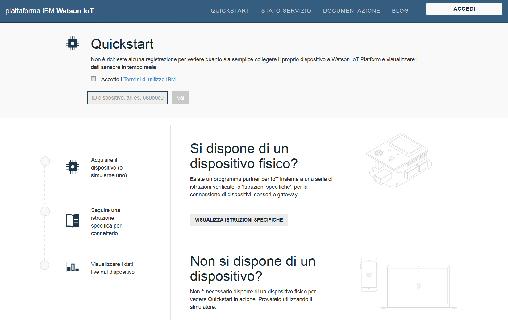

---

copyright:
  years: 2015, 2016, 2017
lastupdated: "2016-09-19"

---

{:new_window: target="_blank"}
{:shortdesc: .shortdesc}
{:screen: .screen}
{:codeblock: .codeblock}
{:pre: .pre}

# Quickstart

[Quickstart](https://quickstart.internetofthings.ibmcloud.com/#/) è un sandbox gratuito che puoi utilizzare per collegare velocemente i tuoi dispositivi a {{site.data.keyword.iot_full}}. Se i tuoi dispositivi supportano il protocollo di messaggistica MQTT, possono essere facilmente collegati a Quickstart.

Per gli esempi, le ricette e le esercitazioni che spiegano come puoi collegare differenti dispositivi al servizio Quickstart, vai a [DeveloperWorks Recipes](https://developer.ibm.com/recipes/), ad esempio:

- [OpenBlocks IoT BX1G](https://developer.ibm.com/recipes/tutorials/openblocks-iot-bx1g-for-iot-foundation-quickstart/)
- [Reactive Blocks](https://developer.ibm.com/recipes/tutorials/reactive-blocks-and-java-to-iot-foundation-part-1-quickstart/)


**Importante:** se la tua istanza {{site.data.keyword.iot_short_notm}} utilizza il servizio Quickstart, non sono supportate le applicazioni scalabili.

## Dispositivi simulati

In aggiunta alle ricette e alle esercitazioni Quickstart, è disponibile un dispositivo simulato basato sul browser per i dispositivi mobili da utilizzare per il collegamento di qualsiasi dispositivo con un browser web al servizio Quickstart. Per avviare un dispositivo simulato basato sul browser che si collega a {{site.data.keyword.iot_short}} da un tablet o da una telefono mobile, apri il seguente URL:

```
http://quickstart.internetofthings.ibmcloud.com/iotsensor
```

Quando ti colleghi all'URL del dispositivo simulato su un dispositivo mobile, viene avviato un dispositivo simulato basato sul browser collegato a {{site.data.keyword.iot_short}}. Utilizza i seguenti controlli della IU per gestire i sensori:

- Temperatura
- Umidità
- Temperatura oggetto


## Visualizzazione dati

Per visualizzare i dati generati dal tuo dispositivo mobile, assicurati che il dispositivo simulato sia in esecuzione sul tuo dispositivo mobile e quindi avvia l'applicazione Quickstart. Immetti l'ID del dispositivo di 12 caratteri per il dispositivo, che viene visualizzato nell'angolo in alto a destra della IU.



Come hai modificato i valori del sensore nel tuo dispositivo simulato, puoi visualizzare i dati dal dispositivo mostrati in tempo reale nell'applicazione Quickstart, come illustrato nella seguente schermata:


## Dimostrazione Mosquitto

[Mosquitto](http://mosquitto.org/) è un client MQTT open source su diverse piattaforme che puoi utilizzare per provare il servizio {{site.data.keyword.iot_short}}. Dopo aver installato il servizio Mosquitto, scegli un ID dell'applicazione e un ID del dispositivo che siano univoci. Se gli ID applicazione e dispositivo non sono univoci, la tua connessione di test potrebbe andare in conflitto con un altro utente che sta completando la stessa procedura di test di Quickstart.

I valori *appId*, *type_id*, *device_type* e *device_id* non devono essere più lunghi di 36 caratteri e possono contenere solo i seguenti caratteri:
- Caratteri alfanumerici (a-z, A-Z, 0-9)
- Trattini ( - )
- Caratteri di sottolineatura ( _ )
- Punti ( . )

Dopo aver definito l'ID dell'applicazione e l'ID del dispositivo, crea una connessione che rappresenta la tua applicazione utilizzando `mosquitto_sub`. Utilizza i seguenti esempi di `<applicationId>` = myApplicationId and `<deviceId>` = myDeviceId:
```
    [user@host ~]$ mosquitto_sub -h quickstart.messaging.internetofthings.ibmcloud.com -p 1883 -i "a:quickstart:myApplicationId" -t iot-2/type/mosquitto/id/myDeviceId/evt/helloworld/fmt/json

```

Mentre è in esecuzione il precedente processo, puoi creare il tuo dispositivo. In questo esempio. Collega un dispositivo del tipo `mosquitto` e invia quindi due eventi al servizio utilizzando `mosquitto_pub`, come descritto nel seguente codice:

```
    [user@host ~]$ mosquitto_pub -h quickstart.messaging.internetofthings.ibmcloud.com -p 1883 -i "d:quickstart:mosquitto:myDeviceId" -t iot-2/evt/helloworld/fmt/json -m "{\"helloworld\": 1}"
    [user@host ~]$ mosquitto_pub -h quickstart.messaging.internetofthings.ibmcloud.com -p 1883 -i "d:quickstart:mosquitto:myDeviceId" -t iot-2/evt/helloworld/fmt/json -m "{\"helloworld\": 2}"
```
Mentre utilizzi il tuo terminale dell'applicazione, i due eventi che hai appena pubblicato vengono visualizzati, come descritto nel seguente output di esempio:

```
   [user@host ~]$ mosquitto_sub -h quickstart.messaging.internetofthings.ibmcloud.com -p 1883 -i "a:quickstart:myApplicationId" -t iot-2/type/mosquitto/id/myDeviceId/evt/helloworld/fmt/json
    {"helloworld": 1}
    {"helloworld": 2}
```

Questo è tutto. Completando la procedura di esempio di Quickstart, hai:
- Collegato correttamente un dispositivo e un'applicazione a {{site.data.keyword.iot_short}} tramite MQTT
- Inviato un evento dal dispositivo al servizio
- Ricevuto l'evento nella tua applicazione


## Link correlati

- [Quickstart](https://quickstart.internetofthings.ibmcloud.com)
- [DeveloperWorks Recipes](https://developer.ibm.com/recipes)
- [OpenBlocks IoT BX1G](https://developer.ibm.com/recipes/tutorials/openblocks-iot-bx1g-for-iot-foundation-quickstart/)
- [Reactive Blocks](https://developer.ibm.com/recipes/tutorials/reactive-blocks-and-java-to-iot-foundation-part-1-quickstart/)
- [Quickstart application](http://quickstart.internetofthings.ibmcloud.com)
- [Mosquitto](http://mosquitto.org/)
