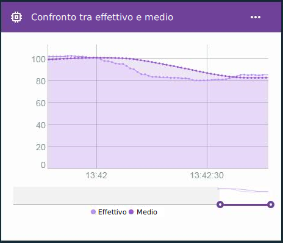

---

copyright:
  years: 2016, 2017
lastupdated: "2016-12-12"

---

{:new_window: target="blank"}
{:shortdesc: .shortdesc}
{:screen:.screen}
{:codeblock:.codeblock}
{:pre: .pre}

# Calcoli avanzati per le proprietà virtuali edge
{: #im_vir_calculations}

Estendi i calcoli della proprietà virtuale di base con le formule di analisi edge predefinite.
{:shortdesc}

**Importante:** i calcoli avanzati restituiscono solo i punti dati della proprietà se i dati per la proprietà selezionata provengono da un dispositivo collegato a un gateway con installato un EAA (Edge Analytics Agent). Una regola edge può utilizzare questa proprietà virtuale direttamente. Per utilizzare la proprietà con una regola del cloud, è necessario che una regola edge invii il punto dati al cloud utilizzando l'azione Inoltra a cloud. Per ulteriori informazioni, consulta [Installazione dell'agent di analisi edge](gateways/dashboard.html#edge).

Esempio: utilizza i punti dati virtuali avanzati in una scheda grafica a linee per visualizzare gli andamenti dei dati con i malfunzionamenti rimossi.  
 

## Formule avanzate
{: #advanced}

Le opzioni di calcolo avanzate includono le seguenti formule:

**Suggerimento:** per alcune formule hai l'opzione di scegliere una lunghezza del periodo o un numero di punti dati da includere. Se sai che i tuoi flussi di dati hanno una frequenza consistente, una finestra di tempo potrebbe essere una scelta corretta. Se i dati sono raccolti sporadicamente o irregolarmente, potrebbe essere meglio utilizzare il numero di punti dati, perché la finestra di tempo è difficilmente prevedibile.

<table>
<thead>
<tr>
<th>Formula</th>
<th>Descrizione</th>
<th>Utilizzo</th>
</tr>
</thead>
<tbody>
<tr>
<td>Media</td>
<td>Restituisce il valore medio di una proprietà per un numero di punti dati recente o per un periodo recente.    
Input:
<ul>
<li>Proprietà
 <li>Lunghezza del periodo o numero di punti dati nel formato di un numero intero maggiore di 0.</ul></td>
 <td>La formula AVG fornisce un valore medio di punti dati in una finestra di tempo in costante movimento.     Utilizza la formula media con una regola per prevenire l'attivazione di falsi avvisi basati su dati confusi che contengono malfunzionamenti isolati.    Utilizza una scheda grafica a linee per visualizzare gli andamenti dei dati con i malfunzionamenti rimossi.  
</td>
</tr>
<tr>
<td>Spostamento Z-score</td>
<td>Restituisce la differenza nelle unità di deviazione standard tra il punto dati i valore del punto dati principale in un numero di punti dati recente o in un intervallo di tempo recente.    
Input:
<ul>
<li>Proprietà
<li>Lunghezza del periodo o numero di punti dati nel formato di un numero intero maggiore di 0.</ul></td>
<td>Lo spostamento Z-Score di un punto dati indica l'estensione di un'anomalia per il valore del punto dati relativo alla propria media recente. Un valore z-score assoluto maggiore indica che il valore del punto dati corrente è molto diverso dai valori del punto dati medi precedenti.
  Utilizza la formula di spostamento Z-Score con una regola per attivare gli avvisi per un cambiamento rapido quando i valori del punto dati differiscono dalla media recente piuttosto che quando il punto dati supera un certo valore.
  Utilizza una scheda grafica a linee per visualizzare le fluttuazioni nei tuoi dati tracciando la frequenza e la rilevanza nelle deviazioni standard.
</td>
</tr>
<tr>
<td>Livellamento esponenziale</td>
<td>Restituisce il valore medio di una proprietà per i punti dati raccolti disponibili, dove i valori della proprietà più vecchi vengono ponderati esponenzialmente meno dei valori più nuovi. L'importanza viene controllata dal fattore di livellamento, dove un valore più grande fornisce più importanza ai valori recenti e meno ai valori più vecchi.  
Puoi inoltre facoltativamente utilizzare il fattore di pendenza per regolare tutti i trend nei dati. I valori esponenzialmente livellati reagiscono più velocemente alle modifiche nei dati rispetto alla media di spostamento.    
Input:
<ul>
<li>Proprietà
<li>Fattore di livellamento, un numero maggiore di 0 ma minore di 1.  
<li>Facoltativo: pendenza, un numero maggiore di 0 ma minore di 1.    
 **Suggerimento:** se non sei sicuro se i tuoi dati raccolti dispongono di tendenze, inizia utilizzando una pendenza di .5. A seconda dei tuoi risultati, potresti voler modificare il fattore.
 </ul></td>  
 <td>Applicando il livellamento esponenziale su un punto dati risulta un valore medio dove i valori più vecchi sono ponderati meno quando viene calcolata la media piuttosto che definendo un periodo di tempo. Invece, limiti l'importanza dei valori distanti impostando un fattore di livellamento maggiore.
  Utilizza la formula del livellamento esponenziale con una regola per prevenire l'attivazione di falsi avvisi basati su dati confusi che contengono malfunzionamenti isolati utilizzando tutti i dati disponibili invece di una sottoserie.
  Utilizza una scheda grafica a linee per visualizzare gli andamenti dei dati con i malfunzionamenti rimossi.</td>
</tr>
<tr>
<td>livellamento con casella</td>
<td>Restituisce il valore medio di una proprietà basata su un intervallo di punti dati centrati nel punto dati corrente.  
Il livellamento con casella utilizza un numero configurato di valori di punti dati che viene prima e dopo il punto dati elaborato corrente per determinare il proprio valore livellato. Nei propri calcoli, il livellamento con casella pesa tutti i valori del punto dati ugualmente.    
Input:
<ul>
<li>Proprietà
<li>Numero di punti dati prima e dopo (a mezza larghezza) nel formato di un numero intero maggiore di 0.
</ul></td>
<td>Applicando il livellamento con casella a un punto dati si ottiene un valore medio di punti dati in una finestra di tempo in costante movimento e che è centrato sul punto dati di interesse.   **Importante:** a seconda della frequenza dati e del valore a mezza larghezza, i punti dati restituiti sono più o meno in ritardo. Ad esempio, se la mezza larghezza è impostata su `5` e la frequenza dati è un messaggio ogni secondo, i punti dati virtuali restituiti vengono ritardati di cinque secondi.   Utilizza la formula del livellamento con casella con una regola per prevenire l'attivazione di falsi avvisi basati su dati confusi che contengono malfunzionamenti isolati. **Importante:** fai attenzione al ritardo del punto dati quando crei le tue regole.   Utilizza una scheda grafica a linee per visualizzare gli andamenti dei dati con i malfunzionamenti rimossi.
</td>
</tr>
<tr>
<td>Livellamento gaussiano</td>
<td>Restituisce il valore medio di una proprietà basata su un intervallo di punti dati centrati nel punto dati corrente, dove i valori di proprietà più lontani dal punto dati corrente vendo ponderati esponenzialmente meno rispetto ai valori più vicini.  
Input:
<ul>
<li>Proprietà
<li>Numero di punti dati prima e dopo (a mezza larghezza) nel formato di un numero intero maggiore di 0.
</ul></td>
<td>Applicando il livellamento gaussiano in un punto dati ottieni un valore medio ponderato di punti dati in una finestra di tempo in costante movimento e che è centrato sul punto dati di interesse. I punti dati più lontani dal punto dati di interesse sono ponderati meno durante il calcolo della media.   **Importante:** a seconda della frequenza dati e del valore a mezza larghezza, i punti dati restituiti sono più o meno in ritardo. Ad esempio, se la mezza larghezza è impostata su `5` e la frequenza dati è un messaggio ogni secondo, i punti dati virtuali restituiti vengono ritardati di cinque secondi.   Utilizza la formula del livellamento gaussiano con una regola per prevenire l'attivazione di falsi avvisi basati su dati confusi che contengono malfunzionamenti isolati. **Importante:** fai attenzione al ritardo del punto dati quando crei le tue regole.   Utilizza una scheda grafica a linee per visualizzare gli andamenti dei dati con i malfunzionamenti rimossi.
</td>
</tr>
</tbody>
</table>  
