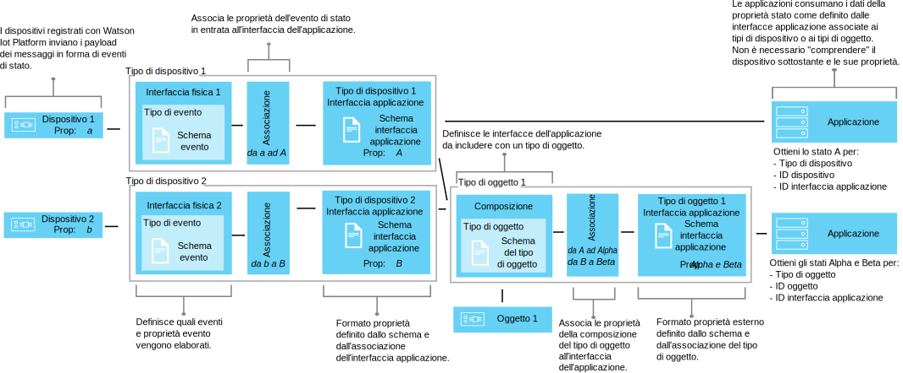

---

copyright:
years: 2016, 2017
lastupdated: "2017-04-10"

---

{:new_window: target="\_blank"}
{:shortdesc: .shortdesc}
{:screen: .screen}
{:codeblock: .codeblock}
{:pre: .pre}

# Utilizzo delle interfacce per associare i dati dispositivo (Beta)
{: #im_index}

Le interfacce dell'applicazione estendono il concetto di [tipo dispositivo](#resources) per controllare meglio i dati che transitano tramite {{site.data.keyword.iot_short_notm}} e per fornire una vista non dipendente dai dispositivi dei dati IoT.
{:shortdesc}.

**Importante:** la funzione di associazione dell'interfaccia è una funzione beta. Gli aggiornamenti beta in corso così come la release finale potrebbero includere delle modifiche non compatibili con la versione corrente. È caldamente consigliato che le funzioni beta non siano utilizzate nelle applicazioni di produzione fino alla release finale. Per ricevere informazioni aggiuntive e fornire il feedback per questa beta, puoi [registrarti al programma beta di gestione delle informazioni ](https://www.ibm.com/software/support/trial/cst/forms/nomination.wss?id=7050){:new_window}.

## Panoramica
{: #overview}

Utilizza le interfacce dell'applicazione per creare astrazioni condivise di dispositivi e oggetti per migliorare riutilizzo e manutenzione e per gestire le complessità di un ecosistema IoT mantenendo al tempo stesso l'applicazione isolata dalla modifica dei dati. Le interfacce dell'applicazione sono disgiunte dalla variabilità nei dati di messaggio che i dispositivi comunicano a {{site.data.keyword.iot_short_notm}}.

Mediante le interfacce dell'applicazione, le applicazioni possono accedere allo stato corretto di dispositivi e oggetti. Lo stato consiste in una serie di proprietà di stato definite dall'interfaccia dell'applicazione. Man mano che i dispositivi inviano gli eventi di modifica di stato, i valori più recenti di queste proprietà sono memorizzati in {{site.data.keyword.iot_short_notm}} e sono resi disponibili all'applicazione su richiesta utilizzando una API HTTP.

Utilizzando le interfacce dell'applicazione, puoi:
- Associare le proprietà di stato ai dati di messaggio di evento
- Definire la struttura di dati che preferisci
- Definire più di una rappresentazione o vista dello stato del dispositivo
- Sottoscrivere gli stati del dispositivo o eseguirne query in qualsiasi momento tramite una API HTTP

Alcuni casi d'uso comuni per le interfacce dell'applicazione includono:
- Fornire agli sviluppatori di applicazioni delle interfacce congruenti per accedere ai dati dei dispositivi controllati dagli eventi in un modo simile a REST.
- Normalizzare i dati dai dispositivi di fabbricazioni o modelli diversi che pubblicano i dati in formati differenti.
- Combinare i dati di evento da diversi tipi di dispositivo differenti per modellare qualsiasi specifico oggetto IoT.
- Modificare e convertire i formati di dati per adattarli al tuo modello di applicazione.  

Per la documentazione API delle interfacce (beta), vedi
[API REST HTTP {{site.data.keyword.iot_short_notm}}  ](https://docs.internetofthings.ibmcloud.com/apis/swagger/v0002-beta/info-mgmt-beta.html){: new_window}.   

## Esempi
{: #examples}
I seguenti esempi di interfaccia illustrano due possibili soluzioni.

### Esempio 1: associazione di sensori di temperatura eterogenei a un'interfaccia dell'applicazione
{: #device-type-example}
In questo esempio, creiamo un'interfaccia dell'applicazione che fornisce dei dati di stato della temperatura omogenei in un singolo formato, indipendentemente dal formato del payload del messaggio di evento di dispositivo effettivo. TemperatureSensor1 pubblica una lettura della temperatura in Celsius di `{ "t" : 34.5 }` su {{site.data.keyword.iot_short_notm}}. TemperatureSensor2 pubblica una lettura della temperatura Fahrenheit di `{ "temp" : 72.55 }`. Le letture della temperatura sono pubblicate come eventi separati.

Per uno scenario end-to-end dettagliato che descrive questo esempio, vedi [Scenario di interfaccia dell'applicazione 1](im_index_scenario.html).

Come parte del flusso di dati dell'interfaccia dell'applicazione, puoi eseguire dei calcoli sui dati in entrata per normalizzare queste letture in un formato congruente per l'elaborazione. Questo significa che non hai bisogno di scrivere la tua applicazione per comprendere o convertire diverse scale di temperatura. L'applicazione riceve un singolo stato normalizzato e utilizza la proprietà di stato **temperature** invece delle proprietà **t** e **temp** specifiche per il dispositivo.

### Esempio 2: associazione di più dispositivi climatici a un'interfaccia dell'applicazione di tipo oggetto
{: #thing-type-example}  
In questo esempio, espandiamo un esempio di tipo dispositivo aggiungendo una serie di sensori di umidità sotto forma di dispositivi igrometro separati. Utilizzando un'interfaccia dell'applicazione di tipo oggetto, possiamo unire senza problemi i dati da tipi di dispositivi separati in una singola interfaccia dell'applicazione che rappresenta tutti i dispositivi e tutti i sensori in una stanza. Un'applicazione può ora ottenere i dati climatici raccolti da una stanza stabilendo una connessione all'interfaccia dell'applicazione di tipo oggetto della stanza.

Per uno scenario end-to-end dettagliato che descrive questo esempio, vedi [Scenario di interfaccia dell'applicazione 2](im_index_scenario_thing.html).

Il sensore di temperatura 1 e il sensore di umidità 3 pubblicano i dati ambientali raccolti nella sala R1. I dati dei sensori di temperatura e umidità sono associati separatamente a due interfacce dell'applicazione di tipo dispositivo, uno per il tipo dispositivo termometro e uno per il tipo dispositivo igrometro come da esempio precedente. Creiamo ora un tipo di oggetto denominato Room e avviamo due istanze di oggetto stanza (R1 e R2).

Ora possiamo configurare una composizione che include le interfacce dell'applicazione termometro e igrometro e associamo quindi i sensori ambientali corretti a ciascuna delle istanze di stanza, ad esempio D1 e D3 associati a R1. L'applicazione utente finale può ora richiedere lo stato di uno specifico ID oggetto stanza e ottenere gli stati di temperatura ed umidità della stanza senza dover conoscere l'infrastruttura dispositivo sottostante.

## Definizioni e risorse
{: #resources}

Il seguente diagramma illustra l'associazione logica tra dispositivi e applicazioni su {{site.data.keyword.iot_short_notm}} quando si utilizzano le interfacce dell'applicazione.

### Concetti

Concetti                        | Descrizione       
------------- | ------------- | -------------  
Evento | Gli eventi sono meccanismi con cui i dispositivi pubblicano i dati in {{site.data.keyword.iot_short_notm}}. Il dispositivo controlla il contenuto dell'evento e assegna un nome ad ogni evento che invia.
Proprietà | Dati che trasportano parte di un payload di evento di dispositivo.
Stato | Il valore più recente di una proprietà di stato associata.
Composizione                         | Un costrutto logico che definisce le interfacce dell'associazione associate a un tipo oggetto. La composizione è specificata da uno schema di tipo oggetto.   

### Risorse di gestione delle informazioni
Puoi gestire le risorse utilizzando le API REST. Per informazioni sulle API REST, consulta la [Documentazione {{site.data.keyword.iot_short_notm}} HTTP REST API](https://docs.internetofthings.ibmcloud.com/swagger/info-mgmt-beta.html).

Risorse tipo                        | Descrizione       
------------- | ------------- | -------------  
Tipo di evento                         | Un costrutto programmatico che connette un'interfaccia fisica a uno schema evento.  **Importante:** per la beta, tutti gli eventi in entrata da utilizzare in un'interfaccia dell'applicazione devono essere in formato JSON.   
Tipo dispositivo                         |  Un costrutto programmatico che consente di raggruppare i dispositivi che condividono caratteristiche o modalità di funzionamento. Nell'associazione dell'interfaccia, il tipo di evento viene esteso per includere una singola interfaccia fisica per un dispositivo e una o più interfacce dell'applicazione che vengono utilizzate per recuperare lo stato del dispositivo.  Per ulteriori informazioni, consulta la sezione "Tipi di dispositivo e identificativi" nell'argomento [Modello del dispositivo](../reference/device_model.html#id_and_device_types).
Tipo di oggetto                         | Un costrutto programmatico che rappresenta una raccolta di uno o più tipi dispositivo separati, tipi oggetto o entrambi.  **Importante:** la beta supporta tre livelli di nidificazione dell'interfaccia dell'applicazione di tipo oggetto.
Risorse di schema                         |  Costrutti programmatici che definiscono la struttura di dati delle interfacce fisiche di tipo dispositivo, la composizione di tipo oggetto e le interfacce dell'applicazione in uscita. Vengono utilizzati i seguenti [schemi JSON ](http://json-schema.org/){:new_window}: <ul><li>Gli *schemi evento* definiscono la struttura degli eventi pubblicati su {{site.data.keyword.iot_short_notm}} da un dispositivo. Ogni schema dell'evento definisce la struttura di un evento in entrata e viene associato con un tipo di evento. <li>Gli *schemi di tipo oggetto* definiscono le interfacce dell'applicazione che fungono da fonti di input in base a un tipo di oggetto. Ogni schema di tipo oggetto definisce la struttura di una o più interfacce dell'applicazione di tipo oggetto.<li>Gli *schemi dell'interfaccia dell'applicazione* definiscono la struttura dello [stato dispositivo](#key_concepts) memorizzato su {{site.data.keyword.iot_short_notm}}</ul>.

Risorse di interfaccia                        | Descrizione       
------------- | ------------- | -------------  
Interfaccia applicazione | Un costrutto programmatico che a cui le applicazioni possono connettersi, o che possono sottoscrivere, per appurare lo stato di un dispositivo o di un oggetto. L'interfaccia dell'applicazione è definita da uno schema dell'interfaccia dell'applicazione che definisce la forma della struttura dei dati di stato memorizzati come stato dispositivo od oggetto. Lo stato viene aggiornato in risposta ad eventi di stato in entrata. Un'interfaccia dell'applicazione associata a un tipo dispositivo può avere una singola interfaccia fisica come input. Un'interfaccia dell'applicazione associata a un tipo oggetto può avere una o più interfacce dell'applicazione come input.

Risorse di istanza                        | Descrizione       
------------- | ------------- | -------------  
Dispositivo                         | Un costrutto programmatico che rappresenta un asset, un sistema o un componente registrato presso {{site.data.keyword.iot_short_notm}} e invia i dati IoT sotto forma di eventi.  
Cosa                         | Un costrutto programmatico che rappresenta logicamente un'istanza univoca di un tipo oggetto. Un'istanza oggetto ha lo stesso scopo di un dispositivo registrato di un tipo dispositivo.

Risorse di supporto                        | Descrizione       
------------- | ------------- | -------------  
Interfaccia fisica                         | Un costrutto programmatico che definisce i tipi evento e le proprietà dispositivo associate che vengono associate a un singolo tipo dispositivo che è associato a uno o più tipi evento. L'interfaccia fisica è definita dagli schemi evento.   
Associazioni                         | Un costrutto programmatico che definisce in che modo le proprietà associate agli eventi in entrata sono associati alle proprietà definisce su un'interfaccia dell'applicazione.  **Importante:** deve essere associata almeno un'interfaccia con un tipo dispositivo prima che possa essere definita un'associazione.

## Flusso di lavoro di elevato livello
{: #workflow}

Utilizza la seguente procedura come supporto per la configurazione delle risorse di cui hai bisogno per iniziare l'associazione dei tuo i dati del dispositivo utilizzando le interfacce.

Per i dettagli sull'API, consulta la documentazione [{{site.data.keyword.iot_short_notm}} HTTP REST API ](https://docs.internetofthings.ibmcloud.com/swagger/info-mgmt-beta.html){:new_window}.

**Suggerimento:** per informazioni più dettagliate su ciascuno dei passi, vedi gli scenari di esempio oppure utilizza i link per andare direttamente a uno specifico passo nello scenario di esempio. Lo [scenario di esempio 1](im_index_scenario.html#scenario) descrive i passi per creare un'interfaccia dell'applicazione di tipo dispositivo per dispositivi termometro eterogenei e lo [scenario di esempio 2](im_index_scenario_thing.html#scenario) sviluppa ulteriormente il concetto descrivendo come creare un'interfaccia dell'applicazione che ti consente di utilizzare i dati da due diversi tipi di dispositivo climatico uniti in un oggetto di tipo stanza.

Il processo per creare e consumare interfacce dell'applicazione può presentare delle differenze se stati creando un'interfaccia dell'applicazione associata a un tipo dispositivo o a un tipo oggetto.

### Prima di cominciare
Per creare un'interfaccia dell'applicazione associata a un tipo dispositivo, devi disporre [almeno di un dispositivo registrato presso {{site.data.keyword.iot_short_notm}}](im_index_scenario.html#step14) e che invia eventi con proprietà di stato.  
Per creare un'interfaccia dell'applicazione associata a un tipo oggetto, devi disporre di almeno un'interfaccia dell'applicazione associata a un tipo dispositivo creato.

### Passi

1. 	Definisci le proprietà di stato in entrata.  
Definisci innanzitutto le proprietà di stato in entrata che vuoi che la tua interfaccia dell'applicazione renda disponibile alle tue applicazioni.  
A seconda dell'interfaccia dell'applicazione che stai creando, procedi in uno dei due modi di seguito indicati:
<dl>
<dt>Tipo dispositivo: crea un'interfaccia fisica.</dt>
<dd>
<ol>
<li>[Crea un file di schema di evento](im_index_scenario.html#step1). Il file dello schema evento è un file .JSON locale che definisce la struttura e il formato di un evento in entrata.
<li>[Crea una risorsa dello schema evento per il tuo tipo evento](im_index_scenario.html#step2). La risorsa dello schema evento è n costrutto programmatico utilizzato da {{site.data.keyword.iot_short_notm}}.
<li>[Crea un tipo evento che fa riferimento allo schema evento](im_index_scenario.html#step3). Il tipo evento viene utilizzato da {{site.data.keyword.iot_short_notm}} per associare una o più risorse dello schema evento a un'interfaccia fisica.
<li>[Crea un'interfaccia fisica](im_index_scenario.html#step7).
<li>[Aggiungi il tipo evento all'interfaccia fisica](im_index_scenario.html#step8).
<li>[Aggiungi la tua interfaccia fisica al tuo tipo dispositivo](im_index_scenario.html#step9).
</ol>
</dd>
<dt>Tipo oggetto: definisci una composizione.</dt>
<dd>
<ol>
<li>[Crea un file di schema composizione.](im_index_scenario_thing.html#crt_composition_file).  
Un file di schema di composizione di tipo oggetto è un file .JSON locale che definisce la composizione del tipo oggetto puntando alle interfacce dell'applicazione esistenti.
<li>[Crea la risorsa di schema di composizione](im_index_scenario_thing.html#crt_composition_resource).  
Carica il file .JSON locale su {{site.data.keyword.iot_short_notm}}.
<li>[Crea un tipo oggetto](im_index_scenario_thing.html#crt_thing_type).   Un tipo oggetto ha lo stesso scopo di un tipo dispositivo per il fatto che rappresenta una classe di oggetti.
</ol>
</dd>
</dl>
4. 	Crea l'interfaccia dell'applicazione.
 1. 	Crea un file di schema dell'interfaccia dell'applicazione per il [tipo dispositivo](im_index_scenario.html#step4) o il [tipo oggetto](im_index_scenario_thing.html#crt_ai_schema_file).  
Un file di schema dell'interfaccia dell'applicazione è un file .JSON locale che definisce lo stato del dispositivo reso disponibile alle tue applicazioni.
 2. 	Crea una risorsa di schema dell'interfaccia dell'applicazione per il [tipo dispositivo](im_index_scenario.html#step5) o il [tipo oggetto](im_index_scenario_thing.html#crt_ai_schema_resource).
 3.	Crea un'interfaccia dell'applicazione per il [tipo dispositivo](im_index_scenario.html#step6) o il [tipo oggetto](im_index_scenario_thing.html#crt_thing_ai).
 4.	Aggiungi l'interfaccia dell'applicazione al [tipo dispositivo](im_index_scenario.html#step10) o al [tipo oggetto](im_index_scenario_thing.html#add_thing_ai).
5. 	Definisci le associazioni per il [tipo dispositivo](im_index_scenario.html#step11) o il [tipo oggetto](im_index_scenario_thing.html#define_Thing_type_mappings).   
Associazioni per associare le proprietà in entrata alle proprietà nell'interfaccia dell'applicazione
6. 	Distribuisci la configurazione associata al [tipo dispositivo](im_index_scenario.html#step15) o al [tipo oggetto](im_index_scenario_thing.html#deploy_Thing_config).
7. 	**Tipo oggetto: ** [Crea un'istanza di tipo oggetto](im_index_scenario_thing.html#create_Thing_instances).
8. 	Controlla lo stato degli aggiornamenti di [dispositivo](im_index_scenario.html#step13) od  [oggetto](im_index_scenario_thing.html#verify_Thing_state).  
Verifica che le tue sottoscrizioni mostrino i dati dispositivo aggiornati oppure che siano restituiti i dati dispositivo aggiornai utilizzando una chiamata REST.
