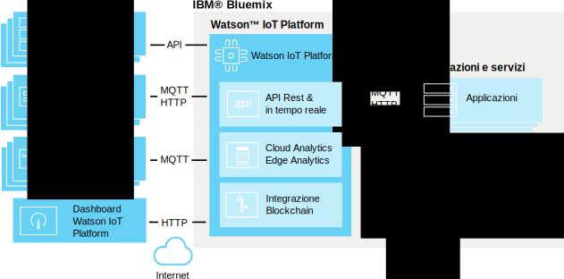

---

copyright:
  years: 2016, 2017
lastupdated: "2017-02-3"

---

{:new_window: target="\_blank"}
{:shortdesc: .shortdesc}
{:screen: .screen}
{:codeblock: .codeblock}
{:pre: .pre}

# Informazioni su {{site.data.keyword.iot_short_notm}}
{: #about_iotplatform}

{{site.data.keyword.iot_full}} fornisce l'accesso all'applicazione potente per i dati e i dispositivi IoT per aiutarti a comporre rapidamente le applicazioni di analisi, i dashboard di visualizzazione e le applicazioni IoT mobili.
{:shortdesc}

{{site.data.keyword.iot_short_notm}} ti consente di eseguire operazioni di gestione del dispositivo potenti e di archiviare e accedere ai dati del dispositivo, collegare una grande varietà di dispositivi e di dispositivi gateway. {{site.data.keyword.iot_short_notm}} fornisce la comunicazione sicura da e per i tuoi dispositivi utilizzando MQTT e TLS.

## Architettura di {{site.data.keyword.iot_short_notm}}
{: #watsoniotplatform_architecture}

**Importante:** le funzioni di analisi vengono unite dal servizio {{site.data.keyword.iotrtinsights_full}} Se la tua organizzazione {{site.data.keyword.iot_short_notm}} viene utilizzata come origine dati per un'istanza {{site.data.keyword.iotrtinsights_short}} esistente, Cloud and Edge Analytics non è abilitato finché non siano state migrate le istanze {{site.data.keyword.iotrtinsights_short}} esistenti. Continuare ad utilizzare il dashboard {{site.data.keyword.iotrtinsights_short}} per le tue analisi finché non viene completata la migrazione. Per ulteriori informazioni, consulta il blog [IBM Watson IoT Platform ](https://developer.ibm.com/iotplatform/2016/04/28/iot-real-time-insights-and-watson-iot-platform-a-match-made-in-heaven/){: new_window} in IBM developerWorks e i tuoi dashboard dell'istanza {{site.data.keyword.iotrtinsights_short}} esistenti.  

{{site.data.keyword.iot_short_notm}} comunica con le tue applicazioni e dispositivi utilizzando l'API {{site.data.keyword.iot_short_notm}} e il protocollo di messaggistica {{site.data.keyword.iot_short_notm}}. Il dashboard {{site.data.keyword.iot_short_notm}} si collega a un'interfaccia utente di front-end per semplificare le operazioni nella piattaforma. I dati del dispositivo possono essere archiviati o utilizzati con le soluzioni di analisi.

## Concetti importanti in {{site.data.keyword.iot_short_notm}}
{: #watsoniotplatform_importantconcepts}

### Organizzazioni

Quando ti registri con {{site.data.keyword.iot_short_notm}}, ti viene fornito un ID dell'organizzazione. Il tuo ID dell'organizzazione è un identificativo a sei caratteri univoco per il tuo account. Le organizzazioni assicurano che è possibile accedere ai tuoi dati soltanto dai tuoi dispositivi e applicazioni. Dopo la registrazione, i dispositivi e le chiavi API vengono associati a una sola organizzazione. Quando un'applicazione si collega al servizio utilizzando una chiave API, sarà registrata nell'organizzazione associata alla chiave API utilizzata.

Per la tua sicurezza, è impossibile la comunicazione tra le organizzazioni. L'unico modo per trasmettere dati tra due organizzazioni è di creare un'applicazione in ognuna delle organizzazioni che comunicherà con le applicazioni in altre organizzazioni.

### Dispositivi

Un'unità può essere qualsiasi cosa che dispone di una connessione a internet e che può trasmettere i dati nel cloud. Tuttavia, i dispositivi non possono comunicare direttamente con altri dispositivi, invece i dispositivi accettano i comandi dalle applicazioni e inviano gli eventi alle applicazioni. I dispositivi in {{site.data.keyword.iot_short_notm}} sono identificati da un token di autenticazione univoco. I dispositivi devono essere registrati prima di potersi collegare a {{site.data.keyword.iot_short_notm}}.

{{site.data.keyword.iot_short_notm}} riconosce due classi di dispositivo; **dispositivi gestiti** e **dispositivi non gestiti**.

**Dispositivi gestiti** sono definiti come dispositivi che contengono un agent di gestione del dispositivo. Un agent di gestione del dispositivo è un insieme di logica che consente al dispositivo di interagire con il servizio di gestione del dispositivo {{site.data.keyword.iot_short_notm}} utilizzando il protocollo di gestione del dispositivo. I dispositivi gestiti possono eseguire operazioni di gestione del dispositivo inclusi gli aggiornamenti dell'ubicazione, gli scaricamenti e gli aggiornamenti del firmware, i riavvi e le reimpostazioni dei valori predefiniti.

**Dispositivi non gestiti** sono tutti i dispositivi senza un agent di gestione del dispositivo. I dispositivi non gestiti possono collegarsi a {{site.data.keyword.iot_short_notm}} e inviare e ricevere gli eventi e i comandi, ma non possono inviare le richieste di gestione del dispositivo o eseguire le operazioni di gestione del dispositivo.

### Gateway

I gateway sono dispositivi specializzati che dispongono delle funzionalità combinate di un'applicazione e di un dispositivo, che gli permette di funzionare come punti di accesso per altri dispositivi. I dispositivi che non possono collegarsi direttamente a internet possono accedere al servizio {{site.data.keyword.iot_short_notm}} collegandosi prima a un dispositivo gateway.

I gateway devono essere registrati prima di potersi collegare al servizio.

### Applicazioni

Un'applicazione può essere qualsiasi cosa che dispone di una connessione a internet e che interagisce con i dati dai dispositivi e che controlla il comportamento di tali dispositivi. Le applicazioni si identificano con {{site.data.keyword.iot_short_notm}} utilizzando una chiave API e un ID dell'applicazione univoco. A differenza dei dispositivi, le applicazioni individuali non devono registrarsi prima di poter stabilire una connessione a {{site.data.keyword.iot_short_notm}}. Tuttavia, devono utilizzare una chiave API valida che è stata precedentemente registrata.

### Eventi

Gli eventi sono meccanismi con cui i dispositivi pubblicano i dati in {{site.data.keyword.iot_short_notm}}. I dispositivi controllane il contenuto dei loro messaggi e assegnano un nome per ogni evento che viene inviato. {{site.data.keyword.iot_short_notm}} utilizza le credenziali allegate ad ogni evento ricevuto per determinare quale dispositivo ha inviato l'evento. Questa architetture impedisce ai dispositivi di impersonarne altri.

Le applicazioni possono elaborare gli eventi in tempo reale e visualizzare l'origine dell'evento e i dati contenuti nell'evento. Le applicazioni devono essere configurate per definire a quali eventi e dispositivi sottoscriversi.

### Comandi

I comandi sono un meccanismo tramite cui le applicazioni comunicano con i dispositivi. Solo le applicazioni possono inviare i comandi e i comandi vengono inviati a dispositivi specifici. Il dispositivo deve determinare quale azione intraprendere alla ricezione di ogni comando. I dispositivi possono essere progettati per elencare tutti i comandi o per sottoscriversi a un elenco di comandi specificato.
