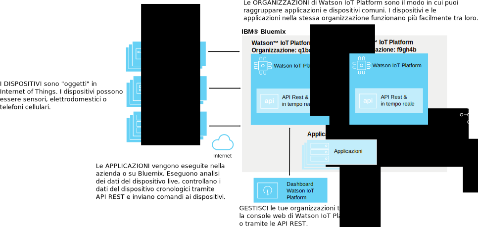
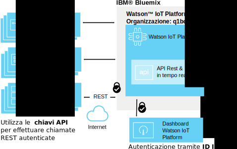
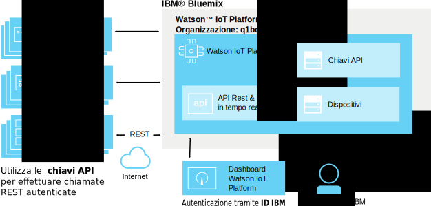
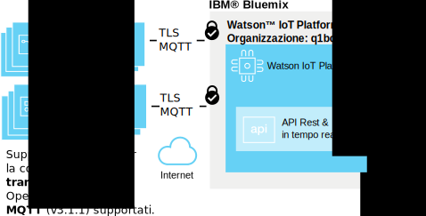
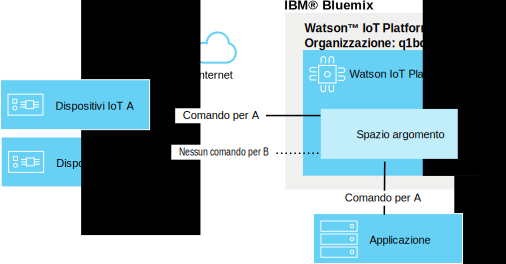
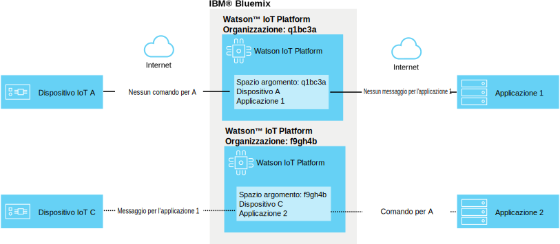

---

copyright:
  years: 2016, 2017
lastupdated: "2017-03-17"

---

{:new_window: target="blank"}
{:shortdesc: .shortdesc}
{:screen: .screen}
{:codeblock: .codeblock}
{:pre: .pre}

# {{site.data.keyword.iot_short_notm}} security
{: #sec-index}

Come un servizio ospitato sul cloud {{site.data.keyword.iot_full}} incorpora la sicurezza come aspetto importante della sua architettura.
{: shortdesc}

Il seguente documento delle risposte a domande comuni su come i dati della tua organizzazione vengono protetti, si focalizza su aree specifiche:

* Conformità: standard esterni che impostano i riferimenti per la sicurezza.
* Autenticazione: assicura l'identità degli utenti, dei dispositivi o delle applicazioni che stanno tentando di accedere alle informazioni della tua organizzazione.
* Autorizzazione: il servizio si accerta che utenti, dispositivi e applicazioni abbiano l'autorizzazione per accedere alle informazioni della propria organizzazione.
* Codifica: assicura che i dati siano leggibili solo dalle parti autorizzate e non possano essere intercettati.

## {{site.data.keyword.iot_short_notm}} e {{site.data.keyword.Bluemix_notm}}
{: #iot-bluemix-sec}

{{site.data.keyword.iot_short_notm}} viene eseguito nella piattaforma {{site.data.keyword.Bluemix_notm}} e quindi si basa su {{site.data.keyword.Bluemix_notm}} e {{site.data.keyword.BluSoftlayer_full}} per l'accesso e la connettività. La dipendenza da {{site.data.keyword.Bluemix_notm}} e {{site.data.keyword.BluSoftlayer}} rende la sicurezza e l'affidabilità di {{site.data.keyword.Bluemix_notm}} e {{site.data.keyword.BluSoftlayer}} importante per gli utenti di {{site.data.keyword.iot_short_notm}}

Per ulteriori dettagli sulla sicurezza di {{site.data.keyword.Bluemix_notm}}, consulta [{{site.data.keyword.Bluemix_notm}} platform security](index.html#platform-security).

## {{site.data.keyword.iot_short_notm}} Conformità di sicurezza
{: #compliance}  
   
{{site.data.keyword.iot_short_notm}} è certificato con lo standard International Organization for Standardization (ISO) 27001, che definisce le procedure consigliate per i processi di gestione della sicurezza delle informazioni. Lo standard ISO 27001 specifica i requisiti per stabilire, implementare e documentare i sistemi di gestione della sicurezza delle informazioni (ISMS) e i requisiti per applicare dei controlli di sicurezza in base alle esigenze delle singole organizzazioni. L'insieme di standard ISO 27000 incorpora un processo di ridimensionamento del rischio e valutazione delle risorse, con l'obiettivo di salvaguardare la riservatezza, l'integrità e la disponibilità delle informazioni scritte, orali ed elettroniche.

{{site.data.keyword.iot_short_notm}} è controllato da una società di sicurezza di terze parti e rispetta tutti i requisiti per l'ISO 27001: {{site.data.keyword.iot_short_notm}} ISO 27001:2013 Certificate of Registration.

## {{site.data.keyword.iot_short_notm}} Terminologia
{: #terminology}

## Come rendiamo sicura la gestione delle informazioni di IoT nella tua organizzazione?
{: #secure-org}

Le API REST e la GUI basate sul browser sono antecedute da HTTPS, che è un certificato firmato da DigiCert, in questo modo puoi controllare che ti stai collegando al genuino {{site.data.keyword.iot_short_notm}}. L'accesso della GUI basata sul web viene autenticato dal tuo ID IBM o {{site.data.keyword.Bluemix_notm}} {{site.data.keyword.ssoshort}}. L'utilizzo dell'API RST richiede una chiave API, generata tramite la GUI, puoi utilizzarla per autenticare le chiamate API REST nella tua organizzazione.

## Come proteggiamo le credenziali di dispositivi e applicazioni?
{: #secure-credentials}

Quando i dispositivi vengono registrati o le chiavi API generate, il token di autenticazione viene distribuito in modo casuale. Questo significa che le credenziali della tua organizzazione non possono mai essere ripristinate dai nostri sistemi - anche nel caso spiacevole che sia compromesso {{site.data.keyword.iot_short_notm}}.

Le credenziali del dispositivo e le chiavi API possono essere revocate individualmente se sono compromesse.

## Come assicuriamo che i tuoi dispositivi siano collegati in modo sicuro a {{site.data.keyword.iot_short_notm}}?
{: #secure-device-connection}

I dispositivi si collegano utilizzando un ID client o il token di autenticazione o entrambi, generati quando sono stati aggiunti alla tua piattaforma. MQTT viene utilizzato per consentire l'interoperabilità semplice per molte piattaforme e linguaggi. {{site.data.keyword.iot_short_notm}} supporta la connettività su TLS v1.2.

Per ulteriori informazioni sui requisiti della suite chipher e TLS, consulta la sezione [TLS requirements](connect_devices_apps_gw.html#tls_requirements)  nella documentazione `Application, device, and gateway connections to Watson IoT Platform`.

Puoi utilizzare i certificati e le politiche di sicurezza per migliorare la sicurezza della connessione del dispositivo. Le politiche di sicurezza possono essre impostate per consentire le connessioni non crittografate, per definire solo le connessioni TLS (transport layer security) e per consentire ai dispositivi di autenticarsi con i certificati lato client. È possibile utilizzare le blacklist per specificare i dispositivi a cui non è consentito collegarsi o le whitelist che possono essere utilizzate per consentire il collegamento a dispositivi specifici. Per ulteriori informazioni sulla sicurezza avanzata, vedi [Gestione della sicurezza e del rischio](RM_security.html).

## Come preveniamo la perdita dei dati tra i dispositivi IoT?
{: #prevent-leak-devices}

Il servizio utilizza schemi di messaggistica sicuri. Una volta autenticati, i dispositivi sono autorizzati solo alla pubblicazione e alla sottoscrizione in uno spazio argomenti limitato:

* '/iot-2/evt/<event_id>/fmt/<format_string>'
* '/iot-2/cmd/<command_id>/fmt/<format_string>'

Tutti i dispositivi operano con lo stesso spazio argomenti. Le credenziali di autenticazione fornite dal client determinano a quale dispositivo è destinato questo spazio dell'argomento da {{site.data.keyword.iot_short_notm}}.  Ciò impedisce ai dispositivi di poter impersonare un altro dispositivo.

L'unico modo per impersonare un altro dispositivo consiste nell'ottenere le credenziali di sicurezza compromesse per il dispositivo.

Le applicazioni possono sottoscrivere e pubblicare su argomenti comandi e eventi per tutti i dispositivi nell'organizzazione. Le applicazioni possono analizzare i dati da molti dispositivi contemporaneamente e possono anche simulare o utilizzare un proxy per i dispositivi in aggiunta alla creazione del lato complementare di un loop di comunicazione full duplex.

## Come preveniamo la perdita dei dati IoT tra le organizzazioni?
{: #prevent-leak-org}

Lo spazio argomenti in cui operano i dispositivi e le applicazioni ha come ambito una singola organizzazione. Quando autenticato, {{site.data.keyword.iot_short_notm}} trasforma la struttura dell'argomento utilizzando un ID dell'organizzazione basato sull'autenticazione client, rendendo impossibile l'accesso ai dati di un'organizzazione da parte di un'altra.

# Link correlati
{: #rellinks}
## Link correlati
{: #general}
* [Introduzione a {{site.data.keyword.iot_short_notm}}](https://console.ng.bluemix.net/docs/services/IoT/index.html)
* [{{site.data.keyword.Bluemix_notm}} security ](https://console.ng.bluemix.net/docs/security/index.html#security){:new_window}
* [{{site.data.keyword.Bluemix_notm}} platform security ](https://console.ng.bluemix.net/docs/security/index.html#platform-security){:new_window}
* [{{site.data.keyword.Bluemix_notm}} compliance](https://console.ng.bluemix.net/docs/security/index.html#compliance){:new_window}
* [{{site.data.keyword.BluSoftlayer}} security ](http://www.softlayer.com/security){:new_window}
* [{{site.data.keyword.BluSoftlayer}} compliance ](http://www.softlayer.com/compliance){:new_window}
