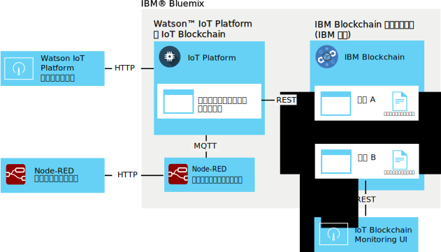

---

copyright:
  years: 2016, 2017
lastupdated: "2017-02-17"

---

{:new_window: target="\_blank"}
{:shortdesc: .shortdesc}
{:screen: .screen}
{:codeblock: .codeblock}
{:pre: .pre}

# {{site.data.keyword.iot_short_notm}} ブロック・チェーン統合
{: #gettingstartedtemplate}

{{site.data.keyword.iot_short_notm}} ブロック・チェーン統合を採用すると、IoT デバイスがブロック・チェーンのトランザクションにデータを提供できるようになるので、ブロック・チェーンの変更不能な台帳にデータが格納され、ブロック・チェーンのスマート・コントラクトに実装されたビジネス・ルールで使用することができます。
{:shortdesc}

このプラットフォームは、ネイティブの MQTT 形式のデバイス・データを受け取ると、それをブロック・チェーンのスマート・コントラクトで必要なデータ・フォーマットにマップし、それをブロック・チェーン・ファブリックに渡して、ブロック・チェーン台帳に格納されるようにします。ブロック・チェーン・ファブリックとは、{{site.data.keyword.blockchainfull}} と Hyperledger のインスタンスを構成する、ピアと証明ノードの集合です。

## ブロック・チェーン統合アーキテクチャー  
{: #architecture}

一般的な {{site.data.keyword.iot_short_notm}} ブロック・チェーン統合環境は、次のコンポーネントで構成されます。
- ブロック・チェーン台帳に書き込むデータを生成する 1 つ以上のデバイス。
- {{site.data.keyword.Bluemix_notm}} 組織:
 - IoT ブロック・チェーン統合が有効な状態の {{site.data.keyword.iot_short_notm}} サービス。
 - 1 つ以上のスマート・コントラクトがデプロイされた {{site.data.keyword.blockchainfull_notm}} または Hyperledger のファブリック。
- ローカル環境:
 - IoT Blockchain Monitoring UI

スマート・コントラクトを作成してデプロイするための拡張環境のセットアップと要件については、[{{site.data.keyword.iot_short_notm}} ブロック・チェーン統合のスマート・コントラクトの作成](blockchain/dev_blockchain.html)を参照してください。  

次の図は、一般的な {{site.data.keyword.iot_short_notm}} ブロック・チェーン統合環境を示しています。

## 始めに
{: #byb}

- {{site.data.keyword.iot_short_notm}} の概要、一般的なブロック・チェーンの概念との関連性、使用する利点について、IBM.com の [{{site.data.keyword.iot_short_notm}} ](http://www.ibm.com/blockchain/){: new_window} で確認します。
- [{{site.data.keyword.iot_short_notm}} ブロック・チェーン統合](reference/extensions/index.html#blockchain)を組織のために有効にします。
- ブロック・チェーン台帳に書き込むデータを生成するデバイスを接続します。
  
[デバイスの接続](iotplatform_task.html)トピックの手順に従って、デバイスを接続します。
- Monitoring UI をインストールします。
Monitoring UI は、{{site.data.keyword.iot_short_notm}} とブロック・チェーン・ファブリックの間の接続を確認するために使用します。[Blockchain Monitoring UI ](https://github.com/ibm-watson-iot/blockchain-samples/tree/master/applications/monitoring_ui){: new_window} GitHub ディレクトリーにある Monitoring UI の README ドキュメントの手順に従ってください。

### IBM の基本的なシナリオを使用してすぐに開始する

{{site.data.keyword.iot_short_notm}} ブロック・チェーン統合をすぐにテストしたいという場合は、IBM 提供のファブリックに接続し、Node-RED サンプル・デバイスを IBM 提供のサンプル・コントラクトにマップしてください。このトピックでは、このシナリオに必要な手順に『**IBM の基本的なシナリオ**』というラベルを付けています。  
**重要:** IBM 提供のサンプル・ブロック・チェーン台帳とそのすべてのデータは、サンプル・ブロック・チェーンのすべてのユーザーが閲覧できることに注意してください。IBM 提供のサンプル・ブロック・チェーンに機密情報を保管しないでください。また、サンプル・コントラクトとトレード・レーン・コントラクトをサポートするサンプル・ファブリックは、各ピアの接続情報を含め、変更されることがあります。接続の詳細については、Watson IoT ブロック・チェーン・コミュニティーの wiki ページ [IoT Blockchain Connection Info ](https://www.ibm.com/developerworks/community/wikis/home?lang=en#!/wiki/W7a44a0e604d9_4a90_89b7_0a2bdbe81b00/page/Blockchain%20Fabric%20Connections){: new_window} に記載されています。

IBM 提供の基本的な {{site.data.keyword.iot_short_notm}} ブロック・チェーン統合環境は、次のコンポーネントで構成されています。
- {{site.data.keyword.Bluemix_notm}}:
 - IoT ブロック・チェーン統合が有効な状態の {{site.data.keyword.iot_short_notm}} サービス
 - オプション: IoT デバイス・シミュレーターを実行する Node-RED アプリケーション
   
 **注:** デバイス・シミュレーターは、ローカルの Node-RED 環境にもデプロイできます。
- ローカル環境:
 - Node.js
 - IoT Blockchain Monitoring UI
- IBM 提供:
 - オプション: {{site.data.keyword.iot_short_notm}} ファブリック (シンプル・スマート・コントラクトがデプロイ済み)。

次のアーキテクチャー図は、このサンプル・シナリオに必要なコンポーネントを示しています。

**IBM の基本的なシナリオ:** [Node-RED デバイス・シミュレーターの作成と接続](nodereddevice_sample.html)トピックに記載されている手順に従って、Node-RED デバイス・シミュレーターを作成します。ブロック・チェーン統合を行う場合は、ノード・データをインポートするときにブロック・チェーン・デバイス固有のノード情報を使用します。ノード情報は、Watson IoT ブロック・チェーン・コミュニティーの wiki ページ [Node-RED Device Simulator ](https://www.ibm.com/developerworks/community/wikis/home?lang=en#!/wiki/W7a44a0e604d9_4a90_89b7_0a2bdbe81b00/page/Node-RED%20Device%20Simulator){: new_window} に記載されています。必要な場合は、IBM ブロック・チェーンの窓口に連絡してコミュニティーへのアクセス権限を取得してください。

## ブロック・チェーン・ファブリックへの接続
{: #getting_started}  
{{site.data.keyword.iot_short_notm}} ブロック・チェーン統合は有効になっているので、{{site.data.keyword.blockchainfull_notm}} または Linux Foundation Hyperledger でホストされるブロック・チェーン・ファブリックに接続できます。

ブロック・チェーン・ファブリックに接続するには、以下のようにします。
1. {{site.data.keyword.iot_short_notm}} ダッシュボードから、**「拡張」**を選択します。
2. **「拡張」**ページのブロック・チェーン・タイルで**「セットアップ」**をクリックします。
3. **「拡張」**ページのブロック・チェーン・タイルで**「セットアップ」**をクリックするか、またはファブリックが既にリンクされている場合には  をクリックして、ファブリック情報を入力します。
 1. **「ファブリック (Fabric)」**タブで、{{site.data.keyword.iot_short_notm}} で対象ファブリックを識別する名前を入力して、**「次へ」**をクリックします。   
 2. **「ピア (Peer)」**タブで、以下のようにピア情報を入力します。  
<table>
<thead>
<tr>
<th>パラメーター</th>
<th>値</th>
</tr>
</thead>
<tbody>
<tr>
<td>名前</td>
<td>{{site.data.keyword.iot_short_notm}} で対象ピアを識別する名前を入力します。</td>
</tr>
<tr>
<td>ホスト</td>
<td>検証ピア 1 サーバーの `api_host` アドレス</td>
</tr>
<tr>
<td>ポート</td>
<td>`api_port` 番号<ul><li>実装環境で TLS を使用しない場合は、ポート 80 を使用します。</li><li>実装環境で TLS を使用する場合は、ポート 443 を使用します。</li></ul></td>
</tr>
<tr>
<td>ユーザー ID</td>
<td>ブロック・チェーンにスマート・コントラクトを登録するときに使用したユーザーの `username` ストリング。後で Simple UI を構成するときにも、このユーザー ID を使用します。</td>
</tr>
<tr>
<td>秘密鍵</td>
<td>ユーザーの `secret` ストリング。</td>
</tr>
<tr>
<td>TLS の使用 (Use TLS)</td>
<td>オンまたはオフにします。 {{site.data.keyword.iot_short_notm}} とファブリックのコントラクトの間の通信を暗号化する場合は、Transport Layer Security を使用します。デフォルトのポート番号は、接続先のデプロイ済みの {{site.data.keyword.iot_short_notm}} インスタンスによって設定されます。</td>
</tr></tbody>
</table>  
 3. **「完了」**をクリックします。
3. ブロック・チェーン構成のセクションで**「完了」**をクリックしてファブリック情報を保存します。

**IBM の基本的なシナリオ:** IBM 提供のファブリックに接続するには、Watson IoT ブロック・チェーン・コミュニティーの wiki ページ [IoT Blockchain Connection Info ](https://www.ibm.com/developerworks/community/wikis/home?lang=en#!/wiki/W7a44a0e604d9_4a90_89b7_0a2bdbe81b00/page/Blockchain%20Fabric%20Connections){: new_window} に記載されているサンプル・コントラクトの接続詳細を使用してください。必要な場合は、IBM ブロック・チェーンの窓口に連絡してコミュニティーへのアクセス権限を取得してください。

## スマート・コントラクトへのデバイス・データのマップ
{: #map_device_properties}

デバイス・データをブロック・チェーン台帳に書き込むには、まず、デバイス・タイプのデバイス・プロパティーを、スマート・コントラクトで定義されているパラメーターにマップする必要があります。

デバイス・データをコントラクトにマップするには、次のようにします。
 1. {{site.data.keyword.iot_short_notm}} ダッシュボードから、サイド・バー・メニューにあるをクリックします。
 3. **「デバイス・データのマップ (Map Device Data)」**をクリックします。
 4. ブロック・チェーンにデバイス・データを保管するデバイス・タイプを選択します。
 5. 保管するイベントのイベント名を入力します。
   
 **ヒント:** サンプルの Node-RED ブロック・チェーン・デバイスのデフォルトのイベント名は obc です。デバイスのイベント・タイプを検索するには、{{site.data.keyword.iot_short_notm}} ダッシュボードで**「デバイス」**を選択し、デバイス名をクリックしてデバイスの詳細ページを開いてください。**「センサー情報」**セクションにスクロールダウンして、そのデバイスの使用可能なイベントとデータ・ポイントのリストを確認します。「Publish to IoT mqtt」出力ノードの「Topic」フィールドを更新して、Node-RED デバイスからパブリッシュするイベント名を変更できます。  
 6. **「次へ」**をクリックします。
 6. 作成済みのファブリック・インスタンスを選択します。
 7. コントラクト名とコントラクト ID を入力します。  
<table>
<thead>
<tr>
<th>パラメーター</th>
<th>コメント</th>
</tr>
</thead>
<tbody>
<tr>
<td>Contract name</td>
<td>{{site.data.keyword.iot_short_notm}} で対象コントラクトを識別するために使用する名前。</td>
</tr>
<tr>
<td>Contract ID</td>
<td>マップするコントラクトの 128 文字の固有 ID。  **重要:** マップするコントラクトは、少なくとも次のメソッドをサポートしている必要があります。
- updateAsset
- readAssetSchemas  </td>
</tr>
</tbody>
</table>
**IBM の基本的なシナリオ:** デプロイ済みのサンプル・スマート・コントラクトを使用すると、デバイスのデータ・ポイントを特定のコントラクト属性にマップして、データ・ポイント値をブロック・チェーン台帳に格納することができます。サンプル・コントラクトを使用してデバイスのデータ・マッピングをテストした後に、より高度なトレード・レーン・コントラクトを試したり、独自のコントラクトを作成したりできます。コントラクト ID は、Watson IoT ブロック・チェーン・コミュニティーの wiki ページ [IoT Blockchain Connection Info ](https://www.ibm.com/developerworks/community/wikis/home?lang=en#!/wiki/W7a44a0e604d9_4a90_89b7_0a2bdbe81b00/page/Blockchain%20Fabric%20Connections){: new_window} に記載されています。必要な場合は、IBM ブロック・チェーンの窓口に連絡してコミュニティーへのアクセス権限を取得してください。
 8. デバイス・プロパティーをコントラクト・パラメーターにマップするためのルートを作成します。
   
コントラクトで使用可能なパラメーターがインポートされます。パラメーターごとに、対応するイベント・プロパティーを入力します。
   
 **重要:** デバイス・メッセージのデータ・ポイントの前に付加される `d.` は含めないでください。
 **IBM の基本的なシナリオ:** IBM 提供のコントラクトを使用する場合は、Watson IoT ブロック・チェーン・コミュニティーの wiki ページ [Data mapping ](https://www.ibm.com/developerworks/community/wikis/home?lang=en#!/wiki/W7a44a0e604d9_4a90_89b7_0a2bdbe81b00/page/Data%20Mapping){: new_window} にリストされている以下のパラメーターをマップしてください。必要な場合は、IBM ブロック・チェーンの窓口に連絡してコミュニティーへのアクセス権限を取得してください。
 9. 要約ページで、すべての情報が正しく入力されたことを確認します。
 10. 「ブロック・チェーン」ページに、デバイス・データとコントラクトのマッピングが表示されます。

これで、準備が整いました。

## IBM 提供のサンプル・スマート・コントラクトのテスト実行
{: #test_simple}

IBM 提供のファブリックに接続し、デバイス・データをサンプル・コントラクトにマップしたら、デバイスからブロック・チェーン台帳へのエンドツーエンドのデータ・フローをテストすることができます。IoT Blockchain Monitoring UI を使用して、自分のアセットに関するブロック・チェーンのアクティビティーとデータを確認します。  
**ヒント:** Monitoring UI をまだローカル環境にインストールしていない場合は、このときにインストールすることができます。[Blockchain Monitoring UI ](https://github.com/ibm-watson-iot/blockchain-samples/tree/master/applications/monitoring_ui){: new_window} GitHub ディレクトリーにある Monitoring UI の README ドキュメントの手順に従ってください。  
1. {{site.data.keyword.iot_short_notm}} に接続するように Monitoring UI を構成します。  
Monitoring UI で、**「CONFIGURATION」**をクリックし、Monitoring UI 接続を構成します。
 <table>
<thead>
<tr>
<th>パラメーター</th>
<th>コメント</th>
</tr>
</thead>
<tbody>
<tr>
<td>API Host and Port</td>
<td>{{site.data.keyword.iot_short_notm}} REST API のホストとポート (前に `http://` を付加したもの)。`api_host` アドレスと `api_port` 番号を使用してください。</td>
</tr>
<tr>
<td>Chaincode ID</td>
<td>チェーン・コード ID は、コントラクト ID のエントリーに対応する 128 文字の英数字ストリングです。  
**重要:** チェーン・コード ID をカット・アンド・ペーストするときに、ID にスペースが含まれないようにしてください。ID の入力に誤りがあると、ブロック・チェーン台帳のエントリーは表示されますが、アセット検索機能が正常に動作しません。
</td>
</tr>
<tr>
<td>Secure Context</td>
<td>このパラメーターは、Bluemix 上の {{site.data.keyword.iot_short_notm}} インスタンスに接続するために必要です。secureContext エントリーを使用してください。  
**重要:** secureContext は、ファブリックの作成時に定義した、ファブリックの許可ユーザーでなければなりません。
</td>
</tr>
</tbody>
</table>
**IBM の基本的なシナリオ:** 基本的なコントラクトまたはトレード・レーン・コントラクトに接続するように Monitoring UI を構成する場合は、Watson IoT ブロック・チェーン・コミュニティーの wiki ページ [IoT Blockchain Connection Info ](https://www.ibm.com/developerworks/community/wikis/home?lang=en#!/wiki/W7a44a0e604d9_4a90_89b7_0a2bdbe81b00/page/Blockchain%20Fabric%20Connections){: new_window} に記載されている接続詳細を使用してください。必要な場合は、IBM ブロック・チェーンの窓口に連絡してコミュニティーへのアクセス権限を取得してください。
2. Node-RED フロー・エディターで、CON123 ノード上のボタンをクリックしてデバイス・データを注入します。これにより、デバイス・データが {{site.data.keyword.iot_short_notm}} にメッセージとして送信され、シンプル・コントラクトによって {{site.data.keyword.iot_short_notm}} 台帳に書き込まれます。
   
**ヒント:** 継続的にデータ・フローを発生させるには、「inject」ノードをダブルクリックし、Repeat パラメーターを `interval` に設定してから、1 分間隔などの適切な間隔に構成します。
3. Monitoring UI で、ブロック・チェーン・ブロックに予期したとおりにデバイス・データが表示されることを確認します。  
  1. デバイスからデータを注入するとブロックがチェーンに追加されることを確認します。
    
  **重要:** ブラウザーの「更新」ボタンを使用して Monitoring UI を更新しないでください。この UI は数秒おきに自動的に更新されます。ブラウザーの「更新」ボタンを使用すると、UI の設定がデフォルト値にリセットされるため、コントラクト・ブロック・チェーンを表示するには、Monitoring UI の再構成が必要になります。
  2. アセットの最新の台帳情報を表示するには、「Asset ID」検索フィールドにアセットの ID を入力し、**「SUBMIT」**をクリックします。例: `CON123`  
  同じコントラクトを使用する他のアセットのブロック・チェーン・データを表示するには、アセット名を入力し、**「SUBMIT」**をクリックします。もう一度やり直す場合は、**「RESET」**をクリックします。
    
  **ヒント:**
    - 変更のポーリング機能をオンにすると、監視/モニター対象のアセットに対する変更がないか、UI は継続的にポーリングを実行し、ブロック・チェーンで変更がコミットされるとすぐにデータを更新します。
    - ブロック・チェーン・デバイスのデフォルトの assetID は「CON123」です。デバイス・メッセージを変更したり、Node-RED デバイス・シミュレーターの assetID を更新したりした場合は、{{site.data.keyword.iot_short_notm}} で assetID を調べることができます。**「デバイス」**ページに移動し、デバイスをクリックしてデバイスの詳細ページを開きます。**「センサー情報」**セクションにスクロールダウンして、そのデバイスのデータ・ポイントのリストを確認します。`d.assetID` データ・ポイントの値を、assetID として使用してください。

## 次の手順  
{: #next_steps}  
以上で、IoT ブロック・チェーンを統合した基本的な {{site.data.keyword.iot_short_notm}} 環境のインストールと構成が完了しました。この最低限のシナリオでは、基本的なスマート・コントラクトを使用して、デバイス・データをブロック・チェーン台帳に書き込み、消去できないデバイス・データ履歴を作成することができました。最初の手順とシンプルなコントラクトのテストが完了したので、次は、より高度なトレード・レーン・サンプル・コントラクトを試し、独自のコントラクトを作成することができます。    

こうした高度な手順についての説明は、[{{site.data.keyword.iot_short_notm}} ブロック・チェーン統合のスマート・コントラクトの作成](blockchain/dev_blockchain.html)トピックに記載しています。
