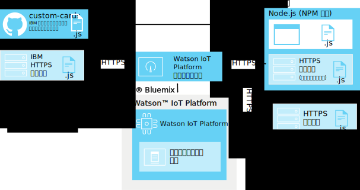

---

copyright:
  years: 2016, 2017
lastupdated: "2016-10-13"

---

{:new_window: target="\_blank"}
{:shortdesc: .shortdesc}
{:screen: .screen}
{:codeblock: .codeblock}
{:pre: .pre}

# カスタム・カード
{: #custom_cards}

カスタム・カードを使用すれば、{{site.data.keyword.iot_full}} に用意されている汎用カードのレベルを超えて IoT のデータを視覚化できます。
{:shortdesc}

## アーキテクチャー
{: #architecture}  

カスタム・カードを開発したら、独自のカスタム・カード HTTP サーバー・リポジトリーを使用してデプロイします。そのサーバーにはユーザーのブラウザーからアクセスします。そのブラウザーで {{site.data.keyword.iot_short_notm}} ダッシュボードが表示され、処理されます。{{site.data.keyword.iot_short_notm}} は、カスタム・カード拡張によってブラウザーの接続を管理しますが、それ自体がカスタム・カード・サーバーに接続するわけではありません。

{{site.data.keyword.iot_short_notm}} ダッシュボードを実行するブラウザーが、すべての必要なリソースをカスタム・カード・サーバーから直接取得します。カスタム・カードは、「カードの追加」ダイアログで追加できます。追加したカスタム・カードは、ユーザーが構成したユーザー作成のボードに表示されます。

カード・サーバーを使用して一元的なバージョン管理を有効にするため、カスタム・カードのコードはクライアント・サイドにキャッシュされません。カスタム・カードが使用できなくなったり、カード・サーバーにアクセスできなくなったりした場合は、ダッシュボードのレイアウトを維持するためにプレースホルダーが使用されます。

**ヒント:** 独自の開発環境をセットアップしないでカスタム・カード機能をテストするために、IBM 提供のサンプル・カスタム・カード・サーバー (`https://customcards.mybluemix.net`) に接続できます。

カードを作成するには、node.js ベースのローカル開発環境をセットアップして、IBM 提供のカスタム・カード GitHub リポジトリーからサンプル・カードをインポートする必要があります。カードを作成したら、カード・パッケージをセキュア (HTTPS) Web サーバーにデプロイして、{{site.data.keyword.iot_short_notm}} カスタム・カード拡張をそのサーバーにリンクします。   

**ヒント:** カードの初期テストやトラブルシューティングには、組み込みの node.js Web サーバーを使用できますが、カードの実動デプロイメントには、管理の行き届いたセキュア Web サーバーを使用してください。

 

## セキュリティー
{: #security}

カスタム・カード・サーバー上のカードにデプロイする JavaScript コードについては何の制限も課されません。カスタム・カードに組み込む JavaScript コードは、ブラウザーで保持されるすべての情報にアクセスできます (ダッシュボードで実行する他のあらゆるカードも同様です)。カスタム・カードを表示して処理するブラウザーにコードを提供しているのが正しいカスタム・カード・サーバーであることを確認してください。

カードは、{{site.data.keyword.iot_short_notm}} のブラウザー・セッションでコードの記述のとおりの処理を実行します。さらに、カスタム・カード・サーバーへの接続を作成する際には、カスタム・カード・サーバーに資格情報を提供しません。ユーザーのブラウザーは、構成されているどのカスタム・カード・サーバーにも接続できます。

既知の保護されたカスタム・カード・サーバーのみを、ユーザーのダッシュボードにカスタム・カードを提供するように構成することが重要です。   

カスタム・カード・サーバーを保護する方法について詳しくは、[カスタム・カードのセキュリティー](../reference/security/custom_cards_server.html)を参照してください。

テスト・カード・サーバーに接続し、独自のカード・サーバーにサンプル・カードをデプロイし、独自のカードを作成してサーバーにデプロイするプロセスの手順を以下にまとめます。

## 手順 1: {{site.data.keyword.iot_short_notm}} をサンプル・カード・サーバーに接続します。
{: #connect-to-sample}  

{{site.data.keyword.iot_short_notm}} でカスタム・カード機能をテストするために、サンプル・カスタム・カード・サーバーに接続できます。サンプル・サーバーには、一連の汎用カードが組み込まれています。それらのカードは、独自のカードを作成するためのテンプレートとしても活用できます。

サンプル・カスタム・カード・サーバーに接続するには、以下のようにします。
1. 管理ユーザーとして {{site.data.keyword.iot_short_notm}} ダッシュボードにログインします。
2. 試験機能を有効にします。
  
現時点では、カスタム・カードは試験機能として組み込まれています。
  
**重要:** ブラウザー・セッションごとに、試験カスタム・カード拡張を有効にする必要があります。カスタム・カードの接続とカード・パッケージは、{{site.data.keyword.iot_short_notm}} 組織内でグローバルに共有されるわけではありません。
 1. **「設定」**に進みます。
 2. 試験機能のセクションで、**「試験機能をアクティブにする (Activate Experimental Features)」**が有効になっていることを確認します。
2. サンプル・サーバーに接続します。
 2. **「拡張」**に進みます。
 3. **「拡張の追加 (Add extension)」**をクリックし、**「カスタム・カード (Custom Cards)」**拡張を選択します。
 4. **「カスタム・カード (Custom Card)」**タイルで**「セットアップ (Setup)」**をクリックします。
 5. 「カスタム・カードの構成 (Configure Custom Cards)」セクションで**「追加 (Add)」**をクリックし、サンプル・カード・サーバーのセキュア (HTTPS) URL をサーバーのフィールドに入力します。
  
独自のサーバーに接続する場合は、そのサーバーの URL をしてください。
    
**ヒント:** IBM サンプル・カード・サーバーの URL は `https://customcards.mybluemix.net` です。  
 6. **「証明書の取得 (Retrieve Certificate)」**をクリックしてカスタム・カード・サーバーに接続し、サーバーのセキュリティー証明書の情報を取得します。
  
 **重要:** 証明書の情報に基づいて、既知の保護された正しいカスタム・カード・サーバーに接続していることを確認してください。
 4. **「完了 (Done)」**をクリックして、サーバー接続を追加します。
5. サンプル・カードに基づく新しいカードを作成します。
 1. {{site.data.keyword.iot_short_notm}} ダッシュボードで**「ボード」**に移動します。
 2. **「新規ボードの作成」**をクリックします。
   
「新規ボードの作成」ダイアログ・ボックスで必要な設定を行います。詳しくは、[ボードとカードの作成](../data_visualization.html#visualizing_data)を参照してください。
 3. 新しいカードを開きます。
 4. **「新しいカードの追加」**をクリックします。  
 5. **「カスタム・カード (Custom cards)」**にスクロールダウンして、いずれかのサンプル・カードを選択します。
   
カード作成プロセスを完了します。詳しくは、[ボードとカードの作成](../data_visualization.html#visualizing_data)を参照してください。  

 新しいカスタム・カードが新しいボードに表示されます。  
 

カスタム・カード・サーバーに接続して、カスタム・カードをボードに追加できました。次の手順では、独自のカード・サーバーをセットアップし、HelloWorld サンプル・カードを使用して最初のカードを作成します。

## 手順 2: カード・サーバーをセットアップして、HelloWorld サンプル・カードをデプロイします。
{: #create-hello-world}

カスタム・カード作成の準備として、ローカル・カスタム・カード開発環境をセットアップし、HelloWorld サンプル・カードを試験的にデプロイできます。

カスタム・カード・サーバーを作成して IBM サンプル・カードをデプロイするために、[カスタム・カード・リポジトリー](https://github.com/ibm-watson-iot/custom-cards/blob/master/README.md)の README にある詳しい指示に従ってください。

このプロセスの手順の概要を以下にまとめます。
1. ローカル開発環境に Node.js と npm ノード・パッケージ・マネージャーがあることを確認します。
  
Node.js のダウンロード・リンクを含めたインストール情報については、https://nodejs.org を参照してください。
2. カスタム・カード・パッケージをホストする HTTP サーバーをセットアップします。    
  - カスタム・カードのコンテンツを処理するこのサーバー上のディレクトリーでは、アクセスのための資格情報を要求できません。
  - このサーバーでは HTTPS プロトコルを使用する必要があります。
  - このサーバーは、クロス・オリジン・リソース共有 (CORS) 接続に対応していなければなりません。
  
**ヒント:** テストと PoC (概念検証) の作業のために、組み込みのサンプル node.js サーバーを使用できます。そのサーバーは、その要件に対応できるように構成されています。
3. 独自のリポジトリーを作成します。
サンプル・カスタム・カード・リポジトリー (https://github.com/ibm-watson-iot/custom-cards) を fork して複製してください。
4. 独自のモジュールとカード・フレームワークを作成します。
カスタム・カードはモジュールとして編成します。新しい HelloWorld カード・モジュールをセットアップします。
5. 新しいカードを参照します。
カスタム・カード・パッケージには複数のモジュールを組み込むことができます。メインパッケージ・ファイル内の新しいモジュールを参照する必要があります。
6. モジュールを登録します。
{{site.data.keyword.iot_short_notm}} 組織のボードでカードを使用できるようにするために、カードの構成の詳細を `DashboardConfig.json` ファイルに追加する必要があります。
7. カード・パッケージを作成します。
Gulp を使用して、自動ビルド・エンジンをセットアップしてください。
8. カード・パッケージをカード・サーバーにデプロイします。
  
{{site.data.keyword.iot_short_notm}} でカードを使用するには、その前にカード・パッケージをカスタム・カード HTTP サーバーにデプロイする必要があります。
  
**ヒント:** カード・パッケージをカード・サーバーに再デプロイすることによって、その場で新しいカードを追加したり廃止するカードを削除したりできます。
9. カード・サーバーを {{site.data.keyword.iot_short_notm}} にリンクします。
新しくデプロイしたカスタム・カード・サーバーを {{site.data.keyword.iot_short_notm}} にリンクします。
  
**ヒント:** カスタム・カード・サーバーがサンプル・カード・サーバーの完全なレプリカになっている場合は、環境内で重複したカードが表示されることがあります。サンプル・カード・サーバーの接続を解除すると、カスタム・カード・サーバーのカードだけが表示されます。
 1. **「拡張」**に進みます。
 2. **「カスタム・カード (Custom Card)」**タイルでギアのアイコンをクリックして、構成を更新します。
 4. 「カスタム・カードの構成 (Configure Custom Cards)」セクションで**「追加 (Add)」**をクリックし、カスタム・カード・サーバーのセキュア (HTTPS) URL をサーバーのフィールドに入力します。
  
**重要:** 既知の保護された正しいカスタム・カード・サーバーに接続していることを確認してください。
4. **「完了 (Done)」**をクリックして、サーバー接続を追加します。
10. これで HelloWorld カスタム・カードをボードで使用できるようになりました。

カード・サーバーを正常にセットアップして、最初のサンプル・カードをデプロイできました。しかし、カスタム・カードの本来の目的は、カードとボードを自分の望むとおりにセットアップすることです。次に、サンプルを変更して独自のカードを作成します。

## 手順 3: 独自のカスタム・カードを作成してデプロイします。
{: #create-your-own-cards}
HelloWorld カードを構成して確認したら、カードをさらに拡張して独自のカスタム・カードを作成できます。

サンプル・カスタム・カード・リポジトリーには、以下のサンプル・カードが含まれています。
- HelloWorld  
基本的な Hello World サンプルを提供する簡単なカード。
- Empty  
カードのインフラストラクチャーが入っている空のカード。カードを最初から作成するときのテンプレートとしてこのカードを使用できます。
- Webcam  
簡単な Web カメラのカード。カードで Web カメラの URL を構成して、リフレッシュ・レートを設定します。
- iFrame  
セキュア (HTTPS) Web ページをボードに埋め込むために使用できる基本的な iFrame カード。

新しいカードを作成する手順の概要を以下にまとめます。

**ヒント:** 詳しい手順については、サンプル・カスタム・カード・リポジトリーにある[カスタム・カードの作成に関する README](https://github.com/ibm-watson-iot/custom-cards/blob/master/README.md) を参照してください。
1. 独自のカード・モジュールを作成します。
 1. モジュールのテンプレートとしていずれかのサンプル・カード・モジュールを使用します。
 2. 新しいモジュール・ファイル名とファイルの内容にモジュール名が出現する箇所があれば、それらをすべて更新します。
   
例えば、すべてのファイル名とファイルの内容において、`HelloWorld` を新しいモジュール名に置き換えます。
2. Modules.jsx ファイル内の新しいモジュールを参照します。
3. 新しいモジュールを DashboardConfig.json ファイルに登録します。
4. カードの要件に合わせてカスタム・カード・コードを更新します。
4. カード・パッケージを作成します。
  
セットアップの種類によっては、Gulp を使用してビルド・プロセスを自動化できます。ビルドを手動でトリガーする必要がある場合もあります。
3. 新しいカードをデプロイします。
  
外部のカスタム・カード・サーバーを使用する場合は、この時点でパッケージをそのサーバーにデプロイする必要があります。  

最初のカスタム・カードを作成してカスタム・カード・サーバーにデプロイできました。{{site.data.keyword.iot_short_notm}} 組織でそのカードを使用できる状態になっています。
