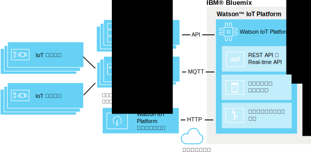

---

copyright:
  years: 2016, 2017
lastupdated: "2017-01-10"

---

{:new_window: target="\_blank"}
{:shortdesc: .shortdesc}
{:screen: .screen}
{:codeblock: .codeblock}
{:pre: .pre}

# エッジ分析
{: #edge_analytics}

エッジ分析を使用して、ルール・トリガー・プロセスをクラウドからエッジ分析対応のゲートウェイに移動します。こうしてデバイスの近くで分析処理を行うことで、クラウドへのデバイス・データ・トラフィックの量が大幅に削減される可能性があります。
{:shortdesk}

デバイスは、エッジ分析ルールでデータを解析するエッジ分析対応のゲートウェイにデータを送信します。ルールとアクションに応じて、重要なデータとアラートが {{site.data.keyword.iot_full}} に送信されるか、ゲートウェイでアラートがトリガーされるか、ゲートウェイのローカルのテキスト・ファイルに書き込まれます。

以下の図は、{{site.data.keyword.iot_full}} エッジ分析環境の一般的なアーキテクチャーを示しています。

## 始めに
{: #byb}

エッジ・ルールとアクションの作成を開始する前に、以下の点にご留意ください。
- ゲートウェイが {{site.data.keyword.iot_short}} に接続されていること、デバイス・データが送信されていることを確認します。詳しくは、[ゲートウェイの接続](gateways/dashboard.html)を参照してください。
- ゲートウェイにエッジ分析エージェント (EAA) をインストールします。詳しくは、[エッジ分析エージェントのインストール](gateways/dashboard.html#edge)を参照してください。  **ヒント:** EAA 対応のゲートウェイは、ゲートウェイ・デバイス・メッセージの形式で EAA 診断データを提供します。詳しくは、[エッジ分析エージェントの診断メトリック](#eaa_metrics)を参照してください。
- ルールで条件として使用するデバイス・プロパティーがスキーマにマップされていることを確認します。詳しくは、[デバイスの接続](iotplatform_task.html)と[スキーマの作成](im_schemas.html)を参照してください。
- エッジ分析レシピの検討  
レシピ・ポータルでは、いくつかのレシピで、IBM エッジ分析を実行するために必要な手順を説明しています。レシピでは、Apache エージェント上に構築されたデバイスで IBM エッジ分析エージェントをインストールして構成し、IoT データ・ソースに近い分析を実行する方法が分かりやすく説明されています。
 - このシリーズの始まりは、[IBM Watson IoT Platform でのエッジ分析の概説](https://developer.ibm.com/recipes/tutorials/getting-started-with-edge-analytics-in-watson-iot-platform/)レシピです。このレシピでは、Cisco DSA Platform on a Laptop System と Raspberry Pi 3 デバイスのセットアップ、IBM エッジ分析エージェントのインストールと {{site.data.keyword.iot_short}} に接続するための構成、System DS Link のインストールと {{site.data.keyword.iot_short}} 上のエッジ・ゲートウェイに接続デバイスとして接続するための構成、エッジ・ゲートウェイでのエッジ・ルールの定義とアクティブ化、{{site.data.keyword.iot_short}} からのエッジ・ルールの管理について説明されています。
 - エッジ分析の発展的な使用法を説明するために、[Handling Alerts and Device Actions with Edge Analytics in IBM Watson IoT Platform](https://developer.ibm.com/recipes/tutorials/handling-alerts-and-device-actions-with-edge-analytics-in-ibm-watson-iot-platform/) レシピでは、独自の DS Link を構築し、接続された Arduino Uno デバイスから Raspberry Pi 3 デバイスにデータを転送する方法が示されています。このレシピでは、エッジ・ルール・アラートの一部として、データ・フィルタリングやローカル・デバイス・アクションの操作についても説明されています。

## エッジ・ルールとアクションの管理  
{: #managing_rules}

エッジ・ルールは、以下の方法を使用して管理されます。
- **「ルール」**ダッシュボードは、デバイスやゲートウェイのクラウド/エッジ・ルールやアクションを作成したり編集したりするために使用されます。
- **「エッジ・ルールのゲートウェイ (Edge Rules Gateways)」**ボードは、ゲートウェイのエッジ・ルールをアクティブ化、非アクティブ化、更新、削除するために使用されます。「ルール」ダッシュボードから「エッジ・ルールのゲートウェイ (Edge Rules Gateways)」にアクセスするには、管理するエッジ・ルールの**「ルールの管理 (Manage Rule)」**をクリックします。詳しくは、[ゲートウェイのエッジ・ルールのアクティブ化、非アクティブ化、管理](#manage)を参照してください。

ゲートウェイに接続されたデバイスについてトリガーされたエッジ・ルールとアラートの概要を確認するには、以下のボードを使用します。

|ボード名 | 説明 |  
 |:---|:---|  
  |ルール中心型の分析 | エッジ・ルールを含む、組織のルールを表示します。追加のカードには、転送されたエッジ・アラート、関連付けられているデバイス、デバイスのプロパティー、転送されたエッジ・アラート情報がリストされます。 |  
 |デバイス中心型の分析 | 組織に接続されているデバイスを表示します。追加のカードには、選択されたエッジ・デバイスの転送されたアラート、選択されたデバイスの情報、デバイスのプロパティー、転送されたアラート情報が表示されます。 |

デフォルトの分析ボートについて詳しくは、[ボードとカードを使用したリアルタイム・データの視覚化](data_visualization.html#default_boards)を参照してください。

## エッジ・ルールの作成
{: #rules}

エッジ・ルールは、リアルタイム・デバイス・データを事前定義しきい値または他のプロパティー・データと突き合わせる条件に基づく決定点です。条件が満たされた場合に、エッジ・アクションがトリガーされます。

**重要:** デバイス・タイプのルールを作成するには、事前にデバイス・タイプのスキーマを作成しておく必要があります。詳しくは、[デバイス・タイプ・スキーマの作成](im_schemas.html)を参照してください。

ルールを作成するには、次のようにします。
1. {{site.data.keyword.iot_short}} ダッシュボードで、**「ルール」**に移動します。
2. **「エッジ・ルールの作成 (Create Edge Rule)」**をクリックし、ルールに名前を付け、説明を入力し、ルールを適用するエッジ・デバイス・タイプを選択してから、**「次へ」**をクリックします。  
3. ルール・ロジックをセットアップします。
  
ルールのトリガーとして使用する 1 つ以上の IF 条件を追加します。
  
並列行に条件を追加して OR 条件として適用したり、順次列に条件を追加して AND 条件として適用したりすることもできます。
  
**注: **ルールの入力としてデバイス・プロパティーを選択できるようにするには、プロパティーをスキーマにマップする必要があります。詳しくは、[スキーマの作成](im_schemas.html)を参照してください。
  

**重要:** 2 つのプロパティーを比較する条件をトリガーしたり、AND を使用して順次に結合された 2 つ以上のプロパティー条件をトリガーしたりする場合は、トリガーするデータ・ポイントを同じデバイス・メッセージに含める必要があります。複数のメッセージでデータを受け取った場合、条件または順次条件はトリガーしません。
  

**例:**  
パラメーター値が 1 つの指定値を上回った場合にアラートをトリガーする場合、ルールは単純です。
  
`temp>80`  
しきい値の組み合わせが満たされたときにトリガーする場合、ルールはもう少し複雑になります。
  
`temp>60 AND capacity>50`
   

4. ルールに対して条件付きトリガー要件を構成します。
  
一定期間にわたってあるルールでトリガーされるアラートとアクションの数を制御する場合、ルールに対して条件付きトリガー要件を構成できます。
  
**重要:** 条件付きトリガーは、ルール内のどの条件に対しても作用します。例えば、1 つのルールに OR を使用して設定された 5 つの異なる並列条件が含まれる場合、満たされる各条件は条件付きトリガー・カウントに加算されます。
ルールに対して条件付きトリガーを設定するには、次のようにします。
 1. ルール・エディターで、デフォルトの**「条件が満たされるたびにトリガーする (Trigger each time conditions are met)」**リンクをクリックし、「頻度要件の設定 (set frequency requirement)」ダイアログ・ボックスを開きます。
 2. ルールで使用する条件付きトリガーを選択して構成します。
 <ul>
 <li>条件が満たされるたびにトリガーします。</li>
 <li>条件が M *時間単位*内に N 回満たされたらトリガーします。</li>
 </ul>  
条件付きトリガーについて詳しくは、クラウド分析セクションの[条件付きルールのトリガー](cloud_analytics.html#conditional "条件付きトリガーの概要")を参照してください。
5. ルールの条件が満たされた場合に発生する 1 つ以上のアクションを作成または選択します。
  
エッジ・アクションについて詳しくは、[エッジ・アクションの作成](#edge_actions "エッジ・アクションの作成")を参照してください。
   
例: デバイス・データをクラウドに送信する、またはアラートをローカル・ファイルに書き込むといったアクションを作成することができます。
3. **オプション:** ルールのアラートの優先順位を選択します。
  
優先順位は、**「ルール・ベースの分析 (Rule-Based Analytics)」**ボードに表示されるアラートを分類するために使用されます。デフォルトの優先順位は「低 (Low)」です。
6. ルールが完成した後、**「保存」**をクリックします。

ルールが作成され、ブラウズ・ダッシュボードに追加されます。**「エッジ・ルールのゲートウェイ (Edge Rules Gateways)」**ボードがオープンし、ルールを[アクティブ化](#manage)できるようになります。

## エッジ・アクションの作成
{: #edge_actions}

ルール・エディターで直接アクションを作成するか「アクション」タブでアクションを作成し、ルールを作成するときにアクションを選択することができます。

「アクション」タブでアクションを作成するには、次のようにします。
1. {{site.data.keyword.iot_short}} ダッシュボードで、**「ルール」**に移動します。
2. 「ルール」ダッシュボードで、**「アクション」**タブを選択します。
2. **「アクションの作成 (Create An Action)」**をクリックし、アクションに名前と説明を付け、アクション・タイプを選択し、**「次へ」**をクリックします。  
エッジ分析は、2 つのアクション・タイプをサポートしています。
<dl>
<dt>イベントをクラウドに転送</dt>  
<dd>デバイス・イベントは {{site.data.keyword.iot_short}} に送信され、ボードとカードでクラウド分析ルールを指定して使用できます。詳しくは、[クラウド分析との統合](#integrate_with_cloud_analytics)を参照してください。    
**ヒント:**「イベントをクラウドに転送」アクションを使用して、重要性の低いデータをゲートウェイ・デバイスで直接フィルターに掛けることによって、クラウドに送信されるデバイス・データの量を削減します。</dd>
<dt>アラート</dt>  
<dd>アラートは、ゲートウェイ・デバイスで作成されます。</dd>
</dl>
3. 選択したアクションのタイプに必須パラメーターを指定します。  
<dl>
<dt>イベントをクラウドに転送</dt>  
<dd>クラウドに転送するイベント・データを選択し、メッセージで使用するイベント名を提供します。 
**ヒント:** ボードとカードをセットアップするときや、クラウド分析ルールを作成するときに、イベントとプロパティーを使用することができます。 
以下を実行できます。
<ul>
 <li>すべてのデバイス・プロパティーと仮想プロパティーを含める
<li>スキーマ定義されたプロパティーと仮想プロパティーのみを含める  
 </ul>
 </dd>
<dt>アラート</dt>  
<dd>アラート・メッセージを指定し、アラートの宛先を少なくとも 1 つ選択します。
<ul>
 <li>クラウドに転送  
アラートは {{site.data.keyword.iot_short}} に転送され、「ルール中心型の分析」ボードと「デバイス中心型の分析」ボードに表示されます。
<li>ゲートウェイ・ブローカーにパブリッシュ
 アラートは、ゲートウェイ・ブローカーにパブリッシュされます。ユーザーへのアラートの表示方法は、ブローカー構成によって決まります。
<li>ローカル・テキスト・ファイルに保存
 アラートは、ゲートウェイ・サーバーのローカル *IBMEdgeAnalyticsAlerts.csv* テキスト・ファイルに付加されます。
</ul>
 </dd>
</dl>
4. **「OK」**をクリックして、新規アクションを作成します。

アクションがルール・エディターで使用できるようになります。

## ゲートウェイのエッジ・ルールのアクティブ化、非アクティブ化、管理
{: #manage}

ルールがアクションをトリガーするようにするには、まず 1 つ以上のゲートウェイでアクティブ化する必要があります。ゲートウェイのエッジ・ルールをアクティブ化、非アクティブ化、更新、削除するには、**「エッジ・ルールのゲートウェイ (Edge Rules Gateways)」**ボードを使用します。

エッジ・ルールをアクティブ化するには、次のようにします。
1. 「ルール」ダッシュボードから、管理するエッジ・ルールの**「ルールの管理 (Manage Rule)」**ボタンをクリックします。
  
**「エッジ・ルールのゲートウェイ (Edge Rules Gateways)」**ボードが開き、接続されているすべての EAA 対応ゲートウェイのリストが表示されます。ルールがアップロード/アクティブ化されないゲートウェイでは、そのルール状況は*「なし」* となります。
2. ルールをアクティブ化するゲートウェイを「選択」操作列のメニューから見つけ、**「アクティブ化 (Activate)」**を選択します。
  
エッジ・ルールがゲートウェイにアップロードされます。アップロードが完了してルールがアクティブになったら、ルールの状況が**「アクティブ」**に変更されます。  

ルールがゲートウェイでアクティブになり、ルールの条件が満たされたときに、構成されたアクションがトリガーされます。

**ヒント:** 複数のゲートウェイでルールを管理するには、「ゲートウェイ」列ヘッダーの横の「すべて選択 (select-all)」ボックスを選択することができます。含めないゲートウェイがあればそれをクリアし、同じ名前を持つ列上部の**「操作の選択 (Select operation)」**メニューから操作を選択します。

ルールをアクティブ化するだけでなく、以下のルール管理操作をゲートウェイで実行することができます。

操作 | 説明
--- | ---
アクティブ化 | 選択されたゲートウェイでルールをアップロード/アクティブ化します。ルールの状況は*「アクティブ」*に設定されます。
非アクティブ化 | 選択されたゲートウェイでルールを非アクティブ化します。ルールはゲートウェイに残り、必要に応じて再アクティブ化することができます。ルールの状況は*「非アクティブ (Inactive)」*に設定されます。
更新 | 選択されたゲートウェイにルールの更新されたバージョンをアップロードします。ゲートウェイのルール状況が*「アクティブ (最新ではない)(Active (Older))」*になっている場合、この操作を使用してゲートウェイを最新の状態にします。ルールの状況は*「アクティブ」*に設定されます。
削除 | 選択されたゲートウェイからルールを削除します。ゲートウェイのルールの状況は*「なし」*に戻ります。

## クラウド分析との統合
{: #integrate_with_cloud_analytics}

EAA 対応のゲートウェイで実行されるエッジ・ルール・トリガー・アクションを使用して、クラウドおよび転送ゲートウェイに流れるデータや、クラウドに流れる転送ゲートウェイ生成アラートをフィルターに掛け、{{site.data.keyword.iot_short}} ボード/カードで使用します。  

{{site.data.keyword.iot_short}} を使用して、ゲートウェイからクラウドに送信されるデバイス・データをクラウド分析することもできます。エッジ・ルールで`「イベントをクラウドに転送」`アクションを使用する場合、エッジ・ルールをトリガーするデータを提供するデバイスが {{site.data.keyword.iot_short}} に直接接続されているかのように、作成されたメッセージをクラウド分析ルールの入力として使用することができます。

クラウド分析ルール/アクションの作成方法については、[クラウド分析](cloud_analytics.html)を参照してください。

## エッジ分析エージェントの診断メトリック
{: #eaa_metrics}

接続された EAA 対応のゲートウェイは、イベント・タイプ `gateway_xv-monitor-event` のデバイス・メッセージとして診断情報を送信します。  **ヒント:** [クラウド分析](cloud_analytics.html)ルールを使用して、EAA 対応のゲートウェイから送り返される診断値に基づいて E メール通知などのアラート・アクションを構成することができます。例えば、`SystemLoad` が特定のしきい値を超える場合にアラートを出すルールを作成することができます。

ゲートウェイの状態に関する情報を表示するには、次のようにします。
1. {{site.data.keyword.iot_short}} ダッシュボードのメニュー・サイド・バーの**「デバイス」**を選択します。
2. ゲートウェイ・デバイスをクリックし、デバイス詳細ページを開きます。
3. ゲートウェイ診断情報にアクセスします。  
 - ゲートウェイによって送信された最近のメッセージのリストについては、**「最近のイベント」**セクションを参照してください。
 - ゲートウェイの警告やその他の診断メッセージについては、**「診断ログ」**セクションを参照してください。
 - ゲートウェイからの詳細な診断情報については、**「センサー情報」**セクションを参照してください。以下の表は、ゲートウェイ・デバイス・メッセージに含まれる可能性があるさまざまなプロパティーについて説明しています。

プロパティー | 説明
 --- | ---
 `MsgInCount` | エッジ分析エージェント (EAA) に送信されたメッセージの数。
`MsgInRate` | 最近 1 分間に EAA に送信された 1 秒あたりの推定メッセージ数。  
 `LastHeartBeat` | 最後のハートビート・メッセージが生成されたときのタイム・スタンプ (ミリ秒)。ハートビート・メッセージは、少なくとも 10 秒ごとに生成されます。
`CurrentTimestamp` | 現在のモニター・メッセージが生成されたときのタイム・スタンプ (ミリ秒)。
`IsAlive` | `LastHeartBeat` と `CurrentTimestamp` の差異が 20 秒より大きい場合、このプロパティーは 0 です。
`BytesOutCount` | EAA によって {{site.data.keyword.iot_short}} に送信されるメッセージ・バイト数。
`BytesOutRate` | 最近 1 分間に EAA から {{site.data.keyword.iot_short}} に送信された 1 秒あたりの推定メッセージ・バイト数。
`BytesInCount` | {{site.data.keyword.iot_short}} から EAA に送信されたメッセージ・バイト数。
`BytesInRate` | 最近 1 分間に {{site.data.keyword.iot_short}} から EAA に送信された 1 秒あたりの推定メッセージ・バイト数。
`RuleBytesInCount` |EAA ルール・エンジン・コアに送信されたメッセージ・バイト数。  **注:** デバイス・タイプにルールが設定されていない場合、そのデバイス・タイプのメッセージは、ルール・エンジン・コアに送信されません。
`RuleBytesInRate` | 最近 1 分間に EAA ルール・エンジン・コアに送信された 1 秒あたりの推定メッセージ・バイト数。
`MsgOutCount` | EAA によって {{site.data.keyword.iot_short}} に送信されたメッセージ数。
`MsgOutRate` | 最近 1 分間に EAA から {{site.data.keyword.iot_short}} に送信された 1 秒あたりの推定メッセージ・バイト数。
`MsgReducePercent` | 着信メッセージと出力メッセージの間のパーセンテージの差異。 計算には、以下の数式が使用されます。`(msgIn - msgOut) / msgIn`
`BytesReducePercent` | 着信バイトと出力バイトの間のパーセンテージの差異。 計算には、以下の数式が使用されます。`(bytesIn - bytesOut) / bytesIn`
`MsgRateReduce` | 着信メッセージ・レートと出力メッセージ・レートの間のパーセンテージの差異。 計算には、以下の数式が使用されます。`(msgInRate - msgOutRate) / msgInRate`
`BytesRateReduce` | 着信メッセージ・バイトと出力メッセージ・バイトの間のパーセンテージの差異。 計算には、以下の数式が使用されます。`(bytesInRate - bytesOutRate) / bytesInRate`
`SystemLoad` | EAA が実行されているシステムの現在のシステム負荷。**注:** CPU レートは、EAA が実行されているシステムで `mpstat` コマンドが使用可能な場合にのみ送信されます。それ以外の場合は、最近 1 分間のシステム負荷の平均が送信されます。 「システム負荷の平均は、使用可能なプロセッサーのキューに入れられている実行可能なエンティティーの数と、使用可能なプロセッサーで実行されている実行可能なエンティティーの数の合計の一定期間の平均値です。負荷平均を計算する方法はオペレーティング・システムに固有ですが、通常は、ダンプ時間に依存する平均です。負荷平均が使用できない場合には、負の値が戻されます。」- *ManagementFactory.getOperatingSystemMXBean* の javadoc。
`FreeMemory` | EAA が実行されている Java™ 仮想マシン (JVM) の空きメモリーのバイト数。
`MemoryUsed` | EAA によって使用される JVM メモリーのバイト数。
`InQueueSize` | EAA 処理のためにキューに入れられるメッセージの数。
`RuleNumber` | ルール・エンジン・コアにある定義済みルールの数。
`ProcessorNumber` | デバッグ用。ルール・エンジン・コアにある定義済みプロセッサーの数。 **注:** プロセッサーは、ルール・エンジン・コアにおける最小実行単位です。
`DataPointsInWindow` | 時間枠内にバッファーに入れられるデータ・ポイントの総数。データ・ポイントのバイト・サイズは、そのデータ・タイプによって異なります。例えば、float/int データ・ポイントのサイズは 8 バイトですが、string データ・ポイントのサイズはその長さによって異なります。ほとんどの場合、以下の数式を使用して、時間枠のメモリー使用率を推定することができます。`DataPointsInWindow * 8`
