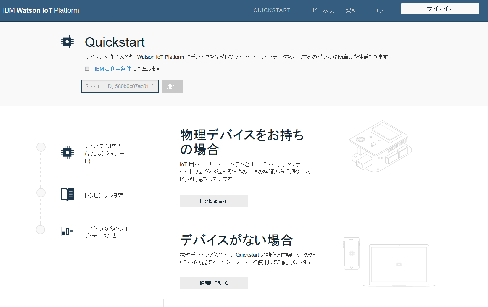
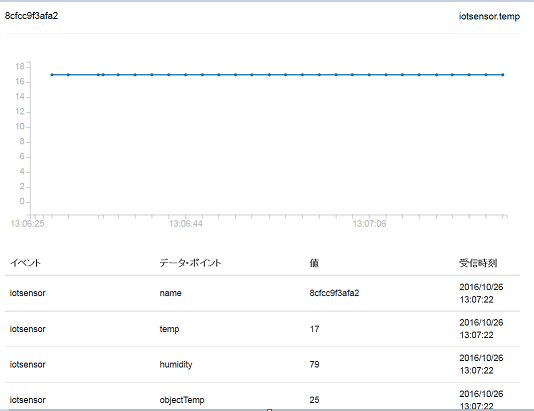

---

copyright:
  years: 2015, 2016, 2017
lastupdated: "2016-09-19"

---

{:new_window: target="_blank"}
{:shortdesc: .shortdesc}
{:screen: .screen}
{:codeblock: .codeblock}
{:pre: .pre}

# Quickstart

[Quickstart](https://quickstart.internetofthings.ibmcloud.com/#/) は、デバイスを素早く {{site.data.keyword.iot_full}} に接続するために使用できるオープン・サンドボックスです。MQTT メッセージ・プロトコルをサポートしているデバイスなら、簡単に Quickstart に接続できます。

各種のデバイスを Quickstart サービスに接続する方法を説明した例、レシピ、チュートリアルについては、[DeveloperWorks Recipes](https://developer.ibm.com/recipes/) をご覧ください。例えば、以下のようなトピックがあります。

- [OpenBlocks IoT BX1G](https://developer.ibm.com/recipes/tutorials/openblocks-iot-bx1g-for-iot-foundation-quickstart/)
- [Reactive Blocks](https://developer.ibm.com/recipes/tutorials/reactive-blocks-and-java-to-iot-foundation-part-1-quickstart/)


**重要:** {{site.data.keyword.iot_short_notm}} インスタンスで Quickstart サービスを使用する場合は、スケーラブルなアプリケーションはサポートされません。

## シミュレート・デバイス

Quickstart のレシピやチュートリアルに加えて、モバイル・デバイスに対応したブラウザー・ベースのシミュレート・デバイスも用意されています。これを使用すれば、どんなデバイスでも Web ブラウザーから Quickstart サービスに接続できます。{{site.data.keyword.iot_short}} に接続するブラウザー・ベースのシミュレート・デバイスを携帯電話やタブレットから起動するには、以下の URL を開いてください。

```
http://quickstart.internetofthings.ibmcloud.com/iotsensor
```

モバイル・デバイスからシミュレート・デバイスの URL に接続すると、{{site.data.keyword.iot_short}} に接続するブラウザー・ベースのシミュレート・デバイスが始動します。以下の UI コントロールを使用してセンサーを管理できます。

- 温度
- 湿度
- 対象温度


## データの可視化

モバイル・デバイスから生成されるデータを表示するには、モバイル・デバイスでシミュレート・デバイスが稼働していることを確認してから Quickstart アプリケーションを開始します。UI の右上隅に表示される 12 文字のデバイス ID を入力してください。



シミュレート・デバイスでセンサーの値を調整すると、デバイスからのデータが Quickstart アプリケーションでリアルタイムに視覚化されます。以下の画面キャプチャーをご覧ください。




## Mosquitto のデモ

[Mosquitto](http://mosquitto.org/) は、{{site.data.keyword.iot_short}} サービスをテストするために使用できるクロスプラットフォーム・オープン・ソース MQTT クライアントです。Mosquitto クライアントをインストールしたら、固有のアプリケーション ID とデバイス ID を選択してください。アプリケーション ID とデバイス ID が固有の値になっていないと、テスト接続時に、Quickstart の同じテスト手順を実行している別のユーザーと競合する可能性があります。

*appId*、*type_id*、*device_type*、*device_id* の値は、36 文字以下でなければなりません。以下の文字だけを含めるようにしてください。
- 英数字 (a-z、A-Z、0-9)
- ダッシュ ( - )
- 下線 ( _ )
- ドット ( . )

アプリケーション ID とデバイス ID を定義したら、`mosquitto_sub` を使用してアプリケーションに対応する接続を作成します。以下の例では、`<applicationId>` を myApplicationId、`<deviceId>` を myDeviceId にしています。
```
    [user@host ~]$ mosquitto_sub -h quickstart.messaging.internetofthings.ibmcloud.com -p 1883 -i "a:quickstart:myApplicationId" -t iot-2/type/mosquitto/id/myDeviceId/evt/helloworld/fmt/json

```

直前に示されているプロセスの実行中に、デバイスを作成できます。この例では、タイプ `mosquitto` のデバイスを接続してから、`mosquitto_pub` を使用して 2 つのイベントをサービスに送信します。以下のコードをご覧ください。

```
    [user@host ~]$ mosquitto_pub -h quickstart.messaging.internetofthings.ibmcloud.com -p 1883 -i "d:quickstart:mosquitto:myDeviceId" -t iot-2/evt/helloworld/fmt/json -m "{\"helloworld\": 1}"
    [user@host ~]$ mosquitto_pub -h quickstart.messaging.internetofthings.ibmcloud.com -p 1883 -i "d:quickstart:mosquitto:myDeviceId" -t iot-2/evt/helloworld/fmt/json -m "{\"helloworld\": 2}"
```
アプリケーションの端末を見ると、パブリッシュした 2 つのイベントが表示されています。以下のサンプル出力をご覧ください。

```
   [user@host ~]$ mosquitto_sub -h quickstart.messaging.internetofthings.ibmcloud.com -p 1883 -i "a:quickstart:myApplicationId" -t iot-2/type/mosquitto/id/myDeviceId/evt/helloworld/fmt/json
    {"helloworld": 1}
    {"helloworld": 2}
```

これで終わりです。Quickstart のサンプル手順を実行することによって、以下の作業を完了できました。
- MQTT でデバイスとアプリケーションを {{site.data.keyword.iot_short}} に正常に接続できました。
- デバイスからサービスにイベントを送信できました。
- アプリケーションでイベントを受信できました。


## 関連リンク

- [Quickstart](https://quickstart.internetofthings.ibmcloud.com)
- [DeveloperWorks Recipes](https://developer.ibm.com/recipes)
- [OpenBlocks IoT BX1G](https://developer.ibm.com/recipes/tutorials/openblocks-iot-bx1g-for-iot-foundation-quickstart/)
- [Reactive Blocks](https://developer.ibm.com/recipes/tutorials/reactive-blocks-and-java-to-iot-foundation-part-1-quickstart/)
- [Quickstart アプリケーション](http://quickstart.internetofthings.ibmcloud.com)
- [Mosquitto](http://mosquitto.org/)
