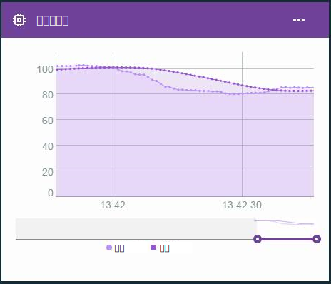

---

copyright:
  years: 2016, 2017
lastupdated: "2016-12-12"

---

{:new_window: target="blank"}
{:shortdesc: .shortdesc}
{:screen:.screen}
{:codeblock:.codeblock}
{:pre: .pre}

# エッジ仮想プロパティーの高度な計算
{: #im_vir_calculations}

事前設定のエッジ分析数式によって基本仮想プロパティー計算を拡張します。
{:shortdesc}

**重要:** 高度な計算からプロパティーのデータ・ポイントが返されるのは、選択したプロパティーのデータが、エッジ分析エージェントをインストールしたゲートウェイに接続したデバイスから来た場合に限られます。エッジ・ルールでは、この仮想プロパティーを直接使用できます。クラウド・ルールでこのプロパティーを使用する場合は、クラウドへの転送の操作を使用して、エッジ・ルールでクラウドにデータ・ポイントを送信する必要があります。詳しくは、[エッジ分析エージェントのインストール](gateways/dashboard.html#edge)を参照してください。

例: 折れ線グラフ・カードで高度な仮想データ・ポイントを使用して、データ・スパイクを除去した状態でデータ傾向を視覚化します。  
 

## 高度な数式
{: #advanced}

高度な計算オプションには以下の数式が含まれています。

**ヒント:** 数式の種類によっては、期間の長さや組み込むデータ・ポイントの数を選択することも可能です。データが一定の頻度で流れることが分かっている場合は、時間枠を選択できます。データ収集が散発的だったり不均一だったりする場合は、時間枠の予測が難しいのでデータ・ポイントの数を使用できます。

<table>
<thead>
<tr>
<th>数式</th>
<th>説明</th>
<th>使用法</th>
</tr>
</thead>
<tbody>
<tr>
<td>平均</td>
<td>直近のデータ・ポイントの数や直近の期間に基づいてプロパティーの平均値を返します。  
入力:
<ul>
<li>プロパティー<li>期間の長さまたはデータ・ポイントの数 (0 より大きい整数)。</ul></td>
 <td>AVG 数式で時間枠を指定して、絶えず移動しているデータ・ポイントの平均値を計算できます。   ルールで平均の数式を使用すれば、単発的なスパイクが含まれているノイズ・データに基づいて偽のアラートを起動する、といった事態を避けられます。  折れ線グラフ・カードを使用すれば、データ・スパイクを除去した状態でデータ傾向を視覚化できます。  
</td>
</tr>
<tr>
<td>移動 Z-score</td>
<td>データ・ポイント値と、直近のデータ・ポイントの平均値または直近の期間のデータ・ポイントの平均値との間の標準偏差の差を返します。  
入力:
<ul>
<li>プロパティー<li>期間の長さまたはデータ・ポイントの数 (0 より大きい整数)。</ul></td>
<td>データ・ポイントの移動 Z-Score によって、データ・ポイント値が直近の平均値と比べてどれほど異常かを確認できます。Z-score の絶対値が大きければ大きいほど、現在のデータ・ポイントが以前のデータ・ポイント平均値からそれだけ離れていることになります。
  ルールで移動 Z-Score の数式を使用すれば、データ・ポイント値が特定の値を超えた場合ではなく、急激な変動があった場合、つまり、データ・ポイント値が直近の平均値からかけ離れた場合にアラートを起動できます。
  折れ線グラフ・カードを使用すれば、標準偏差の頻度や絶対値を描き出すことでデータの変動を視覚化できます。
</td>
</tr>
<tr>
<td>指数平滑法</td>
<td>収集した利用可能なデータ・ポイントに基づいてプロパティーの平均値を返します。その際に、新しい値のほうにより大きいウェイトを置き、古い値のほうにより小さいウェイトを置きます。そのウェイトは、平滑化係数によって制御します。その値が大きければ大きいほど、新しい値にそれだけ大きなウェイトを置き、古い値にそれだけ小さなウェイトを置くことになります。  
データ傾向に基づく調整のために傾斜係数を使用することもできます。移動平均値よりも指数平滑値のほうがデータの変動に素早く反応します。  
入力:
<ul>
<li>プロパティー<li>平滑化係数 (0 より大きく 1 より小さい数)。  
<li>オプション: 傾斜係数 (0 より大きく 1 より小さい数)。 
 **ヒント:** 収集したデータに傾向があるかどうかが不明な場合は、手始めに傾斜係数として .5 を使用してください。結果を見ながら、係数を調整できます。</ul></td>  
 <td>データ・ポイントに指数平滑法を適用して平均を計算すると、期間の長さを定義する場合よりも古い値にかかるウェイトが小さくなります。大きな平滑化係数を設定することによって、遠い過去の値のウェイトを制限できます。
  利用可能なデータのサブセットではなく全データを対象にした場合に、ルールで指数平滑法の数式を使用すれば、単発的なスパイクが含まれているノイズ・データに基づいて偽のアラートを起動する、といった事態を避けられます。
  折れ線グラフ・カードを使用すれば、データ・スパイクを除去した状態でデータ傾向を視覚化できます。</td>
</tr>
<tr>
<td>ボックス平滑法</td>
<td>現在のデータ・ポイントを中心にした一定範囲のデータ・ポイントに基づいてプロパティーの平均値を返します。  
ボックス平滑法では、現在処理中のデータ・ポイントの前後に来るデータ・ポイント値の数を設定し、その数のデータ・ポイント値に基づいて平滑値を計算します。ボックス平滑法の計算では、すべてのデータ・ポイント値のウェイトを同一にします。  
入力:
<ul>
<li>プロパティー<li>前と後 (全範囲の半分) のデータ・ポイントの数 (0 より大きい整数)。
</ul></td>
<td>データ・ポイントにボックス平滑法を適用して時間枠を指定すれば、対象のデータ・ポイントを中心にした一定の範囲で絶えず移動しているデータ・ポイントの平均値を返せます。  **重要:** データの頻度と全範囲の半分の値の組み合わせによっては、返されるデータ・ポイントにいくらかの遅れが生じることがあります。例えば、全範囲の半分の値を `5` に設定した場合、データの頻度が 1 秒あたり 1 メッセージであれば、返される仮想データ・ポイントに 5 秒の遅れが発生します。  ルールでボックス平滑法の数式を使用すれば、単発的なスパイクが含まれているノイズ・データに基づいて偽のアラートを起動する、といった事態を避けられます。**重要:** ルールを作成する時に、データ・ポイントの遅れを意識するようにしてください。  折れ線グラフ・カードを使用すれば、データ・スパイクを除去した状態でデータ傾向を視覚化できます。</td>
</tr>
<tr>
<td>ガウス平滑法</td>
<td>現在のデータ・ポイントを中心にした一定範囲のデータ・ポイントに基づいてプロパティーの平均値を返します。その際に、現在のデータ・ポイントに近い値のほうにより大きいウェイトを置き、遠い値のほうにより小さいウェイトを置きます。  
入力:
<ul>
<li>プロパティー<li>前と後 (全範囲の半分) のデータ・ポイントの数 (0 より大きい整数)。
</ul></td>
<td>データ・ポイントにガウス平滑法を適用して時間枠を指定すれば、対象のデータ・ポイントを中心にした一定の範囲で絶えず移動しているデータ・ポイントの加重平均値を返せます。平均の計算時に、対象のデータ・ポイントから遠いデータ・ポイントのほうにより小さいウェイトを置くことになります。  **重要:** データの頻度と全範囲の半分の値の組み合わせによっては、返されるデータ・ポイントにいくらかの遅れが生じることがあります。例えば、全範囲の半分の値を `5` に設定した場合、データの頻度が 1 秒あたり 1 メッセージであれば、返される仮想データ・ポイントに 5 秒の遅れが発生します。  ルールでガウス平滑法の数式を使用すれば、単発的なスパイクが含まれているノイズ・データに基づいて偽のアラートを起動する、といった事態を避けられます。**重要:** ルールを作成する時に、データ・ポイントの遅れを意識するようにしてください。  折れ線グラフ・カードを使用すれば、データ・スパイクを除去した状態でデータ傾向を視覚化できます。</td>
</tr>
</tbody>
</table>  
