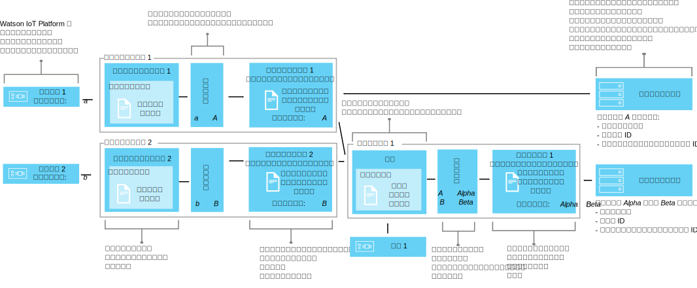

---

copyright:
years: 2016, 2017
lastupdated: "2017-04-25"

---

{:new_window: target="\_blank"}
{:shortdesc: .shortdesc}
{:screen: .screen}
{:codeblock: .codeblock}
{:pre: .pre}

# インターフェースを使用してデバイス・データをマップする方法 (ベータ)
{: #im_index}

アプリケーション・インターフェースは、[デバイス・タイプ](#resources)の概念を拡張し、{{site.data.keyword.iot_short_notm}} を流れるデータに対する制御を強化し、デバイスを意識しない IoT データ表示を可能にします。
{:shortdesc}

**重要:** インターフェース・マッピング機能はベータ機能です。ベータ版の継続中の更新や最終リリースで、現行バージョンと互換性のない変更が行われる可能性があります。最終リリースが提供されるまで、実動アプリケーションではベータ版の機能を使用しないように強くお勧めします。このベータ版についての追加の情報を受け取ったりフィードバックを送信したりしたい場合は、[情報管理ベータ・プログラムの登録 ](https://www.ibm.com/software/support/trial/cst/forms/nomination.wss?id=7050){:new_window} を行うことができます。

## 概説
{: #overview}

アプリケーション・インターフェースを使用すると、デバイスやモノを抽象化して共有できるようにして再利用性や保守性を向上させることができます。また、アプリケーションをデータ変更から切り離して複雑な IoT エコシステムを管理できます。アプリケーション・インターフェースは、デバイスと {{site.data.keyword.iot_short_notm}} の間でやり取りされるメッセージ・データの変動からも切り離されています。

アプリケーション・インターフェースを介して、アプリケーションはデバイスやモノの現在の状態を取得できます。状態は、アプリケーション・インターフェースで定義する一連の状態プロパティーで構成されます。デバイスが状態変更イベントを送信すると、それらのプロパティーの最新の値が {{site.data.keyword.iot_short_notm}} に格納され、HTTP API を使用した要求に応じてアプリケーションに提供されます。

アプリケーション・インターフェースを使用すると、以下を実現できます。
- 状態プロパティーをイベント・メッセージ・データにマップする
- 必要なデータ構造を定義する
- デバイス状態の表現方法や表示方法を複数定義する
- デバイス状態をサブスクライブする。または時間を問わず HTTP API を使用してデバイス状態を照会する

アプリケーション・インターフェースの一般的な使用例を次に示します。
- アプリケーション開発者に、REST のような方法でイベント・ドリブンのデバイス・データにアクセスできる統一インターフェースを提供する。
- さまざまなメーカーやモデルのデバイスからさまざまな形式でパブリッシュされるデータを正規化する。
- 複数の異なるデバイス・タイプからのイベント・データを集約し、IoT の「モノ」をモデル化する。
- アプリケーション・モデルに合わせてデータ形式を変更したり変換したりする。  

インターフェース API 資料 (ベータ) については、[{{site.data.keyword.iot_short_notm}} HTTP REST API ](https://docs.internetofthings.ibmcloud.com/apis/swagger/v0002-beta/info-mgmt-beta.html){: new_window} を参照してください。   

## 例
{: #examples}
以下のインターフェースの例で、想定される 2 つのソリューションについて説明します。

### 例 1: 種類の異なる複数の温度センサーを 1 つのアプリケーション・インターフェースにマップする
{: #device-type-example}
この例では、実際のデバイス・イベント・メッセージのペイロード形式にかかわらず、1 つの形式で同種の温度状態データを提供するアプリケーション・インターフェースを作成します。TemperatureSensor1 は、`{ "t" : 34.5 }` という摂氏温度の読み取り値を {{site.data.keyword.iot_short_notm}} にパブリッシュします。TemperatureSensor2 は、`{ "temp" : 72.55 }` という華氏温度の読み取り値をパブリッシュします。これらの温度の読み取り値は、別々のイベントとしてパブリッシュされます。

この例について詳細に説明したエンドツーエンドのシナリオについては、[アプリケーション・インターフェースのシナリオ 1](im_index_scenario.html) を参照してください。

アプリケーション・インターフェースのデータ・フローの一部として、着信データに対する計算を実行し、読み取り値を統一形式に正規化して、処理できるようにします。つまり、温度の目盛りの違いを認識したり変換したりするアプリケーションを作成する必要はありません。アプリケーションは、正規化された 1 つの状態を受け取り、デバイス固有の **t** プロパティーと **temp** プロパティーの代わりに **temperature** という状態プロパティーを使用します。

### 例 2: 複数の環境デバイスを 1 つのモノ・タイプのアプリケーション・インターフェースにマップする
{: #thing-type-example}  
この例では、上記のデバイス・タイプの例をさらに広げて、別の湿度計デバイスという形式で一連の湿度センサーを追加します。モノ・タイプのアプリケーション・インターフェースを使用して、さまざまなデバイス・タイプからのデータを、1 つの部屋のすべてのデバイスとセンサーを表わす 1 つのアプリケーション・インターフェースにシームレスにマージすることができます。アプリケーションは、「部屋」というモノのアプリケーション・インターフェースに接続して、収集された部屋の環境データを取得できるようになります。

この例について詳細に説明したエンドツーエンドのシナリオについては、[アプリケーション・インターフェースのシナリオ 2](im_index_scenario_thing.html) を参照してください。

温度センサー 1 と湿度センサー 3 は、部屋 R1 で収集された環境データをパブリッシュします。温度と湿度のセンサー・データは 2 つのデバイス・タイプのアプリケーション・インターフェースに別々にマップされます。上記の例では、温度計のデバイス・タイプと湿度計のデバイス・タイプです。これで、「部屋」というモノ・タイプを作成し、部屋のモノ・インスタンスを 2 つ (R1 と R2) 生成することができます。

次は、温度計と湿度計のアプリケーション・インターフェースを含む構成をセットアップし、適切な環境センサーを各部屋のインスタンスにマップできます。例えば、 D1 と D3 を R1 にマップします。これで、基礎的なデバイス・インフラストラクチャーを知らなくても、エンド・ユーザー・アプリケーションは特定の部屋というモノの ID の状態を要求して、その部屋の温度と湿度の状態を取得できます。

## 定義とリソース
{: #resources}

アプリケーション・インターフェースを使用する場合にデバイスと {{site.data.keyword.iot_short_notm}} 上のアプリケーションを対応付ける論理マッピングについて、以下の図で説明します。

### 概念

概念                        | 説明       
------------- | ------------- | -------------  
イベント | イベントとは、デバイスが {{site.data.keyword.iot_short_notm}} にデータをパブリッシュするためのメカニズムのことです。デバイスはイベントの内容を制御し、送信するイベントごとに名前を割り当てます。プロパティー | デバイス・イベント・ペイロードのデータが含まれる部分。
状態 | マップされた状態プロパティーの最新値。
構成                         | モノ・タイプと関連付けるアプリケーション・インターフェースを定義する論理構成。この構成は、モノ・タイプのスキーマで指定します。   

### 情報管理リソース
REST API を使用してリソースを管理することができます。REST API の詳細については、[{{site.data.keyword.iot_short_notm}} HTTP REST API](https://docs.internetofthings.ibmcloud.com/swagger/info-mgmt-beta.html) の資料を参照してください。

タイプ・リソース                        | 説明       
------------- | ------------- | -------------  
イベント・タイプ                         | 物理インターフェースをイベント・スキーマに結び付けるプログラムの構成要素。 **重要:** ベータ版では、アプリケーション・インターフェースで使用するインバウンド・イベントはすべて JSON 形式でなければなりません。   
デバイス・タイプ                         |  特性や動作が同じデバイスをグループ化するためのプログラムの構成要素。インターフェース・マッピングでは、デバイス・タイプを拡張して、デバイスの物理インターフェース 1 つと、そのデバイスの状態を取得するために使用するアプリケーション・インターフェースを 1 つ以上組み込むことができます。
 詳細については、[デバイス・モデル](../reference/device_model.html#id_and_device_types)のトピックの「ID とデバイス・タイプ」の項を参照してください。モノのタイプ                         | 1 つ以上の異なるデバイス・タイプ、モノ・タイプ、またはその両方の集合を表わすプログラムの構成要素。 **重要:** ベータ版では、モノ・タイプのアプリケーション・インターフェースを 3 レベルまでネストできます。
スキーマのリソース                         |  デバイス・タイプの物理インターフェース、モノ・タイプの構成、出力アプリケーション・インターフェースのデータ構造を定義するプログラムの構成要素。次の [JSON スキーマ ](http://json-schema.org/){:new_window} が使用されます。
<ul><li>*イベントのスキーマ*では、デバイスから {{site.data.keyword.iot_short_notm}} にパブリッシュするイベントの構造を定義します。各イベント・スキーマで 1 つのインバウンド・イベントの構造を定義し、各イベント・スキーマを 1 つのイベント・タイプに関連付けます。<li>*モノ・タイプのスキーマ*では、モノ・タイプに応じて入力ソースとして機能するアプリケーション・インターフェースを定義します。モノ・タイプのスキーマごとに、1 つ以上のモノ・タイプのアプリケーション・インターフェースの構造を定義します。<li>
*アプリケーション・インターフェース・スキーマ*では、{{site.data.keyword.iot_short_notm}} に格納する[デバイス状態](#key_concepts)の構造を定義します。
</ul>.

インターフェース・リソース                        | 説明       
------------- | ------------- | -------------  
アプリケーション・インターフェース | アプリケーションがデバイスやモノの状態を参照するために接続またはサブスクライブできるプログラムの構成要素。アプリケーション・インターフェースはアプリケーション・インターフェース・スキーマによって定義されます。このスキーマは、デバイスやモノの状態として格納される状態データの構造を形成します。この状態は、インバウンド状態イベントに応じて更新されます。デバイス・タイプに関連付けられるアプリケーション・インターフェースは、入力として 1 つの物理インターフェースを使用できます。モノ・タイプに関連付けられるアプリケーション・インターフェースは、入力として 1 つ以上のアプリケーション・インターフェースを使用できます。
インスタンス・リソース                        | 説明       
------------- | ------------- | -------------  
デバイス                         | {{site.data.keyword.iot_short_notm}} に登録されているアセット、システム、またはコンポーネントを表わし、IoT データをイベントの形式で送信するプログラムの構成要素。  
モノ                         | モノ・タイプの固有のインスタンスを論理的に表わすプログラムの構成要素。モノのインスタンスは、デバイス・タイプの登録済みデバイスと同じ役割を果たします。

サポート・リソース                        | 説明       
------------- | ------------- | -------------  
物理インターフェース                         | 1 つのデバイス・タイプと関連付けられるイベント・タイプと関連するデバイス・プロパティーを定義するプログラムの構成要素。物理インターフェースは、イベント・スキーマで定義されます。   
マッピング                         | インバウンド・イベントに関連するプロパティーを、アプリケーション・インターフェースで定義されているプロパティーにマップする方法を定義するプログラムの構成要素。
 **重要:** マッピングを定義する前に、デバイス・タイプに少なくとも 1 つのアプリケーション・インターフェースを関連付ける必要があります。
## ワークフローの概要
{: #workflow}

デバイス・データのインターフェース・マッピングを開始するのに必要なリソースを構成する手順を以下にまとめます。

API の詳細については、[{{site.data.keyword.iot_short_notm}} HTTP REST API ](https://docs.internetofthings.ibmcloud.com/swagger/info-mgmt-beta.html){:new_window} の資料を参照してください。

**ヒント:** 各手順の詳細については、サンプル・シナリオを参照するか、サンプル・シナリオ内の各手順への直接リンクを使用してください。[サンプル・シナリオ 1](im_index_scenario.html#scenario) では、種類の異なる複数の温度計デバイスに対するデバイス・タイプ・アプリケーション・インターフェースを作成する一連の手順を記載しています。これに基づいて、[サンプル・シナリオ 2](im_index_scenario_thing.html#scenario) では、部屋タイプの 1 つのモノにまとめられた 2 種類の環境デバイス・タイプからのデータを取り込めるアプリケーション・インターフェースを作成する方法を説明しています。

作成するアプリケーション・インターフェースをデバイス・タイプとモノ・タイプのどちらに関連付けるかに応じて、アプリケーション・インターフェースの作成と取り込みのプロセスは多少異なります。

### 始めに
デバイス・タイプに関連付けるアプリケーション・インターフェースを作成するには、イベントと状態プロパティーを送信する[ 1 つ以上のデバイスが {{site.data.keyword.iot_short_notm}} に登録](im_index_scenario.html#step14)されていなければなりません。  
モノ・タイプに関連付けるアプリケーション・インターフェースを作成するには、デバイス・タイプと関連付けられたアプリケーション・インターフェースを 1 つ以上作成していなければなりません。

### 手順

1. 	着信状態プロパティーを定義します。  
最初に、アプリケーション・インターフェースからアプリケーションに提供する着信状態プロパティーを定義します。  
作成するアプリケーション・インターフェースに応じて、以下のどちらかを行います。
<dl>
<dt>デバイス・タイプ: 物理インターフェースを作成します。</dt>
<dd>
<ol>
<li>[イベント・スキーマ・ファイルを作成します](im_index_scenario.html#step1)。イベント・スキーマ・ファイルは、インバウンド・イベントの構造と形式を定義したローカルの .JSON ファイルです。<li>[使用するイベント・タイプのためのイベント・スキーマ・リソースを作成します](im_index_scenario.html#step2)。イベント・スキーマ・リソースは、{{site.data.keyword.iot_short_notm}} で使用されるプログラムの構成要素です。
<li>[このイベント・スキーマを参照するイベント・タイプを作成します](im_index_scenario.html#step3)。{{site.data.keyword.iot_short_notm}} はそのイベント・タイプを使用して、1 つ以上のイベント・スキーマ・リソースを物理インターフェースにマップします。
<li>[物理インターフェースを作成します](im_index_scenario.html#step7)。
<li>[物理インターフェースにイベント・タイプを追加します](im_index_scenario.html#step8)。
<li>[デバイス・タイプに物理インターフェースを追加します](im_index_scenario.html#step9)。
</ol>
</dd>
<dt>モノ・タイプ: 構成を定義します。</dt>
<dd>
<ol>
<li>[構成スキーマ・ファイルを作成します](im_index_scenario_thing.html#crt_composition_file)。  
モノ・タイプの構成スキーマ・ファイルは、既存のアプリケーション・インターフェースを指してモノ・タイプの構成を定義するローカルの .JSON ファイルです。<li>[構成スキーマ・リソースを作成します](im_index_scenario_thing.html#crt_composition_resource)。  
ローカルの .JSON ファイルを {{site.data.keyword.iot_short_notm}} にアップロードします。
<li>[モノ・タイプを作成します](im_index_scenario_thing.html#crt_thing_type)。
 モノ・タイプは、モノのクラスを表すという点でデバイス・タイプと同じ役割を果たします。
</ol>
</dd>
</dl>
4. 	アプリケーション・インターフェースを作成します。
 1. 	[デバイス・タイプ](im_index_scenario.html#step4)または[モノ・タイプ](im_index_scenario_thing.html#crt_ai_schema_file)のためのアプリケーション・インターフェース・スキーマ・ファイルを作成します。  
アプリケーション・インターフェース・スキーマ・ファイルは、アプリケーションに提供するデバイス状態を定義したローカルの .JSON ファイルです。
 2. 	[デバイス・タイプ](im_index_scenario.html#step5)または[モノ・タイプ](im_index_scenario_thing.html#crt_ai_schema_resource)のためのアプリケーション・インターフェース・スキーマ・リソースを作成します。
 3.	[デバイス・タイプ](im_index_scenario.html#step6)または[モノ・タイプ](im_index_scenario_thing.html#crt_thing_ai)のためのアプリケーション・インターフェースを作成します。
 4.	[デバイス・タイプ](im_index_scenario.html#step10)または[モノ・タイプ](im_index_scenario_thing.html#add_thing_ai)にそのアプリケーション・インターフェースを追加します。
5. 	[デバイス・タイプ](im_index_scenario.html#step11)または[モノ・タイプ](im_index_scenario_thing.html#define_Thing_type_mappings)のマッピングを定義します。   
インバウンド・プロパティーをアプリケーション・インターフェースのプロパティーにマップするマッピングです。
6. 	[デバイス・タイプ](im_index_scenario.html#step15)または[モノ・タイプ](im_index_scenario_thing.html#deploy_Thing_config)に関連付けられた構成をデプロイします。
7. 	**モノ・タイプ:** [モノ・タイプのインスタンスを作成します](im_index_scenario_thing.html#create_Thing_instances)。
8. 	[デバイス](im_index_scenario.html#step13)または[モノ](im_index_scenario_thing.html#verify_Thing_state)の状態の更新を確認します。  
更新されたデバイス・データがサブスクリプションに表示されることを確認するか、または REST 呼び出しを使用して、更新されたデバイス・データが返されることを確認します。
