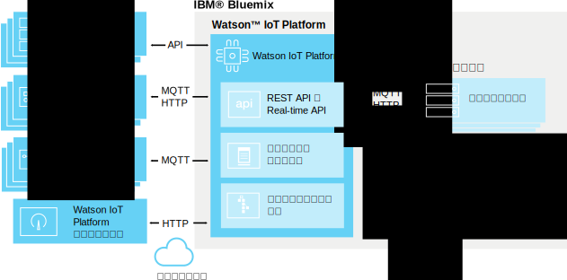

---

copyright:
  years: 2016, 2017
lastupdated: "2017-03-13"

---

{:new_window: target="\_blank"}
{:shortdesc: .shortdesc}
{:screen: .screen}
{:codeblock: .codeblock}
{:pre: .pre}

# {{site.data.keyword.iot_short_notm}} について
{: #about_iotplatform}

{{site.data.keyword.iot_full}} には、IoT のデバイスやデータに対する強力なアプリケーション・アクセス機能が用意されています。この機能は、分析アプリケーション、視覚化ダッシュボード、モバイル IoT アプリを短時間で作成するのに役立ちます。
{:shortdesc}

{{site.data.keyword.iot_short_notm}} では、強力なデバイス管理操作を実行したり、デバイス・データを格納してそれにアクセスしたり、多種多様なデバイスやゲートウェイ・デバイスを接続したりできます。{{site.data.keyword.iot_short_notm}} には、MQTT や TLS を使用してデバイスと安全に通信するための機能が備わっています。

## {{site.data.keyword.iot_short_notm}} のアーキテクチャー
{: #watsoniotplatform_architecture}

**重要:** 分析機能は、{{site.data.keyword.iotrtinsights_full}} サービスからマージされます。既存の {{site.data.keyword.iotrtinsights_short}} インスタンスのデータ・ソースとして {{site.data.keyword.iot_short_notm}} 組織を使用する場合は、既存の {{site.data.keyword.iotrtinsights_short}} インスタンスのマイグレーションが完了するまでクラウド分析とエッジ分析が有効になりません。マイグレーションが完了するまでは、引き続き {{site.data.keyword.iotrtinsights_short}} ダッシュボードを使用して分析要件に対応してください。詳しくは、IBM developerWorks にある [IBM Watson IoT Platform のブログ ](https://developer.ibm.com/iotplatform/2016/04/28/iot-real-time-insights-and-watson-iot-platform-a-match-made-in-heaven/){: new_window} および既存の {{site.data.keyword.iotrtinsights_short}} インスタンス・ダッシュボードをご覧ください。  

{{site.data.keyword.iot_short_notm}} は、{{site.data.keyword.iot_short_notm}} API と {{site.data.keyword.iot_short_notm}} メッセージ・プロトコルを使用してアプリケーションやデバイスと通信します。{{site.data.keyword.iot_short_notm}} ダッシュボードは、プラットフォーム内の操作を簡略化するためのフロントエンド・ユーザー・インターフェースとして接続します。分析ソリューションでは、そのようなデバイス・データを格納したり使用したりできます。

## {{site.data.keyword.iot_short_notm}} の重要な概念
{: #watsoniotplatform_importantconcepts}

### 組織

{{site.data.keyword.iot_short_notm}} に登録すると、組織 ID が与えられます。組織 ID は、6 文字からなるアカウント固有の ID です。組織という区分があるので、自分のデータには自分のデバイスやアプリケーションからしかアクセスできません。登録後は、デバイスと API キーが 1 つの組織だけに結び付けられます。アプリケーションは、API キーを使用してサービスに接続すると、その API キーに関連付けられた組織に登録されます。

セキュリティーを確保するために、組織をまたいだ通信はできなくなっています。2 つの組織の間でデータを送受信するには、相手側組織のアプリケーションと通信するアプリケーションをそれぞれの組織内に作成するしか方法はありません。

**注:** {{site.data.keyword.iot_short_notm}} 組織 ID は、[Bluemix 組織](../../docs/admin/orgs_spaces.html#orginfo) ID とは異なります。

### デバイス

デバイスとは、インターネットに接続してデータをクラウドにプッシュできる装置のことです。ただし、デバイス同士の直接的な通信はできません。デバイスは、アプリケーションからコマンドを受け入れ、アプリケーションにイベントを送信します。{{site.data.keyword.iot_short_notm}} のデバイスは、固有の認証トークンで識別されます。デバイスを {{site.data.keyword.iot_short_notm}} に接続するには、その前にデバイスを登録する必要があります。

{{site.data.keyword.iot_short_notm}} は、2 種類のデバイスを認識します。**管理対象デバイス**と**非管理対象デバイス**です。

**管理対象デバイス**とは、デバイス管理エージェントが組み込まれたデバイスとして定義されます。デバイス管理エージェントとは、デバイスがデバイス管理プロトコルを使用して {{site.data.keyword.iot_short_notm}} デバイス管理サービスと対話するための一連のロジックのことです。管理対象デバイスは、デバイス管理操作 (場所の更新、ファームウェアのダウンロードと更新、リブート、工場出荷時設定へのリセットなど) を実行できます。

**非管理対象デバイス**とは、デバイス管理エージェントのないすべてのデバイスのことです。非管理対象デバイスは、{{site.data.keyword.iot_short_notm}} に接続してイベントやコマンドを送受信できますが、デバイス管理要求を送信したりデバイス管理操作を実行したりすることはできません。

### ゲートウェイ

ゲートウェイとは、アプリケーションとデバイスの機能を組み合わせた特殊なデバイスのことであり、他のデバイスのためのアクセス・ポイントとしての役割も果たせます。インターネットに直接接続できないデバイスは、まずゲートウェイ・デバイスに接続することによって {{site.data.keyword.iot_short_notm}} サービスにアクセスできます。

ゲートウェイをサービスに接続するには、その前にゲートウェイを登録する必要があります。

### アプリケーション

アプリケーションとは、インターネットに接続して、デバイスから送られてくるデータと対話したりデバイスの動作を制御したりするプログラムのことです。{{site.data.keyword.iot_short_notm}} は、API キーと固有のアプリケーション ID でアプリケーションを識別します。デバイスとは異なり、個々のアプリケーションの場合は、登録なしで {{site.data.keyword.iot_short_notm}} に接続できます。ただし、登録済みの有効な API キーを使用しなければなりません。

### イベント

イベントとは、デバイスが {{site.data.keyword.iot_short_notm}} にデータをパブリッシュするためのメカニズムのことです。デバイスは、メッセージの内容を制御し、送信する各イベントに名前を割り当てます。{{site.data.keyword.iot_short_notm}} は、受け取った各イベントに添付されている資格情報を使用して、そのイベントを送信したデバイスを判別します。このアーキテクチャーによって、デバイスが互いに偽名を使用するといったことを防止できます。

アプリケーションは、リアルタイムでイベントを処理して、イベントのソースやイベントに含まれているデータを確認できます。アプリケーションの構成で、サブスクライブ先のデバイスやイベントを定義する必要があります。

### コマンド

コマンドとは、アプリケーションがデバイスと通信するためのメカニズムのことです。コマンドを送信できるのはアプリケーションだけであり、コマンドの送信先は特定のデバイスになります。デバイスでは、所定のコマンドの受信時に実行するアクションを決めておかなければなりません。すべてのコマンドを listen するようデバイスを設計することもできれば、サブスクライブするコマンドのリストを指定することもできます。
