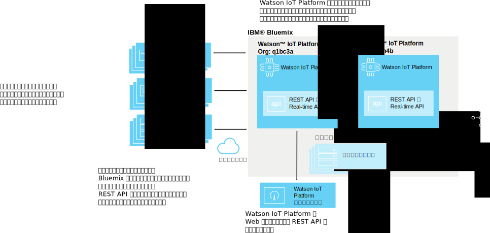
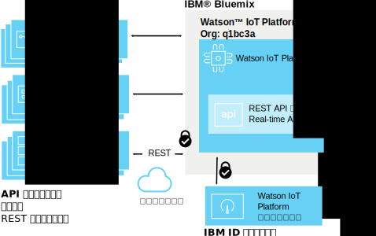
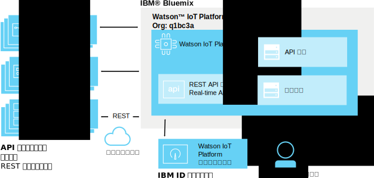
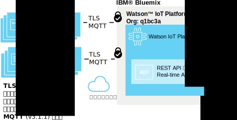
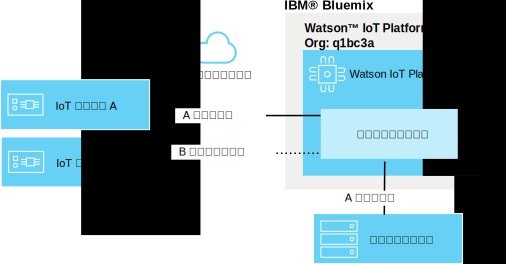
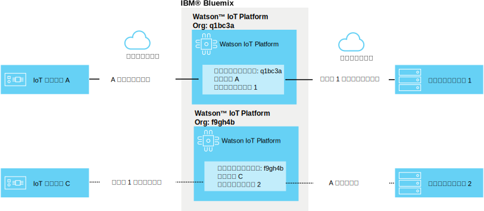

---

copyright:
  years: 2016, 2017
lastupdated: "2017-02-03"

---

{:new_window: target="blank"}
{:shortdesc: .shortdesc}
{:screen: .screen}
{:codeblock: .codeblock}
{:pre: .pre}

# {{site.data.keyword.iot_short_notm}} のセキュリティー
{: #sec-index}

{{site.data.keyword.iot_full}} はクラウド・ホスティング・サービスであるため、セキュリティーを重要視したアーキテクチャーが採用されています。
{: shortdesc}

次の文書では、組織のデータを保護する方法に関する一般的な質問の中から、特定の分野に焦点を当てて答えを提示しています。

* コンプライアンス: セキュリティーのベンチマークを設定する外部の標準。
* 認証: 組織の情報にアクセスしようとするユーザー、デバイス、またはアプリケーションの身元を確認します。
* 権限付与 (許可): ユーザー、デバイス、アプリケーションが組織の情報にアクセスすることを許可します。
* 暗号化: 許可を受けた者だけが読み取れる形式のデータにして、代行受信ができないようにします。

## {{site.data.keyword.iot_short_notm}} と {{site.data.keyword.Bluemix_notm}}
{: #iot-bluemix-sec}

{{site.data.keyword.iot_short_notm}} は {{site.data.keyword.Bluemix_notm}} プラットフォーム内で実行されるため、アクセスと接続を {{site.data.keyword.Bluemix_notm}} と {{site.data.keyword.BluSoftlayer_full}} の両方に依存しています。{{site.data.keyword.Bluemix_notm}} と {{site.data.keyword.BluSoftlayer}} に依存しているため、{{site.data.keyword.iot_short_notm}} のユーザーにとって、{{site.data.keyword.Bluemix_notm}} と {{site.data.keyword.BluSoftlayer}} のセキュリティーと信頼性は重要です。

{{site.data.keyword.Bluemix_notm}} のセキュリティーについて詳しくは、[{{site.data.keyword.Bluemix_notm}} プラットフォームのセキュリティー ](https://console.ng.bluemix.net/docs/security/index.html#platform-security){: new_window} を参照してください。

## {{site.data.keyword.iot_short_notm}} のセキュリティー・コンプライアンス
{: #compliance}  
   
{{site.data.keyword.iot_short_notm}} は、情報セキュリティー管理プロセスのベスト・プラクティスを定義する、国際標準化機構 (ISO) 27001 標準で認定されています。ISO 27001 標準では、情報セキュリティー管理システム (ISMS) の確立、実装、および文書化に関する条件、および個々の企業のニーズに沿ったセキュリティー管理の実装に関する条件が規定されています。ISO 27000 標準ファミリーには、書面情報、口頭による情報、および電子情報の機密性、整合性、可用性を保護するための、資産のリスクと価値の査定プロセスが含まれています。

{{site.data.keyword.iot_short_notm}} は第三者のセキュリティー機関によって監査されており、ISO 27001: {{site.data.keyword.iot_short_notm}} ISO 27001:2013 Certificate of Registration のすべての条件を満たしています。

## {{site.data.keyword.iot_short_notm}} 用語
{: #terminology}

## 組織内の IoT 情報管理のセキュリティー保護方法
{: #secure-org}

ブラウザー・ベースの GUI および REST API は、DigiCert が署名した証明書を使用して HTTPS で動作するので、正真正銘の {{site.data.keyword.iot_short_notm}} と接続していると信頼できます。Web ベースの GUI へのアクセスは、IBMid または {{site.data.keyword.Bluemix_notm}} {{site.data.keyword.ssoshort}} によって認証されます。REST API を使用するには GUI で生成された API キーが必要であり、これを使用して組織に対して認証済み REST API 呼び出しを行うことができます。

## デバイスとアプリケーションの資格情報のセキュリティー保護方法
{: #secure-credentials}

デバイスの登録時または API キーの生成時には、認証トークンに対してソルト処理およびハッシュ処理が行われます。そのため、{{site.data.keyword.iot_short_notm}} から情報が漏えいするという不測の事態が万が一発生したとしても、当社のシステムからお客様組織の資格情報を復元することは決してできなくなります。

デバイス資格情報や API キーが漏えいした場合には、それらを個別に取り消すことが可能です。

## デバイスと {{site.data.keyword.iot_short_notm}} の接続のセキュリティー保護方法
{: #secure-device-connection}

接続されるデバイスは、プラットフォームにそのデバイスを追加したときに生成された clientId と認証トークンの組み合わせを使用します。多くのプラットフォームと言語で使用するときの相互運用性が高い MQTT v3.1.1 が使用されます。{{site.data.keyword.iot_short_notm}} は TLS v1.2 を介した接続をサポートします。

TLS および暗号スイートの要件について詳しくは、`Watson IoT Platform へのアプリケーション、デバイス、ゲートウェイの接続`という資料の [TLS 要件 ](https://console.ng.bluemix.net/docs/services/IoT/reference/security/connect_devices_apps_gw.html#tls_requirements){: new_window} セクションを参照してください。

## IoT デバイス間のデータ・リークを回避する方法
{: #prevent-leak-devices}

安全性の高いメッセージ・パターンが実現されています。認証されたデバイスは、制限されたトピック・スペースについてのみパブリッシュとサブスクライブが可能になるように権限が与えられます。

* '/iot-2/evt/<event_id>/fmt/<format_string>'
* '/iot-2/cmd/<command_id>/fmt/<format_string>'

すべてのデバイスは、同じトピック・スペースで動作します。{{site.data.keyword.iot_short_notm}} がそのトピック・スペースの対象スコープをどのデバイスにするかは、クライアントから提供される認証資格情報によって決まります。これにより、デバイスで別のデバイスの偽名を使用する行為を防止できます。

デバイスのセキュリティー資格情報が漏えいしてそれを誰かが入手した場合を除き、別のデバイスで偽名を使用することはできません。

アプリケーションは、組織内のすべてのデバイスのイベントとコマンドの両方のトピックについてサブスクライブとパブリッシュが可能です。アプリケーションは、同時に多くのデバイスからのデータを分析することが可能です。また、全二重通信ループの補足側を形成することに加えて、デバイスのシミュレートやプロキシーも可能です。

## 複数組織間の IoT データ・リークの回避方法
{: #prevent-leak-org}

デバイスおよびアプリケーションの動作するトピック・スペースの対象スコープは、単一組織内に限られます。認証後、{{site.data.keyword.iot_short_notm}} はクライアント認証に基づき組織 ID を使用してトピックの構造を変換するため、ある組織からのデータを別の組織からアクセスすることは不可能です。

# 関連リンク
{: #rellinks}
## 関連リンク
{: #general}
* [{{site.data.keyword.iot_short_notm}} の概説](https://console.ng.bluemix.net/docs/services/IoT/index.html)
* [{{site.data.keyword.Bluemix_notm}} のセキュリティー ](https://console.ng.bluemix.net/docs/security/index.html#security "外部リンク・アイコン"){:new_window}
* [{{site.data.keyword.Bluemix_notm}} プラットフォームのセキュリティー ](https://console.ng.bluemix.net/docs/security/index.html#platform-security "外部リンク・アイコン"){:new_window}
* [{{site.data.keyword.Bluemix_notm}} のコンプライアンス](https://console.ng.bluemix.net/docs/security/index.html#compliance){:new_window}
* [{{site.data.keyword.BluSoftlayer}} のセキュリティー ](http://www.softlayer.com/security "外部リンク・アイコン"){:new_window}
* [{{site.data.keyword.BluSoftlayer}} のコンプライアンス ](http://www.softlayer.com/compliance "外部リンク・アイコン"){:new_window}
