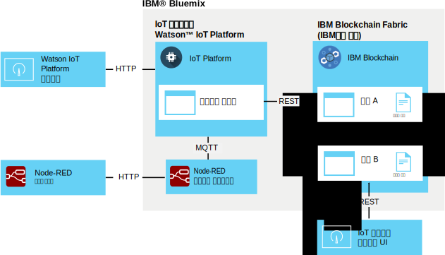

---

copyright:
  years: 2016, 2017
lastupdated: "2017-02-17"

---

{:new_window: target="\_blank"}
{:shortdesc: .shortdesc}
{:screen: .screen}
{:codeblock: .codeblock}
{:pre: .pre}

# {{site.data.keyword.iot_short_notm}} 블록체인 통합
{: #gettingstartedtemplate}

{{site.data.keyword.iot_short_notm}} 블록체인 통합을 사용하여 IoT 디바이스는 블록체인 트랜잭션에 데이터를 제공할 수 있으며, 블록체인 트랜잭션은 블록체인의 불변 원장에 데이터를 저장하고 블록체인의 스마트 계약에서 구현된 비즈니스 규칙에서 해당 데이터를 사용합니다.
{:shortdesc}

플랫폼은 고유 MQTT 형식으로 디바이스 데이터를 가져오고, 이를 블록체인의 스마트 계약에서 필요한 데이터 형식으로 맵핑하며, 블록체인 원장에 저장할 수 있도록 이를 블록체인 패브릭에 전달합니다. 블록체인 패브릭은 {{site.data.keyword.blockchainfull}} 및 Hyperledger의 인스턴스를 구성하는 피어 및 인증 노드의 콜렉션입니다. 

## 블록체인 통합 아키텍처  
{: #architecture}

일반 {{site.data.keyword.iot_short_notm}} 블록체인 통합 환경은 다음 컴포넌트로 구성되어 있습니다. 
- 블록체인 원장에 기록할 데이터를 생성하는 하나 이상의 디바이스. 
- {{site.data.keyword.Bluemix_notm}} 조직:
 - IoT 블록체인 통합이 사용되는 {{site.data.keyword.iot_short_notm}} 서비스. 
 - 하나 이상의 스마트 계약이 배치된 {{site.data.keyword.blockchainfull_notm}} 또는 Hyperledger 패브릭. 
- 로컬 환경:
 - IoT 블록체인 모니터링 UI

스마트 계약을 생성하고 배치하기 위한 확장 환경의 설정 및 요구사항에 대한 정보는 [{{site.data.keyword.iot_short_notm}} 블록체인 통합을 위한 스마트 계약 개발](blockchain/dev_blockchain.html)을 참조하십시오.   

다음 다이어그램은 일반 {{site.data.keyword.iot_short_notm}} 블록체인 통합 환경을 예시합니다. 

## 시작하기 전에
{: #byb}

- {{site.data.keyword.iot_short_notm}}, 일반 블록체인 개념과의 연관성 및 해당 역할에 대한 개요를 IBM.com의 [{{site.data.keyword.iot_short_notm}}()](http://www.ibm.com/blockchain/){: new_window}에서 개요를 파악하십시오.
- 조직에 대해 [{{site.data.keyword.iot_short_notm}} 블록체인 통합을 사용하십시오](reference/extensions/index.html#blockchain). 
- 블록체인 원장에 기록할 데이터를 생성하는 디바이스를 연결하십시오.
  
[디바이스 연결](iotplatform_task.html) 주제의 지시사항에 따라 디바이스를 연결하십시오. 
- 모니터링 UI를 설치하십시오. 모니터링 UI는 {{site.data.keyword.iot_short_notm}} 및 블록체인 패브릭 간의 연결을 확인하는 데 사용됩니다. [Blockchain Monitoring UI ](https://github.com/ibm-watson-iot/blockchain-samples/tree/master/applications/monitoring_ui){: new_window} GitHub 디렉토리에서 사용 가능한 모니터링 UI readme 문서의 지시사항을 따르십시오.

### IBM 기본 시나리오를 사용하여 빨리 시작하기

{{site.data.keyword.iot_short_notm}} 블록체인 통합의 테스트를 빠르게 시작할 수 있도록 IBM 제공 패브릭에 연결하고 Node-RED 샘플 디바이스를 IBM 제공 샘플 계약에 맵핑할 수 있습니다. 이 시나리오에 필요한 단계는 이 주제에서 **IBM 기본 시나리오**라는 레이블이 지정되어 있습니다.   
**중요:** 참고로, 샘플 블록체인의 모든 사용자는 IBM 제공 샘플 블록체인 원장 및 모든 해당 데이터를 볼 수 있습니다. 그러므로 IBM 제공 샘플 블록체인에는 민감한 정보를 저장하지 마십시오. 또한 각 피어에 대한 연결 정보를 포함하여 샘플 및 거래선 계약을 지원하는 샘플 패브릭은 변경될 수 있습니다. 연결 세부사항은 Watson IoT 블록체인 커뮤니티의 [IoT 블록체인 연결 정보 ](https://www.ibm.com/developerworks/community/wikis/home?lang=en#!/wiki/W7a44a0e604d9_4a90_89b7_0a2bdbe81b00/page/Blockchain%20Fabric%20Connections){: new_window} 위키 페이지에서 제공됩니다.

IBM 제공 기본 {{site.data.keyword.iot_short_notm}} 블록체인 통합 환경은 다음 컴포넌트로 구성되어 있습니다. 
- {{site.data.keyword.Bluemix_notm}}:
 - IoT 블록체인 통합이 사용되는 {{site.data.keyword.iot_short_notm}} 서비스
 - 선택사항: IoT 디바이스 시뮬레이터를 실행 중인 Node-RED 애플리케이션  
 **참고:** 디바이스 시뮬레이터를 로컬 Node-RED 환경에 배치할 수도 있습니다. 
- 로컬 환경:
 - Node.js
 - IoT 블록체인 모니터링 UI
- IBM 제공:
 - 선택사항: 단순 스마트 계약이 사전 배치된 {{site.data.keyword.iot_short_notm}} 패브릭. 

다음 아키텍처 다이어그램은 이 샘플 시나리오에 필요한 컴포넌트를 예시합니다. 

**IBM 기본 시나리오:** [Node-RED 디바이스 시뮬레이터 작성 및 연결](nodereddevice_sample.html) 주제의 지시사항에 따라 Node-RED 디바이스 시뮬레이터를 작성하십시오. 블록체인 통합의 경우에는 노드 데이터를 가져올 때 블록체인 디바이스 특정 노드 정보를 사용하십시오. 노드 정보는 Watson IoT 블록체인 커뮤니티의 [Node-RED 디바이스 시뮬레이터 ](https://www.ibm.com/developerworks/community/wikis/home?lang=en#!/wiki/W7a44a0e604d9_4a90_89b7_0a2bdbe81b00/page/Node-RED%20Device%20Simulator){: new_window} 위키 페이지에서 사용 가능합니다. 필요하면 IBM 블록체인 담당자에게 문의하여 커뮤니티에 대한 액세스 권한을 얻으십시오. 

## 블록체인 패브릭에 연결
{: #getting_started}  
{{site.data.keyword.iot_short_notm}} 블록체인 통합이 사용되므로, 이제 {{site.data.keyword.blockchainfull_notm}} 또는 Linux Foundation Hyperledger에서 호스팅하는 블록체인 패브릭에 연결할 수 있습니다. 

블록체인 패브릭에 연결하려면 다음을 수행하십시오. 
1. {{site.data.keyword.iot_short_notm}} 대시보드에서 **확장기능**을 선택하십시오.
2. **확장기능** 페이지의 블록체인 타일에서 **설정**을 클릭하십시오. 
3. **확장기능** 페이지의 블록체인 타일에서 **설정**을 클릭하거나, 패브릭이 이미 링크되어 있으면 을 클릭한 후에 패브릭 정보를 입력하십시오. 
 1. **패브릭** 탭에서 {{site.data.keyword.iot_short_notm}}의 패브릭을 식별하는 이름을 입력한 후에 **다음**을 클릭하십시오.    
 2. **피어** 탭에서 피어 정보를 입력하십시오.   
<table>
<thead>
<tr>
<th>매개변수</th>
<th>값</th>
</tr>
</thead>
<tbody>
<tr>
<td>이름</td>
<td>{{site.data.keyword.iot_short_notm}}에서 피어를 식별하는 이름을 입력하십시오. </td>
</tr>
<tr>
<td>호스트</td>
<td>유효성 검증 피어 1 서버의 `api_host` 주소입니다. </td>
</tr>
<tr>
<td>포트</td>
<td>`api_port` 번호<ul><li>구현에서 TLS을 사용하지 않으면 포트 80을 사용하십시오. </li><li>구현에서 TLS을 사용하면 포트 443을 사용하십시오. </li></ul></td>
</tr>
<tr>
<td>사용자 ID</td>
<td>블록체인에서 스마트 계약을 등록하는 데 사용된 사용자의 `username` 문자열입니다. 나중에 단순 UI를 구성할 때 이 사용자 ID를 사용할 수도 있습니다. </td>
</tr>
<tr>
<td>비밀 키</td>
<td>사용자의 `secret` 문자열</td>
</tr>
<tr>
<td>TLS 사용</td>
<td>켜짐 또는 꺼짐 전송 계층 보안을 사용하여 패브릭의 계약 및 {{site.data.keyword.iot_short_notm}} 간의 통신을 암호화할 수 있습니다. 기본 포트 번호는 연결 중인 배치된 {{site.data.keyword.iot_short_notm}} 인스턴스에 의해 설정됩니다. </td>
</tr></tbody>
</table>  
 3. **완료**를 클릭합니다.
3. 블록체인 구성 섹션에서 **완료**를 클릭하여 패브릭 정보를 저장하십시오. 

**IBM 기본 시나리오:** IBM 제공 패브릭에 연결하려면 Watson IoT 블록체인 커뮤니티의 [IoT 블록체인 연결 정보 ](https://www.ibm.com/developerworks/community/wikis/home?lang=en#!/wiki/W7a44a0e604d9_4a90_89b7_0a2bdbe81b00/page/Blockchain%20Fabric%20Connections){: new_window} 위키 페이지에서 제공된 샘플 계약의 연결 세부사항을 사용하십시오. 필요하면 IBM 블록체인 담당자에게 문의하여 커뮤니티에 대한 액세스 권한을 얻으십시오. 

## 스마트 계약에 디바이스 데이터 맵핑
{: #map_device_properties}

디바이스 데이터를 블록체인 원장에 쓰려면, 우선 디바이스 유형의 디바이스 특성을 스마트 계약에서 정의한 매개변수로 맵핑해야 합니다. 

계약에 디바이스 데이터를 맵핑하려면 다음을 수행하십시오. 
 1. {{site.data.keyword.iot_short_notm}} 대시보드의 메뉴 사이드바에서 을 클릭하십시오. 
 3. **디바이스 데이터 맵핑**을 클릭하십시오. 
 4. 블록체인에 디바이스 데이터를 저장할 대상 디바이스 유형을 선택하십시오. 
 5. 저장할 이벤트에 대한 이벤트 이름을 입력하십시오.   
 **팁:** 샘플 Node-RED 블록체인 디바이스의 기본 이벤트 이름은 "obc"입니다. 디바이스의 이벤트 유형을 찾으려면, {{site.data.keyword.iot_short_notm}} 대시보드에서 **디바이스**를 선택하고 디바이스 이름을 클릭하여 디바이스 세부사항 페이지를 여십시오. 아래의 **센서 정보** 섹션으로 화면이동하면 디바이스에 대해 사용 가능한 이벤트 및 데이터 점의 목록을 볼 수 있습니다. IoT mqtt 아웃 노드에 공개에서 주제 필드를 업데이트하여 Node-RED 디바이스가 공개하는 이벤트 이름을 변경할 수 있습니다.   
 6. **다음**을 클릭하십시오. 
 6. 이전에 작성한 패브릭 인스턴스를 선택하십시오. 
 7. 계약 이름과 계약 ID를 입력하십시오.   
<table>
<thead>
<tr>
<th>매개변수</th>
<th>설명</th>
</tr>
</thead>
<tbody>
<tr>
<td>계약 이름</td>
<td>{{site.data.keyword.iot_short_notm}}에서 계약을 식별하는데 사용되는 이름입니다. </td>
</tr>
<tr>
<td>계약 ID</td>
<td>맵핑된 계약의 고유 128자 ID입니다.   **중요:** 맵핑하는 계약은 최소한 다음 메소드를 지원해야 합니다.
- updateAsset
- readAssetSchemas  </td>
</tr>
</tbody>
</table>
**IBM 기본 시나리오:** 사전 배치된 샘플 스마트 계약을 사용하면 블록체인 원장에 데이터 점 값을 저장할 수 있도록 특정 계약 속성에 디바이스 데이터 점을 맵핑할 수 있습니다. 샘플 계약을 사용하면 보다 고급의 거래선 계약을 시도하거나 자체 계약을 쓰기 전에 디바이스 데이터 맵핑을 테스트할 수 있습니다. 계약 ID는 Watson IoT 블록체인 커뮤니티의 [IoT 블록체인 연결 정보 ](https://www.ibm.com/developerworks/community/wikis/home?lang=en#!/wiki/W7a44a0e604d9_4a90_89b7_0a2bdbe81b00/page/Blockchain%20Fabric%20Connections){: new_window} 위키 페이지에서 제공됩니다. 필요하면 IBM 블록체인 담당자에게 문의하여 커뮤니티에 대한 액세스 권한을 얻으십시오.

 8. 디바이스 특성을 계약 매개변수에 맵핑하기 위한 라우트를 작성하십시오.  
 계약에서 사용 가능한 매개변수를 가져옵니다. 각 매개변수마다 대응되는 이벤트 특성을 입력하십시오.  
 **중요:** 디바이스 메시지의 데이터 점에 접두부로 추가된 `d.`는 포함하지 마십시오.
 **IBM 기본 시나리오:** IBM 제공 계약을 사용 중인 경우에는 Watson IoT 블록체인 커뮤니티의 [데이터 맵핑 ](https://www.ibm.com/developerworks/community/wikis/home?lang=en#!/wiki/W7a44a0e604d9_4a90_89b7_0a2bdbe81b00/page/Data%20Mapping){: new_window} 위키 페이지에 나열된 다음 매개변수를 맵핑하십시오. 필요하면 IBM 블록체인 담당자에게 문의하여 커뮤니티에 대한 액세스 권한을 얻으십시오. 
 9. 요약 페이지에서 모든 정보가 올바르게 입력되었는지 확인하십시오. 
 10. 디바이스 데이터 대 계약 맵핑이 블록체인 페이지에 표시됩니다. 

축하드립니다! 이제 시작하고 실행할 수 있습니다! 

## IBM 제공 샘플 스마트 계약의 테스트 구동
{: #test_simple}

IBM 제공 패브릭에 연결되었으며 디바이스 데이터를 샘플 계약에 맵핑한 경우에는 디바이스에서 블록체인 원장으로의 종단간 데이터 플로우를 테스트할 수 있습니다. IoT 블록체인 모니터링 UI를 사용하면 자산에 대한 블록체인 활동 및 데이터를 볼 수 있습니다.   
**팁:** 모니터링 UI가 아직 로컬 환경에 설치되지 않았으면 지금 이를 설치할 수 있습니다. [Blockchain Monitoring UI ](https://github.com/ibm-watson-iot/blockchain-samples/tree/master/applications/monitoring_ui){: new_window} GitHub 디렉토리에서 사용 가능한 모니터링 UI readme 문서의 지시사항을 따르십시오.  
1. {{site.data.keyword.iot_short_notm}}에 연결하도록 모니터링 UI를 구성하십시오.   
모니터링 UI에서 **구성**을 클릭하여 모니터링 UI 연결을 구성하십시오. 
 <table>
<thead>
<tr>
<th>매개변수</th>
<th>설명</th>
</tr>
</thead>
<tbody>
<tr>
<td>API 호스트 및 포트</td>
<td>`http://`가 접두어로 지정된 {{site.data.keyword.iot_short_notm}} REST API에 대한 호스트 및 포트입니다. `api_host` 주소 및 `api_port` 번호를 사용하십시오. </td>
</tr>
<tr>
<td>체인코드 ID</td>
<td>체인코드 ID는 계약 ID 항목에 대응되는 128자 영숫자 문자열입니다.   
**중요:** 체인코드 ID를 잘라내어 붙여넣을 때는 ID에 공백이 포함되지 않는지 확인하십시오. ID가 잘못 입력된 경우, 블록체인 원장 항목은 표시되지만 자산 검색 기능은 작동하지 않습니다.
</td>
</tr>
<tr>
<td>보안 컨텍스트</td>
<td>이 매개변수는 Bluemix에서 {{site.data.keyword.iot_short_notm}} 인스턴스에 연결하는 데 필요합니다. secureContext 항목을 사용하십시오.   
**중요:** secureContext는 패브릭을 작성할 때 정의된 패브릭의 권한 부여된 사용자여야 합니다.
</td>
</tr>
</tbody>
</table>
**IBM 기본 시나리오:** 기본 또는 거래선 계약에 연결하도록 모니터링 UI를 구성하려면 Watson IoT 블록체인 커뮤니티의 [IoT 블록체인 연결 정보 ](https://www.ibm.com/developerworks/community/wikis/home?lang=en#!/wiki/W7a44a0e604d9_4a90_89b7_0a2bdbe81b00/page/Blockchain%20Fabric%20Connections){: new_window} 위키 페이지에서 제공하는 연결 세부사항을 사용하십시오. 필요하면 IBM 블록체인 담당자에게 문의하여 커뮤니티에 대한 액세스 권한을 얻으십시오.
2. Node-RED 플로우 편집기에서 CON123 노드의 단추를 클릭하여 디바이스 데이터를 삽입하고 이를 {{site.data.keyword.iot_short_notm}}에 메시지로서 전송하며 단순 계약에 의해 {{site.data.keyword.iot_short_notm}} 원장에 기록되도록 하십시오.   
**팁:** 연속적인 데이터 플로우를 가져오려면, 삽입 노드를 두 번 클릭하고 반복 매개변수를 `interval`로 설정한 후에 적합한 간격(예: 매 1분마다)을 구성하십시오. 
3. 모니터링 UI에서, 디바이스 데이터가 블록체인 블록에서 예상한 대로 표시되는지 확인하십시오.   
  1. 디바이스에서 데이터를 삽입할 때 블록이 체인에 추가되는지 확인하십시오.  
  **중요:** 브라우저의 새로 고치기 단추를 사용하여 모니터링 UI를 새로 고치지 마십시오. UI는 수 초마다 자동으로 새로 고쳐집니다. 브라우저의 새로 고치기 단추를 사용하면 UI 설정이 자체 기본값으로 재설정되며, 계약 블록체인을 보려면 모니터링 UI를 재구성해야 합니다. 
  2. 자산에 대한 최신 원장 정보를 보려면, 자산 ID 검색 필드에서 자산의 ID를 입력하고 **제출**을 클릭하십시오. 예제: `CON123`  
  동일한 계약을 사용하는 다른 자산에 대한 블록체인 데이터를 보려면, 해당 자산 이름을 입력하고 **제출**을 클릭하십시오. **재설정**을 클릭하여 다시 시작할 수 있습니다.  
  **팁:**
    - 변경사항 폴링 기능을 켜면 관찰/모니터 중인 자산의 변경사항에 대해 UI가 지속적으로 폴링을 수행하며 블록체인에서 변경사항이 커미트되는 순간 데이터 새로 고치기가 수행됩니다. 
    - 블록체인 디바이스의 기본 assetID는 "CON123"입니다. Node-RED 디바이스 시뮬레이터에서 assetID를 업데이트하거나 디바이스 메시지를 수정한 경우에는 {{site.data.keyword.iot_short_notm}}에서 assetID를 찾아볼 수 있습니다. **디바이스** 페이지로 이동하고 디바이스를 클릭하여 디바이스 세부사항 페이지를 여십시오. 아래의 **센서 정보** 섹션으로 화면이동하면 디바이스에 대한 데이터 점의 목록을 볼 수 있습니다. assetID의 `d.assetID` 데이터 점에 대한 값을 사용하십시오. 

## 다음 단계  
{: #next_steps}  
이제 기본 IoT 블록체인 통합 {{site.data.keyword.iot_short_notm}} 환경이 설치되고 구성되었습니다. 이 최소 시나리오에서, 기본 스마트 계약을 사용하면 디바이스 데이터를 블록체인 원장에 기록하여 영구적인 디바이스 데이터 히스토리를 작성할 수 있습니다. 이제 이 초기 단계를 완료했으며 단순 계약을 테스트했으므로, 보다 고급의 거래선 샘플 계약을 시도하고 자체 계약을 작성할 수 있습니다.     

이러한 보다 고급 단계에 대한 지시사항은 [{{site.data.keyword.iot_short_notm}} 블록체인 통합을 위한 스마트 계약 개발](blockchain/dev_blockchain.html) 주제에서 제공됩니다. 
