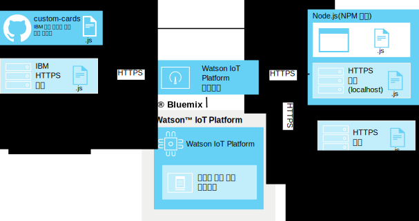

---

copyright:
  years: 2016, 2017
lastupdated: "2016-10-13"

---

{:new_window: target="\_blank"}
{:shortdesc: .shortdesc}
{:screen: .screen}
{:codeblock: .codeblock}
{:pre: .pre}

# 사용자 정의 카드
{: #custom_cards}

사용자 정의 카드를 사용하여 {{site.data.keyword.iot_full}}에 제공되는 일반 카드보다 나은 IoT(Internet of Things) 데이터 시각화를 수행할 수 있습니다.
{:shortdesc}

## 아키텍처
{: #architecture}  

사용자가 사용자 정의 카드를 개발하며, 고유 사용자 정의 카드 HTTP 서버 저장소를 사용하여 이 카드를 배치합니다. 이 서버는 {{site.data.keyword.iot_short_notm}} 대시보드를 표시하고 처리할 때 사용자 브라우저를 통해 액세스할 수 있습니다. {{site.data.keyword.iot_short_notm}}은 사용자 정의 카드 확장기능을 통해 브라우저 연결을 관리하지만 사용자 정의 카드 서버에 자체 연결되지 않습니다.

{{site.data.keyword.iot_short_notm}} 대시보드를 실행 중인 브라우저는 사용자 정의 카드 서버에서 직접 모든 필수 리소스를 검색합니다. 사용자 정의 카드는 “카드 추가” 대화 상자에 제공되고 사용자가 구성한 사용자 작성 보드에 표시됩니다.

카드 서버를 사용하여 중앙화된 버전 제어를 사용으로 설정하기 위해 사용자 정의 카드 코드가 클라이언트 측에 캐시되지 않습니다. 사용자 정의 카드를 더 이상 사용할 수 없거나 카드 서버에 연결할 수 없는 경우 플레이스홀더를 사용하여 일관된 대시보드 레이아웃을 유지합니다.

**팁:** 고유 개발 환경을 설정하지 않고 사용자 정의 카드 기능을 테스트하기 위해 `https://customcards.mybluemix.net`에서 IBM 제공 샘플 사용자 정의 카드 서버에 연결할 수 있습니다.

카드를 빌드하려면 node.js 기반 로컬 개발 환경을 설정하고 IBM 제공 사용자 정의 카드 GitHub 저장소에서 샘플 카드를 가져와야 합니다. 카드를 작성한 후 {{site.data.keyword.iot_short_notm}} 사용자 정의 카드 확장기능을 링크하는 보안(HTTPS) 웹 서버에 카드 패키지를 배치합니다.   

**팁:** 카드의 초기 테스트 및 문제점 해결을 위해 기본 제공 node.js 웹 서버를 사용할 수 있지만 카드의 프로덕션 배치에는 보안되고 잘 관리되는 웹 서버를 사용해야 합니다.

 

## 보안
{: #security}

사용자 정의 카드 서버의 카드에 배치하도록 선택하는 Javascript 코드에 제한사항이 없습니다. 사용자 정의 카드의 Javascript 코드에는 대시보드에서 실행되는 다른 카드와 같이 브라우저에 있는 모든 정보에 대한 액세스 권한이 있습니다. 올바른 사용자 정의 카드 서버가 사용자 정의 카드를 표시하고 처리하도록 브라우저에 코드를 제공하는지 확인하십시오.

카드는 {{site.data.keyword.iot_short_notm}} 브라우저 세션의 코드를 작성된 그대로 실행합니다. 또한 사용자 정의 카드 서버 연결이 사용자 정의 카드 서버에 신임 정보가 제공되지 않은 채로 작성됩니다. 사용자 브라우저는 구성된 사용자 정의 카드 서버에 연결할 수 있습니다.

사용자 대시보드에 사용자 정의 카드를 제공하려면 알려지고 보안된 사용자 정의 카드 서버만 구성해야 합니다.   

사용자 정의 카드 서버 보안 방법에 대한 자세한 정보는 [사용자 정의 카드 보안](../reference/security/custom_cards_server.html)을 참조하십시오.

다음 단계에서는 테스트 카드 서버에 연결하고 고유 카드 서버에 샘플 카드를 배치하고 마지막으로 고유 카드를 작성하여 서버에 배치하는 프로세스를 거칩니다.

## 1단계: 샘플 카드 서버에 {{site.data.keyword.iot_short_notm}}을 연결하십시오.
{: #connect-to-sample}  

{{site.data.keyword.iot_short_notm}}에서 사용자 정의 카드 기능을 테스트하기 위해 샘플 사용자 정의 카드 서버에 연결할 수 있습니다. 샘플 서버에 고유 카드 작성을 위한 템플리트로도 사용 가능한 일반 카드 세트가 포함됩니다.

샘플 사용자 정의 카드 서버에 연결하려면 다음을 수행하십시오.
1. {{site.data.keyword.iot_short_notm}} 대시보드에 관리자로 로그인하십시오.
2. 시범 기능을 사용하십시오.  
사용자 정의 카드가 현재 시범 기능으로 제공됩니다.  
**중요:** 브라우저 세션마다 시범 사용자 정의 카드 확장기능을 사용으로 설정해야 합니다. 사용자 정의 카드 연결 및 카드 패키지는 {{site.data.keyword.iot_short_notm}} 조직에서 글로벌로 공유되지 않습니다.
 1. **설정**으로 이동하십시오.
 2. 시범 기능 섹션에서 **시범 기능 활성화**가 사용 가능한지 확인하십시오.
2. 샘플 서버에 연결하십시오.
 2. **확장기능**으로 이동하십시오.
 3. **확장기능 추가**를 클릭하고 **사용자 정의 카드** 확장기능을 선택하십시오.
 4. **사용자 정의 카드** 타일에서 **설정**을 클릭하십시오.
 5. 사용자 정의 카드 구성 섹션에서 **추가**를 클릭하고 서버 필드에 샘플 카드 서버의 보안(HTTPS) URL을 입력하십시오.  
고유 서버에 연결하는 경우 해당 서버의 URL을 입력하십시오.    
**팁:** IBM 샘플 카드 서버의 URL은 `https://customcards.mybluemix.net`입니다.  
 6. **인증서 검색**을 클릭하여 사용자 정의 카드 서버에 연결하고 서버의 보안 인증서 정보를 검색하십시오.   
 **중요:** 인증서 정보를 사용하여 목표로 한 알려지고 보안된 사용자 정의 카드 서버에 연결하고 있는지 확인하십시오.
 4. **완료**를 클릭하여 서버 연결을 추가하십시오.
5. 샘플 카드를 기반으로 한 새 카드를 작성하십시오.
 1. {{site.data.keyword.iot_short_notm}} 대시보드에서 **보드**로 이동하십시오.
 2. **새 보드 작성**을 클릭하십시오.  
새 보드 작성 대화 상자를 완료하십시오. 정보는 [보드 및 카드 작성](../data_visualization.html#visualizing_data)을 참조하십시오.
 3. 새 보드를 여십시오.
 4. **새 카드 추가**를 클릭하십시오.  
 5. **사용자 정의 카드**까지 아래로 화면이동하고 샘플 카드 중 하나를 선택하십시오.  
카드 작성 프로세스를 완료하십시오. 정보는 [보드 및 카드 작성](../data_visualization.html#visualizing_data)을 참조하십시오.  

 새 사용자 정의 카드는 이제 새 보드에 있습니다.  
 

사용자 정의 카드 서버에 연결되고 보드 중 하나에 사용자 정의 카드가 추가되었습니다. 다음 단계는 Helloworld 샘플 카드를 사용하여 고유 카드 서버를 설정하고 첫 번째 카드를 작성하는 것입니다.

## 2단계: 카드 서버를 설정하고 HelloWorld 샘플 카드를 배치하십시오.
{: #create-hello-world}

사용자 정의 카드 개발을 준비하기 위해 로컬 사용자 정의 카드 개발 환경을 설정하고 HelloWorld 샘플 카드 배치를 테스트할 수 있습니다.

사용자 정의 카드 서버를 작성하고 IBM 샘플 카드를 배치하려면 [custom-cards repository](https://github.com/ibm-watson-iot/custom-cards/blob/master/README.md) readme의 상세 지시사항을 따르십시오.

다음 상위 레벨 단계가 프로세스에 포함됩니다.
1. 로컬 개발 환경에 npm 노드 패키지 관리자와 함께 Node.js가 있는지 확인하십시오.  
다운로드 링크를 포함해 Node.js 설치에 대한 정보를 보려면 https://nodejs.org로 이동하십시오.
2. 사용자 정의 카드 패키지를 호스팅하도록 HTTP 서버를 설정하십시오.    
  - 서버에 사용자 정의 카드 컨텐츠를 제공하는 디렉토리에는 신임 정보에 대한 액세스가 필요하지 않습니다.
  - 서버가 HTTPS 프로토콜을 사용해야 합니다.
  - 서버가 CORS(Cross-Origin Resource Sharing) 연결을 지원해야 합니다.  
**팁:** 테스트 및 개념 증명 작업에서 기본 제공 샘플 node.js 서버를 사용할 수 있으며 해당 서버는 이러한 요구사항을 충족하도록 구성되어 있습니다.
3. 고유 저장소를 작성하십시오.
https://github.com/ibm-watson-iot/custom-cards에서 사용자 정의 카드 저장소 예에 분기를 지정하고 이 저장소를 복제하십시오.
4. 고유 모듈 및 카드 프레임워크를 작성하십시오.
사용자 정의 카드가 모듈에서 구성됩니다. 새 HelloWorld 카드 모듈을 설정하십시오.
5. 새 카드를 참조하십시오.
사용자 정의 카드 패키지에 여러 모듈이 포함될 수 있습니다. 기본 패키지 파일에서 새 모듈을 참조해야 합니다.
6. 모듈을 등록하십시오.
카드가 {{site.data.keyword.iot_short_notm}} 조직의 보드에서 사용 가능하게 하려면 `DashboardConfig.json` 파일에 카드 구성 세부사항을 추가해야 합니다.
7. 카드 패키지를 빌드하십시오.
Gulp를 사용하여 자동화된 빌드 엔진을 설정하십시오.
8. 카드 서버에 카드 패키지를 배치하십시오.  
{{site.data.keyword.iot_short_notm}}에서 카드를 사용하려면 먼저 사용자 정의 카드 HTTP 서버에 카드 패키지를 배치해야 합니다.  
**팁:** 카드 서버에 카드 패키지를 재배치하여 상황에 따라 새 카드를 추가하거나 더 이상 사용되지 않는 카드를 제거할 수 있습니다.
9. 카드 서버를 {{site.data.keyword.iot_short_notm}}에 링크하십시오.
새로 배치된 사용자 정의 카드 서버를 {{site.data.keyword.iot_short_notm}}에 링크하십시오.  
**팁:** 사용자 정의 카드 서버가 샘플 카드 서버의 전체 복제본이므로 사용자 환경에서 중복 카드를 볼 수 있습니다. 사용자 정의 카드 서버의 카드만 보려면 샘플 카드 서버 연결을 제거하십시오.
 1. **확장기능**으로 이동하십시오.
 2. **사용자 정의 카드** 타일에서 기어 아이콘을 클릭하여 구성을 업데이트하십시오.
 4. 사용자 정의 카드 구성 섹션에서 **추가**를 클릭하여 서버 필드에 사용자 정의 카드 서버의 보안(HTTPS) URL을 입력하십시오.  
**중요:** 목표로 한 알려지고 보안된 사용자 정의 카드 서버에 연결하고 있는지 확인하십시오.
4. **완료**를 클릭하여 서버 연결을 추가하십시오.
10. HelloWorld 사용자 정의 카드를 이제 보드에 사용할 수 있습니다.

카드 서버를 설정하고 첫 번째 샘플 카드를 배치했습니다. 하지만 사용자 정의 카드의 전체적인 아이디어는 사용자가 카드와 보드를 원하는 대로 정확하게 설정할 수 있게 하는 것입니다. 이제 고유 카드를 작성하기 위해 샘플 수정을 시작해야 합니다.

## 3단계: 고유 사용자 정의 카드를 작성하고 배치하십시오.
{: #create-your-own-cards}
HelloWorld 카드를 구성하고 확인한 후 사용자 정의 카드를 펼쳐 고유 카드를 작성할 수 있습니다.

사용자 정의 카드 저장소 예에는 다음 샘플 카드가 포함됩니다.
- HelloWorld  
기본 Hello World 예제를 제공하는 단순 카드입니다. 
- Empty  
카드에 대한 인프라가 포함된 비어 있는 카드입니다. 처음부터 카드를 빌드할 때 이 카드를 템플리트로 사용하십시오.
- Webcam  
단순 웹 카메라 카드입니다. 웹 카메라 URL에서 카드를 구성하고 새로 고치기 간격을 설정하십시오.
- iFrame  
보드에서 보안(HTTPS) 웹 페이지를 임베드하는 데 사용할 수 있는 기본 iFrame 카드입니다. 

다음 상위 레벨 단계에서는 새 카드를 작성합니다.

**팁:** 상세 단계는 사용자 정의 카드 저장소 예에서 [Creating custom cards Readme](https://github.com/ibm-watson-iot/custom-cards/blob/master/README.md)를 참조하십시오.
1. 고유 카드 모듈을 작성하십시오.
 1. 샘플 카드 모듈 중 하나를 모듈의 템플리트로 사용하십시오.
 2. 새 모듈 파일 이름 및 파일 컨텐츠에서 모듈 이름의 모든 인스턴스를 업데이트하십시오.  
예를 들어, 모든 파일 이름과 파일 컨텐츠 인스턴스에서 `HelloWorld`를 모듈 이름으로 바꾸십시오.
2. Modules.jsx 파일에서 새 모듈을 참조하십시오.
3. DashboardConfig.json 파일에 새 모듈을 등록하십시오.
4. 카드 요구사항에 맞게 사용자 정의 카드 코드를 업데이트하십시오.
4. 카드 패키지를 빌드하십시오.  
설정에 따라 빌드 프로세스가 gulp를 사용하여 자동화되거나 사용자가 빌드를 수동으로 트리거해야 할 수 있습니다.
3. 새 카드를 배치하십시오.  
외부 사용자 정의 카드 서버를 사용하는 경우 서버에 패키지를 배치해야 합니다.  

첫 번째 사용자 정의 카드를 작성하고 사용자 정의 카드 서버에 배치했습니다. 이제 {{site.data.keyword.iot_short_notm}} 조직에 카드를 사용할 수 있습니다.
