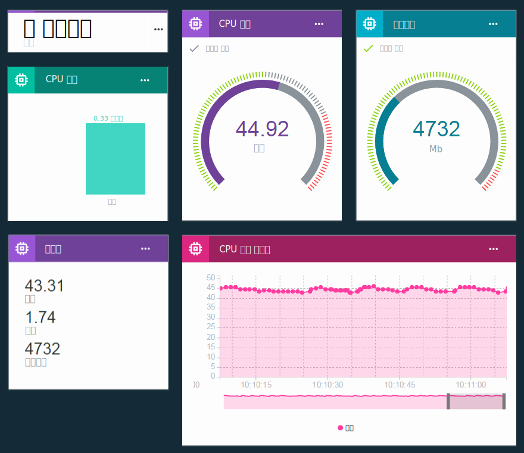

---

copyright:
  years: 2016, 2017
lastupdated: "2017-03-13"

---

{:new_window: target="\_blank"}
{:shortdesc: .shortdesc}
{:screen: .screen}
{:codeblock: .codeblock}
{:pre: .pre}

# 보드 및 카드를 사용하여 실시간 데이터 시각화
{: #boards_and_cards}

보드 및 카드를 작성하여 실시간으로 디바이스 데이터를 시각화하는 자체 대시보드를 작성하고 공유할 수 있습니다.
{:shortdesc}

보드 및 카드를 사용하면 빠른 개요를 제공하고 데이터 이해도를 개선할 수 있도록 하나 이상의 디바이스에서 데이터 세트 값을 그래픽 방식으로 시각화할 수 있습니다. 보드를 작성하고 데이터를 원시 값, 실시간 그래프, 게이지 등으로 표시하는 카드를 추가하십시오. 구성원을 보드에 추가하여 이를 조직의 기타 사용자와 공유하십시오. 카드를 배열하고 설명용 텍스트 디바이더를 추가하여 사용자 프리젠테이션을 미세 조정하십시오.   

또한 [고유의 사용자 정의 카드를 작성](custom_cards/custom-cards.html)하여 IBM에서 제공하는 기본 카드 세트를 확장할 수 있습니다. 

## 기본 보드
{: #default_boards}
{{site.data.keyword.iot_full}} 대시보드에는 다음의 기본 보드가 있습니다. 

|보드 이름 | 설명 |  
|:---|:---|  
|사용량 개요  | 조직의 사용량 통계를 표시합니다. 디바이스 유형 및 이용된 데이터를 나열합니다.
|규칙 중심 분석 | 조직에 대한 규칙을 표시합니다. 추가 카드에는 트리거된 경보, 연관된 디바이스, 디바이스 특성 및 경보 정보가 나열되어 있습니다.  |  
|디바이스 중심 분석 | 조직에 연결된 디바이스를 표시합니다. 추가 카드에는 선택된 디바이스에 대한 경보, 선택된 디바이스에 대한 정보, 디바이스 특성 및 경보 정보가 표시되어 있습니다.  |
|위험성 및 보안 관리 | 전체 보안 상태를 요약한 카드를 표시합니다. 시스템 운영자 및 보안 분석가는 규제 준수 세부사항과 디바이스의 연결 상태 및 연결 실패 원인, 그리고 블랙리스트 또는 화이트리스트를 통해 차단되거나 허용되는 디바이스를 볼 수 있습니다. 연결 규제 준수 카드에서 사용자는 규제 비준수 디바이스에 대한 자세한 보고서로 드릴 다운할 수 있으며 보고서를 Excel로 내보낼 수 있습니다. |

카드를 추가하고 업데이트하며 제거하여 이러한 보드를 업데이트할 수 있습니다. 

**팁:** 기본 보드를 원래 상태로 재설정하려면 이를 삭제할 수 있습니다. 그리고 보드는 원래 카드로 재작성됩니다. 

## 보드 및 카드 작성
{: #visualizing_data}

{{site.data.keyword.iot_short_notm}}은 디바이스가 리턴 중인 실시간 데이터를 표시하는 데 사용할 수 있는 기본 제공 대시보드를 제공합니다. 기본적으로, 개요 페이지는 {{site.data.keyword.iot_short_notm}} 조직에 대한 사용량 정보(예: 데이터 및 이용된 스토리지 영역)를 표시합니다. 유입되는 실시간 디바이스 데이터를 보려면 디바이스 특정 카드를 이 페이지에 추가하십시오. 

보드에 디바이스 특정 카드를 추가하려면 다음을 수행하십시오. 
1. {{site.data.keyword.iot_short_notm}} 대시보드에서 **보드**를 선택하십시오. 
2. 해당 권한을 편집 중인 보드를 선택하거나 새 보드를 작성하십시오. 
3. 보드에서 **새 카드 추가**를 클릭하십시오. 
2. 일반 시각화 카드 편집 상자에서 아래의 디바이스 섹션으로 화면이동하십시오. 
3. 시각화 유형을 선택하십시오.
**팁:** 기본 구성에 대해 **일반 시각화**를 선택하십시오. 나중에 카드 유형을 변경할 수 있습니다.
카드 유형의 전체 목록을 보려면 **추가 표시**를 클릭하십시오. 
4.	하나 이상의 카드 데이터 소스를 선택한 후에 **다음**을 클릭하여 하나 이상의 데이터 세트를 추가하십시오. 
 1.	데이터 세트에 식별 이름을 부여하십시오. 
 2. 표시할 데이터 점이 포함된 이벤트를 선택하십시오. 
 3.	데이터 점을 표시하는 특성을 선택하십시오. 
 4.	데이터 점에 대한 유형, 단위, 정밀도, 최소 및 최대 값을 설정하십시오.   
완료되면 **새 데이터 세트**를 클릭하여 데이터 세트를 더 추가하거나 **다음**을 클릭할 수 있습니다. 
5.	시각화를 선택하십시오.   
사용할 시각화의 유형 및 크기를 선택하십시오. 일부 카드 유형에는 추가 설정이 있습니다. 
<dl>
<dt>사용량</dt>
<dd>
<table>
<thead>
<tr>
<th>유형</th>
<th>표시되는 데이터</th>
</tr>
</thead>
<tbody>
<tr>
<td>디바이스 유형</td>
<td>디바이스 유형당 디바이스의 수를 표시하는 원형 차트입니다. </td>
</tr><tr>
<td>전송된 데이터</td>
<td>조직에 대한 전송된 데이터의 사용량 통계입니다. </td>
</tr>
</tbody>
</table>
</dd>
<dt>기본</dt>
<dd>
<table>
<thead>
<tr>
<th>유형</th>
<th>표시되는 데이터</th>
</tr>
</thead>
<tbody>
<tr>
<td>구분 기호</td>
<td>보드에서 카드를 구성하고 그룹화하기 위한 가로 구분 기호입니다. </td>
</tr>
</tbody>
</table>
</dd>
<dt>디바이스</dt>
<dd><table>
<thead>
<tr>
<th>유형</th>
<th>표시되는 데이터</th>
</tr>
</thead>
<tbody>
<tr>
<td>일반 시각화</td>
<td>하나 이상의 데이터 세트의 값입니다.  **팁:** 소형 테이블에서 최대 세 개의 데이터 점 값을 보려면 대형 위젯 크기를 선택하십시오. </td>
</tr>
<tr>
<td>실시간 차트</td>
<td>실시간 화면 이동 차트에서 하나 이상의 데이터 세트입니다. 설정 메뉴를 사용하여 데이터 범위 및 보관, 그래프의 룩앤필 등을 설정할 수 있습니다. </td>
</tr>
<tr>
<td>막대형 차트</td>
<td>레이블 지정된 막대의 데이터 세트 값입니다. 설정 메뉴를 사용하여 가로 또는 세로 막대 방향을 토글할 수 있습니다. </td>
</tr>
<tr>
<td>도넛형 차트</td>
<td>원형으로 표시된 둘 이상의 데이터 세트입니다. </td>
</tr>
<tr>
<td>값</td>
<td>하나 이상의 데이터 세트의 원시 값입니다. </td>
</tr>
<tr>
<td>게이지</td>
<td>게이지로 표시된 데이터 세트 값입니다. 데이터 세트의 양호, 적정 및 임계 값에 대한 표시 임계값을 구성할 수 있습니다. 설정 메뉴를 사용하여 하단, 중간 및 상단 데이터 범위에 대한 게이지 임계값을 선택사항으로 설정할 수 있습니다. </td>
</tr>
</tbody>
</table>
</dd>
<dt>분석</dt>
<dd>
<table>
<thead>
<tr>
<th>유형</th>
<th>표시되는 데이터</th>
</tr>
</thead>
<tbody>
<tr>
<td>디바이스 정보</td>
<td>단일 디바이스에 대한 기본 정보를 표시합니다. </td>
</tr>
<tr>
<td>경보 정보</td>
<td>단일 경보에 대한 기본 정보를 표시합니다. </td>
</tr>
<tr>
<td>디바이스 목록</td>
<td>여러 디바이스를 모니터하기 위한 목록입니다. </td>
</tr>
<tr>
<td>경보</td>
<td>디바이스에 대한 경보의 목록입니다. </td>
</tr>
<tr>
<td>규칙</td>
<td>경보가 있는 규칙의 목록입니다. </td>
</tr>
<tr>
<td>디바이스 특성</td>
<td>하나 이상의 디바이스에 대한 특정 특성을 표시합니다. </td>
</tr>
<tr>
<td>모든 디바이스 특성</td>
<td>하나 이상의 디바이스에 대한 모든 특성을 표시합니다. </td>
</tr>
<tr>
<td>디바이스 맵</td>
<td>목록에서 여러 디바이스의 위치를 표시합니다. </td>
</tr>
</tbody>
</table>
</dd>
</dl>

6. 카드에 대한 데이터 소스를 지정하십시오.  
선택한 카드 유형에 따라, 카드에 표시된 데이터를 디바이스에서 가져오거나 다른 카드에서 가져올 수 있습니다. 데이터 소스에 대해 특정 디바이스, 디바이스 목록 또는 경보 목록 카드를 선택한 후에 **다음**을 클릭하십시오. 
7. 디바이스 유형 카드에만 해당됨: 카드에 표시할 하나 이상의 데이터 세트를 추가하십시오.    
 1. **데이터 세트 연결**을 클릭하여 카드에 표시할 특성을 추가하십시오. 
 2. 데이터 세트에 이름을 부여하십시오. 
 3. 해당 특성을 표시할 이벤트를 입력하거나 선택하십시오. 
 4. 표시할 특성을 입력하거나 선택하십시오. 
 5. 특성의 유형을 지정하고, 선택사항으로 특성의 단위, 정밀도, 최소 및 최대 값을 설정하십시오.   
 6. **다음**을 클릭하십시오. 
7. 프리젠테이션 크기를 선택하십시오.   
특정 카드 유형의 경우에는 **설정**을 클릭하여 추가 시각화 세부사항을 구성할 수 있습니다. **다음**을 클릭하십시오. 
7. 카드의 제목과 설명을 입력하고, 선택사항으로 색상 스킴을 선택한 후에 **제출**을 클릭하여 카드를 작성하십시오. 
7.	마지막으로, 알맞은 위치로 끌어와서 보드에서 새 카드의 위치를 지정하십시오.   

축하합니다! 이제 디바이스의 실시간 데이터를 볼 수 있습니다! 

실시간 디바이스 데이터를 표시하는 방법에 대한 단계별 지시사항은 [Configuring Boards & Cards in the new Watson IoT Dashboard ](https://developer.ibm.com/recipes/tutorials/configuring-the-cards-in-the-new-watson-iot-dashboard/){: new_window} 레시피를 참조하십시오. 
