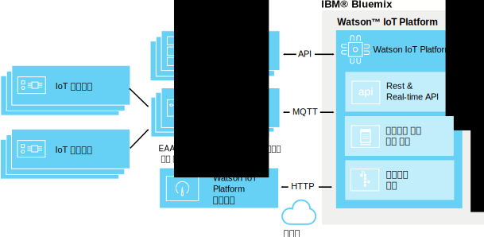

---

copyright:
  years: 2016, 2017
lastupdated: "2017-01-10"

---

{:new_window: target="\_blank"}
{:shortdesc: .shortdesc}
{:screen: .screen}
{:codeblock: .codeblock}
{:pre: .pre}

# 에지 분석
{: #edge_analytics}

에지 분석을 사용하여 클라우드에서 에지 분석 사용 게이트웨이로 분석 규칙 트리거 프로세스를 이동하면 디바이스 가까이에서 분석 처리를 수행하여 클라우드에 대한 디바이스 데이터 트래픽 양을 현저히 줄일 수 있습니다.
{:shortdesk}

디바이스에서 에지 분석 규칙을 통해 데이터를 구문 분석하는 에지 분석 사용 게이트웨이에 해당 데이터를 보냅니다. 규칙 및 해당 조치에 따라 중요한 데이터와 경보가 {{site.data.keyword.iot_full}}에 전송되거나 게이트웨이에서 경보를 트리거하거나 게이트웨이에 로컬인 텍스트 파일에 기록될 수 있습니다.

다음 다이어그램은 {{site.data.keyword.iot_full}} 에지 분석 환경의 일반 아키텍처를 설명합니다.

## 시작하기 전에
{: #byb}

에지 규칙 및 조치 작성을 시작하기 전에 다음을 수행하십시오.
- 게이트웨이가 {{site.data.keyword.iot_short}}에 연결되고 디바이스 데이터가 전송되는지 확인하십시오. 자세한 정보는 [게이트웨이 연결](gateways/dashboard.html)을 참조하십시오.
- 게이트웨이에 EAA(Edge Analytics Agent)를 설치하십시오. 자세한 정보는 [Edge Analytics Agent 설치](gateways/dashboard.html#edge)를 참조하십시오.   **팁:** EAA 사용 게이트웨이에서는 게이트웨이 디바이스 메시지의 양식으로 EAA 진단 데이터를 제공합니다. 자세한 정보는 [Edge Analytics Agent 진단 메트릭](#eaa_metrics)을 참조하십시오.
- 규칙에서 조건으로 사용할 디바이스 특성이 스키마에 맵핑되었는지 확인하십시오. 자세한 정보는 [디바이스 연결](iotplatform_task.html) 및 [스키마 작성](im_schemas.html)을 참조하십시오.
- 에지 분석 레시피 검토  
레시피 포털에서 한 쌍의 레시피는 IBM 에지 분석을 수행하는 데 필요한 단계를 설명합니다. 레시피는 IoT 데이터 소스에 인접하여 분석을 실행하기 위해 Apache Edgent 위에 빌드된 디바이스에서 IBM Edge Analytics Agent를 설치하고 구성하는 방법에 대해 명료하게 설명합니다. 
 - [IBM Watson IoT Platform에서 에지 분석 시작하기](https://developer.ibm.com/recipes/tutorials/getting-started-with-edge-analytics-in-watson-iot-platform/) 레시피는 이 시리즈의 시작입니다. 이 레시피에서는 랩탑 시스템과 Raspberry Pi 3 디바이스에서 Cisco DSA 플랫폼 설정, {{site.data.keyword.iot_short}}에 연결하기 위한 IBM Edge Analytics Agent의 설치와 구성, 시스템 DS 링크 설치 및 연결된 디바이스로서 {{site.data.keyword.iot_short}}의 에지 게이트웨이에 연결하도록 이를 구성, 에지 게이트웨이에서 에지 규칙의 정의와 활성화, 그리고 {{site.data.keyword.iot_short}}에서 에지 규칙의 관리를 설명합니다. 
 - 에지 분석의 고급 사용을 예시하기 위해 [IBM Watson IoT Platform의 에지 분석에서 경보 및 디바이스 조치 핸들링](https://developer.ibm.com/recipes/tutorials/handling-alerts-and-device-actions-with-edge-analytics-in-ibm-watson-iot-platform/) 레시피는 연결된 Arduino Uno 디바이스의 데이터를 Raspberry Pi 3 디바이스로 전송하기 위한 자체 DS 링크를 빌드하는 방법을 보여줍니다. 이 레시피는 에지 규칙 경보의 일부로서 데이터 필터링 및 핸들링 로컬 디바이스 조치도 보여줍니다. 

## 에지 규칙 및 조치 관리  
{: #managing_rules}

에지 규칙은 다음을 사용하여 관리합니다.
- **규칙** 대시보드를 사용하여 디바이스와 게이트웨이의 클라우드 및 에지 규칙과 조치를 작성하고 편집합니다.
- **에지 규칙 게이트웨이** 보드는 게이트웨이에서 에지 규칙을 활성화, 비활성화, 업데이트 및 제거하는 데 사용합니다. 에지 규칙 게이트웨이 보드에 액세스하려면 규칙 대시보드에서 관리할 에지 규칙의 **규칙 관리**를 클릭하십시오. 자세한 정보는 [게이트웨이의 에지 규칙 활성화, 비활성화 및 관리](#manage)를 참조하십시오.

게이트웨이에 연결된 디바이스의 트리거된 에지 규칙 및 경보에 대한 개요를 가져오려면 다음 보드를 사용하십시오. 

|보드 이름 | 설명  |  
 |:---|:---|  
  |규칙 중심 분석 | 에지 규칙을 포함하여 조직의 규칙을 표시합니다. 추가 카드는 전달된 에지 경보, 연관된 디바이스, 디바이스 특성 및 전달된 에지 경보 정보를 나열합니다. |  
 |디바이스 중심 분석 | 조직에 연결된 디바이스를 표시합니다. 추가 카드는 선택한 에지 디바이스에 대해 전달된 경보, 선택한 디바이스 정보, 디바이스 특성 및 전달된 경보 정보를 표시합니다. |

기본 분석 보드에 대한 자세한 정보는 [보드 및 카드를 사용하여 실시간 데이터 시각화](data_visualization.html#default_boards)를 참조하십시오.

## 에지 규칙 작성
{: #rules}

에지 규칙은 조건을 충족하는 경우 에지 조치를 트리거하기 위해 사전 정의된 임계값 또는 다른 특성 데이터와 실시간 디바이스 데이터를 일치시키는 조건 기반 의사결정 지점입니다.

**중요:** 디바이스 유형에 대한 규칙을 작성하려면 우선 디바이스 유형에 대한 스키마를 작성해야 합니다. 자세한 정보는 [디바이스 유형 스키마 작성](im_schemas.html)을 참조하십시오.

규칙을 작성하려면 다음을 수행하십시오.
1. {{site.data.keyword.iot_short}} 대시보드에서 **규칙**으로 이동하십시오.
2. **에지 규칙 작성**을 클릭하고, 규칙에 이름을 지정하며, 설명을 제공하고, 규칙이 적용되는 에지 디바이스 유형을 선택한 후, **다음**을 클릭하십시오.  
3. 규칙 로직을 설정하십시오.  
규칙의 트리거로 사용할 IF 조건을 하나 이상 추가하십시오.  
병렬 행에서 조건을 추가하여 이를 OR 조건으로 적용하거나, 순차 열에서 조건을 추가하여 이를 AND 조건으로 적용할 수 있습니다.  
**참고:** 규칙의 입력으로 디바이스 특성을 선택할 수 있으려면 특성을 스키마에 맵핑해야 합니다. 자세한 정보는 [스키마 작성](im_schemas.html)을 참조하십시오.  

**중요:** 두 개의 특성을 비교하는 조건을 트리거하거나 AND를 사용하여 순차적으로 결합된 둘 이상의 특성 조건을 트리거하려면 트리거링 데이터 점이 동일한 디바이스 메시지에 포함되어 있어야 합니다. 데이터가 둘 이상의 메시지에서 수신되면, 조건 또는 순차 조건이 트리거되지 않습니다.  

**예:**  
매개변수 값이 다음과 같이 지정된 값보다 크면 간단한 규칙을 통해 경보를 트리거할 수 있습니다.  
`temp>80`  
다음과 같은 임계값 조합이 충족되면 더욱 복잡한 규칙이 트리거할 수 있습니다.  
`temp>60 AND capacity>50`   

4. 규칙에 대한 조건부 트리거 요구사항을 구성하십시오.  
일정 기간 동안 규칙에 대해 트리거된 경보 및 조치 수를 제어하려면 규칙에 맞는 조건부 트리거 요구사항을 구성할 수 있습니다.  
**중요:** 조건부 트리거링은 규칙의 모든 조건에 대해 작동합니다. 예를 들어, 규칙에 OR을 사용하여 설정된 다섯 개의 서로 다른 병렬 조건이 있으면 true인 각 조건은 조건부 트리거 개수에 포함됩니다.
규칙에 대한 조건부 트리거링을 설정하려면 다음을 수행하십시오.
 1. 규칙 편집기에서 기본 **조건이 충족될 때마다 트리거** 링크를 클릭하여 빈도 설정 요구사항 대화 상자를 여십시오.
 2. 규칙에서 사용할 조건부 트리거를 선택하고 구성하십시오.
 <ul>
 <li>조건이 충족될 때마다 트리거</li>
 <li>M *단위 시간*에 조건이 N번 충족되면 트리거</li>
 </ul>  
 조건부 트리거에 대한 자세한 설명은 클라우드 분석 섹션에서 [조건부 규칙 트리거](cloud_analytics.html#conditional "조건부 트리거 개요")를 참조하십시오.
5. 규칙 조건이 충족되면 발생하는 하나 이상의 조치를 작성하거나 선택하십시오.  
에지 조치에 대한 자세한 정보는 [에지 조치 작성](#edge_actions "에지 조치 작성")을 참조하십시오.   
예: 조치는 디바이스 데이터를 클라우드에 보내기 또는 로컬 파일에 경보 쓰기일 수 있습니다.
3. **선택사항:** 규칙에 대한 경보 우선순위를 선택하십시오.  
우선순위는 **규칙 기반 분석** 보드에서 표시되는 경보를 분류하는 데 사용됩니다. 기본 우선순위는 '낮음'입니다.
6. 규칙에 만족하면 **저장**을 클릭하십시오.

규칙이 작성되어 찾아보기 대시보드에 추가됩니다. 이제 **에지 규칙 게이트웨이** 보드가 열리면 규칙을 [활성화](#manage)할 수 있습니다.

## 에지 조치 작성
{: #edge_actions}

규칙 편집기에서 직접 조치를 작성하거나 조치 탭에서 조치를 작성한 후에 규칙을 작성할 때 조치를 선택할 수 있습니다.

조치 탭에서 조치를 작성하려면 다음을 수행하십시오.
1. {{site.data.keyword.iot_short}} 대시보드에서 **규칙**으로 이동하십시오.
2. 규칙 대시보드에서 **조치** 탭을 선택하십시오.
2. **조치 작성**을 클릭하고 조치에 이름과 설명을 지정한 다음 조치 유형을 선택하고 **다음**을 클릭하십시오.   
에지 분석은 다음 두 가지 조치 유형을 지원합니다.
<dl>
<dt>클라우드에 이벤트 전달</dt>  
<dd>{{site.data.keyword.iot_short}}에 디바이스 이벤트가 전달되어 보드와 카드에서 사용되고 클라우드 분석 규칙과 함께 사용될 수 있습니다. 자세한 정보는 [클라우드 분석과 통합](#integrate_with_cloud_analytics)을 참조하십시오.    
**팁:** 클라우드에 이벤트 전달 조치를 사용하여 덜 중요한 데이터를 게이트웨이 디바이스에서 직접 필터링함으로써 클라우드에 보낸 디바이스 데이터 양을 줄이십시오. </dd>
<dt>경보</dt>  
<dd>경보는 게이트웨이 디바이스에서 작성됩니다.</dd>
</dl>
3. 선택한 조치 유형에 필요한 매개변수를 제공하십시오.  
<dl>
<dt>클라우드에 이벤트 전달</dt>  
<dd>클라우드에 전송할 이벤트 데이터를 선택하고 메시지에서 사용할 이벤트 이름을 제공하십시오. 
**팁:** 보드와 카드를 설정하고 클라우드 분석 규칙을 작성할 때 이벤트와 특성을 사용할 수 있습니다. 
다음을 수행할 수 있습니다.
 <ul>
 <li>모든 디바이스 특성과 가상 특성 포함
 <li>스키마 정의 특성과 가상 특성만 포함  
 </ul>
 </dd>
<dt>경보</dt>  
<dd>경보 메시지를 지정하고 경보의 대상을 하나 이상 선택하십시오.
 <ul>
 <li>클라우드에 전달  
 경보가 {{site.data.keyword.iot_short}}에 전달되어 규칙 중심 분석과 디바이스 중식 분석 보드에 표시됩니다.
 <li>게이트웨이 브로커에 공개
 경보가 게이트웨이 브로커에 공개됩니다. 브로커 구성에 따라 경보가 사용자에게 표시되는 방식이 결정됩니다.
 <li>로컬 텍스트 파일에 저장
 게이트웨이 서버의 로컬 *IBMEdgeAnalyticsAlerts.csv* 텍스트 파일에 경보가 추가됩니다.
 </ul>
 </dd>
</dl>
4. 새 조치를 작성하려면 **확인**을 클릭하십시오.

이제 규칙 편집기에서 조치를 사용할 수 있습니다.

## 게이트웨이의 에지 규칙 활성화, 비활성화 및 관리
{: #manage}

규칙을 통해 조치를 트리거하려면 먼저 하나 이상의 게이트웨이에서 규칙을 활성화해야 합니다. **에지 규칙 게이트웨이** 보드를 사용하여 게이트웨이에서 에지 규칙을 활성화, 비활성화, 업데이트 및 제거합니다.

에지 규칙을 활성화하려면 다음을 수행하십시오.
1. 규칙 대시보드에서 관리할 에지 규칙의 **규칙 관리** 단추를 클릭하십시오.  
**에지 규칙 게이트웨이** 보드가 열리면 연결된 모든 EAA 사용 게이트웨이의 목록이 표시됩니다. 규칙이 업로드되지 않고 활성화되지 않은 게이트웨이의 규칙 상태는 *없음*입니다.
2. 규칙을 활성화할 게이트웨이를 찾아 오퍼레이션 선택 열의 메뉴에서 **활성화**를 선택하십시오.  
에지 규칙이 게이트웨이에 업로드됩니다. 업로드가 완료되고 규칙이 활성이 되면 규칙 상태가 **활성**으로 변경됩니다.  

이제 규칙이 게이트웨이에서 활성화되었으며 규칙 조건이 충족되면 구성된 조치가 트리거됩니다.

**팁:** 여러 게이트웨이에서 규칙을 관리하려면 게이트웨이 열 헤더 옆의 모두 선택 상자를 선택할 수 있습니다. 포함하지 않을 모든 게이트웨이를 지운 다음 동일한 이름의 열 맨 위에 있는 **오퍼레이션 선택** 메뉴에서 오퍼레이션을 선택하십시오.

규칙을 활성화하는 외에도, 게이트웨이에서 다음 규칙 관리 오퍼레이션을 수행할 수 있습니다.

오퍼레이션 | 설명
--- | ---
활성화 | 선택한 게이트웨이에서 규칙을 업로드하고 활성화합니다. 규칙 상태는 *활성*으로 설정됩니다.
비활성화  | 선택한 게이트웨이에서 규칙을 비활성화합니다. 규칙이 게이트웨이에 남아 있으므로 필요한 경우 다시 활성화할 수 있습니다. 규칙 상태는 *비활성*으로 설정됩니다.
업데이트 | 업데이트된 버전의 규칙을 선택한 게이트웨이에 업로드합니다. 게이트웨이의 규칙 상태가 *활성(이전)*인 경우 이 오퍼레이션을 사용하여 게이트웨이를 최신 상태로 만드십시오. 규칙 상태는 *활성*으로 설정됩니다.
제거 | 선택한 게이트웨이에서 규칙을 제거합니다. 게이트웨이의 규칙 상태를 *없음*으로 되돌립니다.

## 클라우드 분석과 통합
{: #integrate_with_cloud_analytics}

EAA 사용 게이트웨이에서 실행되는 에지 규칙 트리거 조치를 사용하여 클라우드로 이동하는 데이터를 필터링하고 {{site.data.keyword.iot_short}} 보드 및 카드와 사용하도록 게이트웨이 생성 경보를 클라우드에 전달하십시오.  

게이트웨이에서 클라우드에 보낸 디바이스 데이터에 대한 클라우드 분석을 수행하는 데도 {{site.data.keyword.iot_short}}를 사용할 수 있습니다. 에지 규칙에서 `클라우드에 이벤트 전달` 조치를 사용하는 경우 에지 규칙을 트리거한 데이터를 제공한 디바이스가 {{site.data.keyword.iot_short}}에 직접 연결된 경우와 같이 작성된 메시지를 클라우드 분석 규칙의 입력으로 사용할 수 있습니다.

클라우드 분석 규칙 및 조치 작성 방법에 대한 자세한 정보는 [클라우드 분석](cloud_analytics.html)을 참조하십시오.

## Edge Analytics Agent 진단 메트릭
{: #eaa_metrics}

연결된 EAA 사용 게이트웨이에서 `gateway_xv-monitor-event` 이벤트 유형의 디바이스 메시지로 진단 정보를 보냅니다.  **팁:** [클라우드 분석](cloud_analytics.html) 규칙을 사용하여 EAA 사용 게이트웨이에서 되돌려 보낸 진단 값을 기반으로 이메일 알림과 같은 경보 조치를 구성할 수 있습니다. 예를 들어 `SystemLoad`가 특정 임계값을 초과하면 경보하는 규칙을 작성할 수 있습니다.

게이트웨이의 상태에 대한 정보를 보려면 다음을 수행하십시오.
1. {{site.data.keyword.iot_short}} 대시보드의 메뉴 사이드바에서 **디바이스**를 선택하십시오.
2. 게이트웨이 디바이스를 클릭하여 디바이스 세부사항 페이지를 여십시오.
3. 다음과 같이 게이트웨이 진단 정보에 액세스하십시오.  
 - 게이트웨이에서 보낸 최근 메시지 목록은 **최근 이벤트** 섹션을 참조하십시오.
 - 게이트웨이 경고 및 다른 진단 메시지는 **진단 로그** 섹션을 참조하십시오.
 - 게이트웨이의 자세한 진단 정보는 **센서 정보** 섹션을 참조하십시오. 다음 표에서는 게이트웨이 디바이스 메시지에 포함될 수 있는 여러 다른 특성에 대해 설명합니다.

특성 | 설명
 --- | ---
 `MsgInCount` |EAA(Edge Analytics Agent)에 보낸 메시지 수입니다.
`MsgInRate` | 마지막 기간 동안 EAA에 전송된 것으로 추정되는 초당 메시지 수입니다.  
 `LastHeartBeat` | 마지막 하트비트 메시지가 생성된 밀리초 시간소인입니다. 하트비트 메시지는 최소 10초마다 생성됩니다.
`CurrentTimestamp` | 현재 모니터링 메시지가 생성된 밀리초 시간소인입니다.
`IsAlive` | `LastHeartBeat`와 `CurrentTimestamp` 사이의 차이가 20초보다 큰 경우 이 특성은 0입니다.
`BytesOutCount` | EAA에서 {{site.data.keyword.iot_short}}로 보낸 메시지 바이트 수입니다.
`BytesOutRate` | 마지막 기간 동안 EAA에서 {{site.data.keyword.iot_short}}에 전송한 것으로 추정되는 초당 메시지 바이트 수입니다.
`BytesInCount` | {{site.data.keyword.iot_short}}에서 EAA에 보낸 메시지 바이트 수입니다.
`BytesInRate` | 마지막 기간 동안 {{site.data.keyword.iot_short}}에서 EAA에 전송한 것으로 추정되는 초당 메시지 바이트 수입니다.
`RuleBytesInCount` |EAA 규칙 엔진 코어에 전송된 메시지 바이트 수입니다.   **참고:** 디바이스 유형에 대해 규칙이 설정되지 않은 경우 해당 디바이스 유형의 메시지가 규칙 엔진 코어에 전송되지 않습니다.
`RuleBytesInRate` | 마지막 기간 동안 EAA 규칙 엔진 코어에 전송된 것으로 추정되는 초당 메시지 바이트 수입니다.
`MsgOutCount` | EAA에서 {{site.data.keyword.iot_short}}에 보낸 메시지 수입니다.
`MsgOutRate` | 마지막 기간 동안 EAA에서 {{site.data.keyword.iot_short}}에 전송하는 것으로 추정되는 초당 메시지 바이트 수입니다.
`MsgReducePercent` | 입력 메시지와 출력 메시지 사이의 차이(백분율)입니다.  다음 공식을 사용하여 계산합니다. `(msgIn - msgOut) / msgIn`
`BytesReducePercent` | 입력 바이트와 출력 바이트 사이의 차이(백분율)입니다.  다음 공식을 사용하여 계산합니다. `(bytesIn - bytesOut) / bytesIn`
`MsgRateReduce` | 입력 메시지 비율과 출력 메시지 비율 사이의 차이(백분율)입니다.  다음 공식을 사용하여 계산합니다. `(msgInRate - msgOutRate) / msgInRate`
`BytesRateReduce` | 입력 메시지 바이트와 출력 메시지 바이트 사이의 차이(백분율)입니다.  다음 공식을 사용하여 계산합니다. `(bytesInRate - bytesOutRate) / bytesInRate`
`SystemLoad` | EAA가 실행 중인 시스템의 현재 시스템 로드입니다. **참고:** EAA가 실행 중인 시스템에서 `mpstat` 명령을 사용할 수 있는 경우에만 CPU 비율이 전송됩니다. 그렇지 않으면 마지막 순간의 시스템 로드 평균이 전송됩니다.  “시스템 로드 평균은 사용 가능한 프로세서에 큐된 실행 가능한 엔티티 수와 일정 기간 동안 평균을 낸 사용 가능한 프로세서에서 실행되는 실행 가능 엔티티 수의 합계입니다. 로드 평균을 계산하는 방법은 운영 체제별로 다르지만 일반적으로 감쇠 시간 종속 평균입니다. 로드 평균을 사용할 수 없으면 음수 값이 리턴됩니다. ” - *ManagementFactory.getOperatingSystemMXBean*에 대한 javadoc.
 `FreeMemory` | EAA가 실행 중인 JVM(Java™ Virtual Machine)에 대한 여유 메모리의 바이트 수입니다.
 `MemoryUsed` | EAA에서 사용하는 JBM 메모리의 바이트 수입니다.
`InQueueSize` | EAA 처리를 위해 큐된 메시지 수입니다.
`RuleNumber` | 규칙 엔진 코어에 정의된 규칙 수입니다.
`ProcessorNumber` | 디버그용입니다. 규칙 엔진 코어에 정의된 프로세서 수입니다.  **참고:** 프로세서는 규칙 엔진 코어의 최소 실행 단위입니다.
`DataPointsInWindow` | 기간 내에 버퍼링된 데이터 점의 총 수입니다. 데이터 점의 바이트 크기는 해당 데이터 유형에 따라 다릅니다. 예를 들어 float/int 데이터 점 크기는 8바이트인 반면 문자열 데이터 점 크기는 해당 길이에 따라 따릅니다. 대부분의 경우 다음 공식을 사용하여 일정 기간의 메모리 사용을 추정할 수 있습니다. `DataPointsInWindow * 8`.
