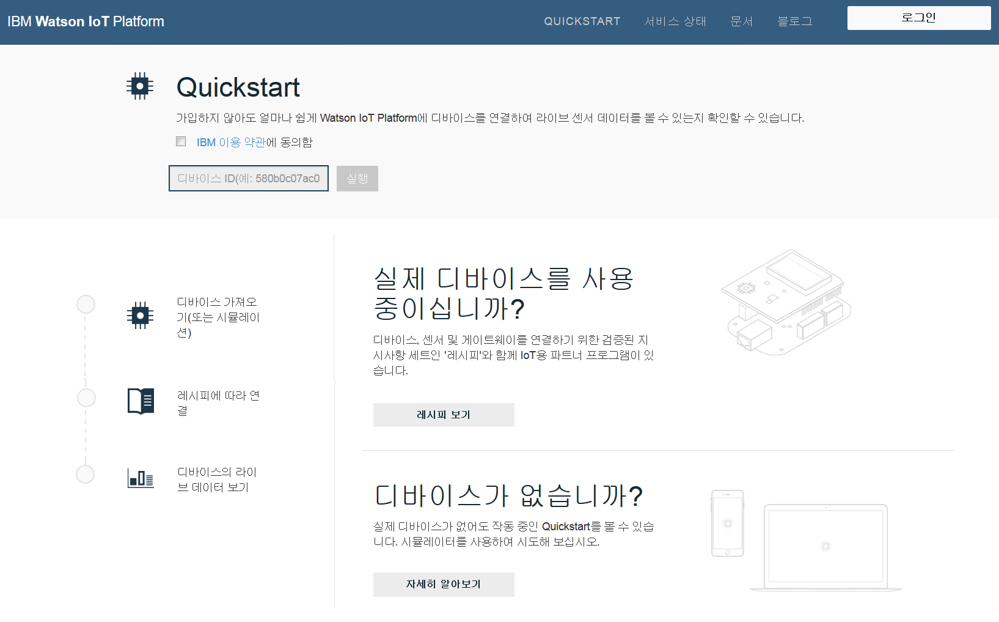
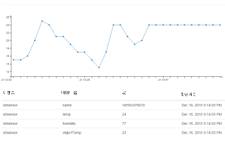

---

copyright:
  years: 2015, 2016, 2017
lastupdated: "2016-09-19"

---

{:new_window: target="_blank"}
{:shortdesc: .shortdesc}
{:screen: .screen}
{:codeblock: .codeblock}
{:pre: .pre}

# Quickstart

[Quickstart](https://quickstart.internetofthings.ibmcloud.com/#/)는 디바이스를 신속하게 {{site.data.keyword.iot_full}}에 연결하는 데 사용할 수 있는 개방형 샌드박스입니다. 디바이스에서 MQTT 메시징 프로토콜을 지원하는 경우 Quickstart에 쉽게 연결할 수 있습니다.

예를 들어, 여러 다른 디바이스를 Quickstart 서비스에 연결하는 방법을 설명하는 레시피 및 튜토리얼을 보려면 [DeveloperWorks Recipes](https://developer.ibm.com/recipes/)로 이동하십시오. 예를 들어 다음과 같습니다.

- [OpenBlocks IoT BX1G](https://developer.ibm.com/recipes/tutorials/openblocks-iot-bx1g-for-iot-foundation-quickstart/)
- [Reactive Blocks](https://developer.ibm.com/recipes/tutorials/reactive-blocks-and-java-to-iot-foundation-part-1-quickstart/)


**중요:** {{site.data.keyword.iot_short_notm}} 인스턴스에서 Quickstart 서비스를 사용하는 경우 확장 가능한 애플리케이션은 지원되지 않습니다.

## 시뮬레이션된 디바이스

Quickstart 레시피 및 튜토리얼 외에도, 웹 브라우저로 디바이스를 Quickstart 서비스에 연결하는 데 사용하는 모바일 디바이스의 브라우저 기반 시뮬레이션된 디바이스도 제공됩니다. 휴대전화 또는 태블릿에서 {{site.data.keyword.iot_short}}에 연결하는 브라우저 기반 시뮬레이션된 디바이스를 시작하려면 다음 URL을 여십시오.

```
http://quickstart.internetofthings.ibmcloud.com/iotsensor
```

모바일 디바이스에서 시뮬레이션된 디바이스 URL에 연결하면 {{site.data.keyword.iot_short}}에 연결된 브라우저 기반의 시뮬레이션된 디바이스가 시작됩니다. 다음 UI 제어를 사용하여 센서를 관리하십시오.

- 온도
- 습도
- 오브젝트 온도


## 데이터 시각화

모바일 디바이스에서 생성된 데이터를 보려면 시뮬레이션된 디바이스가 모바일 디바이스에서 실행되는지 확인한 다음 Quickstart 애플리케이션을 시작하십시오. UI의 오른쪽 상단에 표시되는 디바이스의 12자로 된 디바이스 ID를 입력하십시오.



다음 화면 캡처에 간략하게 설명된 대로, 시뮬레이션된 디바이스에서 센서 값을 조정하면서 Quickstart 애플리케이션에서 실시간으로 시각화된 디바이스의 데이터를 볼 수 있습니다.




## Mosquitto 데모

[Mosquitto](http://mosquitto.org/)는 {{site.data.keyword.iot_short}} 서비스를 실험하는 데 사용할 수 있는 교차 플랫폼 개방형 소스 MQTT 클라이언트입니다. Mosquitto 클라이언트를 설치한 다음 고유한 애플리케이션 ID와 디바이스 ID를 선택하십시오. 애플리케이션과 디바이스 ID가 고유하지 않으면 테스트 연결이 동일한 Quickstart 테스트 프로시저를 완료 중인 다른 사용자와 충돌할 수 있습니다.

*appId*, *type_id*, *device_type* 및 *device_id* 값은 36자 이하여야 하며 다음 문자만 포함할 수 있습니다.
- 영숫자 문자(a-z, A-Z, 0-9)
- 대시(-)
- 밑줄(_)
- 점( . )

애플리케이션 ID와 디바이스 ID를 정의한 후 `mosquitto_sub`를 사용하여 애플리케이션을 표시하는 연결을 작성하십시오. 다음 `<applicationId>` = myApplicationId and `<deviceId>` = myDeviceId 예를 사용하십시오.
```
    [user@host ~]$ mosquitto_sub -h quickstart.messaging.internetofthings.ibmcloud.com -p 1883 -i "a:quickstart:myApplicationId" -t iot-2/type/mosquitto/id/myDeviceId/evt/helloworld/fmt/json

```

이전 프로세스를 실행하는 중에 디바이스를 작성할 수 있습니다. 이 예에서는 다음 코드에 간략하게 설명된 대로, 유형이 `mosquitto`인 디바이스를 연결한 다음 `mosquitto_pub`를 사용하여 서비스에 두 이벤트를 보냅니다. 

```
    [user@host ~]$ mosquitto_pub -h quickstart.messaging.internetofthings.ibmcloud.com -p 1883 -i "d:quickstart:mosquitto:myDeviceId" -t iot-2/evt/helloworld/fmt/json -m "{\"helloworld\": 1}"
    [user@host ~]$ mosquitto_pub -h quickstart.messaging.internetofthings.ibmcloud.com -p 1883 -i "d:quickstart:mosquitto:myDeviceId" -t iot-2/evt/helloworld/fmt/json -m "{\"helloworld\": 2}"
```
다음 예제 출력에 간략하게 설명된 대로 애플리케이션 터미널을 보면 방금 공개한 두 개의 이벤트가 표시됩니다.

```
   [user@host ~]$ mosquitto_sub -h quickstart.messaging.internetofthings.ibmcloud.com -p 1883 -i "a:quickstart:myApplicationId" -t iot-2/type/mosquitto/id/myDeviceId/evt/helloworld/fmt/json
    {"helloworld": 1}
    {"helloworld": 2}
```

모두 완료되었습니다. Quickstart 예제 프로시저를 완료하면 다음과 같은 결과를 얻습니다.
- MQTT를 통해 디바이스와 애플리케이션을 {{site.data.keyword.iot_short}}에 연결
- 디바이스에서 서비스로 이벤트 전송
- 애플리케이션에서 이벤트 수신


## 관련 링크

- [Quickstart](https://quickstart.internetofthings.ibmcloud.com)
- [DeveloperWorks Recipes](https://developer.ibm.com/recipes)
- [OpenBlocks IoT BX1G](https://developer.ibm.com/recipes/tutorials/openblocks-iot-bx1g-for-iot-foundation-quickstart/)
- [Reactive Blocks](https://developer.ibm.com/recipes/tutorials/reactive-blocks-and-java-to-iot-foundation-part-1-quickstart/)
- [Quickstart 애플리케이션](http://quickstart.internetofthings.ibmcloud.com)
- [Mosquitto](http://mosquitto.org/)
