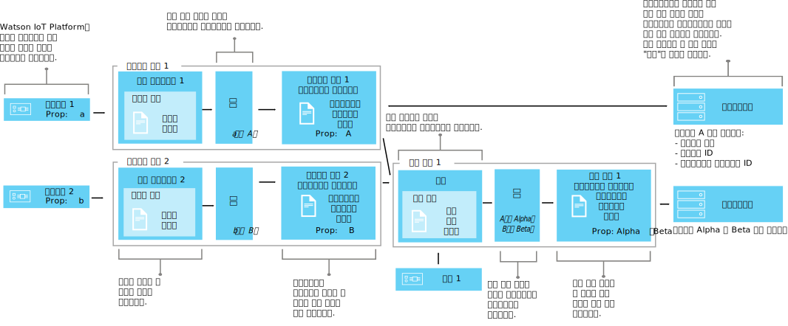

---

copyright:
years: 2016, 2017
lastupdated: "2017-04-25"

---

{:new_window: target="\_blank"}
{:shortdesc: .shortdesc}
{:screen: .screen}
{:codeblock: .codeblock}
{:pre: .pre}

# 인터페이스를 사용하여 디바이스 데이터 맵핑(베타)
{: #im_index}

애플리케이션 인터페이스는 {{site.data.keyword.iot_short_notm}}을 통해 이동되는 데이터를 보다 잘 제어하고 모든 디바이스에서 IoT 데이터를 볼 수 있도록 [디바이스 유형](#resources) 개념을 확장합니다.
{:shortdesc}

**중요:** 인터페이스 맵핑 기능은 베타 기능입니다. 진행 중인 베타 업데이트는 물론 최종 릴리스에는 현재 버전과 호환되지 않는 변경사항이 포함될 수 있습니다. 최종 릴리스 이전에는 베타 기능을 프로덕션 애플리케이션에서 사용하지 않도록 적극 권장합니다. 추가 정보를 받고 이 베타에 대한 피드백을 제공하기 위해 [Information Management Beta 프로그램에 등록 ](https://www.ibm.com/software/support/trial/cst/forms/nomination.wss?id=7050){:new_window}할 수 있습니다. 

## 개요
{: #overview}

애플리케이션 인터페이스를 사용하여 디바이스와 사물의 공유된 추상화를 구축하면 데이터가 변경되어도 애플리케이션을 이와 격리시킴으로써 재활용도와 유지보수를 개선하고 복잡한 IoT 에코시스템을 관리할 수 있습니다. 애플리케이션 인터페이스는 디바이스가 {{site.data.keyword.iot_short_notm}}에 전달하는 메시지 데이터의 가변성으로부터 분리됩니다. 

애플리케이션 인터페이스를 통해 애플리케이션은 디바이스와 사물의 현재 상태에 액세스할 수 있습니다. 상태는 애플리케이션 인터페이스에서 정의하는 상태 특성 세트로 구성됩니다. 디바이스가 상태 변경 이벤트를 전송함에 따라, 이러한 특성의 가장 최신 값은 {{site.data.keyword.iot_short_notm}}에 저장되며 HTTP API를 사용하여 요청 시에 애플리케이션에서 이를 사용할 수 있습니다. 

애플리케이션 인터페이스를 사용하면 다음을 수행할 수 있습니다. 
- 상태 특성을 이벤트 메시지 데이터에 맵핑
- 선호하는 데이터 구조 정의
- 디바이스 상태에 대해 둘 이상의 표현이나 보기 정의
- 디바이스 상태를 구독하거나 이를 HTTP API를 통해 언제든지 조회

애플리케이션 인터페이스의 일부 공통 유스 케이스에는 다음이 포함됩니다. 
- REST와 유사한 방식으로 이벤트 구동 디바이스 데이터에 액세스할 수 있도록 애플리케이션 개발자에게 일관된 인터페이스를 제공합니다. 
- 서로 다른 형식의 데이터를 공개하는 서로 다른 제조업체나 모델의 디바이스에서 가져온 데이터를 정규화합니다. 
- 여러 서로 다른 디바이스 유형의 이벤트 데이터를 결합하여 제공된 IoT 사물을 모델링합니다. 
- 애플리케이션 모델에 알맞게 데이터 형식을 수정하고 변환합니다.   

인터페이스 API 문서(베타)에 대해서는 [{{site.data.keyword.iot_short_notm}} HTTP REST API ](https://docs.internetofthings.ibmcloud.com/apis/swagger/v0002-beta/info-mgmt-beta.html){: new_window}를 참조하십시오.    

## 예제
{: #examples}
다음의 인터페이스 예제는 두 개의 가능한 솔루션을 보여줍니다. 

### 예제 1: 이기종 온도 센서를 애플리케이션 인터페이스에 맵핑
{: #device-type-example}
이 예제에서는 실제 디바이스 이벤트 메시지 페이로드 형식이 무엇이든 상관없이 단일 형식의 이기종 온도 상태 데이터를 제공하는 애플리케이션 인터페이스를 작성합니다. TemperatureSensor1은 `{ "t" : 34.5 }`의 섭씨 온도 측정값을 {{site.data.keyword.iot_short_notm}}에 공개합니다. TemperatureSensor2는 `{ "temp" : 72.55 }`의 화씨 온도 측정값을 공개합니다. 온도 측정값은 개별 이벤트로서 공개됩니다. 

이 예제를 설명하는 상세 엔드-투-엔드 시나리오는 [애플리케이션 인터페이스 시나리오 1](im_index_scenario.html)을 참조하십시오. 

애플리케이션 인터페이스 데이터 플로우의 일부로서, 사용자는 수신 데이터에 대한 계산을 수행하여 처리를 위한 일관된 양식으로 이러한 측정값을 정규화할 수 있습니다, 따라서 사용자는 서로 다른 온도 스케일을 파악하고 이를 변환하는 애플리케이션을 작성할 필요가 없습니다. 애플리케이션은 하나의 정규화된 상태를 수신하며 디바이스 특정 **t** 및 **temp** 특성이 아닌 **temperature** 상태 특성을 사용합니다. 

### 예제 2: 여러 날씨 디바이스를 하나의 사물 유형 애플리케이션 인터페이스에 맵핑
{: #thing-type-example}  
이 예제에서는 개별 습도계 디바이스 양식의 습도 센서 세트를 추가하여 디바이스 유형 예제를 확장합니다. 사물 유형 애플리케이션 인터페이스를 사용하면 개별 디바이스 유형에서 가져온 데이터를 룸의 모든 디바이스와 센서를 나타내는 하나의 애플리케이션 인터페이스에 완벽하게 병합할 수 있습니다. 이제 애플리케이션은 룸 사물 애플리케이션 인터페이스에 연결하여 해당 룸에 대해 수집된 날씨 데이터를 가져올 수 있습니다. 

이 예제를 설명하는 상세 엔드-투-엔드 시나리오는 [애플리케이션 인터페이스 시나리오 2](im_index_scenario_thing.html)를 참조하십시오. 

온도 센서 1과 습도 센서 3은 룸 R1에서 수집된 환경 데이터를 공개합니다. 온도 및 습도 센서 데이터는 두 디바이스 유형 애플리케이션 인터페이스에 개별적으로 맵핑됩니다(이전 예제에 따라 온도계 디바이스 유형에 대해 하나와 습도계 디바이스 유형에 대해 하나). 이제 룸이라고 하는 사물 유형을 작성하고 두 개의 룸 사물 인스턴스(R1 및 R2)를 작성합니다. 

이제 온도계 및 습도계 애플리케이션 인터페이스가 포함된 구성을 설정하고 적합한 환경 센서를 각각의 룸 인스턴스에 맵핑할 수 있습니다(예: D1 및 D3이 R1에 맵핑됨). 이제 일반 사용자 애플리케이션은 기본 디바이스 인프라를 몰라도 특정 룸 사물 ID의 상태를 요청하고 룸 온도/습도 상태를 가져올 수 있습니다. 

## 정의 및 리소스
{: #resources}

다음 다이어그램은 애플리케이션 인터페이스를 사용할 때 {{site.data.keyword.iot_short_notm}}에서 디바이스와 애플리케이션 간의 논리 맵핑을 보여줍니다. 

### 개념

개념                        | 설명        
------------- | ------------- | -------------  
이벤트 | 이벤트는 디바이스가 {{site.data.keyword.iot_short_notm}}에 데이터를 공개하는 메커니즘입니다. 디바이스에서 이벤트의 컨텐츠를 제어하고 전송하는 각 이벤트의 이름을 지정합니다.
특성 | 디바이스 이벤트 페이로드의 데이터 이동 파트입니다.
상태 | 맵핑된 상태 특성의 최신 값입니다.
구성                         | 사물 유형과 연관된 애플리케이션 인터페이스를 정의하는 논리 구성입니다. 구성은 사물 유형 스키마로 지정됩니다.    

### 정보 관리 리소스
REST API를 사용하여 리소스를 관리할 수 있습니다. REST API에 대한 정보는 [{{site.data.keyword.iot_short_notm}} HTTP REST API](https://docs.internetofthings.ibmcloud.com/swagger/info-mgmt-beta.html) 문서를 참조하십시오. 

유형 리소스                        | 설명        
------------- | ------------- | -------------  
이벤트 유형                         | 실제 인터페이스를 이벤트 스키마에 연결하는 프로그램 방식의 구성입니다.  **중요:** 베타인 경우에는 애플리케이션 인터페이스에서 사용되는 모든 인바운드 이벤트가 JSON 형식이어야 합니다.    
디바이스 유형                         |  특성 또는 작동을 공유하는 디바이스를 그룹화할 수 있도록 허용하는 프로그램 방식의 구성입니다. 인터페이스 맵핑에서 디바이스 유형은 디바이스 상태의 검색에 사용되는 하나 이상의 애플리케이션 인터페이스와 디바이스에 대한 하나의 실제 인터페이스를 포함하도록 확장됩니다.  자세한 정보는 [디바이스 모델](../reference/device_model.html#id_and_device_types) 주제의 "ID 및 디바이스 유형" 절을 참조하십시오.
사물 유형                         | 하나 이상의 개별 디바이스 유형, 사물 유형 또는 둘 모두의 콜렉션을 표시하는 프로그램 방식의 구성입니다.  **중요:** 베타에서는 3개 레벨의 사물 유형 애플리케이션 인터페이스 중첩을 지원합니다.
스키마 리소스                         |  디바이스 유형 실제 인터페이스, 사물 유형 구성 및 출력 애플리케이션 인터페이스의 데이터 구조를 정의하는 프로그램 방식의 구성입니다. 다음의 [JSON 스키마 ](http://json-schema.org/){:new_window}가 사용됩니다. <ul><li>*이벤트 스키마*는 디바이스에 의해 {{site.data.keyword.iot_short_notm}}에 공개되는 이벤트의 구조를 정의합니다. 각 이벤트 스키마는 하나의 인바운드 이벤트의 구조를 정의하고 하나의 이벤트 유형과 연관됩니다. <li>*사물 유형 스키마*는 사물 유형에 의해 입력 소스로서 작동하는 애플리케이션 인터페이스를 정의합니다. 각각의 사물 유형 스키마는 하나 이상의 사물 유형 애플리케이션 인터페이스의 구조를 정의합니다. <li>*애플리케이션 인터페이스 스키마*는 {{site.data.keyword.iot_short_notm}}에 저장된 [디바이스 상태](#key_concepts)의 구조를 정의합니다. </ul>.

인터페이스 리소스                        | 설명        
------------- | ------------- | -------------  
애플리케이션 인터페이스 | 디바이스 또는 사물의 상태를 보기 위해 애플리케이션이 연결하거나 구독할 수 있는 프로그램 방식의 구성입니다. 애플리케이션 인터페이스는 디바이스 또는 사물 상태로서 저장된 상태 데이터의 구조를 형성하는 애플리케이션 인터페이스 스키마로 정의됩니다. 상태는 인바운드 상태 이벤트에 대한 응답으로 업데이트됩니다. 디바이스 유형과 연관된 애플리케이션 인터페이스에는 입력으로서 하나의 실제 인터페이스가 있을 수 있습니다. 사물 유형과 연관된 애플리케이션 인터페이스에는 입력으로서 하나 이상의 애플리케이션 인터페이스가 있을 수 있습니다.

인스턴스 리소스                        | 설명        
------------- | ------------- | -------------  
디바이스                         | {{site.data.keyword.iot_short_notm}}에 등록된 자산, 시스템 또는 컴포넌트를 표시하며 이벤트 양식으로 IoT 데이터를 전송하는 프로그램 방식의 구성입니다.   
사물                         | 사물 유형의 고유 인스턴스를 논리적으로 표시하는 프로그램 방식의 구성입니다. 사물 인스턴스는 디바이스 유형의 등록된 디바이스와 동일한 용도를 제공합니다.

지원 리소스                        | 설명        
------------- | ------------- | -------------  
실제 인터페이스                         | 단일 디바이스 유형과 연관된 이벤트 유형 및 관련 디바이스 특성을 정의하는 프로그램 방식의 구성입니다. 실제 인터페이스는 이벤트 스키마로 정의됩니다.    
맵핑                         | 인바운드 이벤트와 연관된 특성이 애플리케이션 인터페이스에 정의된 특성에 맵핑되는 방법을 정의하는 프로그램 방식의 구성입니다.  **중요:** 맵핑을 정의하려면 우선 최소한 하나의 애플리케이션 인터페이스가 디바이스 유형과 연관되어야 합니다.

## 상위 레벨 워크플로우
{: #workflow}

다음 단계를 사용하면 인터페이스를 사용하여 디바이스 데이터의 맵핑을 시작해야 하는 리소스를 구성하는 데 도움이 됩니다. 

API에 대한 세부사항은 [{{site.data.keyword.iot_short_notm}} HTTP REST API ](https://docs.internetofthings.ibmcloud.com/swagger/info-mgmt-beta.html){:new_window} 문서를 참조하십시오. 

**팁:** 각 단계에 대한 자세한 정보를 보려면 예제 시나리오를 참조하거나 링크를 사용하여 예제 시나리오의 특정 단계로 직접 이동하십시오. [예제 시나리오 1](im_index_scenario.html#scenario)은 이기종 온도계 디바이스의 디바이스 유형 애플리케이션 인터페이스를 작성하는 단계를 안내합니다. 그리고 [예제 시나리오 2](im_index_scenario_thing.html#scenario)는 룸 유형 사물에 융합된 두 개의 서로 다른 날씨 디바이스 유형의 데이터를 이용할 수 있도록 하는 애플리케이션 인터페이스의 빌드 방법을 설명함으로써 추가적인 빌드를 수행합니다. 

애플리케이션 인터페이스를 작성하고 이용하기 위한 프로세스는 디바이스 유형과 연관된 또는 사물 유형과 연관된 애플리케이션 인터페이스를 작성하는지에 따라 약간 다릅니다. 

### 시작하기 전에
디바이스 유형과 연관된 애플리케이션 인터페이스를 작성하려면 [{{site.data.keyword.iot_short_notm}}에 등록된 최소한 하나의 디바이스](im_index_scenario.html#step14) 및 상태 특성의 전송 이벤트가 있어야 합니다.   
사물 유형과 연관된 애플리케이션 인터페이스를 작성하려면 작성된 디바이스 유형과 연관된 최소한 하나의 애플리케이션 인터페이스가 있어야 합니다. 

### 단계

1. 	수신 상태 특성을 정의하십시오.   
우선 애플리케이션 인터페이스가 애플리케이션에 대해 사용 가능하도록 할 수신 상태 특성을 정의하십시오.   
작성 중인 애플리케이션 인터페이스에 따라 다음 둘 중 하나를 수행하십시오. 
<dl>
<dt>디바이스 유형: 실제 인터페이스를 작성하십시오. </dt>
<dd>
<ol>
<li>[이벤트 스키마 파일을 작성](im_index_scenario.html#step1)하십시오. 이벤트 스키마 파일은 인바운드 이벤트의 구조와 형식을 정의하는 로컬 .JSON 파일입니다.
<li>[이벤트 유형의 이벤트 스키마 리소스를 작성](im_index_scenario.html#step2)하십시오. 이벤트 스키마 리소스는 {{site.data.keyword.iot_short_notm}}에서 사용하는 프로그램 방식의 구성입니다.
<li>[이벤트 스키마를 참조하는 이벤트 유형을 작성](im_index_scenario.html#step3)하십시오. 이벤트 유형은 하나 이상의 이벤트 스키마 리소스를 실제 인터페이스에 맵핑하기 위해 {{site.data.keyword.iot_short_notm}}에 의해 사용됩니다.
<li>[실제 인터페이스를 작성](im_index_scenario.html#step7)하십시오.
<li>[이벤트 유형을 실제 인터페이스에 추가](im_index_scenario.html#step8)하십시오.
<li>[실제 인터페이스를 디바이스 유형에 추가](im_index_scenario.html#step9)하십시오.
</ol>
</dd>
<dt>사물 유형: 구성을 정의하십시오. </dt>
<dd>
<ol>
<li>[구성 스키마 파일을 작성](im_index_scenario_thing.html#crt_composition_file)하십시오.   
사물 유형 구성 스키마 파일은 기존 애플리케이션 인터페이스를 지시하여 사물 유형의 구성을 정의하는 로컬 .JSON 파일입니다.
<li>[구성 스키마 리소스를 작성](im_index_scenario_thing.html#crt_composition_resource)하십시오.   
로컬 .JSON 파일을 {{site.data.keyword.iot_short_notm}}에 업로드하십시오.
<li>[사물 유형을 작성](im_index_scenario_thing.html#crt_thing_type)하십시오.  사물 유형은 사물의 클래스를 표현한다는 점에서 디바이스 유형과 동일한 용도를 제공합니다.
</ol>
</dd>
</dl>
4. 	애플리케이션 인터페이스를 작성하십시오. 
 1. 	[디바이스 유형](im_index_scenario.html#step4) 또는 [사물 유형](im_index_scenario_thing.html#crt_ai_schema_file)의 애플리케이션 인터페이스 스키마 파일을 작성하십시오.   
애플리케이션 인터페이스 스키마 파일은 애플리케이션에 대해 사용 가능한 디바이스 상태를 정의하는 로컬 .JSON 파일입니다. 
 2. 	[디바이스](im_index_scenario.html#step5) 또는 [사물 유형](im_index_scenario_thing.html#crt_ai_schema_resource)의 애플리케이션 인터페이스 스키마 리소스를 작성하십시오. 
 3.	[디바이스 유형](im_index_scenario.html#step6) 또는 [사물 유형](im_index_scenario_thing.html#crt_thing_ai)의 애플리케이션 인터페이스를 작성하십시오. 
 4.	[디바이스 유형](im_index_scenario.html#step10) 또는 [사물 유형](im_index_scenario_thing.html#add_thing_ai)에 애플리케이션 인터페이스를 추가하십시오. 
5. 	[디바이스 유형](im_index_scenario.html#step11) 또는 [사물 유형](im_index_scenario_thing.html#define_Thing_type_mappings)에 대한 맵핑을 정의하십시오.    
인바운드 특성을 애플리케이션 인터페이스의 특성에 맵핑하기 위한 맵핑입니다. 
6. 	[디바이스 유형](im_index_scenario.html#step15) 또는 [사물 유형](im_index_scenario_thing.html#deploy_Thing_config)과 연관된 구성을 배치하십시오. 
7. 	**사물 유형:** [사물 유형 인스턴스를 작성](im_index_scenario_thing.html#create_Thing_instances)하십시오. 
8. 	[디바이스](im_index_scenario.html#step13) 또는 [사물](im_index_scenario_thing.html#verify_Thing_state) 업데이트의 상태를 확인하십시오.   
구독이 업데이트된 디바이스 데이터를 표시하는지 또는 업데이트된 디바이스 데이터가 REST 호출을 사용하여 리턴되는지를 확인하십시오. 
