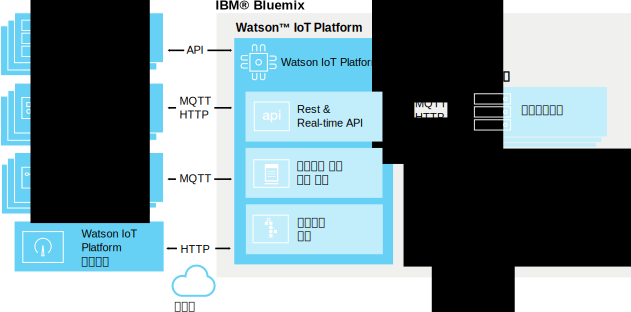

---

copyright:
  years: 2016, 2017
lastupdated: "2017-02-3"

---

{:new_window: target="\_blank"}
{:shortdesc: .shortdesc}
{:screen: .screen}
{:codeblock: .codeblock}
{:pre: .pre}

# {{site.data.keyword.iot_short_notm}} 정보
{: #about_iotplatform}

{{site.data.keyword.iot_full}}에서는 신속하게 분석 애플리케이션, 시각화 대시보드 및 모바일 IoT 앱을 작성할 수 있도록 IoT 디바이스와 데이터에 대한 강력한 애플리케이션 액세스를 제공합니다.
{:shortdesc}

{{site.data.keyword.iot_short_notm}}에서는 강력한 디바이스 관리 오퍼레이션을 수행하고 디바이스 데이터를 저장하고 액세스하며 다양한 디바이스와 게이트웨이 디바이스에 연결할 수 있습니다. {{site.data.keyword.iot_short_notm}}에서는 MQTT 및 TLS를 사용하여 디바이스와 안전하게 통신할 수 있습니다.

## {{site.data.keyword.iot_short_notm}}의 아키텍처
{: #watsoniotplatform_architecture}

**중요:** 분석 기능은 {{site.data.keyword.iotrtinsights_full}} 서비스에서 병합됩니다. {{site.data.keyword.iot_short_notm}} 조직이 기존 {{site.data.keyword.iotrtinsights_short}} 인스턴스의 데이터 소스로 사용되는 경우 {{site.data.keyword.iotrtinsights_short}} 인스턴스가 마이그레이션된 후에야 클라우드 및 에지 분석이 사용됩니다. 마이그레이션이 완료될 때까지 분석이 필요할 때는 계속 {{site.data.keyword.iotrtinsights_short}} 대시보드를 사용하십시오. 자세한 정보는 기존 {{site.data.keyword.iotrtinsights_short}} 인스턴스 대시보드 및 IBM developerWorks의 [IBM Watson IoT Platform 블로그 ](https://developer.ibm.com/iotplatform/2016/04/28/iot-real-time-insights-and-watson-iot-platform-a-match-made-in-heaven/){: new_window}를 참조하십시오.   

{{site.data.keyword.iot_short_notm}}에서는 {{site.data.keyword.iot_short_notm}} API 및 {{site.data.keyword.iot_short_notm}} 메시징 프로토콜을 사용하여 애플리케이션 및 디바이스와 통신합니다. {{site.data.keyword.iot_short_notm}} 대시보드는 프론트 엔드 사용자 인터페이스로 연결되어 플랫폼 내에서의 오퍼레이션을 간소화합니다. 디바이스 데이터는 분석 솔루션을 통해 저장하거나 사용할 수 있습니다.

## {{site.data.keyword.iot_short_notm}}의 중요한 개념
{: #watsoniotplatform_importantconcepts}

### 조직

{{site.data.keyword.iot_short_notm}}에 등록할 때 조직 ID가 부여됩니다. 조직 ID는 계정의 고유한 6자 ID입니다. 조직은 디바이스와 애플리케이션을 통해서만 데이터에 액세스할 수 있음을 확인합니다. 등록하고 나면 디바이스와 API 키가 단일 조직에 바인드됩니다. 애플리케이션에서 API 키를 사용하여 서비스에 연결하면 사용된 API 키와 연관된 조직에 등록됩니다.

보안을 위해 조직 간 통신은 불가능합니다. 두 조직 간에 데이터를 전송하는 유일한 방법은 각 조직에서 다른 조직의 애플리케이션과 통신할 애플리케이션을 작성하는 것입니다.

### 디바이스

디바이스는 인터넷에 연결되어 있고 데이터를 클라우드에 푸시할 수 있는 모든 것입니다. 그러나 디바이스는 다른 디바이스와 직접 통신할 수 없으며, 대신 애플리케이션에서 명령을 받고 이벤트를 애플리케이션에 보낼 수 있습니다. {{site.data.keyword.iot_short_notm}}의 디바이스는 고유 인증 토큰으로 식별됩니다. 디바이스를 등록해야 {{site.data.keyword.iot_short_notm}}에 연결할 수 있습니다.

{{site.data.keyword.iot_short_notm}}에서는 두 가지 디바이스 클래스(**관리 디바이스** 및 **비관리 디바이스**)를 인식합니다.

**관리 디바이스**는 디바이스 관리 에이전트가 포함된 디바이스로 정의됩니다. 디바이스 관리 에이전트는 디바이스가 디바이스 관리 프로토콜을 사용하여 {{site.data.keyword.iot_short_notm}} 디바이스 관리 서비스와 상호작용할 수 있도록 허용하는 로직 세트입니다. 관리 디바이스는 위치 업데이트, 펌웨어 다운로드 및 업데이트, 재부팅 및 팩토리 재설정 등의 디바이스 관리 오퍼레이션을 수행할 수 있습니다.

**비관리 디바이스**는 디바이스 관리 에이전트가 없는 모든 디바이스입니다. 비관리 디바이스는 {{site.data.keyword.iot_short_notm}}에 연결할 수 있고 이벤트와 명령을 보내고 받을 수 있지만 디바이스 관리 요청을 보내거나 디바이스 관리 오퍼레이션을 수행할 수 없습니다.

### 게이트웨이

게이트웨이는 애플리케이션과 디바이스의 기능이 결합된 특수화된 서비스로, 다른 디바이스의 액세스 지점 역할을 수행할 수 있습니다. 인터넷에 직접 연결할 수 없는 디바이스가 먼저 게이트웨이 디바이스에 연결하여 {{site.data.keyword.iot_short_notm}} 서비스에 액세스할 수 있습니다.

게이트웨이를 등록해야 서비스에 연결할 수 있습니다.

### 애플리케이션

애플리케이션은 인터넷에 연결되어 있고 디바이스의 데이터와 상호작용하며 해당 디바이스의 동작을 제어하는 모든 것입니다. 애플리케이션은 API 키와 고유 애플리케이션 ID를 사용하여 {{site.data.keyword.iot_short_notm}}에서 식별됩니다. 디바이스와 달리 개별 애플리케이션은 등록하지 않아도 {{site.data.keyword.iot_short_notm}}에 연결할 수 있습니다. 그러나 이전에 등록된 유효한 API 키를 사용해야 합니다.

### 이벤트

이벤트는 디바이스가 {{site.data.keyword.iot_short_notm}}에 데이터를 공개하는 데 사용하는 메커니즘입니다. 디바이스에서 메시지 컨텐츠를 제어하고 전송된 각 이벤트의 이름을 지정합니다. {{site.data.keyword.iot_short_notm}}에서는 이벤트를 보낸 디바이스를 판별하기 위해 수신한 각 이벤트에 첨부된 신임 정보를 사용합니다. 이 아키텍처에서는 디바이스가 서로 위장하지 못합니다.

애플리케이션은 이벤트를 실시간으로 처리하고 이벤트의 소스 및 이벤트에 포함된 데이터를 볼 수 있습니다. 구독한 디바이스와 이벤트를 정의하도록 애플리케이션을 구성해야 합니다.

### 명령

명령은 애플리케이션이 디바이스와 통신하는 데 사용하는 메커니즘입니다. 애플리케이션에서만 명령을 보낼 수 있으며 명령은 특정 디바이스에 전송됩니다. 지정된 명령을 받으면 디바이스에서 수행할 조치를 판별해야 합니다. 임의 명령을 청취하거나 지정된 명령 목록을 구독하도록 디바이스를 디자인할 수 있습니다.
