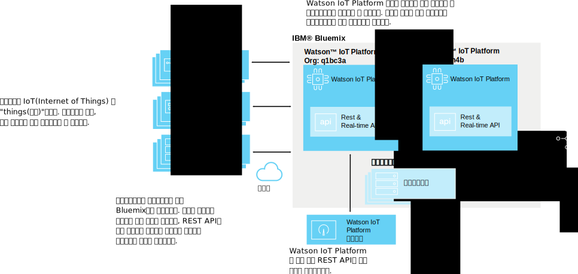
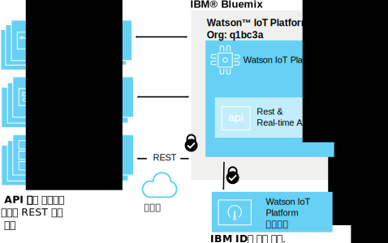
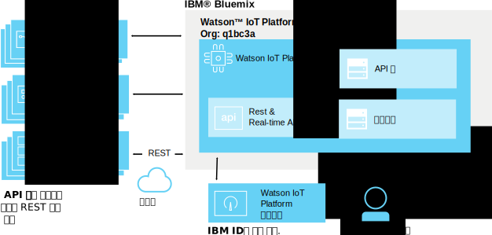
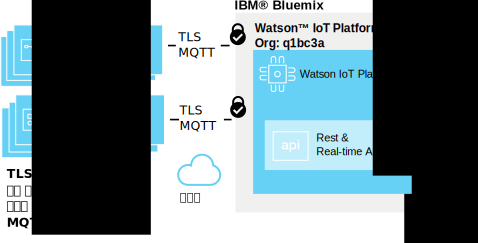
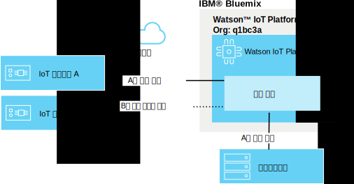
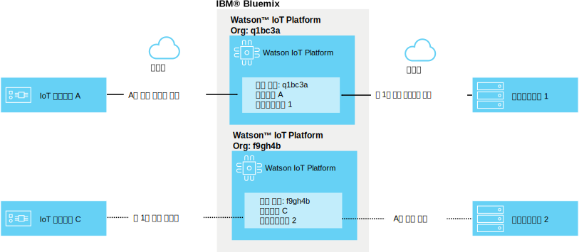

---

copyright:
  years: 2016, 2017
lastupdated: "2017-02-03"

---

{:new_window: target="blank"}
{:shortdesc: .shortdesc}
{:screen: .screen}
{:codeblock: .codeblock}
{:pre: .pre}

# {{site.data.keyword.iot_short_notm}} 보안
{: #sec-index}

클라우드에서 호스트되는 서비스로서 {{site.data.keyword.iot_full}}에는 아키텍처의 중요한 요소로 보안이 임베드되어 있습니다.
{: shortdesc}

다음 문서에서는 특정 영역에 초점을 맞춰 조직 데이터 보호 방식에 대한 몇 가지 일반 질문에 응답합니다.

* 규제 준수: 보안을 위한 기준을 설정하는 외부 표준입니다.
* 인증: 조직의 정보에 액세스하는 사용자, 디바이스 또는 애플리케이션의 ID를 보증합니다.
* 권한: 사용자, 디바이스 및 애플리케이션이 조직의 정보에 액세스하는 데 필요한 권한을 가지고 있음을 보증합니다.
* 암호화: 인증된 당사자만 데이터를 읽을 수 있고 가로채지는 못하게 합니다.

## {{site.data.keyword.iot_short_notm}} 및 {{site.data.keyword.Bluemix_notm}}
{: #iot-bluemix-sec}

{{site.data.keyword.iot_short_notm}}은 {{site.data.keyword.Bluemix_notm}} 플랫폼 내에서 실행되므로 액세스 및 연결에 {{site.data.keyword.Bluemix_notm}} 및 {{site.data.keyword.BluSoftlayer_full}}를 둘 다 사용합니다. {{site.data.keyword.Bluemix_notm}} 및 {{site.data.keyword.BluSoftlayer}}를 사용하기 때문에 {{site.data.keyword.Bluemix_notm}} 및 {{site.data.keyword.BluSoftlayer}}의 보안과 신뢰성이 {{site.data.keyword.iot_short_notm}} 사용자에게 중요합니다.

{{site.data.keyword.Bluemix_notm}}의 보안에 대한 세부사항은 [{{site.data.keyword.Bluemix_notm}} 플랫폼 보안 ](https://console.ng.bluemix.net/docs/security/index.html#platform-security){: new_window}을 참조하십시오. 

## {{site.data.keyword.iot_short_notm}} 보안 준수
{: #compliance}  
   
{{site.data.keyword.iot_short_notm}}은 정보 보안 관리 프로세스의 우수 사례를 정의하는 ISO(International Organization for Standardization) 27001 표준에 따라 인증됩니다. ISO 27001 표준은 ISMS(Information Security Management Systems)를 설정, 구현 및 문서화하기 위한 요구사항과 개별 조직의 필요에 따라 보안 제어를 구현하기 위한 요구사항을 지정합니다. ISO 27000 표준 제품군은 자산 평가 및 위험성 스케일링 프로세스를 통합하며 서면 정보, 구두 정보 및 전자 정보의 기밀성, 무결성 및 가용성 보호를 목표로 합니다.

{{site.data.keyword.iot_short_notm}}은 써드파티 보안 업체에서 감사하며 ISO 27001({{site.data.keyword.iot_short_notm}} ISO 27001:2013 등록 인증)의 모든 요구사항을 만족합니다. 

## {{site.data.keyword.iot_short_notm}} 용어
{: #terminology}

## 조직에서 IoT 정보 관리를 보호하는 방법
{: #secure-org}

브라우저 기반 GUI 및 REST API 앞에는 HTTPS와 DigiCert에서 서명한 인증서가 오므로 진본의 {{site.data.keyword.iot_short_notm}}에 연결 중임을 신뢰할 수 있습니다. 웹 기반 GUI에 대한 액세스는 IBM ID 또는 {{site.data.keyword.Bluemix_notm}} {{site.data.keyword.ssoshort}}를 통해 인증됩니다. REST API를 사용하려면 GUI를 통해 생성된 API 키가 필요하므로 이 키를 사용하여 조직에 대해 인증된 REST API를 호출할 수 있습니다.

## 디바이스 및 애플리케이션 신임 정보에 보안을 설정하는 방법
{: #secure-credentials}

디바이스가 등록되거나 API 키가 생성되면 인증 토큰이 솔트(salt)되고 해시됩니다. 즉, 조직의 신임 정보를 시스템에서 복구할 수 없습니다. {{site.data.keyword.iot_short_notm}}이 손상되는 매우 드문 경우에도 마찬가지입니다. 

디바이스 신임 정보 및 API 키는 위태롭게 되는 경우 개별적으로 취소될 수 있습니다. 

## {{site.data.keyword.iot_short_notm}}에 디바이스를 안전하게 연결하는 방법
{: #secure-device-connection}

연결된 디바이스에서는 플랫폼에 디바이스를 추가할 때 생성된 클라이언트 ID와 인증 토큰의 조합을 사용합니다. MQTT v3.1.1은 여러 플랫폼과 언어 간에 단순 상호 운용성을 허용하는 데 사용합니다.{{site.data.keyword.iot_short_notm}}에서는 TLS v1.2를 통한 연결을 지원합니다. 

TLS 및 암호 스위트 요구사항에 대한 자세한 정보는 `Watson IoT Platform에 애플리케이션, 디바이스 및 게이트웨이 연결` 문서의 [TLS 요구사항 ](https://console.ng.bluemix.net/docs/services/IoT/reference/security/connect_devices_apps_gw.html#tls_requirements){: new_window} 절을 참조하십시오. 

## IoT 디바이스 간 데이터 누출 방지 방법
{: #prevent-leak-devices}

보안 메시징 패턴이 빌드됩니다. 인증되고 나면 디바이스에는 제한된 주제 공간을 공개하고 구독할 수 있는 권한만 부여됩니다.

* '/iot-2/evt/<event_id>/fmt/<format_string>'
* '/iot-2/cmd/<command_id>/fmt/<format_string>'

모든 디바이스가 동일한 주제 공간에 대해 작업합니다. 클라이언트에서 제공하는 인증 신임 정보를 통해 {{site.data.keyword.iot_short_notm}}에서 이 주제 영역의 범위로 지정될 디바이스를 나타냅니다. 이를 수행하면 디바이스가 다른 디바이스를 위장하는 것이 방지됩니다. 

다른 디바이스를 위장하는 유일한 방법은 해당 디바이스에 대해 안전을 위협하는 보안 신임 정보를 얻는 것입니다. 

애플리케이션은 조직의 모든 디바이스에 대한 이벤트 및 명령 주제 모두에서 구독하고 공개할 수 있습니다. 애플리케이션에서 동시에 여러 디바이스의 데이터를 분석할 수 있으며 전이중 통신 루프의 보완 사항을 형성하는 외에도 디바이스를 시뮬레이션하거나 프록시할 수 있습니다.

## 조직 간 IoT 데이터 누출 방지 방법
{: #prevent-leak-org}

디바이스 및 애플리케이션이 작동하는 주제 공간은 단일 조직 내에서 범위가 지정됩니다. 인증되면 {{site.data.keyword.iot_short_notm}}이 클라이언트 인증을 기반으로 조직 ID를 사용하여 주제 구조를 변환하므로 한 조직의 데이터를 다른 조직에서 액세스할 수 없게 됩니다.

# 관련 링크
{: #rellinks}
## 관련 링크
{: #general}
* [{{site.data.keyword.iot_short_notm}} 시작하기](https://console.ng.bluemix.net/docs/services/IoT/index.html)
* [{{site.data.keyword.Bluemix_notm}} 보안 ](https://console.ng.bluemix.net/docs/security/index.html#security "외부 링크 아이콘"){:new_window}
* [{{site.data.keyword.Bluemix_notm}} 플랫폼 보안 ](https://console.ng.bluemix.net/docs/security/index.html#platform-security "외부 링크 아이콘"){:new_window}
* [{{site.data.keyword.Bluemix_notm}} 규제 준수](https://console.ng.bluemix.net/docs/security/index.html#compliance){:new_window}
* [{{site.data.keyword.BluSoftlayer}} 보안 ](http://www.softlayer.com/security "외부 링크 아이콘"){:new_window}
* [{{site.data.keyword.BluSoftlayer}} 준수 ](http://www.softlayer.com/compliance "외부 링크 아이콘"){:new_window}
