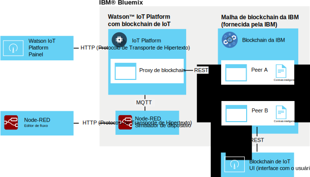

---

copyright:
  years: 2016, 2017
lastupdated: "2016-12-08"

---

{:new_window: target="\_blank"}
{:shortdesc: .shortdesc}
{:screen: .screen}
{:codeblock: .codeblock}
{:pre: .pre}

# Integração de blockchain ao {{site.data.keyword.iot_short_notm}}
{: #gettingstartedtemplate}

A integração de blockchain ao {{site.data.keyword.iot_short_notm}} permite que dispositivos IoT forneçam dados a transações de blockchain, o que armazena os dados no livro razão imutável de blockchain e usa os mesmos nas regras de negócios implementadas nos contratos inteligentes de blockchain.
{:shortdesc}

A plataforma aceita dados do dispositivo em seu formato MQTT nativo, mapeia os mesmos para o formato de dados requerido pelo contrato inteligente de blockchain e os passa para uma malha de blockchain para armazenamento no livro razão de blockchain. Uma malha de blockchain é uma coleção de nós peer e de certificação que formam uma instância do {{site.data.keyword.blockchainfull}} e do Hyperledger.

## Arquitetura de integração de blockchain  
{: #architecture}

Um ambiente genérico de integração de blockchain ao {{site.data.keyword.iot_short_notm}} consiste nos componentes a seguir:
- Um ou mais dispositivos que produzem dados que você deseja gravar em um livro razão de blockchain.
- Organização do {{site.data.keyword.Bluemix_notm}}:
 - Serviço do {{site.data.keyword.iot_short_notm}} com integração de blockchain de IoT ativada.
 - Malha de {{site.data.keyword.blockchainfull_notm}} ou de Hyperledger com um ou mais contratos inteligentes implementados.
- Ambiente local:
 - UI (interface com o usuário) de monitoramento de blockchain de IoT

Para obter informações sobre a configuração e os requisitos para um ambiente estendido para produzir e implementar contratos inteligentes, consulte [Desenvolvendo contratos inteligentes para integração de blockchain ao {{site.data.keyword.iot_short_notm}}](blockchain/dev_blockchain.html).  

O diagrama a seguir ilustra o ambiente general de integração de blockchain ao {{site.data.keyword.iot_short_notm}}.

## Antes de iniciar
{: #byb}

- Obtenha uma visão geral do {{site.data.keyword.iot_short_notm}}, como se relaciona ao conceito geral de blockchain e o que ele pode fazer por você em [{{site.data.keyword.iot_short_notm}}](http://www.ibm.com/blockchain/) no IBM.com.
- [Ative a integração de blockchain do {{site.data.keyword.iot_short_notm}}](reference/extensions/index.html#blockchain) para sua organização.
- Conecte dispositivos que produzem dados que você deseja gravar no livro razão de blockchain.  
Siga as instruções do tópico [Conectando dispositivos](iotplatform_task.html) para conectar seus dispositivos.
- Instale a UI (interface com o usuário) de monitoramento.
A UI (interface com o usuário) de monitoramento é usada para verificar a conexão entre o {{site.data.keyword.iot_short_notm}} e a malha de blockchain. Siga as instruções do documento leia-me da UI (interface com o usuário) de monitoramento está disponível no diretório do GitHub [UI (interface com o usuário) de monitoramento de blockchain](https://github.com/ibm-watson-iot/blockchain-samples/tree/master/applications/monitoring_ui).

### Usando o cenário básico IBM para iniciar rapidamente

Para iniciar rapidamente com o teste da integração de blockchain ao {{site.data.keyword.iot_short_notm}}, é possível se conectar a uma malha fornecida pela IBM e mapear um dispositivo de amostra Node-RED para o contrato de amostra fornecido pela IBM.  As etapas necessárias para esse cenário estão rotuladas como **Cenário básico IBM** neste tópico.  
**Importante:** esteja ciente de que o livro razão de blockchain da amostra fornecida pela IBM e todos os seus dados estão visíveis para todos os usuários do blockchain de amostra. Não armazene nenhuma informação confidencial no blockchain de amostra fornecido pela IBM. Além disso, as malhas de amostra que suportam os contratos de amostra e de linha comercial estão sujeitas a mudanças, incluindo as informações de conexão de cada peer. Os detalhes de conexão são fornecidos na página da wiki [Informações de conexão de blockchain de IoT](https://www.ibm.com/developerworks/community/wikis/home?lang=en#!/wiki/W7a44a0e604d9_4a90_89b7_0a2bdbe81b00/page/Blockchain%20Fabric%20Connections) na comunidade Watson IoT Blockchain.

O ambiente básico de integração de blockchain ao {{site.data.keyword.iot_short_notm}} fornecido pela IBM consiste nos componentes a seguir:
- {{site.data.keyword.Bluemix_notm}}:
 - Serviço do {{site.data.keyword.iot_short_notm}} com integração de blockchain de IoT ativada
 - Opcional: aplicativo Node-RED executando o simulador de dispositivo IoT  
 **Nota:** o simulador de dispositivo também pode ser implementado em um ambiente local do Node-RED.
- Ambiente local:
 - Node.js
 - UI (interface com o usuário) de monitoramento de blockchain de IoT
- Fornecido pela IBM:
 - Opcional: malha do {{site.data.keyword.iot_short_notm}} com um contrato inteligente simples pré-implementado.

O diagrama da arquitetura a seguir ilustra os componentes necessários para esse cenário de amostra.

**Cenário básico IBM:** crie um simulador de dispositivo Node-RED seguindo as instruções do tópico [Criando e conectando um simulador de dispositivo Node-RED](nodereddevice_sample.html). Para integração de blockchain, use as informações de nó específicas do dispositivo de blockchain ao importar os dados do nó. As informações do nó estão disponíveis na página da wiki [Simulador de dispositivo Node-RED](https://www.ibm.com/developerworks/community/wikis/home?lang=en#!/wiki/W7a44a0e604d9_4a90_89b7_0a2bdbe81b00/page/Node-RED%20Device%20Simulator) na comunidade Watson IoT Blockchain. Se necessário, entre em contato com seu contato de blockchain da IBM para obter acesso à comunidade.

## Conectar a uma malha do blockchain
{: #getting_started}  
Como a integração de blockchain ao {{site.data.keyword.iot_short_notm}} está ativada, agora é possível se conectar a malhas de blockchain hospedadas pelo {{site.data.keyword.blockchainfull_notm}} ou pelo Linux Foundation Hyperledger.

Para se conectar a uma malha de blockchain:
1. No painel do {{site.data.keyword.iot_short_notm}}, selecione **Extensões**.
2. Na página **Extensões**, no quadro Blockchain, clique em **Configurar**.
3. Na página **Extensões**, no quadro Blockchain, clique em **Configurar** ou clique em  se já houver malhas vinculadas e, em seguida, insira as informações de malha.
 1. Na guia **Malha**, insira um nome para identificar a malha no {{site.data.keyword.iot_short_notm}} e, em seguida, clique em **Avançar**.   
 2. Na guia **Peer**, insira as informações de peer:  
<table>
<thead>
<tr>
<th>Parâmetro</th>
<th>Value</th>
</tr>
</thead>
<tbody>
<tr>
<td>Name</td>
<td>Insira um nome para identificar o peer no {{site.data.keyword.iot_short_notm}}.</td>
</tr>
<tr>
<td>Host</td>
<td>O endereço `api_host` para o servidor de Validação do Peer 1</td>
</tr>
<tr>
<td>Porta</td>
<td>O número da `api_port`<ul><li>Use a porta 80 se sua implementação não usar TLS (Segurança da Camada de Transporte).</li><li>Use a porta 443 se sua implementação usar TLS (Segurança da Camada de Transporte).</li></ul></td>
</tr>
<tr>
<td>Id do usuário</td>
<td>A sequência `username` do usuário usado para registrar o contrato inteligente com o blockchain. Também é possível usar esse ID do usuário ao configurar posteriormente a UI (interface com o usuário) simples.</td>
</tr>
<tr>
<td>Chave Secreta</td>
<td>A sequência `secret` do usuário</td>
</tr>
<tr>
<td>Use TLS</td>
<td>Ligado ou desligado Use Segurança da Camada de Transporte para criptografar a comunicação entre o {{site.data.keyword.iot_short_notm}} e o contrato na malha. Os números de porta padrão são configurados pela instância do {{site.data.keyword.iot_short_notm}} implementada à qual você está se conectando.</td>
</tr></tbody>
</table>  
 3. Clique em **Concluir**.
3. Na seção Configurar blockchain, clique em **Pronto** para salvar as informações de malha.

**Cenário básico IBM:** para se conectar à malha fornecida pela IBM, use os detalhes da conexão do contrato de amostra fornecidos na página da wiki [Informações da conexão de blockchain de IoT](https://www.ibm.com/developerworks/community/wikis/home?lang=en#!/wiki/W7a44a0e604d9_4a90_89b7_0a2bdbe81b00/page/Blockchain%20Fabric%20Connections) na comunidade Watson IoT Blockchain. Se necessário, entre em contato com seu contato de blockchain da IBM para obter acesso à comunidade.

## Mapear dados do dispositivo para contratos inteligentes
{: #map_device_properties}

Para gravar dados do dispositivo no livro razão de blockchain, deve-se primeiramente mapear as propriedades do dispositivo de um tipo de dispositivo para os parâmetros definidos pelo contrato inteligente.

Para mapear dados do dispositivo para um contrato:
 1. No painel do {{site.data.keyword.iot_short_notm}}, clique em  na barra lateral de menus.
 3. Clique em **Mapear dados do dispositivo**.
 4. Selecione o tipo de dispositivo no qual você deseja armazenar dados do dispositivo no blockchain.
 5. Insira o nome do evento para os eventos que você deseja armazenar.  
 **Dica:** o nome do evento padrão para o dispositivo de blockchain Node-RED de amostra é obc. Para localizar os tipos de eventos para um dispositivo, no painel do {{site.data.keyword.iot_short_notm}}, selecione **Dispositivos** e clique no nome do dispositivo para abrir a página de detalhes do dispositivo. Role para baixo até a seção **Informações do sensor** para ver uma lista de eventos e pontos de dados disponíveis para o dispositivo. É possível mudar o nome do evento que o dispositivo Node-RED publica atualizando o campo Tópico no modo de saída mqtt Publicar em IoT.  
 6. Clique em **Avançar**.
 6. Selecione a instância de malha que você criou anteriormente.
 7. Insira um nome de contrato e o ID do contrato.  
<table>
<thead>
<tr>
<th>Parâmetro</th>
<th>Comentários</th>
</tr>
</thead>
<tbody>
<tr>
<td>Nome do Contrato</td>
<td>Um nome que é usado para identificar o contrato no {{site.data.keyword.iot_short_notm}}.</td>
</tr>
<tr>
<td>ID do Contrato</td>
<td>O ID exclusivo de 128 caracteres do contrato mapeado.   **Importante:** o contrato que você mapeia deve pelo menos suportar os métodos a seguir:
- updateAsset
- readAssetSchemas  </td>
</tr>
</tbody>
</table>
**Cenário básico IBM:** o contrato inteligente pré-implementado de amostra permite mapear pontos de dados do dispositivo para determinados atributos do contrato para armazenar os valores de pontos de dados no livro razão de blockchain. Use o contrato de amostra para testar o mapeamento de dados do dispositivo antes de tentar os contratos de linha comercial mais avançados ou escrever seus próprios contratos. O ID do contrato é fornecido na página da wiki [Informações de conexão de blockchain de IoT](https://www.ibm.com/developerworks/community/wikis/home?lang=en#!/wiki/W7a44a0e604d9_4a90_89b7_0a2bdbe81b00/page/Blockchain%20Fabric%20Connections) na comunidade Watson IoT Blockchain. Se necessário, entre em contato com seu contato de blockchain da IBM para obter acesso à comunidade.

 8. Crie uma rota para mapear propriedades do dispositivo para os parâmetros do contrato.  
 Os parâmetros que estão disponíveis no contrato são importados. Para cada parâmetro, insira uma propriedade de evento correspondente.  
 **Importante:** não inclua `d.` que está anexado à frente do ponto de dados na mensagem do dispositivo.
 **Cenário básico IBM:** se você estiver usando os contratos fornecidos pela IBM, mapeie os parâmetros a seguir que estão listados na página da wiki [Mapeamento de dados](https://www.ibm.com/developerworks/community/wikis/home?lang=en#!/wiki/W7a44a0e604d9_4a90_89b7_0a2bdbe81b00/page/Data%20Mapping) na comunidade Watson IoT Blockchain. Se necessário, entre em contato com seu contato de blockchain da IBM para obter acesso à comunidade.
 9. Na página de resumo, verifique se todas as informações foram inseridas corretamente.
 10. O mapeamento de dados do dispositivo para o contrato é exibido na página Blockchain.

Parabéns, agora você está com tudo funcionando!

## Fazer um test drive do contrato inteligente de amostra fornecido pela IBM
{: #test_simple}

Se você estiver conectado à malha fornecida pela IBM e tiver mapeado os dados de seu dispositivo para o contrato de amostra, será possível testar o fluxo de dados de ponta a ponta do dispositivo para o livro razão de blockchain. Use a UI (interface com o usuário) de monitoramento de blockchain de IoT para visualizar a atividade de blockchain e os dados para seus ativos.  
**Dica:** se a UI (interface com o usuário) de monitoramento ainda não estiver instalada em seu ambiente local, será possível instalá-la agora. Siga as instruções do documento leia-me da UI (interface com o usuário) de monitoramento está disponível no diretório do GitHub [UI (interface com o usuário) de monitoramento de blockchain](https://github.com/ibm-watson-iot/blockchain-samples/tree/master/applications/monitoring_ui).  
1. Configure a UI (interface com o usuário) de monitoramento para conectar-se ao {{site.data.keyword.iot_short_notm}}.  
 Na UI (interface com o usuário) de monitoramento, clique em **CONFIGURAÇÃO** para configurar a conexão da UI de monitoramento:
 <table>
<thead>
<tr>
<th>Parâmetro</th>
<th>Comentários</th>
</tr>
</thead>
<tbody>
<tr>
<td>Host e porta da API (interface de programação de aplicativos)</td>
<td>O host e a porta para a API (interface de programação de aplicativos) REST do {{site.data.keyword.iot_short_notm}} que tem como prefixo `http://`. Use o endereço de `api_host` e o número de `api_port`. </td>
</tr>
<tr>
<td>ID do código da cadeia</td>
<td>O ID do contrato é uma sequência alfanumérica de 128 caracteres que corresponde à entrada do ID do contrato.  
**Importante:** ao recortar e colar o ID do código da cadeia, certifique-se de que nenhum espaço seja incluído no ID. Se o ID for inserido incorretamente, as entradas do livro razão de blockchain serão exibidas, mas a função de procura de ativos não funciona.
</td>
</tr>
<tr>
<td>Contexto seguro</td>
<td>Esse parâmetro é necessário para se conectar às instâncias do {{site.data.keyword.iot_short_notm}} no Bluemix. Use a entrada secureContext.  
**Importante:** secureContext deve ser um usuário autorizado da malha, definido quando você criou a malha.
</td>
</tr>
</tbody>
</table>
**Cenário básico IBM:** para configurar a UI (interface com o usuário) de monitoramento para se conectar aos contratos básicos ou de linha comercial, use os detalhes da conexão fornecidos na página da wiki [Informações de conexão de blockchain de IoT](https://www.ibm.com/developerworks/community/wikis/home?lang=en#!/wiki/W7a44a0e604d9_4a90_89b7_0a2bdbe81b00/page/Blockchain%20Fabric%20Connections) na comunidade Watson IoT Blockchain. Se necessário, entre em contato com seu contato de blockchain da IBM para obter acesso à comunidade.
2. No editor de fluxo Node-RED, clique no botão no nó CON123 para injetar dados do dispositivo, enviá-los como uma mensagem para o {{site.data.keyword.iot_short_notm}} e gravá-los no livro razão do {{site.data.keyword.iot_short_notm}} pelo contrato simples.   
**Dica:** para obter um fluxo de dados contínuo, dê um clique duplo no nó de injeção, configure o parâmetro Repeat para `interval` e configure um intervalo apropriado, como a cada um minuto.
3. Na UI (interface com o usuário) de monitoramento, verifique se os dados do dispositivo são exibidos conforme esperado nos blocos de blockchain.  
  1. Verifique se os blocos são incluídos na cadeia quando você injeta dados do dispositivo.  
  **Importante:** não use o botão Atualizar do navegador para atualizar a UI (interface com o usuário) de monitoramento. A UI (interface com o usuário) é atualizada automaticamente a cada poucos segundos. Usar o botão Atualizar do navegador redefine as configurações da UI (interface com o usuário) para seus valores padrão e deve-se reconfigurar a UI de monitoramento para ver o blockchain de seu contrato.
  2. Para ver as informações de livro razão mais recentes para seu ativo, no campo de procura do ID do ativo, insira o ID de seu ativo e clique em **ENVIAR**. Exemplo: `CON123`  
  Para ver dados de blockchain para mais de um ativo que usa o mesmo contrato, insira o nome desse ativo e clique em **ENVIAR**. Clique em **RECONFIGURAR** para reiniciar.  
  **Dicas:**
    - Ativar o recurso Pesquisar mudanças irá assegurar que a UI (interface com o usuário) pesquise de forma contínua quaisquer mudanças no ativo que está sendo observado / monitorado e atualize os dados assim que a mudança for confirmada no blockchain.
    - O assetID padrão do dispositivo de blockchain é "CON123". Se você tiver modificado a mensagem do dispositivo ou atualizado o assetID no simulador de dispositivo Node-RED, será possível consultar o assetID no {{site.data.keyword.iot_short_notm}}. Acesse a página **Dispositivos** e clique em seu dispositivo para abrir a página de detalhes do dispositivo. Role para baixo até a seção **Informações do sensor** para ver uma lista dos pontos de dados do dispositivo. Use o valor do ponto de dados `d.assetID` para seu assetID.

## Próximas etapas  
{: #next_steps}  
Agora você tem um ambiente básico do {{site.data.keyword.iot_short_notm}} integrado de blockchain de IoT instalado e configurado. Neste cenário mínimo, o contrato inteligente básico permite gravar dados do dispositivo no livro razão de blockchain para criar um histórico de dados do dispositivo indelével. Agora que você concluiu essas etapas iniciais e testou o contrato simples, é possível experimentar o contrato de amostra de linha comercial mais avançado e escrever seus próprios contratos.    

Instruções para essas etapas mais avançadas são fornecidas no tópico [Desenvolvendo contratos inteligentes para integração de blockchain ao {{site.data.keyword.iot_short_notm}}](blockchain/dev_blockchain.html).
