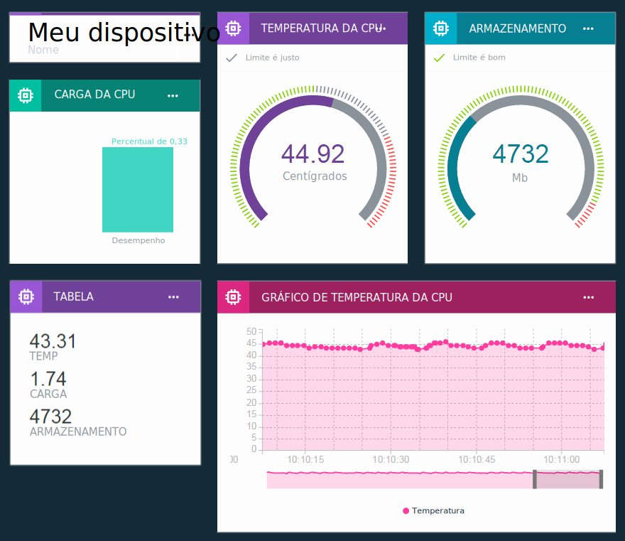

---

copyright:
  years: 2016, 2017
lastupdated: "2017-03-13"

---

{:new_window: target="\_blank"}
{:shortdesc: .shortdesc}
{:screen: .screen}
{:codeblock: .codeblock}
{:pre: .pre}

# Visualizando dados em tempo real usando placas e cartões
{: #boards_and_cards}

Crie placas e cartões para criar e compartilhar seus próprios painéis que visualizam os dados de seu dispositivo de tempo real.
{:shortdesc}

Usando placas e cartões, é possível visualizar graficamente valores do conjunto de dados de um ou mais dispositivos para fornecer uma visão geral rápida e aprimorar o entendimento dos dados. Crie placas e inclua cartões que exibam os dados como números brutos, gráficos em tempo real, medidores e mais. Inclua membros em suas placas para compartilhá-los com outros usuários em sua organização. Organize os cartões e inclua divisórias de texto explicativo para fazer um ajuste fino de sua apresentação.  

É possível também expandir o conjunto padrão de cartões fornecidos pela IBM [criando seus próprios cartões customizados](custom_cards/custom-cards.html).

## Placas padrão
{: #default_boards}
O painel do {{site.data.keyword.iot_full}} têm as placas padrão a seguir:

|Nome do Painel | Descrição |  
|:---|:---|  
|Visão Geral do Uso  | Mostra estatísticas de uso para sua organização. Lista os tipos de dispositivo e os dados que são consumidos.
|Análise de dados central da regra | Mostra as regras para sua organização. Cartões adicionais listam alertas acionados, dispositivos associados, propriedades dos dispositivos e informações de alerta. |  
|Análise de dados central do dispositivo | Mostra os dispositivos que estão conectados à sua organização. Cartões adicionais mostram alertas para um dispositivo selecionado, informações para um dispositivo selecionado, propriedades do dispositivo e informações de alerta. |
|Gerenciamento de risco e segurança | Mostra cartões que resumem o status de segurança geral. Os operadores do sistema e os analistas de segurança podem visualizar detalhes de conformidade, status de conexão para dispositivos, as causas das falhas de conexão e os dispositivos bloqueados ou permitidos por meio de uma lista de bloqueio ou uma lista de desbloqueio.  No cartão Conformidade de conexão, o usuário pode realizar drill down para um relatório detalhado sobre dispositivos fora de conformidade e pode exportar o relatório para o Excel. |

É possível atualizar essas placas incluindo, atualizando e removendo cartões.

**Dica:** para reconfigurar uma placa padrão para seu estado original pode excluí-la. A placa será então recriada com os cartões originais.

## Criando placas e cartões
{: #visualizing_data}

O {{site.data.keyword.iot_short_notm}} fornece um painel integrado que é possível usar para exibir os dados em tempo real que seu dispositivo está retornando. Por padrão, a página Visão geral exibe informações de uso sobre o sua organização do {{site.data.keyword.iot_short_notm}}, como dados e o espaço de armazenamento consumido. Para ver os dados do dispositivo de tempo real conforme fluem para dentro, inclua cartões específicos do dispositivo nesta página.

Para incluir um cartão específico do dispositivo em uma placa:
1. No painel do {{site.data.keyword.iot_short_notm}}, selecione **Placas**.
2. Selecione uma placa para a qual você tem direitos de edição ou crie uma placa nova.
3. Na placa, clique em **Incluir novo cartão**.
2. Na caixa Editar cartão de visualização genérica, role para baixo até a seção Dispositivos.
3. Selecione um tipo de visualização.
**Dica:** selecione **Visualização genérica** para a configuração básica. É possível mudar o tipo de cartão posteriormente.
Clique em **Mostrar mais** para a lista completa de tipos de cartão.
4.	Selecione uma ou mais origens de dados de cartão e, em seguida, clique em **Avançar** para incluir um ou mais conjuntos de dados.
 1.	Forneça ao conjunto de dados um nome de identificação.
 2. Selecione um evento que inclua o ponto de dados que você deseja exibir.
 3.	Selecione a propriedade que representa o ponto de dados.
 4.	Configure o tipo, a unidade, a precisão e os valores mínimo e máximo para o ponto de dados.  
 Quando você tiver terminado, será possível clicar em **Novo conjunto de dados** para incluir mais conjuntos de dados ou clicar em **Avançar**.
5.	Selecione a visualização.  
Selecione o tipo e o tamanho da visualização que você deseja usar.  Alguns tipos de cartão têm mais configurações.
<dl>
<dt>Uso</dt>
<dd>
<table>
<thead>
<tr>
<th>Tipo</th>
<th>Dados exibidos</th>
</tr>
</thead>
<tbody>
<tr>
<td>Tipos de dispositivos</td>
<td>Um gráfico de pizza que exibe o número de dispositivos por tipo de dispositivo.</td>
</tr><tr>
<td>Dados transferidos</td>
<td>Estatísticas de uso para dados transferidos para sua organização.</td>
</tr>
</tbody>
</table>
</dd>
<dt>Básica</dt>
<dd>
<table>
<thead>
<tr>
<th>Tipo</th>
<th>Dados exibidos</th>
</tr>
</thead>
<tbody>
<tr>
<td>Separator</td>
<td>Um separador horizontal para estruturar e agrupar cartões na placa.</td>
</tr>
</tbody>
</table>
</dd>
<dt>Dispositivos</dt>
<dd><table>
<thead>
<tr>
<th>Tipo</th>
<th>Dados exibidos</th>
</tr>
</thead>
<tbody>
<tr>
<td>Visualização genérica</td>
<td>O valor de um ou mais conjuntos de dados.  **Dica:** para ver até três valores de pontos de dados em uma tabela pequena, escolha o tamanho de widget grande.  </td>
</tr>
<tr>
<td>Gráfico em tempo real</td>
<td>Um ou mais conjuntos de dados em um gráfico de rolagem em tempo real. Use o menu Configurações para configurar o intervalo de dados e a retenção, a aparência dos gráficos e mais. </td>
</tr>
<tr>
<td>gráfico de barras</td>
<td>Valores do conjunto de dados em barras rotuladas. Use o menu Configurações para alternar a direção da barra horizontal ou vertical.</td>
</tr>
<tr>
<td>Gráfico de rosca</td>
<td>Dois ou mais conjuntos de dados em uma representação circular.</td>
</tr>
<tr>
<td>Value</td>
<td>O valor bruto de um ou mais conjuntos de dados.</td>
</tr>
<tr>
<td>Medidor</td>
<td>O valor de um conjunto de dados mostrado como um medidor. É possível configurar limites de exibição para valores bom, justo e crítico do conjunto de dados. Use o menu Configurações para opcionalmente configurar limites do medidor para intervalos de dados inferior, intermediário e superior.  </td>
</tr>
</tbody>
</table>
</dd>
<dt>Analytics</dt>
<dd>
<table>
<thead>
<tr>
<th>Tipo</th>
<th>Dados exibidos</th>
</tr>
</thead>
<tbody>
<tr>
<td>Informações do dispositivo</td>
<td>Mostra informações básicas para um único dispositivo.</td>
</tr>
<tr>
<td>Informações de alerta</td>
<td>Mostra informações básicas para um único alerta.</td>
</tr>
<tr>
<td>Lista de dispositivos</td>
<td>Uma lista para monitorar vários dispositivos.</td>
</tr>
<tr>
<td>Alerts</td>
<td>Uma lista de alertas para um dispositivo.</td>
</tr>
<tr>
<td>Rules</td>
<td>Uma lista das regras que têm alertas.</td>
</tr>
<tr>
<td>Propriedades do Dispositivo</td>
<td>Mostra propriedades específicas para um ou mais dispositivos.</td>
</tr>
<tr>
<td>Todas as propriedades do dispositivo</td>
<td>Mostrar todas as propriedades para um ou mais dispositivos.</td>
</tr>
<tr>
<td>Mapa de dispositivos</td>
<td>Mostra o local de vários dispositivos em uma lista.</td>
</tr>
</tbody>
</table>
</dd>
</dl>

6. Especifique a origem de dados para o cartão.  
Dependendo do tipo de cartão selecionado, os dados exibidos em um cartão podem vir de um dispositivo ou de outro cartão. Selecione um dispositivo específico, uma lista de dispositivos ou um cartão de lista de alertas para a origem de dados e clique em **Avançar**.
7. Somente para cartões de tipo de dispositivo: inclua um ou mais conjuntos de dados para exibir no cartão.   
 1. Clique em **Conectar conjunto de dados** para incluir uma propriedade para exibir no cartão.
 2. Forneça ao conjunto de dados um nome.
 3. Insira ou selecione o evento para o qual exibir as propriedades.
 4. Insira ou selecione a propriedade para exibir.
 5. Especifique o tipo da propriedade e, opcionalmente, configure a unidade, a precisão, os valores mínimo e máximo para a propriedade.  
 6. Clique em **Avançar**.
7. Selecione o tamanho da apresentação.   
Para determinados tipos de cartão, é possível clicar em **Configurações** para configurar detalhes de visualização adicionais. Clique em **Avançar**.
7. Forneça um título e uma descrição para o cartão e, opcionalmente, selecione um esquema de cores e, em seguida, clique em **Enviar** para criar o cartão.
7.	Por fim, posicione o novo cartão em sua placa arrastando-o para uma boa localização.  

Ótimo! Agora é possível ver os dados em tempo real de seu dispositivo!

Para obter instruções passo a passo sobre como exibir dados do dispositivo em tempo real, veja a orientação [Configurando placas e cartões no novo Painel do Watson IoT ](https://developer.ibm.com/recipes/tutorials/configuring-the-cards-in-the-new-watson-iot-dashboard/){: new_window}.
