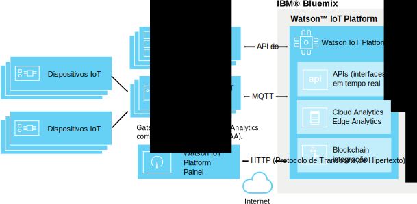

---

copyright:
  years: 2016, 2017
lastupdated: "2017-03-13"

---

{:new_window: target="\_blank"}
{:shortdesc: .shortdesc}
{:screen: .screen}
{:codeblock: .codeblock}
{:pre: .pre}

# Edge Analytics
{: #edge_analytics}

Com Edge Analytics, você move o processo de acionamento da regra de análise de dados da nuvem para um gateway ativado por Edge Analytics que pode reduzir de forma drástica a quantia de tráfego de dados do dispositivo para a nuvem executando o processamento de análise de dados próximo ao dispositivo.
{:shortdesk}

Os dispositivos enviam seus dados a um gateway ativado por Edge Analytics em que as regras de Edge Analytics analisam os dados. Dependendo da função e sua ação, dados críticos e alertas podem ser enviados ao {{site.data.keyword.iot_full}}, acionarem um alerta no gateway ou serem gravados em um arquivo de texto que é local para o gateway.

O diagrama a seguir ilustra a arquitetura geral de um ambiente de Edge Analytics do {{site.data.keyword.iot_full}}.

## Antes de iniciar
{: #byb}

Antes de iniciar a criação de regras e ações de Edge Analytics:
- Certifique-se de que o gateway esteja conectado ao {{site.data.keyword.iot_short}} e que os dados do dispositivo estejam sendo transmitidos. Consulte [Conectando gateways](gateways/dashboard.html) para obter mais informações.
- Instale o Edge Analytics Agent (EAA) em seu gateway. Para obter informações, consulte [Instalando o Edge Analytics Agent](gateways/dashboard.html#edge).   **Dica:** gateways ativados para o EAA fornecem dados de diagnóstico do EAA no formato de mensagens do dispositivo de gateway. Para obter informações, consulte [Métricas de diagnóstico do Edge Analytics Agent](#eaa_metrics).
- Certifique-se de que as propriedades do dispositivo que você deseja usar como condições em suas regras sejam mapeadas para esquemas. Consulte [Conectando dispositivos](iotplatform_task.html) e [Criando esquemas](im_schemas.html) para obter mais informações.
- Revise as orientações do Edge Analytics  
Em nosso portal Orientações, algumas orientações descrevem as etapas que são necessárias para executar o IBM Edge Analytics. As orientações descrevem claramente como instalar e configurar o IBM Edge Analytics Agent em um dispositivo construído sobre o Apache Edgent para executar análise próxima a uma origem de dados da IoT.
 - A orientação [Introdução ao Edge Analytics no IBM Watson IoT Platform ](https://developer.ibm.com/recipes/tutorials/getting-started-with-edge-analytics-in-watson-iot-platform/){: new_window} é o início dessa série. Essa orientação descreve como configurar o Cisco DSA Platform em um Sistema Laptop e um Dispositivo Raspberry Pi 3, como instalar e configurar o IBM Edge Analytics Agent para se conectar ao {{site.data.keyword.iot_short}}, como instalar o Sistema DS Link e configurá-lo para se conectar ao Gateway do Edge Analytics no {{site.data.keyword.iot_short}} como um dispositivo conectado, como definir e ativar a Regra do Edge no Edge Gateway e o gerenciamento da Regra de Edge Analytics por meio do {{site.data.keyword.iot_short}}.
 - Para ilustrar um uso avançado do Edge Analytics, a orientação [Manipulando alertas e ações de dispositivo com o Edge Analytics no IBM Watson IoT Platform ](https://developer.ibm.com/recipes/tutorials/handling-alerts-and-device-actions-with-edge-analytics-in-ibm-watson-iot-platform/){: new_window} exibe um showcase de como construir seu próprio Link DS para transferir dados de um dispositivo Arduino Uno conectado a um dispositivo Raspberry Pi 3. A orientação também exibe um showcase de filtragem de dados e manipulação de ações de dispositivo local como parte do alerta da Regra do Edge.

## Gerenciando regras e ações de borda  
{: #managing_rules}

As regras de Edge Analytics são gerenciadas usando o seguinte:
- O painel **Regras** é usado para criar e editar regras e ações de nuvem e de Edge Analytics para seus dispositivos e gateways.
- O painel **Gateways de regras de Edge Analytics** é usado para ativar, desativar, atualizar e remover uma regra de Edge Analytics em seus gateways. Para acessar o painel Gateways de regras de Edge Analytics, no painel Regras, clique em **Gerenciar regra** para a regra de Edge Analytics que deseja gerenciar. Para obter mais informações, consulte [Ativando, desativando e gerenciando regras de Edge Analytics para seus gateways](#manage).

Para obter uma visão geral das regras e alertas de Edge que foram acionados para seus dispositivos conectados por gateway, use as placas a seguir:

|Nome do Painel | Descrição |  
 |:---|:---|  
  |Análise de dados central da regra | Mostra as regras para sua organização, incluindo regras de Edge Analytics. Cartões adicionais listam alertas de Edge Analytics encaminhados, dispositivos associados, propriedades do dispositivo e informações de alerta de Edge Analytics encaminhado. |  
 |Análise de dados central do dispositivo | Mostra os dispositivos que estão conectados à sua organização. Cartões adicionais mostram alertas encaminhados para um dispositivo de Edge Analytics selecionado, informações para um dispositivo selecionado, propriedades do dispositivo e informações de alerta encaminhado. |

Para obter mais informações sobre as placas de análise de dados padrão, consulte [Visualizando dados em tempo real usando placas e cartões](data_visualization.html#default_boards).

## Criando regras de borda
{: #rules}

Regras de Edge Analytics são pontos de decisão baseados em condições que correspondem a dados do dispositivo de tempo real com valores de limites predefinidos ou outros dados de propriedade para acionar uma ação de Edge Analytics se uma condição for atendida.

**Importante:** antes que seja possível criar regras para um tipo de dispositivo, deve-se criar um esquema para o tipo de dispositivo. Para obter informações, consulte [Criar esquemas para o tipo de dispositivo](im_schemas.html).

Para criar uma regra:
1. No painel do {{site.data.keyword.iot_short}}, acesse **Regras**.
2. Clique em **Criar regra de Edge Analytics**, dê à regra um nome, forneça uma descrição, selecione um tipo de dispositivo de Edge Analytics ao qual a regra se aplica e, em seguida, clique em **Avançar**.  
3. Configure a lógica de regra.  
Inclua uma ou mais condições IF para usar como acionadores para a regra.  
É possível incluir condições em linhas paralelas para aplicá-las como condições OR ou incluir condições em colunas sequenciais para aplicá-las como condições AND.  
**Nota:** para poder selecionar uma propriedade do dispositivo como entrada para uma regra, a propriedade deve ser mapeada para um esquema. Consulte [Criando esquemas](im_schemas.html) para obter mais informações.  

**Importante:** para acionar uma condição que compara duas propriedades ou para acionar duas ou mais condições de propriedade combinadas em sequência usando AND, os pontos de dados de acionamento devem ser incluídos na mesma mensagem do dispositivo. Se os dados forem recebidos em mais de uma mensagem, a condição ou condições sequenciais não serão acionadas.  

**Exemplos:**   
Uma regra simples poderá acionar um alerta se um valor de parâmetro for maior que um valor especificado:  
`temp>80`  
Uma regra mais complexa pode ser acionada quando uma combinação de limites é atendida:  
`temp>60 AND capacity>50`   

4. Configure os requisitos de acionador condicional para a sua regra.  
Para controlar o número de alertas e ações que são acionados por uma regra durante um período, é possível configurar requisitos de acionador condicional para a sua regra.  
**Importante:** o acionamento condicional age em qualquer condição na regra. Por exemplo, se uma regra tiver cinco condições paralelas diferentes configuradas usando OR, cada condição verdadeira será incluída na contagem do acionador condicional.
Para configurar o acionamento condicional para uma regra:
 1. No editor de regras, clique no link **Acionar cada vez que as condições forem atendidas** padrão para abrir a caixa de diálogo para configurar requisitos de frequência.
 2. Selecione e configure o acionador condicional que você deseja usar na regra.
 <ul>
 <li>Acionar cada vez que as condições forem atendidas.</li>
 <li>Acionar se a condições forem atendidas N vezes em *Unidade de tempo* M</li>
 </ul>  
 Para obter uma descrição mais detalhada dos acionadores condicionais, consulte [Acionamento de regra condicional](cloud_analytics.html#conditional "Visão geral de acionamento condicional") na seção Cloud Analytics.
5. Crie ou selecione uma ou mais ações que ocorrem se as condições da regra forem atendidas.  
Para obter mais informações sobre ações de Edge Analytics, consulte [Criando ações de Edge Analytics](#edge_actions "Criar ações de Edge Analytics").   
 Exemplo: uma ação pode ser enviar dados do dispositivo para a nuvem ou gravar um alerta em um arquivo local.
3. **Opcional:** Selecione uma prioridade de alerta para a regra.  
 A prioridade é usada para classificar os alertas exibidos na placa **Análise de dados baseada em regra**. A prioridade padrão é Baixa.
6. Quando estiver satisfeito com sua regra, clique em **Salvar**.

Sua regra está criada e incluída no painel de navegação. Agora é possível [ativar](#manage) a regra a partir da placa **Gateways de regras de Edge Analytics** que se abre.

## Criando ações de borda
{: #edge_actions}

É possível criar ações diretamente no editor de regras ou na guia Ações e, em seguida, selecioná-las ao criar suas regras.

Para criar uma ação na guia Ações:
1. No painel do {{site.data.keyword.iot_short}}, acesse **Regras**.
2. No painel Regras, selecione a guia **Ações**.
2. Clique em **Criar uma ação**, forneça à ação um nome e uma descrição e selecione um tipo de ação, em seguida, clique em **Avançar**.  
Edge Analytics suporta dois tipos de ações:
<dl>
<dt>Encaminhar evento para a nuvem</dt>  
<dd>O evento de dispositivo é enviado ao {{site.data.keyword.iot_short}} no qual pode ser usado em placas e cartões e com regras de Cloud Analytics. Para obter informações, consulte [Integrando com Cloud Analytics](#integrate_with_cloud_analytics).    
**Dica:** use a ação de encaminhamento de evento para a nuvem para reduzir a quantia de dados do dispositivo que é enviada para a nuvem filtrando os dados menos importantes diretamente no dispositivo de gateway. </dd>
<dt>Alerta</dt>  
<dd>Um alerta é criado no dispositivo de gateway.</dd>
</dl>
3. Forneça os parâmetros necessários para o tipo de ação que você selecionou.  
<dl>
<dt>Encaminhar evento para a nuvem</dt>  
<dd>Selecione os dados do evento para encaminhar para a nuvem e forneça o nome do evento para usar na mensagem.  
**Dica:** é possível usar o evento e as propriedades ao configurar placas e cartões e ao criar regras de Cloud Analytics. 
É possível:
 <ul>
 <li>Incluir todas as propriedades de dispositivo e as propriedades virtuais
 <li>Incluir somente as propriedades definidas pelo esquema e as propriedades virtuais  
 </ul>
 </dd>
<dt>Alerta</dt>  
<dd>Especifique uma mensagem de alerta e selecione pelo menos um destino para o alerta.
 <ul>
 <li>Encaminhar para a nuvem  
 O alerta é encaminhado para o {{site.data.keyword.iot_short}} no qual é exibido nas placas Análise de dados centrada em regras e Análise de dados centrada em dispositivo.
 <li>Publicar no broker de gateway
 O alerta é publicado no broker de gateway. A configuração do broker determina como o alerta é apresentado a um usuário.
 <li>Salvar em um arquivo de texto local
 O alerta é anexado ao arquivo de texto local *IBMEdgeAnalyticsAlerts.csv* no servidor gateway.
 </ul>
 </dd>
</dl>
4. Clique em **OK** para criar a nova ação.

A ação agora está disponível no editor de regras.

## Ativando, desativando e gerenciando regras de Edge Analytics para seus gateways
{: #manage}

Para que uma regra acione ações, deve-se primeiramente ativá-la em um ou mais gateways. Você usa a placa **Gateways de regras de Edge Analytics** para ativar, desativar, atualizar e remover uma regra de Edge Analytics em seus gateways.

Para ativar uma regra de Edge Analytics:
1. No painel Regras, clique no botão **Gerenciar regra** para a regra de Edge Analytics que você deseja gerenciar.  
Na placa **Gateways de regras de Edge Analytics** que se abre, você vê uma lista de todos os gateways ativados para EAA conectados. O status da regra para gateways em que a regra não foi transferida por upload e está ativada é *Nenhum*.
2. Localize o gateway no qual deseja ativar a regra e selecione **Ativar** no menu da coluna Selecionar operação.  
A regra de Edge Analytics é transferida por upload para o gateway. Quando o upload for concluído e a regra estiver ativa, o status da regra muda para **Ativo**.  

A regra agora está ativa no gateway e as ações configuradas serão acionadas quando as condições da regra forem atendidas.

**Dica:** para gerenciar regras em vários gateways, é possível selecionar a caixa de seleção de todos ao lado do cabeçalho da coluna Gateway. Limpe quaisquer gateways que você não deseja incluir e, em seguida, escolha uma operação no menu **Selecionar operação** na parte superior da coluna com o mesmo nome.

Além de ativar uma regra, é possível executar as operações de gerenciamento de regra a seguir em seus gateways:

Operation | Descrição
--- | ---
Ativar | Faz upload e ativa a regra nos gateways selecionados. O status da regra é configurado como *Ativo*.
Desativar | Desativa a regra nos gateways selecionados. A regra permanece no gateway e pode ser reativada se necessário. O status da regra é configurado como *Inativo*.
Update | Faz upload de uma versão atualizada da regra para os gateways selecionados. Use esta operação para atualizar um gateway se o status da regra para o gateway for *Ativo (mais antigo)*. O status da regra é configurado como *Ativo*.
Remover | Remove a regra dos gateways selecionados. O status da regra para o gateway será revertido para *Nenhum*.

## Integrando ao Cloud Analytics
{: #integrate_with_cloud_analytics}

Use as ações acionadas pela regra de Edge Analytics que são executadas no gateway ativado para EAA para filtrar os dados que fluem para a nuvem e encaminhar alertas gerados pelo gateway para a nuvem para serem usados com placas e cartões do {{site.data.keyword.iot_short}}.  

Também é possível usar o {{site.data.keyword.iot_short}} para executar Cloud Analytics em dados do dispositivo que são enviados à nuvem a partir do gateway. Se você usar a ação `Encaminhar evento à nuvem` em sia regra de Edge Analytics, a mensagem criada poderá ser usada como entrada para uma rega de Cloud Analytics, exatamente como se o dispositivo que forneceu os dados que acionaram a regra de Edge Analytics estivesse conectado diretamente ao {{site.data.keyword.iot_short}}.

Para obter mais informações sobre como criar regras e ações de Cloud Analytics, consulte [Cloud Analytics](cloud_analytics.html).

## Métricas de diagnóstico do Edge Analytics Agent
{: #eaa_metrics}

Um gateway ativado para EAA conectado envia informações de diagnóstico como mensagens do dispositivo do tipo de evento `gateway_xv-monitor-event`.   **Dica:** é possível usar regras de [Cloud Analytics](cloud_analytics.html) para configurar ações de alerta, como notificações por e-mail, com base nos valores de diagnóstico que são enviados de volta pelo gateway ativado para EAA. Por exemplo, é possível criar uma regra para alertá-lo se `SystemLoad` exceder um determinado limite.

Para ver informações sobre o estado do gateway:
1. No painel do {{site.data.keyword.iot_short}}, selecione **Dispositivos** na barra lateral de menus.
2. Clique em seu dispositivo de gateway para abrir a página de detalhes do dispositivo.
3. Acesse as informações de diagnóstico do gateway:  
 - Consulte a seção **Eventos recentes** para obter uma lista de mensagens recentes que foram enviadas pelo gateway.
 - Consulte a seção **Logs de diagnóstico** para obter quaisquer avisos de gateway e outras mensagens de diagnóstico.
 - Consulte a seção **Informações de sensor** para obter informações de diagnóstico detalhadas do gateway. A tabela a seguir descreve as diferentes propriedades que podem ser incluídas nas mensagens do dispositivo de gateway.

 Propriedade | Descrição
 --- | ---
 `MsgInCount` |O número de mensagens que foram enviadas ao Edge Analytics Agent (EAA).
 `MsgInRate` | O número estimado de mensagens por segundo que foram enviadas ao EAA durante o último período.  
 `LastHeartBeat` | O registro de data e hora em milissegundos quando a última mensagem de pulsação foi gerada. Uma mensagem de pulsação é gerada a cada 10 segundos no mínimo.
 `CurrentTimestamp` | O registro de data e hora em milissegundos quando a mensagem de monitoramento atual foi gerada.
 `IsAlive` | Essa propriedade será 0 se a diferença entre `LastHeartBeat` e `CurrentTimestamp` for maior que 20 segundos.
 `BytesOutCount` | O número de bytes de mensagens que são enviados pelo EAA ao {{site.data.keyword.iot_short}}.
 `BytesOutRate` | O número estimado de bytes de mensagens por segundo que foram enviados pelo EAA ao {{site.data.keyword.iot_short}} durante o último minuto.
 `BytesInCount` | O número de bytes de mensagens que foram enviados pelo {{site.data.keyword.iot_short}} ao EAA.
 `BytesInRate` | O número estimado de bytes de mensagens por segundo que foram enviados pelo {{site.data.keyword.iot_short}} ao EAA no último minuto.
 `RuleBytesInCount` |O número de bytes de mensagens que foram enviados ao núcleo do mecanismo de regras do EAA.   **Nota:** se nenhuma regra for configurada para um tipo de dispositivo, as mensagens para esse tipo de dispositivo não serão enviadas ao núcleo do mecanismo de regras.
 `RuleBytesInRate` | O número estimado de bytes de mensagens por segundo que foram enviados ao núcleo do mecanismo de regras do EAA durante o último minuto.
 `MsgOutCount` | O número de mensagens que foram enviadas pelo EAA ao {{site.data.keyword.iot_short}}.
 `MsgOutRate` | O número estimado de bytes de mensagens por segundo que são enviados pelo EAA ao {{site.data.keyword.iot_short}} durante o último minuto.
 `MsgReducePercent` | A diferença de porcentagem entre mensagens recebidas e não enviadas.  A fórmula a seguir é usada para o cálculo: `(msgIn - msgOut) / msgIn` `BytesReducePercent` | A diferença de porcentagem entre bytes recebidos e de saída.  A fórmula a seguir é usada para o cálculo: `(bytesIn - bytesOut) / bytesIn`
`MsgRateReduce` | A diferença de porcentagem entre a taxa de mensagens recebidas e não enviadas.  A fórmula a seguir é usada para o cálculo: `(msgInRate - msgOutRate) / msgInRate` `BytesRateReduce` | A diferença de porcentagem entre bytes de mensagens recebidas e não enviadas.  A fórmula a seguir é usada para o cálculo: `(bytesInRate - bytesOutRate) / bytesInRate` `SystemLoad` | O carregamento do sistema atual para o sistema no qual o EAA está em execução. **Nota:** a taxa da CPU (unidade central de processamento) será enviada apenas se o comando `mpstat` estiver disponível no sistema no qual o EAA está em execução. Caso contrário, a média de carregamento do sistema para o último minuto será enviada.  “A média de carregamento do sistema é a soma do número de entidades executáveis enfileiradas para os processadores disponíveis e o número de entidades executáveis em execução nos processadores disponíveis em média durante um período de tempo. A maneira na qual a média de carregamento é calculada é específica do sistema operacional, mas geralmente é uma média controlada dependente de tempo. Se a média de carregamento não estiver disponível, um valor negativo será retornado. ” - javadoc para *ManagementFactory.getOperatingSystemMXBean*.
 `FreeMemory` | O número de bytes de memória livre para a Java™ Virtual Machine (JVM) na qual o EAA está em execução.
 `MemoryUsed` | O número de bytes de memória da JVM usado pelo EAA.
 `InQueueSize` | O número de mensagens que são enfileiradas para processamento pelo EAA.
 `RuleNumber` | O número de regras definidas no núcleo do mecanismo de regras.
 `ProcessorNumber` | Para uso de depuração. O número de processadores definidos no núcleo do mecanismo de regras.  **Nota:** um processador é a unidade mínima de execução no núcleo do mecanismo de regras.
 `DataPointsInWindow` | O número total de pontos de dados que são armazenados em buffer no espaço de tempo. O tamanho em bytes de um ponto de dados difere dependendo de seu tipo de dados. Por exemplo, o tamanho de um ponto de dados float/int é 8 bytes, enquanto que o tamanho de um ponto de dados string difere dependendo de seu comprimento.  Na maioria dos casos, é possível estimar o uso de memória para o espaço de tempo usando a fórmula a seguir: `DataPointsInWindow * 8`.

## Comunidade do Edge Analytics
{: #eaa_community}

É possível fazer download do SDK do Edge Analytics na [página
da comunidade do IBM Edge Analytics](https://www.ibm.com/developerworks/community/groups/service/html/communitystart?communityUuid=3df173af-0c21-4b9c-9fd1-e8e5561ef460&ftHelpTip=true). O SDK inclui o arquivo JAR do SDK, o Javadoc, a amostra de código, os links de orientação e os arquivos LEIA-ME. Na comunidade, também é possível ver vídeos de como o Edge Analytics funciona e usar o fórum da comunidade para fazer perguntas.
