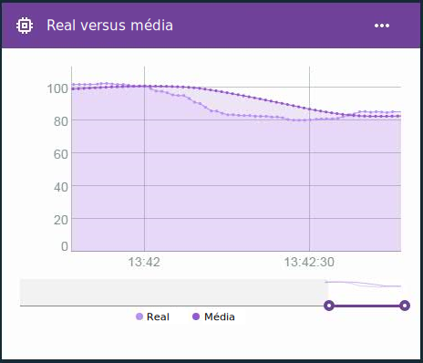

---

copyright:
  years: 2016, 2017
lastupdated: "2016-12-12"

---

{:new_window: target="blank"}
{:shortdesc: .shortdesc}
{:screen:.screen}
{:codeblock:.codeblock}
{:pre: .pre}

# Cálculos avançados para propriedades virtuais de borda
{: #im_vir_calculations}

Amplie os cálculos básicos de propriedade virtual com fórmulas pré-executadas do Edge Analytics.
{:shortdesc}

**Importante:** os cálculos avançados somente retornarão pontos de dados da propriedade se os dados para a propriedade selecionada vierem de um dispositivo conectado a um gateway que tenha um Edge Analytics Agent instalado. Uma regra do Edge pode usar essa propriedade virtual diretamente. Para usar a propriedade com uma regra de nuvem, uma regra do Edge deve enviar o ponto de dados para a nuvem usando a ação Encaminhar para a nuvem. Para obter mais informações, consulte [Instalando o Edge Analytics Agent](gateways/dashboard.html#edge).

Exemplo: use os pontos de dados virtuais avançados em um cartão de gráfico de linhas para visualizar as tendências de dados com aumentos de dados removidos.  
 

## Fórmulas avançadas
{: #advanced}

As opções de cálculo avançado incluem as fórmulas a seguir:

**Dica:** para algumas das fórmulas, você tem a opção de escolher um período ou um número de pontos de dados para incluir. Se você souber que seus dados fluem em uma frequência consistente, um espaço de tempo poderá ser uma boa opção. Se os dados forem coletados de forma esporádica ou desigual, poderá ser melhor usar o número de pontos de dados, porque será difícil prever o espaço de tempo.

<table>
<thead>
<tr>
<th>Fórmula</th>
<th>Descrição</th>
<th>Uso</th>
</tr>
</thead>
<tbody>
<tr>
<td>Média</td>
<td>Retorna o valor médio para uma propriedade em um número de pontos de dados recentes ou durante um período recente.   
Entrada:
<ul>
<li>Propriedade
 <li>Período ou número de pontos de dados na forma de um número inteiro maior que 0.</ul></td>
 <td>A fórmula AVG fornece um valor médio de pontos de dados em um espaço de tempo que está em constante movimentação.    Use a fórmula média com uma regra para evitar o acionamento de alertas falsos com base em dados não significativos que contêm aumentos isolados.    Use um cartão de gráfico de linhas para visualizar as tendências de dados com aumentos de dados removidos.  
</td>
</tr>
<tr>
<td>Moving Z-score</td>
<td>Retorna a diferença em unidades de desvio padrão entre o ponto de dados e o valor do ponto de dados médio em um número de pontos de dados recentes ou em um período recente.  
Entrada:
<ul>
<li>Propriedade
<li>Período ou número de pontos de dados na forma de um número inteiro maior que 0.</ul></td>
<td>O Moving Z-Score de um ponto de dados indica a extensão de uma anomalia do valor de ponto de dados em relação à sua média recente. Um valor z-score absoluto maior significa que o valor do ponto de dados atual difere mais dos valores de ponto de dados médios anteriores.
  Use a fórmula Moving Z-Score com uma regra para acionar alertas em mudança rápida quando os valores de pontos de dados forem diferentes da média recente, em vez de quando o ponto de dados exceder um determinado valor.
  Use um cartão de gráfico de linhas para visualizar flutuações em seus dados, plotando a frequência e a magnitude em desvios padrão.
</td>
</tr>
<tr>
<td>Suavização exponencial</td>
<td>Retorna o valor médio para uma propriedade em pontos de dados coletados disponíveis, em que os valores de propriedade mais antigos são ponderados exponencialmente menos que os valores mais recentes. A ponderação é controlada pelo fator de suavização, em que um valor maior dá mais peso aos valores recentes e menos aos valores mais antigos.  
Também é possível, opcionalmente, usar o fator inclinação para ajustar tendências nos dados. Os valores suavizados exponencialmente reagem mais rápido às mudanças nos dados do que a média de movimentação.   
Entrada:
<ul>
<li>Propriedade
<li>Fator de suavização, como um número maior que 0 e menor que 1.  
<li>Opcional: inclinação, como um número maior que 0 e menor que 1. 
 **Dica:** se você não tiver certeza se seus dados coletados possuem tendências, inicie usando uma inclinação de .5. Dependendo dos resultados, talvez você queira ajustar o fator.
</ul></td>  
 <td>A aplicação de suavização exponencial em um ponto de dados resulta em um valor médio, em que os valores mais antigos são ponderados menos ao calcular a média, em vez de definir um período. Como alternativa, você limita a ponderação de valores distantes configurando um fator de suavização maior.
  Use a fórmula de suavização exponencial com uma regra para evitar o acionamento de alertas falsos com base em dados não significativos que contêm aumentos isolados usando todos os dados disponíveis, em vez de um subconjunto.
  Use um cartão de gráfico de linhas para visualizar as tendências de dados com aumentos de dados removidos.</td>
</tr>
<tr>
<td>Suavização da caixa</td>
<td>Retorna o valor médio para uma propriedade com base em um intervalo de pontos de dados centralizados em torno do ponto de dados atual.  
A suavização da caixa usa um número configurado de valores de ponto de dados que vêm antes e depois do ponto de dados processado atualmente para determinar seu valor suavizado. Em seu cálculo, a suavização da caixa pondera todos os valores de ponto de dados igualmente.   
Entrada:
<ul>
<li>Propriedade
<li>Número de pontos de dados adiante e atrás (metade da largura) na forma de um número inteiro maior que 0.
</ul></td>
<td>A aplicação da suavização de caixa em um ponto de dados retorna um valor médio de pontos de dados em um espaço de tempo que está em constante movimentação e que é centralizado no ponto de dados de interesse.   **Importante:** dependendo da frequência de dados e do valor da metade da largura, os pontos de dados retornados serão mais ou menos atrasados. Por exemplo, se a metade da largura estiver configurada como `5` e a frequência de dados for uma mensagem a cada segundo, os pontos de dados virtuais retornados serão atrasados em cinco segundos.   Use a fórmula de suavização de caixa com uma regra para evitar o acionamento de alertas falsos com base em dados não significativos que contêm aumentos isolados. **Importante:** esteja ciente do atraso do ponto de dados ao criar suas regras.   Use um cartão de gráfico de linhas para visualizar as tendências de dados com aumentos de dados removidos.</td>
</tr>
<tr>
<td>Suavização gaussiana</td>
<td>Retorna o valor médio para uma propriedade com base em um intervalo de pontos de dados centralizados em torno do ponto de dados atual, em que os valores de propriedade mais distantes do ponto de dados atual são ponderados exponencialmente menos do que os valores mais próximos.  
Entrada:
<ul>
<li>Propriedade
<li>Número de pontos de dados adiante e atrás (metade da largura) na forma de um número inteiro maior que 0.
</ul></td>
<td>A aplicação da suavização gaussiana em um ponto de dados retorna um valor médio ponderado de pontos de dados em um espaço de tempo que está em constante movimentação e que é centralizado no ponto de dados de interesse. Os pontos de dados mais distantes do ponto de dados de interesse são ponderados menos ao calcular a média.   **Importante:** dependendo da frequência de dados e do valor da metade da largura, os pontos de dados retornados serão mais ou menos atrasados. Por exemplo, se a metade da largura estiver configurada como `5` e a frequência de dados for uma mensagem a cada segundo, os pontos de dados virtuais retornados serão atrasados em cinco segundos.   Use a fórmula de suavização gaussiana com uma regra para evitar o acionamento de alertas falsos com base em dados não significativos que contêm aumentos isolados. **Importante:** esteja ciente do atraso do ponto de dados ao criar suas regras.   Use um cartão de gráfico de linhas para visualizar as tendências de dados com aumentos de dados removidos.</td>
</tr>
</tbody>
</table>  
