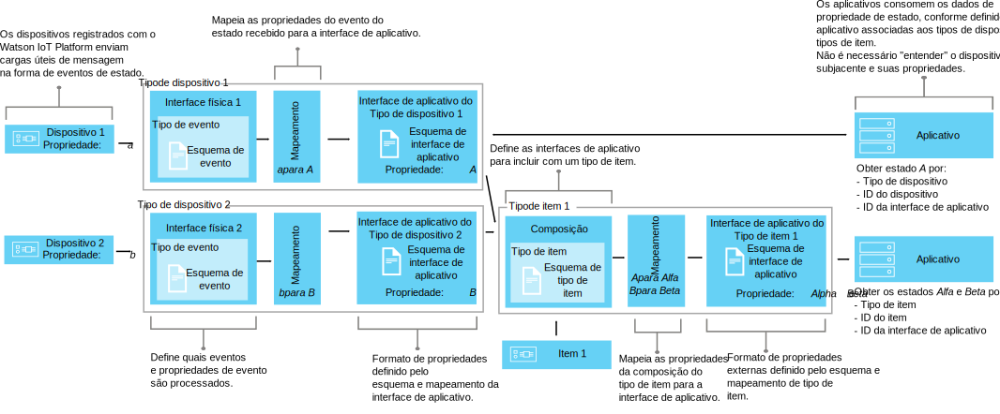

---

copyright:
years: 2016, 2017
lastupdated: "2017-04-25"

---

{:new_window: target="\_blank"}
{:shortdesc: .shortdesc}
{:screen: .screen}
{:codeblock: .codeblock}
{:pre: .pre}

# Usando interfaces para mapear dados do dispositivo (Beta)
{: #im_index}

As interfaces de aplicativo estendem o conceito de [tipo de dispositivo](#resources) para melhor controlar os dados que fluem pelo {{site.data.keyword.iot_short_notm}} e para fornecer uma visualização agnóstica de dispositivo de dados do IoT.
{:shortdesc}

**Importante:** o recurso de mapeamento de interface é um recurso beta. As atualizações do beta de saída, bem como da liberação final, podem incluir mudanças que são incompatíveis com a versão atual. É altamente recomendável que os recursos beta não são usados em aplicativos de produção até a liberação final. Para receber informações adicionais e fornecer feedback sobre esse beta, é possível [registrar-se para o programa Beta de Gerenciamento de Informações ](https://www.ibm.com/software/support/trial/cst/forms/nomination.wss?id=7050){:new_window}.

## Visão geral
{: #overview}

Use interfaces de aplicativo para criar abstrações compartilhadas de dispositivos e de itens para melhorar a reutilização e a manutenção e para gerenciar as complexidades de um ecossistema IoT enquanto mantém o aplicativo isolado de mudança de dados. As interfaces de aplicativo são desacopladas da variabilidade nos dados da mensagem que os dispositivos comunicam para o {{site.data.keyword.iot_short_notm}}.

É por meio das interfaces de aplicativo que os aplicativos podem acessar o estado atual de dispositivos e itens. O estado consiste em um conjunto de propriedades de estado que são definidas pela interface de aplicativo. Conforme os dispositivos enviam eventos de mudança de estado, os valores mais recentes dessas propriedades são armazenados no {{site.data.keyword.iot_short_notm}} e disponibilizados para o aplicativo mediante solicitação usando uma API HTTP.

Usando interfaces de aplicativos, é possível:
- Mapear propriedades de estado dados da mensagem do evento
- Definir a estrutura de dados que você preferir
- Definir mais de uma representação ou visualização do estado do dispositivo
- Assine estados de dispositivo ou consultá-los a qualquer momento por meio de uma API HTTP

Alguns casos de uso comuns para interfaces de aplicativo incluem:
- Fornecer aos seus desenvolvedores de aplicativos interfaces consistentes para acessar dados de dispositivo orientados a evento em uma maneira do tipo REST.
- Normalizar dados de dispositivos de diferentes tipos ou modelos que publicam dados em formatos diferentes.
- Combinar dados de eventos de vários tipos de dispositivo diferentes para modelar qualquer item do IoT fornecido.
- Modificar e converter formatos de dados de acordo com seu modelo de aplicativo.  

Para obter a documentação da API de interfaces (beta), consulte [API de REST HTTP do {{site.data.keyword.iot_short_notm}}ícone de Link externo](https://docs.internetofthings.ibmcloud.com/apis/swagger/v0002-beta/info-mgmt-beta.html){: new_window}.   

## Exemplos
{: #examples}
Os exemplos da interface a seguir ilustram duas soluções possíveis.

### Exemplo 1: Mapeando sensores de temperatura heterogêneos para uma interface de aplicativo
{: #device-type-example}
Neste exemplo, criaremos uma interface de aplicativo que forneça dados homogêneos do estado de temperatura em um formato, não importa em qual formato de carga útil de mensagem de evento de dispositivo real eles estiverem. TemperatureSensor1 publica uma leitura de temperatura Celsius de `{ "t" : 34.5 }` para o {{site.data.keyword.iot_short_notm}}. TemperatureSensor2 publica uma leitura de temperatura Fahrenheit de `{ "temp" : 72.55 }`. As leituras de temperatura são publicadas como eventos separados.

Para obter um cenário de ponta a ponta detalhado que descreva este exemplo, consulte [Cenário de interface de aplicativo 1](im_index_scenario.html).

Como parte do fluxo de dados da interface de aplicativo, é possível executar cálculos em dados de entrada para normalizar essas leituras em uma forma consistente para processamento. Isso significa que não é necessário gravar seu aplicativo para entender ou converter escalas de temperatura diferentes. O aplicativo recebe um estado único e normalizado e usa a propriedade de estado **temperature** em vez das propriedades **t** e **temp** específicas do dispositivo.

### Exemplo 2: Mapeando múltiplos dispositivos de clima para uma interface de aplicativo de tipo de item.
{: #thing-type-example}  
Neste exemplo, expandiremos o exemplo de tipo de dispositivo incluindo um conjunto de sensores de umidade na forma de dispositivos de higrômetro separados. Usando uma interface de aplicativo de tipo de item, é possível mesclar dados facilmente por meio de tipos de dispositivos separados em uma interface de aplicativo que represente todos os dispositivos e sensores em uma sala. Agora um aplicativo pode ter os dados de clima coletados para uma sala conectando-se à interface de aplicativo de item da sala.

Para obter um cenário de ponta a ponta detalhado que descreva este exemplo, consulte [Cenário de interface de aplicativo 2](im_index_scenario_thing.html).

O Sensor de temperatura 1 e Sensor de umidade 3 publica dados ambientais dados que são coletados na sala R1. Os dados de sensores de temperatura e de umidade são mapeados separadamente para duas interfaces de aplicativo de tipo de dispositivo, uma para o tipo de dispositivo termômetro e outra para o tipo de dispositivo higrômetro de acordo com o exemplo anterior. Agora criaremos um tipo de item chamado Room e instanciaremos duas instâncias de item de sala (R1 e R2).

Agora é possível configurar uma composição que inclua as interfaces de aplicativo termômetro e higrômetro e, em seguida, mapear os sensores ambientais corretos para cada instância da sala, por exemplo, D1 e D3 mapeados para R1. O aplicativo de usuário final pode agora solicitar o estado de um ID de item de sala específico e obter os estados de temperatura e de umidade da sala sem precisar saber sobre a infraestrutura de dispositivo subjacente.

## Definições e recursos
{: #resources}

Os diagramas a seguir ilustram o mapeamento lógico entre dispositivos e aplicativos no {{site.data.keyword.iot_short_notm}} quando usar interfaces de aplicativo.

### Conceitos

Conceitos                        | Descrição       
------------- | ------------- | -------------  
Evento | Eventos são o mecanismo pelo qual os dispositivos publicam dados no {{site.data.keyword.iot_short_notm}}. O dispositivo controla o conteúdo do evento e designa um nome para cada evento que ele envia.
Propriedade | Os dados transportam parte de uma carga útil do evento de dispositivo.
Status | O valor mais recente de uma propriedade de estado mapeada.
Composição                         | Uma construção lógica que define as interfaces de aplicativo que estão associadas a um tipo de item. A composição é especificada por um esquema de tipo de item.   

### Recursos de gerenciamento de informações
É possível gerenciar os recursos usando APIs de REST. Para obter informações sobre as APIs de REST, veja a documentação da [API de REST HTTP do {{site.data.keyword.iot_short_notm}}](https://docs.internetofthings.ibmcloud.com/swagger/info-mgmt-beta.html).

Recursos de tipo                        | Descrição       
------------- | ------------- | -------------  
Tipo de evento                         | Uma construção programática que conecta uma interface física a um esquema de evento.  **Importante:** para o beta, todos os eventos de entrada a serem usados em uma interface de aplicativo devem estar no formato JSON.   
Tipo de dispositivo                         |  Uma construção programática que permite agrupar dispositivos que compartilham características ou comportamentos. No mapeamento de interface, o tipo de dispositivo é estendido para incluir uma interface física para um dispositivo e uma ou mais interfaces de aplicativo que são usadas para recuperar o estado do dispositivo.  Para obter mais informações, consulte "Identificadores e tipos de dispositivo" no tópico [Modelo do dispositivo](../reference/device_model.html#id_and_device_types).
Tipo de item                         | Uma construção programática que representa uma coleção de um ou mais tipos de dispositivos, tipos de item, ou ambos, separados.  **Importante:** o beta suporta três níveis de aninhamento de interface de aplicativo de tipo de item.
Recursos do esquema                         |  Construções programáticas que definem a estrutura de dados das interfaces físicas de tipo de dispositivo, a composição do tipo de item e as interfaces de aplicativo de saída. Os [Esquemas JSON ](http://json-schema.org/){:new_window} são usados: <ul><li>Os *esquemas de evento* definem a estrutura dos eventos que são publicados no {{site.data.keyword.iot_short_notm}} por um dispositivo. Cada esquema de evento define a estrutura de um evento de entrada e está associado a um tipo de evento. <li>Os *esquemas de tipo de item* definem as interfaces de aplicativo que agem como origens de entrada por um tipo de item. Cada esquema de tipo de item define a estrutura de uma ou mais interfaces de aplicativo de tipo de item.<li>Os *esquemas de interface de aplicativo* definem a estrutura do [estado do dispositivo](#key_concepts) que é armazenado no {{site.data.keyword.iot_short_notm}}</ul>.

Recursos da Interface                        | Descrição       
------------- | ------------- | -------------  
Interface de aplicativo | Uma construção programática à qual seus aplicativos podem conectar-se ou assinar para ver o estado de um dispositivo ou item. A interface de aplicativo é definida por um esquema de interface de aplicativo que forma a estrutura dos dados de estado que são armazenados como o estado do dispositivo ou do item. O estado é atualizado em resposta a eventos de estado de entrada. Uma interface de aplicativo associada a um tipo de dispositivo pode ter uma interface física como entrada. Uma interface de aplicativo que está associada a um tipo de item pode ter uma ou mais interfaces de aplicativo como entrada.

Recursos da instância                        | Descrição       
------------- | ------------- | -------------  
Dispositivo                         | Uma construção programática que representa um ativo, um sistema ou um componente que está registrado com {{site.data.keyword.iot_short_notm}} e que envia dados do IoT na forma de eventos.  
Coisa                         | Uma construção programática que representa logicamente uma instância exclusiva de um tipo de item. Uma instância de item tem o mesmo propósito de um dispositivo registrado de um tipo de dispositivo.

Recursos de suporte                        | Descrição       
------------- | ------------- | -------------  
Interface física                         | Uma construção programática que define os tipos de evento e as propriedades do dispositivo associadas que estão associados
com um tipo de dispositivo único. A interface física é definida por esquemas de eventos.   
Mapeamentos                         | Uma construção programática que define como as propriedades que estão associadas a eventos de entrada são mapeadas para propriedades que estão definidas em uma interface de aplicativo.  **Importante:** pelo menos uma interface de aplicativo deve estar associada a um tipo de dispositivo antes que os mapeamentos possam ser definidos.

## Fluxo de trabalho de alto nível
{: #workflow}

Use as etapas a seguir para ajudá-lo a configurar os recursos que você precisa para começar a mapear seus dados de dispositivo usando interfaces.

Para obter detalhes sobre a API, consulte a documentação da [API de REST HTTP do {{site.data.keyword.iot_short_notm}}](https://docs.internetofthings.ibmcloud.com/swagger/info-mgmt-beta.html){:new_window}.

**Dica:** para obter informações mais detalhadas sobre cada uma das etapas, consulte os cenários de exemplo ou use os links para acessar diretamente uma etapa específica no cenário de exemplo. O [Cenário de exemplo 1](im_index_scenario.html#scenario) percorre as etapas para criar uma interface de aplicativo de tipo de dispositivo para dispositivos de termômetro heterogêneos e o [Cenário de exemplo 2](im_index_scenario_thing.html#scenario) é construído adicionalmente descrevendo como construir uma interface de aplicativo que permita consumir dados de dois tipos de dispositivo de clima diferentes reunidos em um item de tipo de sala.

O processo para criar e consumir interfaces de aplicativo difere um pouco, dependendo se você estiver criando uma interface de aplicativo que está associada a um tipo de dispositivo ou a um tipo de item.

### Antes de iniciar
Para criar uma interface de aplicativo associada a um tipo de dispositivo, deve-se ter [pelo menos um dispositivo registrado com o {{site.data.keyword.iot_short_notm}}](im_index_scenario.html#step14) e enviar eventos com as propriedades de estado.  
Para criar uma interface de aplicativo associada a um tipo de item, deve-se ter pelo menos uma interface de aplicativo associada a um tipo de dispositivo criado.

### Etapas

1. 	Defina as propriedades de estado de entrada.  
Primeiro defina as propriedades de estado recebidas que deseja que sua interface de aplicativo disponibilize para seus aplicativos.  
Dependendo da interface de aplicativo que você está criando, execute uma das duas ações:
<dl>
<dt>Tipo de dispositivo: Criar uma interface física.</dt>
<dd>
<ol>
<li>[Criar um arquivo de esquema de evento](im_index_scenario.html#step1). O arquivo de esquema de evento é um arquivo .JSON local que define a estrutura e o formato de um evento de entrada.
<li>[Criar um recurso de esquema de evento para seu tipo de evento](im_index_scenario.html#step2). O recurso de esquema de evento é uma construção programática que é usada pelo {{site.data.keyword.iot_short_notm}}.
<li>[Criar um tipo de evento que referencie o esquema de evento](im_index_scenario.html#step3). O tipo de evento é utilizado pelo {{site.data.keyword.iot_short_notm}} para mapear um ou mais recursos de esquema de evento para uma interface física.
<li>[Criar uma interface física](im_index_scenario.html#step7).
<li>[Incluir o tipo de evento na interface física](im_index_scenario.html#step8).
<li>[Incluir sua interface física em seu tipo de dispositivo](im_index_scenario.html#step9).
</ol>
</dd>
<dt>Tipo de item: Definir uma composição.</dt>
<dd>
<ol>
<li>[Criar um arquivo de esquema de composição](im_index_scenario_thing.html#crt_composition_file).  
Um arquivo de esquema de composição de tipo de item é um arquivo .JSON local que define a composição do tipo de item apontando para as interfaces de aplicativo existentes.
<li>[Criar um recurso de esquema de composição](im_index_scenario_thing.html#crt_composition_resource).  
Faça upload do arquivo .JSON local para o {{site.data.keyword.iot_short_notm}}.
<li>[Criar um tipo de item](im_index_scenario_thing.html#crt_thing_type).   Um tipo de item tem o mesmo propósito de um tipo de dispositivo no qual ele representa uma classe de itens.
</ol>
</dd>
</dl>
4. 	Criar a interface de aplicativo.
 1. 	Criar um arquivo de esquema de interface de aplicativo para o [tipo de dispositivo](im_index_scenario.html#step4) ou [tipo de item](im_index_scenario_thing.html#crt_ai_schema_file).  
O arquivo de esquema de interface de aplicativo é um arquivo .JSON local que define o estado do dispositivo que é disponibilizado para seus aplicativos.
 2. 	Criar um recurso de esquema de interface de aplicativo para o [tipo de dispositivo](im_index_scenario.html#step5) ou para o [tipo de item](im_index_scenario_thing.html#crt_ai_schema_resource).
 3.	Criar uma interface de aplicativo para o [tipo de dispositivo](im_index_scenario.html#step6) ou [tipo de item](im_index_scenario_thing.html#crt_thing_ai).
 4.	Incluir a interface de aplicativo no [tipo de dispositivo](im_index_scenario.html#step10) ou no [tipo de item](im_index_scenario_thing.html#add_thing_ai).
5. 	Definir os mapeamentos para o [tipo de dispositivo](im_index_scenario.html#step11) ou para o [tipo de item](im_index_scenario_thing.html#define_Thing_type_mappings).   
Mapeamentos para mapear propriedades de entrada para propriedades na interface de aplicativo.
6. 	Implemente a configuração que está associada ao [tipo de dispositivo](im_index_scenario.html#step15) ou ao [tipo de item](im_index_scenario_thing.html#deploy_Thing_config).
7. 	**Tipo de item:** [Criar uma instância de tipo de item](im_index_scenario_thing.html#create_Thing_instances).
8. 	Verifique se o estado do [dispositivo](im_index_scenario.html#step13) ou do [item](im_index_scenario_thing.html#verify_Thing_state) é atualizado.  
Verifique se suas assinaturas mostram os dados do dispositivo atualizados ou se os dados do dispositivo atualizados são retornados usando uma chamada REST.
