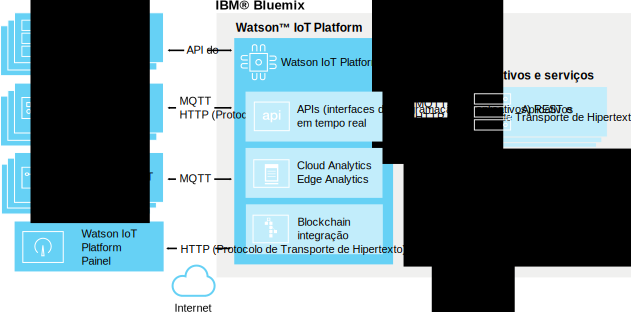

---

copyright:
  years: 2016, 2017
lastupdated: "2017-03-13"

---

{:new_window: target="\_blank"}
{:shortdesc: .shortdesc}
{:screen: .screen}
{:codeblock: .codeblock}
{:pre: .pre}

# Sobre {{site.data.keyword.iot_short_notm}}
{: #about_iotplatform}

O {{site.data.keyword.iot_full}} fornece acesso poderoso ao aplicativo para dispositivos de IoT e dados para ajudá-lo a rapidamente compor aplicativos de analítica, painéis de visualização e
aplicativos móveis de IoT.
{:shortdesc}

O {{site.data.keyword.iot_short_notm}} permite executar operações de gerenciamento de dispositivo poderosas e armazenar e acessar dados do dispositivo, conectar uma ampla variedade de dispositivos e
dispositivos de gateway. O {{site.data.keyword.iot_short_notm}} fornece comunicação segura para e a partir de seus dispositivos usando MQTT e TLS.

## Arquitetura do {{site.data.keyword.iot_short_notm}}
{: #watsoniotplatform_architecture}

**Importante:** os recursos de análise de dados são mesclados a partir do serviço do {{site.data.keyword.iotrtinsights_full}}. Se sua organização do {{site.data.keyword.iot_short_notm}} for usada como uma origem de dados para uma instância existente do {{site.data.keyword.iotrtinsights_short}}, Cloud e Edge Analytics não estarão ativados até após a migração das instâncias existentes do {{site.data.keyword.iotrtinsights_short}}. Continue a usar o painel do {{site.data.keyword.iotrtinsights_short}} para suas necessidades de análise de dados até que a migração seja concluída. Para obter mais informações, veja o [blog do IBM Watson IoT Platform ](https://developer.ibm.com/iotplatform/2016/04/28/iot-real-time-insights-and-watson-iot-platform-a-match-made-in-heaven/){: new_window} no IBM developerWorks e seus painéis de instância existentes do {{site.data.keyword.iotrtinsights_short}}.  

O {{site.data.keyword.iot_short_notm}} se comunica com seus aplicativos e dispositivos usando a API (interface de programação de aplicativos) do {{site.data.keyword.iot_short_notm}} e o protocolo de sistema de mensagens do {{site.data.keyword.iot_short_notm}}. O painel do {{site.data.keyword.iot_short_notm}} conecta-se como uma interface com o usuário de front-end para simplificar operações dentro da plataforma. Dados do dispositivo podem ser armazenados ou usados com soluções de análise de dados.

## Conceitos importantes do {{site.data.keyword.iot_short_notm}}
{: #watsoniotplatform_importantconcepts}

### Organizations (Organizações)

Quando se registrar com o {{site.data.keyword.iot_short_notm}}, você receberá um ID de organização. Seu ID da organização é um identificador exclusivo de seis caracteres para sua conta. As organizações asseguram que seus dados estejam acessíveis apenas para seus dispositivos e aplicativos. Após o registro, dispositivos e chaves API (interface de programação de aplicativos) são ligados a uma única organização. Quando um aplicativo se conecta ao serviço usando uma chave API (interface de programação de aplicativos), ele será registrado na organização que está associada à chave API usada.

Para sua segurança, é impossível a comunicação entre organizações. A única maneira de transmitir dados entre duas organizações é criando um aplicativo em cada organização que irá se comunicar com os aplicativos na outra organização.

**Nota:** O ID de sua organização do {{site.data.keyword.iot_short_notm}} é diferente de
sua [organização do Bluemix](../../docs/admin/orgs_spaces.html#orginfo).

### Dispositivos

Um dispositivo pode ser qualquer coisa que tenha uma conexão com a Internet e que possa enviar dados por push para a nuvem. No entanto, os dispositivos não podem se comunicar diretamente com outros dispositivos, em vez disso, os dispositivos aceitam comandos de aplicativos e enviam eventos para aplicativos. Os dispositivos no {{site.data.keyword.iot_short_notm}} são identificados por um token de autenticação exclusivo. Os dispositivos devem ser registrados antes que possam ser conectar ao {{site.data.keyword.iot_short_notm}}.

O {{site.data.keyword.iot_short_notm}} reconhece duas classes de dispositivo: **dispositivos gerenciados** e **dispositivos não gerenciados**.

**Dispositivos gerenciados** são definidos como dispositivos que contêm um agente de gerenciamento de dispositivo. Um agente de gerenciamento de dispositivo é um conjunto de lógica que permite que o dispositivo interaja com o serviço de Gerenciamento de dispositivo do {{site.data.keyword.iot_short_notm}} usando o Protocolo de gerenciamento de dispositivo. Os dispositivos gerenciados podem executar operações de gerenciamento de dispositivo, incluindo atualizações de localização, downloads de firmware e atualizações, reinicializações e reconfigurações de fábrica.

**Dispositivos não gerenciados** são todos os dispositivos sem um agente de gerenciamento de dispositivo. Os dispositivos não gerenciados podem se conectar ao {{site.data.keyword.iot_short_notm}} e enviar e receber eventos e comandos, mas eles não podem enviar solicitações de gerenciamento de dispositivo ou executar operações de gerenciamento de dispositivo.

### Gateways

Gateways são dispositivos especializados que têm as capacidades combinadas de um aplicativo e um dispositivo, o que permite que eles sirvam como pontos de acesso para outros dispositivos. Dispositivos que não podem se conectar diretamente à Internet, podem acessar o serviço do {{site.data.keyword.iot_short_notm}} conectando-se primeiramente ao dispositivo de gateway.

Gateways devem ser registrados antes que possam se conectar ao serviço.

### Aplicativos

Um aplicativo é qualquer coisa que tenha uma conexão com a Internet e interaja com dados de dispositivos e controle o comportamento desses dispositivos. Os aplicativos se identificam com o {{site.data.keyword.iot_short_notm}} usando uma chave API (interface de programação de aplicativos) e um ID de aplicativo exclusivo. Diferentemente de dispositivos, aplicativos individuais não precisam se registrar antes que eles possam se conectar ao {{site.data.keyword.iot_short_notm}}. No entanto, eles devem usar uma chave API (interface de programação de aplicativos) válida anteriormente registrada.

### Eventos

Eventos são o mecanismo pelo qual os dispositivos publicam dados no {{site.data.keyword.iot_short_notm}}. Os dispositivos controlam o conteúdo de suas mensagens e designam um nome para cada evento enviado. O {{site.data.keyword.iot_short_notm}} usa as credenciais que estão anexadas a cada evento recebido para determinar qual dispositivo enviou o evento. Essa arquitetura evita que dispositivos personifiquem uns aos outros.

Os aplicativos podem processar eventos em tempo real e ver a origem do evento e os dados contidos no evento. Os aplicativos devem ser configurados para definir quais dispositivos e eventos eles assinam.

### Comandos

Comandos são o mecanismo pelo qual os aplicativos se comunicam com dispositivos. Somente aplicativos podem enviar comandos e os comandos são enviados a dispositivos específicos. O dispositivo deve determinar qual ação tomar ao receber qualquer comando específico. Os dispositivos podem ser projetados para receber qualquer comando ou para assinar uma lista de comandos especificada.
