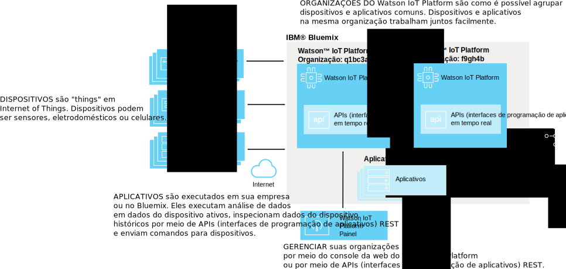
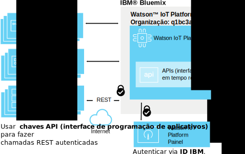
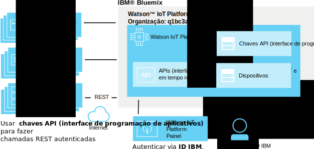
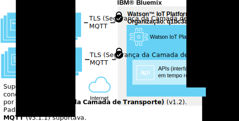
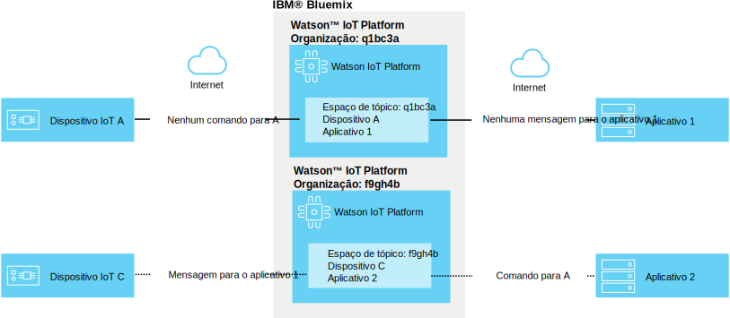

---

copyright:
  years: 2016, 2017
lastupdated: "2017-03-17"

---

{:new_window: target="blank"}
{:shortdesc: .shortdesc}
{:screen: .screen}
{:codeblock: .codeblock}
{:pre: .pre}

# Segurança do {{site.data.keyword.iot_short_notm}}
{: #sec-index}

Como um serviço hospedado na nuvem, o {{site.data.keyword.iot_full}} integra a segurança como um aspecto importante de sua arquitetura.
{: shortdesc}

O documento a seguir responde a algumas perguntas comuns sobre como os dados de sua organização são protegidos, focando áreas específicas:

* Conformidade: padrões externos que definem referências para segurança.
* Autenticação: assegurar a identidade de usuários. dispositivos ou aplicativos que estão tentando acessar as informações de sua organização.
* Autorização: assegurar que usuários, dispositivos e aplicativos tenham permissão para acessar informações de sua organização.
* Criptografia: assegurar que os dados podem ser lidos somente por partes autorizadas e não podem ser interceptados.

## {{site.data.keyword.iot_short_notm}} e {{site.data.keyword.Bluemix_notm}}
{: #iot-bluemix-sec}

O {{site.data.keyword.iot_short_notm}} é executado na plataforma do {{site.data.keyword.Bluemix_notm}} e, por isso, depende do {{site.data.keyword.Bluemix_notm}} e do {{site.data.keyword.BluSoftlayer_full}} para acesso e conectividade. A reliance do {{site.data.keyword.Bluemix_notm}} e do {{site.data.keyword.BluSoftlayer}} torna a segurança e a confiabilidade do {{site.data.keyword.Bluemix_notm}} e do {{site.data.keyword.BluSoftlayer}} importantes para os
usuários do {{site.data.keyword.iot_short_notm}}

Para obter mais detalhes sobre a segurança do {{site.data.keyword.Bluemix_notm}}, veja [Segurança da plataforma do {{site.data.keyword.Bluemix_notm}}](index.html#platform-security).

## Conformidade de segurança do {{site.data.keyword.iot_short_notm}}
{: #compliance}  
   
O {{site.data.keyword.iot_short_notm}} é certificado sob a norma da Organização Internacional para Normatização (ISO) 27001 que define as melhores práticas para processos de gerenciamento de segurança da informação. A norma ISO 27001 especifica os requisitos para estabelecer, implementar e documentar Information Security Management Systems (ISMS) e os requisitos para implementar controles de segurança, de acordo com as necessidades de organizações individuais. A família de normas ISO 27000 incorpora um processo de ajuste de escala de risco e avaliação de ativos, com o objetivo de proteger a confidencialidade, a integridade e a disponibilidade das informações nas formas escrita, oral e eletrônica.

O {{site.data.keyword.iot_short_notm}} é auditado por uma empresa de segurança terceirizada e atende a todos os requisitos da ISO 27001: Certificado de Registro da ISO 27001:2013 do {{site.data.keyword.iot_short_notm}}.

## Terminologia do {{site.data.keyword.iot_short_notm}}
{: #terminology}

## Como protegemos o gerenciamento de informações de IoT dentro de sua organização?
{: #secure-org}

A GUI (interface gráfica com o usuário) baseada em navegador e as APIs (interfaces de programação de aplicativos) REST têm à sua frente HTTPS (Protocolo de Transporte de Hipertexto Seguro), com um certificado assinado pela DigiCert, portanto, é possível confiar que você está conectando ao {{site.data.keyword.iot_short_notm}} genuíno. O acesso à GUI (interface gráfica com o usuário) baseado na web é autenticado por seu IBMid ou pelo {{site.data.keyword.Bluemix_notm}} {{site.data.keyword.ssoshort}}. O uso da API (interface de programação de aplicativos) REST requer uma chave API gerada pela GUI (interface gráfica com o usuário). É possível usar isso para fazer chamadas da API (interface de programação de aplicativos) REST autenticadas com relação à sua organização.

## Como nós protegemos suas credenciais de dispositivo e aplicativo?
{: #secure-credentials}

Quando os dispositivos são registrados ou as chaves API são geradas, o token de autenticação tem salt e hash. Isso significa que as credenciais de sua organização nunca poderão ser recuperadas de nossos sistemas, mesmo no caso improvável de o {{site.data.keyword.iot_short_notm}} ser comprometido.

As credenciais de dispositivo e as chaves API podem ser individualmente revogadas se estiverem comprometidas.

## Como podemos assegurar que seus dispositivos se conectem de forma segura ao {{site.data.keyword.iot_short_notm}}?
{: #secure-device-connection}

Os dispositivos são conectados usando um identificador de cliente ou o token de autenticação que é gerado quando os dispositivos são incluídos em sua plataforma ou ambos. O MQTT é usado para permitir interoperabilidade simples em várias plataformas e linguagens. O {{site.data.keyword.iot_short_notm}} suporta a conectividade por TLS v1.2.

Para obter mais informações sobre os requisitos de TLS e do conjunto de criptografia, consulte a seção [Requisitos
de TLS Requisitos](connect_devices_apps_gw.html#tls_requirements) na documentação Application, device, and gateway connections to Watson IoT Platform .

É possível usar certificados e políticas de segurança para aprimorar a segurança de conexão de dispositivo. As políticas de segurança podem ser configuradas para permitir conexões não criptografadas, para usar apenas conexões transport layer security (TLS) e para permitir que os dispositivos sejam autenticados com certificados do lado do cliente. As listas de bloqueio podem ser usadas para especificar dispositivos que não têm permissão para se conectar ou as listas de desbloqueio podem ser usadas para permitir que dispositivos específicos se conectem. Para obter mais informações sobre segurança aprimorada, veja [Gerenciamento de risco e segurança](RM_security.html).

## Como podemos evitar fuga de dados entre dispositivos IoT?
{: #prevent-leak-devices}

Padrões de mensagens seguros são produzidos. Depois de autenticados, os dispositivos são autorizados apenas a publicar e assinar um espaço de tópico restrito:

* '/iot-2/evt/<event_id>/fmt/<format_string>'
* '/iot-2/cmd/<command_id>/fmt/<format_string>'

Todos os dispositivos funcionam com o mesmo espaço de tópico. As credenciais de autenticação fornecidas pelo cliente ditam a qual dispositivo este espaço de tópico terá escopo definido pelo {{site.data.keyword.iot_short_notm}}.  Isso evita que os dispositivos possam personificar outro dispositivo.

A única maneira de personificar outro dispositivo é obtendo credenciais de segurança comprometidas para o dispositivo.

Os aplicativos podem assinar e publicar em ambos os tópicos de evento e de comando para todos os dispositivos na organização. Os aplicativos podem analisar dados de muitos dispositivos simultaneamente e também podem simular ou efetuar proxy dos dispositivos além de formar o lado complementar de um loop de comunicação full duplex.

## Como evitamos fuga de dados IoT entre organizações?
{: #prevent-leak-org}

O espaço de tópico no qual os dispositivos e aplicativos operam terá escopo dentro de uma única organização. Quando autenticado, o {{site.data.keyword.iot_short_notm}} transforma a estrutura de tópicos usando um ID da organização com base na autenticação de cliente, impossibilitando que dados de uma organização sejam acessados a partir de outra.

# Links Relacionados
{: #rellinks}
## Links Relacionados
{: #general}
* [Introdução ao {{site.data.keyword.iot_short_notm}}](https://console.ng.bluemix.net/docs/services/IoT/index.html)
* [Segurança do {{site.data.keyword.Bluemix_notm}} ](https://console.ng.bluemix.net/docs/security/index.html#security){:new_window}
* [Segurança da plataforma do {{site.data.keyword.Bluemix_notm}} ](https://console.ng.bluemix.net/docs/security/index.html#platform-security){:new_window}
* [Conformidade do {{site.data.keyword.Bluemix_notm}}](https://console.ng.bluemix.net/docs/security/index.html#compliance){:new_window}
* [Segurança do {{site.data.keyword.BluSoftlayer}} ](http://www.softlayer.com/security){:new_window}
* [Conformidade do {{site.data.keyword.BluSoftlayer}} ](http://www.softlayer.com/compliance){:new_window}
