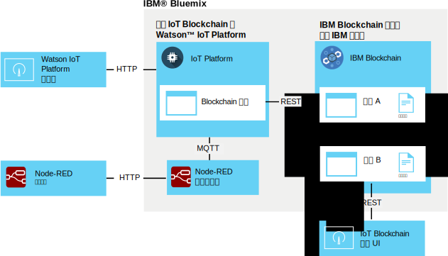

---

copyright:
  years: 2016, 2017
lastupdated: "2016-12-08"

---

{:new_window: target="\_blank"}
{:shortdesc: .shortdesc}
{:screen: .screen}
{:codeblock: .codeblock}
{:pre: .pre}

# {{site.data.keyword.iot_short_notm}} 区块链集成
{: #gettingstartedtemplate}

{{site.data.keyword.iot_short_notm}} 区块链集成支持 IoT 设备向区块链交易提供数据，这会将数据存储在区块链的不可变分类帐中，并将其用于在区块链智能合同中实现的业务规则。
{:shortdesc}

平台以其本机 MQTT 格式获取设备数据，再将数据映射到区块链智能合同所需要的数据格式，然后将数据传递到区块链光纤网以存储在区块链账本中。区块链光纤网是组成 {{site.data.keyword.blockchainfull}} 和 Hyperledger 实例的同级节点和证书节点的集合。

## 区块链集成体系结构  
{: #architecture}

通用 {{site.data.keyword.iot_short_notm}} 区块链集成环境由以下组件组成：
- 一个或多个设备，用于生成要写入区块链分类帐的数据。
- {{site.data.keyword.Bluemix_notm}} 组织：
 - 启用了 IoT 区块链集成的 {{site.data.keyword.iot_short_notm}} 服务。
 - 部署了一个或多个智能合同的 {{site.data.keyword.blockchainfull_notm}} 或 Hyperledger 光纤网。
- 本地环境：
 - IoT 区块链监视 UI

有关生成和部署智能合同的扩展环境的设置与需求的信息，请参阅[针对 {{site.data.keyword.iot_short_notm}} 区块链集成开发智能合同](blockchain/dev_blockchain.html)。  

下图说明了一般 {{site.data.keyword.iot_short_notm}} 区块链集成环境。

## 开始之前
{: #byb}

- 从 IBM.com 上的 [{{site.data.keyword.iot_short_notm}}](http://www.ibm.com/blockchain/) 中获取 {{site.data.keyword.iot_short_notm}} 的概述、其与一般区块链概念的联系及其具体用途。
- 为您的组织[启用 {{site.data.keyword.iot_short_notm}} 区块链集成](reference/extensions/index.html#blockchain)。
- 连接用于生成要写入区块链分类帐的数据的设备。
  
按照[连接设备](iotplatform_task.html)主题中的指示信息来连接设备。
- 安装“监视 UI”。
“监视 UI”用于验证 {{site.data.keyword.iot_short_notm}} 和区块链光纤网之间的连接。按照[区块链监视 UI](https://github.com/ibm-watson-iot/blockchain-samples/tree/master/applications/monitoring_ui) GitHub 目录中提供的“监视 UI”自述文件文档中的指示信息进行操作。

### 使用 IBM 基本场景快速入门

要迅速上手测试 {{site.data.keyword.iot_short_notm}} 区块链集成，您可以连接到 IBM 提供的光纤网，并将 Node-RED 样本设备映射到 IBM 提供的样本合同。此场景所需的步骤在本主题中标记为 **IBM 基本场景**。  
**重要信息：**请注意，IBM 提供的样本区块链分类帐及其所有数据可供样本区块链的所有用户查看。请勿在 IBM 提供的样本区块链中存储任何敏感信息。此外，支持样本和贸易航线合同的样本光纤网可能随时更改，包括每个同级的连接信息。连接详细信息在 Watson IoT Blockchain 社区的 [IoT Blockchain Connection Info](https://www.ibm.com/developerworks/community/wikis/home?lang=en#!/wiki/W7a44a0e604d9_4a90_89b7_0a2bdbe81b00/page/Blockchain%20Fabric%20Connections) Wiki 页面中提供。

IBM 提供的基本 {{site.data.keyword.iot_short_notm}} 区块链集成环境由以下组件组成：
- {{site.data.keyword.Bluemix_notm}}:
 - 启用了 IoT 区块链集成的 {{site.data.keyword.iot_short_notm}} 服务
 - 可选：运行 IoT 设备模拟器的 Node-RED 应用程序
   
 **注：**设备模拟器还可以部署在本地 Node-RED 环境中。
- 本地环境：
 - Node.js
 - IoT 区块链监视 UI
- IBM 提供的组件：
 - 可选：预部署了简单智能合同的 {{site.data.keyword.iot_short_notm}} 光纤网。

以下体系结构图说明了此样本场景所需的组件。

**IBM 基本场景：**按照[创建并连接 Node-RED 设备模拟器](nodereddevice_sample.html)主题中的指示信息来创建 Node-RED 设备模拟器。对于区块链集成，导入节点数据时，请使用特定于区块链设备的节点信息。节点信息在 Watson IoT Blockchain 社区的 [Node-RED Device Simulator](https://www.ibm.com/developerworks/community/wikis/home?lang=en#!/wiki/W7a44a0e604d9_4a90_89b7_0a2bdbe81b00/page/Node-RED%20Device%20Simulator) Wiki 页面中提供。如果需要，请联系 IBM 区块链联系人以获取对社区的访问权。

## 连接到区块链光纤网
{: #getting_started}  
由于启用了 {{site.data.keyword.iot_short_notm}} 区块链集成，因此现在可以连接到由 {{site.data.keyword.blockchainfull_notm}} 或 Linux Foundation Hyperledger 托管的区块链光纤网。

要连接到区块链光纤网，请执行以下操作：
1. 从 {{site.data.keyword.iot_short_notm}} 仪表板选择**扩展**。
2. 在**扩展**页面的“区块链”磁贴中，单击**设置**。
3. 在**扩展**页面的“区块链”磁贴中，单击**设置**，或者如果已经链接了光纤网，请单击 ，然后输入光纤网信息。
 1. 在**光纤网**选项卡中，输入名称以在 {{site.data.keyword.iot_short_notm}} 中标识光纤网，然后单击**下一步**。   
 2. 在**同级**选项卡中，输入同级信息：  
<table>
<thead>
<tr>
<th>参数</th>
<th>值</th>
</tr>
</thead>
<tbody>
<tr>
<td>名称</td>
<td>输入名称以在 {{site.data.keyword.iot_short_notm}} 中标识同级。</td>
</tr>
<tr>
<td>主机</td>
<td>验证同级 1 服务器的 `api_host` 地址</td>
</tr>
<tr>
<td>端口</td>
<td>`api_port` 端口号<ul><li>如果您的实现未使用 TLS，请使用端口 80。</li><li>如果您的实现使用了 TLS，请使用端口 443。</li></ul></td>
</tr>
<tr>
<td>用户标识</td>
<td>用于向区块链注册智能合同的用户的 `username` 字符串。稍后配置“简单 UI”时，还会使用此用户标识。</td>
</tr>
<tr>
<td>密钥</td>
<td>用户的 `secret` 字符串</td>
</tr>
<tr>
<td>使用 TLS</td>
<td>开启或关闭 使用传输层安全性对光纤网中 {{site.data.keyword.iot_short_notm}} 与合同之间的通信加密。缺省端口号由您要连接的已部署 {{site.data.keyword.iot_short_notm}} 实例进行设置。</td>
</tr></tbody>
</table>  
 3. 单击**完成**。
3. 在“配置区块链”部分中，单击**完成**以保存光纤网信息。

**IBM 基本场景：**要连接到 IBM 提供的光纤网，请使用 Watson IoT Blockchain 社区的 [IoT Blockchain Connection Info](https://www.ibm.com/developerworks/community/wikis/home?lang=en#!/wiki/W7a44a0e604d9_4a90_89b7_0a2bdbe81b00/page/Blockchain%20Fabric%20Connections) Wiki 页面中提供的针对样本合同的连接详细信息。

如果需要，请联系 IBM 区块链联系人以获取对社区的访问权。

## 将设备数据映射到智能合同
{: #map_device_properties}

要将设备数据写入区块链分类帐，必须首先将设备类型的设备属性映射到智能合同定义的参数。

要将设备数据映射到合同，请执行以下操作：
 1. 在 {{site.data.keyword.iot_short_notm}} 仪表板中，单击菜单侧边栏中的 。
 3. 单击**映射设备数据**。
 4. 选择要在区块链中存储其设备数据的设备类型。
 5. 输入要存储的事件的事件名称。
   
 **提示：**样本 Node-RED 区块链设备的缺省事件名称为 obc。要查找设备的事件类型，请在 {{site.data.keyword.iot_short_notm}} 仪表板中，选择**设备**，然后单击设备名称以打开设备详细信息页面。向下滚动到**传感器信息**部分，以查看设备的可用事件和数据点的列表。可以通过更新“发布到 IoT”MQTT 输出节点中的“主题”字段来更改 Node-RED 设备发布的事件名称。  
 6. 单击**下一步**。
 6. 选择您先前创建的光纤网实例。
 7. 输入合同名称和合同标识。  
<table>
<thead>
<tr>
<th>参数</th>
<th>注释</th>
</tr>
</thead>
<tbody>
<tr>
<td>合同名称</td>
<td>用于标识 {{site.data.keyword.iot_short_notm}} 中合同的名称。</td>
</tr>
<tr>
<td>合同标识</td>
<td>所映射合同的由 128 个字符组成的唯一标识。  **重要信息：**映射的合同必须至少支持以下方法：
- updateAsset
- readAssetSchemas</td>
</tr>
</tbody>
</table>
**IBM 基本场景：**通过样本预部署智能合同，可将设备数据点映射到特定合同属性，以在区块链分类帐中存储数据点值。使用样本合同，可在尝试更高级的贸易航线合同或编写自己的合同之前，对设备数据映射进行测试。合同标识在 Watson IoT Blockchain 社区的 [IoT Blockchain Connection Info](https://www.ibm.com/developerworks/community/wikis/home?lang=en#!/wiki/W7a44a0e604d9_4a90_89b7_0a2bdbe81b00/page/Blockchain%20Fabric%20Connections) Wiki 页面中提供。

如果需要，请联系 IBM 区块链联系人以获取对社区的访问权。

 8. 创建路径，用于将设备属性映射到合同参数。
   
这将导入合同中可用的参数。对于每个参数，输入对应的事件属性。
   
 **重要信息：**请勿在设备消息中包含附加到数据点前面的 `d.`。**IBM 基本场景：**如果要使用 IBM 提供的合同，请映射 Watson IoT Blockchain 社区的 [Data mapping](https://www.ibm.com/developerworks/community/wikis/home?lang=en#!/wiki/W7a44a0e604d9_4a90_89b7_0a2bdbe81b00/page/Data%20Mapping) Wiki 页面中列出的以下参数。
如果需要，请联系 IBM 区块链联系人以获取对社区的访问权。
 9. 在摘要页面中，验证输入的所有信息是否都正确。
 10. 设备数据到合同的映射会显示在“区块链”页面中。

恭喜您，现在您已快速入门和熟悉运用！

## 试用 IBM 提供的样本智能合同
{: #test_simple}

如果已连接到 IBM 提供的光纤网，并已将设备数据映射到样本合同，那么可以测试设备到区块链分类帐的端到端数据流。使用“IoT 区块链监视 UI”可查看您资产的区块链活动和数据。  
**提示：**如果尚未在本地环境中安装“监视 UI”，那么现在可以进行安装。按照[区块链监视 UI](https://github.com/ibm-watson-iot/blockchain-samples/tree/master/applications/monitoring_ui) GitHub 目录中提供的“监视 UI”自述文件文档中的指示信息进行操作。  
1. 配置“监视 UI”以连接到 {{site.data.keyword.iot_short_notm}}。
   
在“监视 UI”中，单击**配置**以配置“监视 UI”连接：
 <table>
<thead>
<tr>
<th>参数</th>
<th>注释</th>
</tr>
</thead>
<tbody>
<tr>
<td>API 主机和端口</td>
<td>{{site.data.keyword.iot_short_notm}} REST API 的主机和端口，前面附加有 `http://`。使用 `api_host` 地址和 `api_port` 端口号。</td>
</tr>
<tr>
<td>链代码标识</td>
<td>链代码标识是对应于链代码标识条目的由 128 个字符组成的字母数字字符串。  
**重要信息：**剪切并粘贴链代码标识时，请确保标识中不包含任何空格。如果输入的标识不正确，会显示区块链分类帐条目，但资产搜索功能不起作用。
</td>
</tr>
<tr>
<td>安全上下文</td>
<td>此参数对于连接到 Bluemix 上的 {{site.data.keyword.iot_short_notm}} 实例是必需的。请使用 secureContext 条目。  
**重要信息：**secureContext 应该是光纤网的授权用户，在创建光纤网时定义。
</td>
</tr>
</tbody>
</table>
**IBM 基本场景：**要配置“监视 UI”以连接到基本或贸易航线合同，请使用 Watson IoT Blockchain 社区的 [IoT Blockchain Connection Info](https://www.ibm.com/developerworks/community/wikis/home?lang=en#!/wiki/W7a44a0e604d9_4a90_89b7_0a2bdbe81b00/page/Blockchain%20Fabric%20Connections) Wiki 页面中提供的连接详细信息。
如果需要，请联系 IBM 区块链联系人以获取对社区的访问权。
2. 在 Node-RED 流编辑器中，单击 CON123 节点上的按钮以注入设备数据，使其作为消息发送到 {{site.data.keyword.iot_short_notm}}，并通过简单合同写入 {{site.data.keyword.iot_short_notm}} 分类帐。
   
**提示：**要获取持续数据流，请双击注入节点，将 Repeat 参数设置为 `interval`，然后配置相应的时间间隔，例如每 1 分钟。
3. 在“监视 UI”中，验证设备数据是否在区块链区块中按预期显示。  
  1. 验证区块是否在您从设备注入数据时添加到链。
    
  **重要信息：**请勿使用浏览器的“刷新”按钮来刷新“监视 UI”。该 UI 会每几秒自动刷新一次。使用浏览器的“刷新”按钮会将 UI 设置重置为其缺省值，这样就必须重新配置“监视 UI”才能查看合同区块链。
  2. 要查看资产的最新分类帐信息，请在“资产标识”搜索字段中，输入资产的标识，然后单击**提交**。示例：`CON123`  
  要查看使用同一合同的多个资产的区块链数据，请输入资产名称，然后单击**提交**。单击**重置**可重新开始。
    
  **提示：**
    - 开启“轮询更改”功能将确保 UI 持续轮询对被观察/受监视资产的任何更改，并在更改落实到区块链时立即刷新数据。
    - 区块链设备的缺省 assetID 为“CON123”。如果在 Node-RED 设备模拟器中修改了设备消息或更新了 assetID，那么可以在 {{site.data.keyword.iot_short_notm}} 中查找 assetID。转至**设备**页面，然后单击您的设备以打开设备详细信息页面。向下滚动到**传感器信息**部分，以查看设备的数据点的列表。将 `d.assetID` 数据点的值用作您的 assetID。

## 后续步骤  
{: #next_steps}  
现在，您已安装并配置了基本 IoT 区块链集成 {{site.data.keyword.iot_short_notm}} 环境。在此最简场景中，通过基本智能合同，可以将设备数据写入区块链分类帐，以创建不可擦除的设备数据历史记录。既然已完成这些初始步骤并测试了简单合同，现在可以尝试更高级的贸易航线样本合同并编写自己的合同。    

这些更高级步骤的指示信息在[针对 {{site.data.keyword.iot_short_notm}} 区块链集成开发智能合同](blockchain/dev_blockchain.html)主题中提供。
