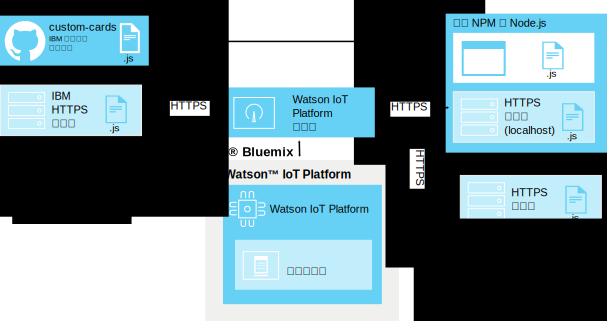

---

copyright:
  years: 2016, 2017
lastupdated: "2016-10-13"

---

{:new_window: target="\_blank"}
{:shortdesc: .shortdesc}
{:screen: .screen}
{:codeblock: .codeblock}
{:pre: .pre}

# 定制卡
{: #custom_cards}

除了 {{site.data.keyword.iot_full}} 随附的通用卡外，还可使用定制卡来对物联网数据进行可视化。
{:shortdesc}

## 体系结构
{: #architecture}  

定制卡由您进行开发，并使用您自己的定制卡 HTTP 服务器存储库进行部署。用户的浏览器在显示和处理 {{site.data.keyword.iot_short_notm}} 仪表板时会访问此服务器。{{site.data.keyword.iot_short_notm}} 通过定制卡扩展来管理浏览器连接，但本身并不会连接到定制卡服务器。

正在运行 {{site.data.keyword.iot_short_notm}} 仪表板的浏览器会直接从定制卡服务器检索所有必要的资源。定制卡在“添加卡”对话框中提供，并在用户已配置的用户创建板中显示。

为了使用卡服务器来启用集中化版本控制，不会在客户机端对定制卡代码进行高速缓存。如果定制卡不再可用或者如果无法访问卡服务器，那么会使用占位符来保持一致的仪表板布局。

**提示：**要在未设置自己的开发环境的情况下测试定制卡功能，可以通过以下网址连接到 IBM 提供的样本定制卡服务器：`https://customcards.mybluemix.net`

要构建卡，您必须设置基于 Node.js 的本地开发环境，并从 IBM 提供的定制卡 GitHub 存储库导入样本卡。创建卡后，将卡软件包部署到安全 (HTTPS) Web 服务器，然后将 {{site.data.keyword.iot_short_notm}} 定制卡扩展链接到该服务器。   

**提示：**您可以使用内置 Node.js Web 服务器来对卡进行初始测试和故障诊断，但应该使用安全且妥善管理的 Web 服务器来对卡进行任何生产部署。

 

## 安全性
{: #security}

对于选择在定制卡服务器上的卡中部署的 JavaScript 代码，没有任何限制。定制卡中的 JavaScript 代码有权访问浏览器中保存的所有信息，就像在仪表板中运行的其他任何卡一样。确保正确的定制卡服务器在向浏览器提供代码，以用于显示和处理定制卡。

卡在您的 {{site.data.keyword.iot_short_notm}} 浏览器会话中执行其代码，完全如编写的那样。此外，在创建定制卡服务器连接时，不会向定制卡服务器提供任何凭证。用户的浏览器可以连接到任何配置的定制卡服务器。

仅配置已知且安全的定制卡服务器来向用户仪表板提供定制卡，这一点非常重要。   

有关如何确保定制卡服务器安全的更多信息，请参阅[定制卡安全性](../reference/security/custom_cards_server.html)。

以下步骤将指导您逐步完成以下过程：连接到测试卡服务器，在自己的卡服务器上部署样本卡，以及最终创建自己的卡并在服务器上部署这些卡。

## 第 1 步：将 {{site.data.keyword.iot_short_notm}} 连接到样本卡服务器。
{: #connect-to-sample}  

要使用 {{site.data.keyword.iot_short_notm}} 来测试定制卡功能，可以连接到样本定制卡服务器。样本服务器包含一组通用卡，这些卡也可用作模板来创建您自己的卡。

要连接到样本定制卡服务器，请执行以下操作：
1. 以管理用户身份登录到 {{site.data.keyword.iot_short_notm}} 仪表板。
2. 启用试验性功能。
  
目前，定制卡是作为试验性功能提供的。
  
**重要信息：**必须针对每个浏览器会话启用试验性定制卡扩展。定制卡连接和卡软件包不会在 {{site.data.keyword.iot_short_notm}} 组织中全局共享。
 1. 转至**设置**。
 2. 在“试验性功能”部分中，验证**激活试验性功能**是否已启用。
2. 连接到样本服务器。
 2. 转至**扩展**。
 3. 单击**添加扩展**，然后选择**定制卡**扩展。
 4. 在**定制卡**磁贴中，单击**设置**。
 5. 在“配置定制卡”部分中，单击**添加**，然后在“服务器”字段中输入样本卡服务器的安全 (HTTPS) URL。
  
如果要连接到您自己的服务器，请输入该服务器的 URL。
    
**提示：**IBM 样本卡服务器的 URL 为：`https://customcards.mybluemix.net`  
 6. 单击**检索证书**以连接到定制卡服务器，并检索该服务器的安全证书信息。
   
 **重要信息：**使用证书信息可验证是否正在连接到所需的已知且安全的定制卡服务器。
 4. 单击**完成**以添加服务器连接。
5. 基于样本卡创建新卡。
 1. 在 {{site.data.keyword.iot_short_notm}} 仪表板中，转至**板**。
 2. 单击**新建板**。
   
填写“新建板”对话框。有关信息，请参阅[创建板和卡](../data_visualization.html#visualizing_data)。
 3. 打开新板。
 4. 单击**添加新卡**。  
 5. 向下滚动到**定制卡**，然后选择其中一个样本卡。
   
完成卡创建过程。有关信息，请参阅[创建板和卡](../data_visualization.html#visualizing_data)。  

 现在，新的定制卡已位于新板中。  
 

恭喜，您已连接到定制卡服务器并将定制卡添加到其中一个板。下一步是设置您自己的卡服务器，然后使用 HelloWorld 样本卡来创建第一个卡。

## 第 2 步：设置卡服务器，并部署 HelloWorld 样本卡。
{: #create-hello-world}

要准备开发定制卡，可以设置本地定制卡开发环境，并测试部署 HelloWorld 样本卡。

要创建定制卡服务器并部署 IBM 样本卡，请按照 [custom-cards 存储库](https://github.com/ibm-watson-iot/custom-cards/blob/master/README.md)自述文件中的详细指示信息进行操作。

此过程中涉及以下高级别步骤：
1. 确保本地开发环境包含带有 npm 节点软件包管理器的 Node.js。
  
有关安装 Node.js 的信息（包括下载链接），请转至以下网址：https://nodejs.org
2. 设置一台 HTTP 服务器以托管定制卡软件包。    
  - 服务器上提供定制卡内容的目录必须无需凭证即可访问。
  - 服务器必须使用 HTTPS 协议。
  - 服务器必须支持跨源资源共享 (CORS) 连接。
  
**提示：**对于测试和概念验证工作，可以使用内置样本 Node.js 服务器，此服务器已配置为满足这些需求。
3. 创建自己的存储库。
在以下网址派生并克隆示例定制卡存储库：https://github.com/ibm-watson-iot/custom-cards
4. 创建自己的模块和卡框架。
定制卡按模块进行组织。设置新的 HelloWorld 卡模块。
5. 引用新卡。
定制卡软件包可能包含多个模块。必须在主软件包文件中引用新模块。
6. 注册模块。
要使卡在 {{site.data.keyword.iot_short_notm}} 组织的板中可用，必须在 `DashboardConfig.json` 文件中添加卡配置详细信息。
7. 构建卡软件包。
使用 Gulp 设置自动构建引擎。
8. 将卡软件包部署到卡服务器。
  
必须将卡软件包部署到定制卡 HTTP 服务器后，才能在 {{site.data.keyword.iot_short_notm}} 中使用您的卡。  
**提示：**可以通过将卡软件包重新部署到卡服务器，以动态添加新卡或除去过时的卡。
9. 将卡服务器链接到 {{site.data.keyword.iot_short_notm}}。
将新部署的定制卡服务器链接到 {{site.data.keyword.iot_short_notm}}。
  
**提示：**由于定制卡服务器可能是样本卡服务器的完整副本，因此可能会在环境中看到重复的卡。请除去样本卡服务器连接以仅显示定制卡服务器中的卡。
 1. 转至**扩展**。
 2. 在**定制卡**磁贴中，单击齿轮图标以更新配置。
 4. 在“配置定制卡”部分中，单击**添加**，然后在“服务器”字段中输入定制卡服务器的安全 (HTTPS) URL。
  
**重要信息：**验证是否正在连接到所需的已知且安全的定制卡服务器。
4. 单击**完成**以添加服务器连接。
10. HelloWorld 定制卡现在可用于您的板。

好了！您已成功设置卡服务器并部署了第一个样本卡。恭喜您！但是，定制卡的整个构想是让您完全按照自己所希望的方式来设置卡和板。因此，现在应该开始修改样本以创建您自己的卡。

## 第 3 步：创建并部署自己的定制卡。
{: #create-your-own-cards}
配置并验证 HelloWorld 卡后，可以扩展定制卡并创建自己的卡。

示例定制卡存储库包含以下样本卡：
- HelloWorld  
简单卡，用于提供基本 Hello World 示例。
- 空  
空卡，包含卡的基础架构。从头开始构建卡时，可将此卡用作模板。
- Webcam  
简单网络摄像头卡。使用 webcam URL 来配置卡，然后设置刷新率。
- iFrame  
基本 iFrame 卡，可用于将任何安全 (HTTPS) Web 页面嵌入板中。

以下高级别步骤将创建新卡：

**提示：**有关详细步骤，请参阅示例定制卡存储库中的[创建定制卡自述文件](https://github.com/ibm-watson-iot/custom-cards/blob/master/README.md)。
1. 创建自己的卡模块。
 1. 将其中一个样本卡模块用作您的模块的模板。
 2. 在您的新模块文件名和文件内容中更新模块名称的所有实例。
   
例如，在所有文件名和文件内容实例中，将 `HelloWorld` 替换为您的模块名称。
2. 在 Modules.jsx 文件中引用新模块。
3. 在 DashboardConfig.json 文件中注册新模块。
4. 更新定制卡代码以满足您的卡需求。
4. 构建卡软件包。
  
根据您的设置，构建过程可能会使用 Gulp 自动执行，或者您可能必须手动触发构建。
3. 部署新卡。
  
如果使用的是外部定制卡服务器，那么现在必须将软件包部署到该服务器。  

您已创建第一个定制卡，并将其部署到定制卡服务器。现在，该卡可在 {{site.data.keyword.iot_short_notm}} 组织中使用。
