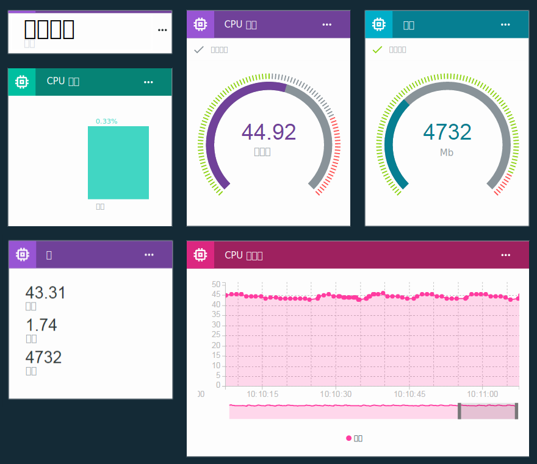

---

copyright:
  years: 2016

---

{:new_window: target="\_blank"}
{:shortdesc: .shortdesc}
{:screen: .screen}
{:codeblock: .codeblock}
{:pre: .pre}

# 使用仪表板和卡可视化实时数据
{: #boards_and_cards}
上次更新时间：2016 年 6 月 21 日
{: .last-updated}

创建仪表板和卡可创建并共享自己的仪表板，用于对实时设备数据进行可视化。
{:shortdesc}

通过使用仪表板和卡，可以通过图形方式可视化来自一个或多个设备的数据集值，以快速概览和增进对设备数据的了解。创建仪表板和卡，以将数据显示为原始数字、实时图形、量表等。向仪表板添加成员，以便与组织中的其他用户共享仪表板。排列卡并添加解释性文本分隔符，以优化呈现。  

## 缺省仪表板
{: #default_boards}
{{site.data.keyword.iot_full}} 仪表板具有以下缺省仪表板：

|仪表板名称 | 描述 |  
|:---|:---|  
|使用情况概述  | 显示组织的使用情况统计信息。列出使用的设备类型和数据。
|基于规则的分析 | 显示组织的规则。其他卡会列出已触发的警报、关联的设备、设备属性和警报信息。 |  
|基于设备的分析 | 显示连接到组织的设备。其他卡会显示所选设备的警报、所选设备的信息、设备属性和警报信息。 |

可以通过添加、更新和除去卡来更新这些仪表板。

**提示：**要将缺省仪表板重置为其原始状态，可以删除该仪表板。然后，该仪表板将使用原始卡重新创建。

## 创建仪表板和卡
{: #visualizing_data}

{{site.data.keyword.iot_short_notm}} 提供了内置仪表板，可用于显示设备返回的实时数据。缺省情况下，“概述”页面显示有关 {{site.data.keyword.iot_short_notm}} 组织的使用情况信息，例如使用的数据和存储空间。要在实时设备数据流入时查看这些数据，请向此页面添加特定于设备的卡。

要向仪表板添加特定于设备的卡，请执行以下操作：
1. 在 {{site.data.keyword.iot_short_notm}} 仪表板中，选择**仪表板**。
2. 选择对其具有编辑权限的仪表板，或创建新的仪表板。
3. 在仪表板中，单击**添加新卡**。
2. 在“编辑通用可视化卡”框中，向下滚动到“设备”部分。
3. 选择可视化类型。
**提示：**选择**通用可视化**可进行基本配置。可以日后更改卡类型。
单击**显示更多**可获取卡类型的完整列表。
4.	选择一个或多个数据源，然后单击**下一步**以添加一个或多个数据集。
 1.	为数据集提供识别名称。
 2. 选择包含要显示的数据点的事件。
 3.	选择表示数据点的属性。
 4.	设置数据点的类型、单位、精度、最小值和最大值。完成后，可以单击**新建数据集**以添加更多数据集，或单击**下一步**。
5.	选择可视化。
选择要使用的可视化的类型和大小。某些卡类型具有更多设置。
<dl>
<dt>用法</dt>
<dd>
<table>
<thead>
<tr>
<th>类型</th>
<th>显示的数据</th>
</tr>
</thead>
<tbody>
<tr>
<td>设备类型</td>
<td>饼图，显示每种设备类型的设备数。</td>
</tr><tr>
<td>传输的数据</td>
<td>组织的已传输数据的使用情况统计信息。</td>
</tr>
</tbody>
</table>
</dd>
<dt>基本</dt>
<dd>
<table>
<thead>
<tr>
<th>类型</th>
<th>显示的数据</th>
</tr>
</thead>
<tbody>
<tr>
<td>分离符</td>
<td>用于在仪表板上对卡进行组织和分组的水平分隔符。</td>
</tr>
</tbody>
</table>
</dd>
<dt>设备</dt>
<dd><table>
<thead>
<tr>
<th>类型</th>
<th>显示的数据</th>
</tr>
</thead>
<tbody>
<tr>
<td>通用可视化</td>
<td>一个或多个数据集的值。 **提示：**要在小型表中最多查看三个数据点，请选择较大的窗口小部件大小。</td>
</tr>
<tr>
<td>实时图表</td>
<td>实时滚动图表中的一个或多个数据集。使用“设置”菜单可设置数据范围和保留时间、图形外观等。</td>
</tr>
<tr>
<td>条形图</td>
<td>以带标签的条形图显示的数据集值。使用“设置”菜单可切换水平或垂直条形图方向。</td>
</tr>
<tr>
<td>圆环图</td>
<td>以圆环图显示的两个或更多数据集。</td>
</tr>
<tr>
<td>值</td>
<td>一个或多个数据集的原始值。</td>
</tr>
<tr>
<td>量表</td>
<td>显示为量表的数据集值。可以针对数据集的良好、一般和临界值配置显示阈值。使用“设置”菜单可选择设置低、中、高数据范围的阈值。</td>
</tr>
</tbody>
</table>
</dd>
<dt>分析</dt>
<dd>
<table>
<thead>
<tr>
<th>类型</th>
<th>显示的数据</th>
</tr>
</thead>
<tbody>
<tr>
<td>设备信息</td>
<td>显示单个设备的基本信息。</td>
</tr>
<tr>
<td>警报信息</td>
<td>显示单个警报的基本信息。</td>
</tr>
<tr>
<td>设备列表</td>
<td>要监视的多个设备的列表。</td>
</tr>
<tr>
<td>警报</td>
<td>设备的警报的列表。</td>
</tr>
<tr>
<td>规则</td>
<td>具有警报的规则的列表。</td>
</tr>
<tr>
<td>设备属性</td>
<td>显示一个或多个设备的特定属性。</td>
</tr>
<tr>
<td>所有设备属性</td>
<td>显示一个或多个设备的所有属性。</td>
</tr>
<tr>
<td>设备地图</td>
<td>显示列表中多个设备的位置。</td>
</tr>
</tbody>
</table>
</dd>
</dl>

6. 指定卡的数据源。
根据所选的卡类型，在卡上显示的数据可能来自设备，也可能来自其他卡。选择数据源的特定设备、设备列表或警报列表卡，然后单击**下一步**。
7. 仅限“设备类型”卡：添加一个或多个要在卡中显示的数据集。   
 1. 单击**连接数据集**以添加要显示在卡中的属性。
 2. 为数据集命名。
 3. 输入或选择要显示其属性的事件。
 4. 输入或选择要显示的属性。
 5. 指定属性的类型，并可选择设置属性的单位、精度、最大值和最小值。  
 6. 单击**下一步**。
7. 选择呈现大小。
对于特定卡类型，可以单击**设置**以配置其他可视化详细信息。单击**下一步**。
7. 提供卡的标题和描述，并可选择颜色方案，然后单击**提交**以创建卡。
7.	最后，通过在仪表板上将新卡拖至适当位置来定位该卡。  

太棒了！您现在可以查看设备的实时数据了！
