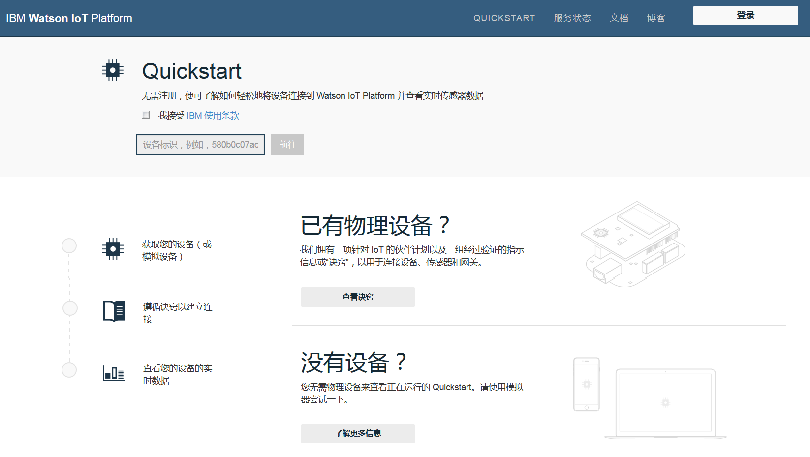
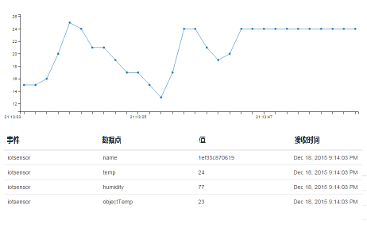

---

copyright:
  years: 2015, 2016, 2017
lastupdated: "2016-09-19"

---

{:new_window: target="_blank"}
{:shortdesc: .shortdesc}
{:screen: .screen}
{:codeblock: .codeblock}
{:pre: .pre}

# Quickstart

[Quickstart](https://quickstart.internetofthings.ibmcloud.com/#/) 是一种开放式沙箱，可用于将设备快速连接到 {{site.data.keyword.iot_full}}。如果设备支持 MQTT 消息传递协议，那么可将其轻松连接到 Quickstart。

例如，有关说明可如何将不同设备连接到 Quickstart 服务的诀窍和教程，请转至 [DeveloperWorks 诀窍](https://developer.ibm.com/recipes/)，例如：

- [OpenBlocks IoT BX1G](https://developer.ibm.com/recipes/tutorials/openblocks-iot-bx1g-for-iot-foundation-quickstart/)
- [响应式块](https://developer.ibm.com/recipes/tutorials/reactive-blocks-and-java-to-iot-foundation-part-1-quickstart/)


**重要信息：**如果 {{site.data.keyword.iot_short_notm}} 实例使用 Quickstart 服务，那么不支持可扩展应用程序。

## 模拟设备

除了 Quickstart 诀窍和教程，还提供了适用于移动设备的基于浏览器的模拟设备，用于将任何具有 Web 浏览器的设备连接到 Quickstart 服务。要从手机或平板电脑启动连接到 {{site.data.keyword.iot_short}} 的基于浏览器的模拟设备，请打开以下 URL：

```
http://quickstart.internetofthings.ibmcloud.com/iotsensor
```

在移动设备上连接到模拟设备 URL 时，会启动连接到 {{site.data.keyword.iot_short}} 的基于浏览器的模拟设备。使用以下 UI 控件来管理传感器：

- 温度
- 湿度
- 对象温度


## 数据可视化

要从移动设备查看生成的数据，请确保模拟设备在该移动设备上运行，然后启动 Quickstart 应用程序。输入设备的 12 个字符设备标识，这会显示在 UI 的右上角。



在模拟设备中调整传感器值时，可看到 Quickstart 应用程序中实时显示的设备中数据，如以下截屏中所示：




## Mosquitto 演示

[Mosquitto](http://mosquitto.org/) 是一款跨平台开放式源代码 MQTT 客户机，可用于试验 {{site.data.keyword.iot_short}} 服务。安装 Mosquitto 客户机后，选择唯一的应用程序标识和设备标识。如果应用程序标识和设备标识不唯一，那么您的测试连接可能会导致与正完成相同 Quickstart 测试过程的其他用户冲突。

*appId*、*type_id*、*device_type* 和 *device_id* 值不得超过 36 个字符，并且仅可包含以下字符：
- 字母数字字符（a-z、A-Z 和 0-9）
- 连字符 (-)
- 下划线 (_)
- 点 (.)

定义应用程序标识和设备标识后，通过使用 `mosquitto_sub` 创建表示应用程序的连接。使用 `<applicationId>` = myApplicationId 且 `<deviceId>` = myDeviceId 的以下示例：
```
    [user@host ~]$ mosquitto_sub -h quickstart.messaging.internetofthings.ibmcloud.com -p 1883 -i "a:quickstart:myApplicationId" -t iot-2/type/mosquitto/id/myDeviceId/evt/helloworld/fmt/json

```

上一个进程正在运行时，可创建您的设备。在此示例中，连接一个类型为 `mosquitto` 的设备，然后通过使用 `mosquitto_pub` 向服务发送两个事件，如以下代码中所示：

```
    [user@host ~]$ mosquitto_pub -h quickstart.messaging.internetofthings.ibmcloud.com -p 1883 -i "d:quickstart:mosquitto:myDeviceId" -t iot-2/evt/helloworld/fmt/json -m "{\"helloworld\": 1}"
    [user@host ~]$ mosquitto_pub -h quickstart.messaging.internetofthings.ibmcloud.com -p 1883 -i "d:quickstart:mosquitto:myDeviceId" -t iot-2/evt/helloworld/fmt/json -m "{\"helloworld\": 2}"
```
查看应用程序终端时，会显示刚刚发布的两个事件，如以下示例输出中所示：

```
   [user@host ~]$ mosquitto_sub -h quickstart.messaging.internetofthings.ibmcloud.com -p 1883 -i "a:quickstart:myApplicationId" -t iot-2/type/mosquitto/id/myDeviceId/evt/helloworld/fmt/json
    {"helloworld": 1}
    {"helloworld": 2}
```

此示例已完成。通过完成 Quickstart 示例过程，即完成以下操作：
- 已将设备和应用程序通过 MQTT 成功连接到 {{site.data.keyword.iot_short}}
- 已将事件从设备发送到服务
- 已在应用程序中收到事件


## 相关链接

- [Quickstart](https://quickstart.internetofthings.ibmcloud.com)
- [DeveloperWorks 诀窍](https://developer.ibm.com/recipes)
- [OpenBlocks IoT BX1G](https://developer.ibm.com/recipes/tutorials/openblocks-iot-bx1g-for-iot-foundation-quickstart/)
- [响应式块](https://developer.ibm.com/recipes/tutorials/reactive-blocks-and-java-to-iot-foundation-part-1-quickstart/)
- [Quickstart 应用程序](http://quickstart.internetofthings.ibmcloud.com)
- [Mosquitto](http://mosquitto.org/)
