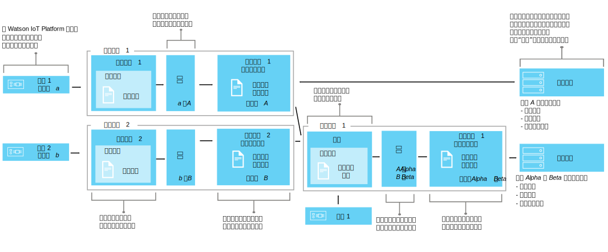

---

copyright:
years: 2016, 2017
lastupdated: "2017-04-25"

---

{:new_window: target="\_blank"}
{:shortdesc: .shortdesc}
{:screen: .screen}
{:codeblock: .codeblock}
{:pre: .pre}

# 使用接口映射设备数据 (Beta)
{: #im_index}

应用程序接口将[设备类型](#resources)的概念扩展到可以更好地控制在 {{site.data.keyword.iot_short_notm}} 中传递的数据，而且能够提供独立于设备的 IoT 数据视图。
{:shortdesc}

**重要信息：**接口映射功能是 beta 功能。后续的 beta 更新以及最终发行版中可能会包含与当前版本不兼容的更改。因此强烈建议在推出最终发行版之前，不要将 beta 功能用于生产应用程序。如果要接收其他信息并提供对此 beta 的反馈，可以[注册 Information Management Beta 程序 ](https://www.ibm.com/software/support/trial/cst/forms/nomination.wss?id=7050){:new_window}。

## 概述
{: #overview}

使用应用程序接口来创建设备和事物的共享抽象形式，以改进复用和维护，并在保证应用程序不受数据更改影响的情况下管理 IoT 生态系统的复杂性。应用程序接口不受设备与 {{site.data.keyword.iot_short_notm}} 进行通信的消息数据的可变性的影响。

通过应用程序接口，应用程序可以访问设备和事物的当前状态。状态由应用程序接口所定义的一组状态属性组成。在设备发送状态更改事件时，这些属性的最新值会存储在 {{site.data.keyword.iot_short_notm}} 中，并在请求时使用 HTTP API 提供给应用程序。

通过使用应用程序接口，您可以：
- 将状态属性映射到事件消息数据
- 定义首选的数据结构
- 定义设备状态的多种表示或视图
- 预订设备状态或随时通过 HTTP API 对其进行查询

应用程序接口的一些常用情况包括：
- 为应用程序开发者提供一致的接口以通过类似 REST 的方式访问事件驱动的设备数据。
- 对来自不同制式或型号并且以不同的格式发布数据的设备的数据进行规范化。
- 组合来自数个不同设备类型的事件数据以为任意给定的 IoT 事物建模。
- 修改并转换数据格式以适合应用程序模型。  

有关接口 API 文档 (beta) 的信息，请参阅 [{{site.data.keyword.iot_short_notm}} HTTP REST API  ](https://docs.internetofthings.ibmcloud.com/apis/swagger/v0002-beta/info-mgmt-beta.html){: new_window}。   

## 示例
{: #examples}
以下接口示例展示了两种可能的解决方案。

### 示例 1：将异构温度传感器映射到应用程序接口
{: #device-type-example}
在此示例中，我们创建的应用程序接口，无论实际设备事件消息有效内容格式如何，都能提供同一格式的同构温度状态数据。温度传感器 1 将摄氏温度读数 `{ "t" : 34.5 }` 发布到 {{site.data.keyword.iot_short_notm}}。温度传感器 2 发布的是华氏温度读数 `{ "temp" : 72.55 }`。这些温度读数会作为单独的事件发布。

有关描述此示例的详细的端到端场景，请参阅[应用程序接口场景 1](im_index_scenario.html)。

作为应用程序接口数据流的一部分，您可以对传入的数据执行计算以对这些读数进行规范化，使其格式一致，以便进行处理。这意味着您无需将应用程序编写为能够识别或转换不同的温标。应用程序会收到单一的规范化状态，并使用 **temperature** 状态属性而不是特定于设备的 **t** 和 **temp** 属性。

### 示例 2：将多个气候设备映射到一个事物类型应用程序接口
{: #thing-type-example}  
在此示例中，我们通过以单独湿度计设备的形式添加一组湿度传感器，扩展了设备类型示例。通过使用事物类型应用程序接口，我们可以将来自不同设备类型的数据无缝合并到表示一个房间中所有设备和传感器的一个应用程序接口中。应用程序现在可以通过连接到房间事物应用程序接口，获取从一个房间收集到的气候数据。

有关描述此示例的详细的端到端场景，请参阅[应用程序接口场景 2](im_index_scenario_thing.html)。

温度传感器 1 和湿度传感器 3 发布在房间 R1 中收集到的环境数据。温度和湿度传感器数据分别映射到两个设备类型应用程序接口，一个针对温度计设备类型，一个针对湿度计设备类型，如先前的示例中所述。现在我们创建一个名为“房间”的事物类型，并将两个房间事物实例进行实例化（R1 和 R2）。

现在我们可以设置一个组合，其中包含温度计和湿度计应用程序接口，然后将正确的环境传感器映射到每个房间实例，例如 D1 和 D3 映射到 R1。最终用户应用程序现在可以请求特定房间事物标识的状态，无需了解底层设备基础架构即可获知房间温度和湿度状态。

## 定义和资源
{: #resources}

下图展示了在使用应用程序接口时 {{site.data.keyword.iot_short_notm}} 上设备与应用程序之间的逻辑映射。

### 概念

概念                        | 描述       
------------- | ------------- | -------------  
事件 | 事件是设备将数据发布到 {{site.data.keyword.iot_short_notm}} 时所采用的机制。设备控制事件内容，并为其发送的每个事件指定名称。属性 | 带有部分设备事件有效内容的数据。
状态 | 映射状态属性的最新值。
组合                         | 定义与事物类型关联的应用程序接口的逻辑构造。组合是由事物类型模式所指定的。   

### 信息管理资源
您可以使用 REST API 来管理资源。有关 REST API 的信息，请参阅 [{{site.data.keyword.iot_short_notm}} HTTP REST API](https://docs.internetofthings.ibmcloud.com/swagger/info-mgmt-beta.html) 文档。

类型资源                        | 描述       
------------- | ------------- | -------------  
事件类型                         | 将物理接口连接到事件模式的程序化构造。 **重要信息：**对于 Beta，要在应用程序接口中使用的所有入站事件必须为 JSON 格式。   
设备类型                         |  允许您将具有共同特征或行为的设备分组到一起的程序化构造。在接口映射中，设备类型扩展为包含设备的一个物理接口以及可用于检索设备状态的一个或多个应用程序接口。 有关更多信息，请参阅[设备模型](../reference/device_model.html#id_and_device_types)主题中的“标识和设备类型”部分。
事物类型                         | 表示一个或多个单独设备类型和/或事物类型的集合的程序化构造。 **重要信息：**该 beta 支持三个级别的事物类型应用程序接口嵌套。
模式资源                         |  定义设备类型物理接口、事物类型组合以及传出应用程序接口的数据结构的程序化构造。使用下列 [JSON 模式 ](http://json-schema.org/){:new_window}：<ul><li>*事件模式*定义由设备发布到 {{site.data.keyword.iot_short_notm}} 的事件结构。每个事件模式会定义一个入站事件的结构，并与一种事件类型相关联。<li>*事物类型模式*定义被事物类型用作输入源的应用程序接口。每个事物类型模式都定义一个或多个事物类型应用程序接口的结构。<li>*应用程序接口模式*定义存储在 {{site.data.keyword.iot_short_notm}} 上的[设备状态](#key_concepts)的结构。</ul>.

接口资源                        | 描述       
------------- | ------------- | -------------  
应用程序接口 | 应用程序可以连接或预订的用于查看设备或事物状态的程序化构造。应用程序接口是由应用程序接口模式定义的，该模式用于设定存储为设备或事物状态的状态数据的结构。状态会进行更新以对入站状态事件做出响应。与设备类型关联的应用程序接口可以具有一个作为输入的物理接口。与事物类型关联的应用程序接口可以具有一个或多个作为输入的应用程序接口。
实例资源                        | 描述       
------------- | ------------- | -------------  
设备                         | 表示向 {{site.data.keyword.iot_short_notm}} 注册并且以事件形式发送 IoT 数据的资产、系统或组件的程序化构造。  
事物                         | 逻辑表示事物类型唯一实例的程序化构造。事物实例的作用与设备类型的已注册设备相同。
支持资源                        | 描述       
------------- | ------------- | -------------  
物理接口                         | 定义事件类型和与单个设备关联的设备属性的程序化构造。物理接口是由事件模式定义的。   
映射                         | 定义与入站事件关联的属性如何映射到在应用程序接口上定义的属性的程序化构造。 **重要信息：**必须至少将一个应用程序接口与一种设备类型相关联后，才能定义映射。
## 高级别工作流
{: #workflow}

使用以下步骤可帮助您配置开始使用接口来映射设备数据所需的资源。

有关 API 的详细信息，请参阅 [{{site.data.keyword.iot_short_notm}} HTTP REST API ](https://docs.internetofthings.ibmcloud.com/swagger/info-mgmt-beta.html){:new_window} 文档。

**提示：**有关每个步骤的更多详细信息，请参阅示例场景或使用链接直接转至示例场景中的特定步骤。[示例场景 1](im_index_scenario.html#scenario) 引导您完成创建针对异构温度计设备的设备类型应用程序接口的各个步骤；[示例场景 2](im_index_scenario_thing.html#scenario) 通过描述如何构建应用程序接口以使用来自合并到一个房间类型事物中的两个不同气候设备类型的数据来完成进一步构建。

根据您要创建的应用程序接口是与设备类型关联还是与事物类型关联，创建和使用应用程序接口的过程会有所不同。

### 开始之前
要创建与设备类型关联的应用程序接口，必须[至少有一个向 {{site.data.keyword.iot_short_notm}} 注册的设备](im_index_scenario.html#step14)，并且该设备发送带有状态属性的事件。  
要创建与事物类型关联的应用程序接口，必须至少有一个与已创建设备类型关联的应用程序接口。

### 步骤

1. 	定义传入状态属性。  
首先定义您希望应用程序接口为应用程序提供的传入状态属性。  
根据您要创建的应用程序接口，执行下列某项操作：
<dl>
<dt>设备类型：创建物理接口。</dt>
<dd>
<ol>
<li>[创建事件模式文件](im_index_scenario.html#step1)。事件模式文件是本地 .JSON 文件，用于定义入站事件的结构和格式。
<li>[创建事件类型的事件模式资源](im_index_scenario.html#step2)。事件模式资源是 {{site.data.keyword.iot_short_notm}} 所使用的程序化构造。
<li>[创建引用事件模式的事件类型](im_index_scenario.html#step3)。事件类型由 {{site.data.keyword.iot_short_notm}} 使用，用于将一个或多个事件模式资源映射到物理接口。
<li>[创建物理接口](im_index_scenario.html#step7)。
<li>[向物理接口添加事件类型](im_index_scenario.html#step8)。
<li>[向设备类型添加物理接口](im_index_scenario.html#step9)。
</ol>
</dd>
<dt>事物类型：定义组合。</dt>
<dd>
<ol>
<li>[创建组合模式文件](im_index_scenario_thing.html#crt_composition_file)。  
事物类型组合模式文件是本地 .JSON 文件，用于通过指向现有应用程序接口来定义事物类型的组合。
<li>[创建组合模式资源](im_index_scenario_thing.html#crt_composition_resource)。  
将本地 .JSON 文件上传到 {{site.data.keyword.iot_short_notm}}。
<li>[创建事物类型](im_index_scenario_thing.html#crt_thing_type)。 事物类型的作用与设备类型相同，用于表示一类事物。
</ol>
</dd>
</dl>
4. 	创建应用程序接口。
 1. 	为[设备类型](im_index_scenario.html#step4)或[事物类型](im_index_scenario_thing.html#crt_ai_schema_file)创建应用程序接口模式文件。  
应用程序接口模式文件是本地 .JSON 文件，用于定义向应用程序提供的设备状态。
 2. 	为[设备类型](im_index_scenario.html#step5)或[事物类型](im_index_scenario_thing.html#crt_ai_schema_resource)创建应用程序接口模式资源。
 3.	为[设备类型](im_index_scenario.html#step6)或[事物类型](im_index_scenario_thing.html#crt_thing_ai)创建应用程序接口。
 4.	为[设备类型](im_index_scenario.html#step10)或[事物类型](im_index_scenario_thing.html#add_thing_ai)添加应用程序接口。
5. 	为[设备类型](im_index_scenario.html#step11)或[事物类型](im_index_scenario_thing.html#define_Thing_type_mappings)定义映射。   
用于将入站属性映射到应用程序接口中属性的映射。
6. 	部署与[设备类型](im_index_scenario.html#step15)或[事物类型](im_index_scenario_thing.html#deploy_Thing_config)关联的配置。
7. 	**事物类型：**[创建事物类型实例](im_index_scenario_thing.html#create_Thing_instances)。
8. 	检查[设备](im_index_scenario.html#step13)或[事物](im_index_scenario_thing.html#verify_Thing_state)更新的状态。  
验证预订中是否显示已更新的设备数据，或者，使用 REST 调用是否返回已更新的设备数据。
