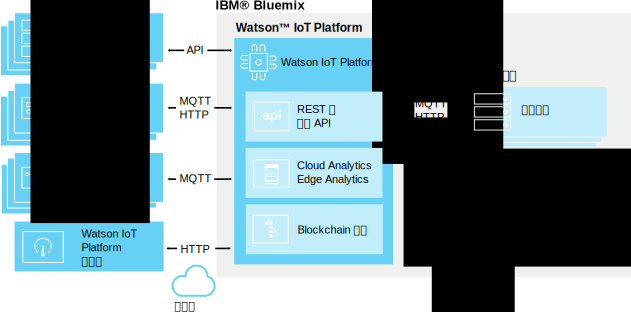

---

copyright:
  years: 2016, 2017
lastupdated: "2017-02-3"

---

{:new_window: target="\_blank"}
{:shortdesc: .shortdesc}
{:screen: .screen}
{:codeblock: .codeblock}
{:pre: .pre}

# 关于 {{site.data.keyword.iot_short_notm}}
{: #about_iotplatform}

{{site.data.keyword.iot_full}} 提供对 IoT 设备和数据的强大应用程序访问，可帮助您快速编写分析应用程序、可视化仪表板和移动 IoT 应用程序。
{:shortdesc}

通过 {{site.data.keyword.iot_short_notm}}，您可以执行强大的设备管理操作，并存储和访问设备数据，连接各种设备和网关设备。{{site.data.keyword.iot_short_notm}} 通过使用 MQTT 和 TLS，提供与设备之间的安全通信。

## {{site.data.keyword.iot_short_notm}} 的体系结构
{: #watsoniotplatform_architecture}

**重要信息：**分析功能是从 {{site.data.keyword.iotrtinsights_full}} 服务合并进来的。如果您的 {{site.data.keyword.iot_short_notm}} 组织用作现有 {{site.data.keyword.iotrtinsights_short}} 实例的数据源，那么在迁移现有 {{site.data.keyword.iotrtinsights_short}} 实例后，才会启用 Cloud Analytics 和 Edge Analytics。继续使用 {{site.data.keyword.iotrtinsights_short}} 仪表板来满足分析需要，直到迁移完成。有关更多信息，请参阅 IBM developerWorks 上的 [IBM Watson IoT Platform 博客 ](https://developer.ibm.com/iotplatform/2016/04/28/iot-real-time-insights-and-watson-iot-platform-a-match-made-in-heaven/){: new_window} 以及现有 {{site.data.keyword.iotrtinsights_short}} 实例仪表板。  

{{site.data.keyword.iot_short_notm}} 通过使用 {{site.data.keyword.iot_short_notm}} API 和 {{site.data.keyword.iot_short_notm}} 消息传递协议与您的应用程序和设备通信。{{site.data.keyword.iot_short_notm}} 仪表板作为前端用户界面进行连接，以简化平台内的操作。可以存储设备数据或将其用于分析解决方案。

## {{site.data.keyword.iot_short_notm}} 中的重要概念
{: #watsoniotplatform_importantconcepts}

### 组织

向 {{site.data.keyword.iot_short_notm}} 注册时，会为您提供组织标识。您的组织标识是您帐户的 6 字符唯一标识。组织确保您的数据仅可由您的设备和应用程序访问。注册后，设备和 API 密钥会绑定到单个组织。应用程序通过使用 API 密钥连接到服务时，会向与所使用的 API 密钥关联的组织注册。

为确保安全性，无法进行跨组织通信。在两个组织之间传输数据的唯一方式是在每个组织中创建一个应用程序，用于与其他组织中的应用程序通信。

### 设备

设备可以是连接到因特网且可将数据推送到云的任何对象。但是，设备无法直接与其他设备通信，而是接受来自应用程序的命令，并将事件发送到应用程序。{{site.data.keyword.iot_short_notm}} 中的设备通过唯一认证令牌进行标识。设备必须先进行注册，才可连接到 {{site.data.keyword.iot_short_notm}}。

{{site.data.keyword.iot_short_notm}} 可识别两类设备：**受管设备**和**非受管设备**。

**受管设备**定义为包含设备管理代理程序的设备。设备管理代理程序是一组逻辑，允许设备通过使用设备管理协议与 {{site.data.keyword.iot_short_notm}} 设备管理服务交互。受管设备可执行设备管理操作，包括位置更新、固件下载和更新、重新引导和出厂重置。

**非受管设备**是没有设备管理代理程序的所有设备。非受管设备可连接到 {{site.data.keyword.iot_short_notm}}，并可发送和接收事件及命令，但无法发送设备管理请求或执行设备管理操作。

### 网关

网关是专用设备，集成了应用程序和设备的功能，从而可充当其他设备的访问点。对于无法直接连接到因特网的设备，可通过先连接到网关设备来访问 {{site.data.keyword.iot_short_notm}} 服务。

网关必须先进行注册，才可连接到此服务。

### 应用程序

应用程序是连接到因特网且与设备中数据交互并控制这些设备的行为的任何对象。应用程序通过使用 API 密钥和唯一应用程序标识来向 {{site.data.keyword.iot_short_notm}} 标识其自己。与设备不同，各个应用程序不需要注册也可连接到 {{site.data.keyword.iot_short_notm}}。但是，应用程序必须使用先前已注册的有效 API 密钥。

### 事件

事件是设备将数据发布到 {{site.data.keyword.iot_short_notm}} 时所采用的机制。设备控制其消息的内容，并为发送的每个事件分配名称。{{site.data.keyword.iot_short_notm}} 使用附加到收到的每个事件的凭证来确定哪个设备发送了此事件。此体系结构可防止设备互相模仿。

应用程序可实时处理事件并了解事件的来源以及事件中所包含的数据。必须对应用程序进行配置以定义其预订的设备和事件。

### 命令

命令是应用程序与设备通信时所采用的机制。仅应用程序可发送命令，并且命令将发送到特定设备。设备必须确定在收到任何给定命令时将采取的操作。设备可以设计为侦听任何命令或预订指定命令列表。
